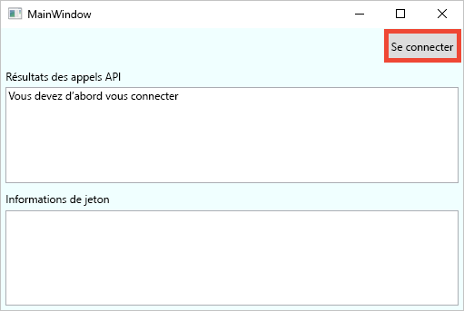
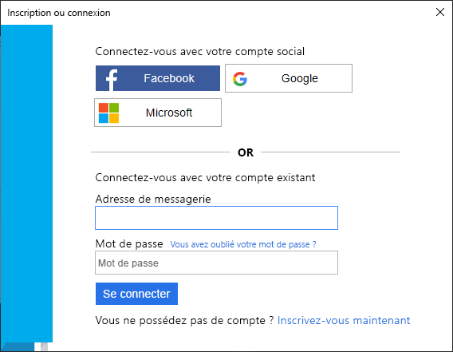
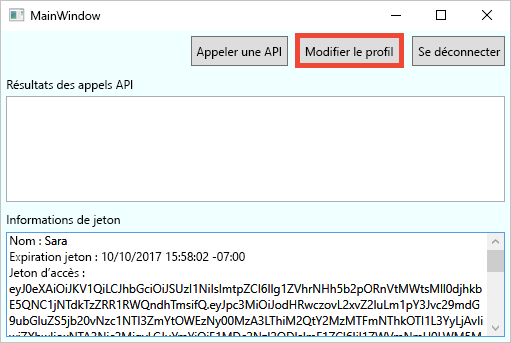
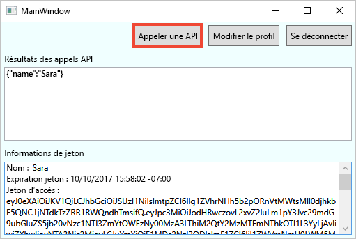

# <a name="quickstart-set-up-sign-in-for-a-desktop-app-using-azure-active-directory-b2c"></a>Démarrage rapide : Configurer la connexion pour une application de bureau à l’aide d’Azure Active Directory B2C

Azure Active Directory B2C (Azure AD B2C) assure la gestion des identités de cloud pour préserver la protection de votre application, de votre entreprise et de vos clients. Azure AD B2C permet à vos applications de s’authentifier auprès de comptes des réseaux sociaux et de comptes d’entreprise à l’aide de protocoles standard ouverts. Dans ce démarrage rapide, vous utiliserez une application de bureau Windows Presentation Foundation (WPF) pour vous connecter à l’aide d’un fournisseur d’identité sociale et appeler une API web protégée par Azure AD B2C.

[!INCLUDE [quickstarts-free-trial-note](../../includes/quickstarts-free-trial-note.md)]

## <a name="prerequisites"></a>Conditions préalables requises

- [Visual Studio 2019](https://www.visualstudio.com/downloads/) avec la charge de travail **Développement ASP.NET et web**.
- Un compte de réseau social Facebook, Google ou Microsoft.
- [Téléchargez un fichier zip](https://github.com/Azure-Samples/active-directory-b2c-dotnet-desktop/archive/msalv3.zip) ou clonez le dépôt [Azure-Samples/active-directory-b2c-dotnet-desktop](https://github.com/Azure-Samples/active-directory-b2c-dotnet-desktop) à partir de GitHub.

    ```
    git clone https://github.com/Azure-Samples/active-directory-b2c-dotnet-desktop.git
    ```

## <a name="run-the-application-in-visual-studio"></a>Exécuter l’application dans Visual Studio

1. Dans l’exemple de dossier de projet de l’application, ouvrez la solution **active-directory-b2c-wpf.sln** dans Visual Studio.
2. Appuyez sur **F5** pour déboguer l’application.

## <a name="sign-in-using-your-account"></a>Connectez-vous à l’aide de votre compte

1. Cliquez sur **Se connecter** pour démarrer le workflow **Inscription ou connexion**.

    

    L’exemple prend en charge plusieurs options d’inscription. Ces options incluent l’utilisation d’un fournisseur d’identité sociale ou la création d’un compte local à l’aide d’une adresse e-mail. Pour ce guide de démarrage rapide, utilisez un compte de fournisseur d’identité sociale provenant de Facebook, Google ou Microsoft.


2. Azure AD B2C présente une page de connexion d’une entreprise fictive appelée Fabrikam pour l’exemple d’application web. Pour vous inscrire au moyen d’un fournisseur d’identité sociale, cliquez sur le bouton en regard du fournisseur d’identité que vous souhaitez utiliser.

    

    Vous vous authentifiez (vous connectez) avec les informations d’identification de votre compte de réseau social et autorisez l’application à lire les informations de votre compte de réseau social. En accordant l’accès, l’application peut extraire des informations de profil du compte de réseau social, telles que votre nom et votre ville.

2. Terminez le processus de connexion pour le fournisseur d’identité.

    Les détails du profil de votre nouveau compte sont préremplis avec les informations de votre compte de réseau social.

## <a name="edit-your-profile"></a>Modifier votre profil

Azure AD B2C fournit des fonctionnalités permettant aux utilisateurs de mettre à jour leurs profils. L’exemple d’application web utilise un flux utilisateur de modification du profil Azure AD B2C pour le workflow.

1. Dans la barre de menus de l’application, cliquez **Modifier le profil** pour modifier le profil que vous avez créé.

    

2. Choisissez le fournisseur d’identité associé au compte que vous avez créé. Par exemple, si vous avez utilisé Facebook comme fournisseur d’identité lors de la création de votre compte, choisissez Facebook pour modifier les informations du profil associé.

3. Modifiez votre **Nom d’affichage** ou votre **Ville**, puis cliquez sur **Continuer**.

    Un nouveau jeton d’accès apparaît dans la zone de texte *Informations sur le jeton*. Si vous souhaitez vérifier les modifications apportées à votre profil, copiez et collez le jeton d’accès dans le décodeur de jeton https://jwt.ms.

## <a name="access-a-protected-api-resource"></a>Accéder à une ressource d’API protégée

Cliquez sur **Appeler l’API** pour envoyer une requête à la ressource protégée.



L’application inclut le jeton d’accès Azure AD dans la requête envoyée à la ressource de l’API web protégée. L’API web renvoie le nom d’affichage contenu dans le jeton d’accès.

Vous avez utilisé votre compte d’utilisateur Azure AD B2C pour effectuer un appel autorisé à une API web protégée par Azure AD B2C.

## <a name="clean-up-resources"></a>Nettoyer les ressources

Vous pouvez utiliser votre locataire Azure AD B2C si vous envisagez d’effectuer d’autres didacticiels ou démarrages rapides Azure AD B2C. Si vous n’en avez plus besoin, vous pouvez [supprimer votre client Azure AD B2C](faq.md#how-do-i-delete-my-azure-ad-b2c-tenant).

## <a name="next-steps"></a>Étapes suivantes

Dans ce guide de démarrage rapide, vous avez utilisé un exemple d’application de bureau pour :

* Vous connecter avec une page de connexion personnalisée
* Vous connecter avec un fournisseur d’identité sociale
* Créer un compte Azure AD B2C
* Appeler une API web protégée par Azure AD B2C

Passez maintenant à la création de votre propre locataire Azure AD B2C.

> [!div class="nextstepaction"]
> [Créer un locataire Azure Active Directory B2C dans le portail Azure](tutorial-create-tenant.md)
