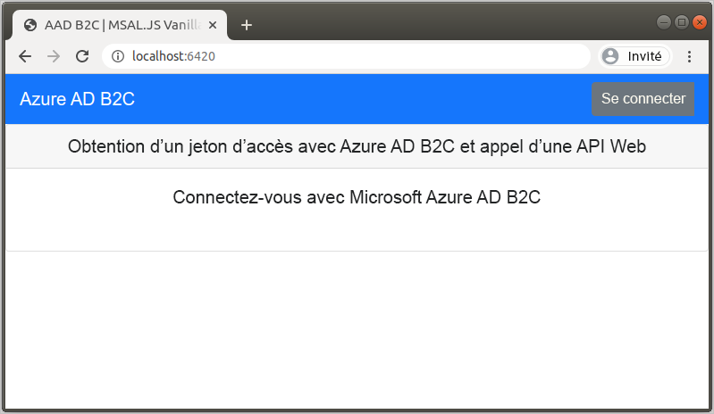
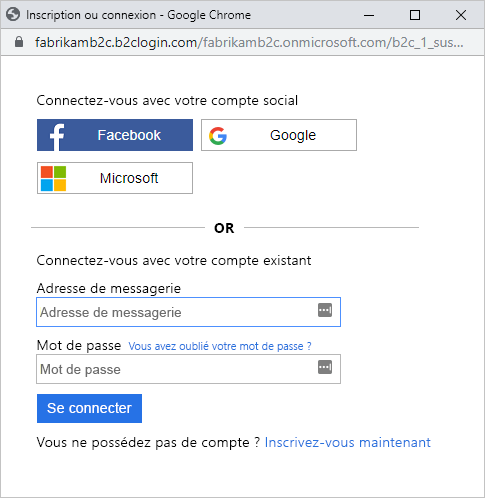
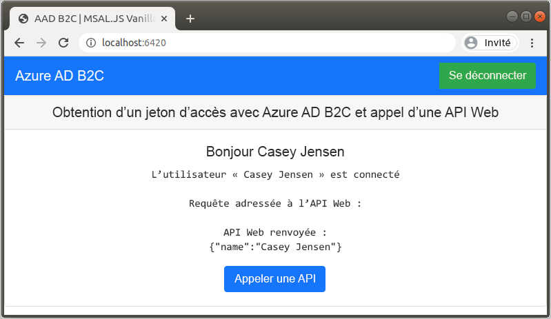

# <a name="quickstart-set-up-sign-in-for-a-single-page-app-using-azure-active-directory-b2c"></a>Démarrage rapide : Configurer la connexion pour une application monopage à l’aide d’Azure Active Directory B2C

Azure Active Directory B2C (Azure AD B2C) assure la gestion des identités de cloud pour préserver la protection de votre application, de votre entreprise et de vos clients. Azure AD B2C permet à vos applications de s’authentifier auprès de comptes des réseaux sociaux et de comptes d’entreprise à l’aide de protocoles standard ouverts. Dans ce démarrage rapide, vous utilisez un exemple d’application monopage pour vous connecter à l’aide d’un fournisseur d’identité sociale et appeler une API web protégée par Azure AD B2C.

[!INCLUDE [quickstarts-free-trial-note](../../includes/quickstarts-free-trial-note.md)]

## <a name="prerequisites"></a>Prérequis

- [Visual Studio 2019](https://www.visualstudio.com/downloads/) avec la charge de travail **Développement ASP.NET et web**
- [Node.JS](https://nodejs.org/en/download/)
- Compte de réseau social Facebook, Google ou Microsoft
- Exemple de code GitHub : [active-directory-b2c-javascript-msal-singlepageapp](https://github.com/Azure-Samples/active-directory-b2c-javascript-msal-singlepageapp)

    Vous pouvez [télécharger l’archive zip](https://github.com/Azure-Samples/active-directory-b2c-javascript-msal-singlepageapp/archive/master.zip) ou cloner le dépôt :

    ```
    git clone https://github.com/Azure-Samples/active-directory-b2c-javascript-msal-singlepageapp.git
    ```

## <a name="run-the-application"></a>Exécution de l'application

1. Démarrez le serveur en exécutant les commandes suivantes à partir de l’invite de commandes Node.js :

    ```
    cd active-directory-b2c-javascript-msal-singlepageapp
    npm install && npm update
    node server.js
    ```

    Server.js génère le numéro de port qu’il écoute sur localhost.

    ```
    Listening on port 6420...
    ```

2. Accédez à l’URL de l’application. Par exemple : `http://localhost:6420`.

## <a name="sign-in-using-your-account"></a>Connectez-vous à l’aide de votre compte

1. Cliquez sur **Se connecter** pour démarrer le flux de travail.

    

    L’exemple prend en charge plusieurs options d’inscription, notamment l’utilisation d’un fournisseur d’identité sociale ou la création d’un compte local à l’aide d’une adresse e-mail. Pour ce guide de démarrage rapide, utilisez un compte de fournisseur d’identité sociale provenant de Facebook, Google ou Microsoft.

2. Azure AD B2C présente une page de connexion d’une entreprise fictive appelée Fabrikam pour l’exemple d’application web. Pour vous inscrire au moyen d’un fournisseur d’identité sociale, cliquez sur le bouton en regard du fournisseur d’identité que vous souhaitez utiliser.

    

    Vous vous authentifiez (vous connectez) avec les informations d’identification de votre compte de réseau social et autorisez l’application à lire les informations de votre compte de réseau social. En accordant l’accès, l’application peut extraire des informations de profil du compte de réseau social, telles que votre nom et votre ville.

3. Terminez le processus de connexion pour le fournisseur d’identité.

## <a name="access-a-protected-api-resource"></a>Accéder à une ressource d’API protégée

Cliquez sur **Call Web API** (Appeler une API web) pour que votre nom d’affichage soit retourné par l’appel de l’API web sous forme d’un objet JSON.



L’exemple d’application monopage inclut un jeton d’accès dans la requête envoyée à la ressource de l’API web protégée.

## <a name="clean-up-resources"></a>Nettoyer les ressources

Vous pouvez utiliser votre locataire Azure AD B2C si vous envisagez d’effectuer d’autres didacticiels ou démarrages rapides Azure AD B2C. Si vous n’en avez plus besoin, vous pouvez [supprimer votre client Azure AD B2C](faq.md#how-do-i-delete-my-azure-ad-b2c-tenant).

## <a name="next-steps"></a>Étapes suivantes

Dans ce guide de démarrage rapide, vous avez utilisé un exemple d’application monopage pour :

* Vous connecter avec une page de connexion personnalisée
* Vous connecter avec un fournisseur d’identité sociale
* Créer un compte Azure AD B2C
* Appeler une API web protégée par Azure AD B2C

Passez maintenant à la création de votre propre locataire Azure AD B2C.

> [!div class="nextstepaction"]
> [Créer un locataire Azure Active Directory B2C dans le portail Azure](tutorial-create-tenant.md)
