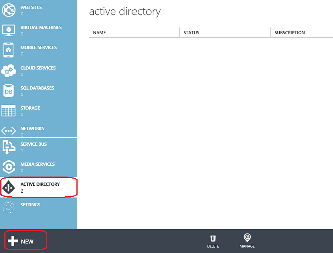
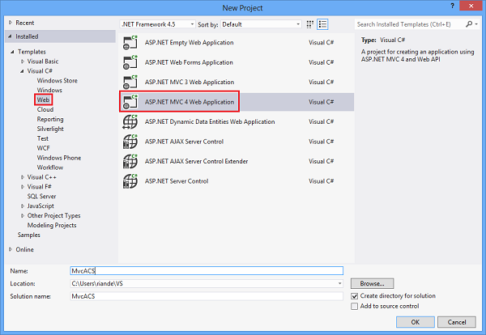
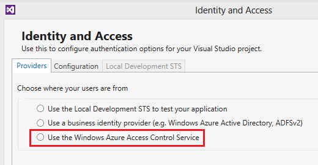
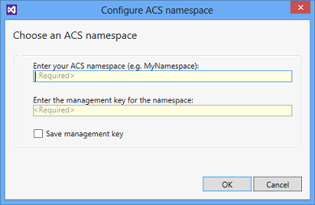
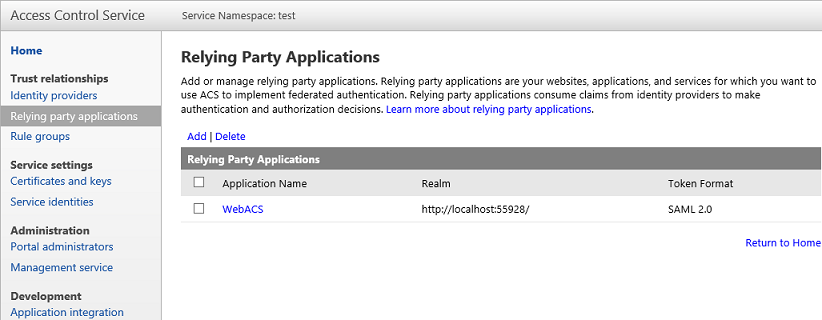
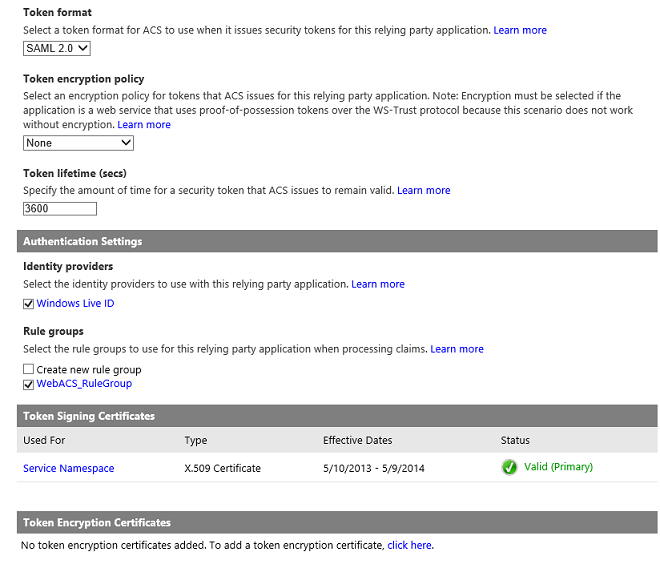
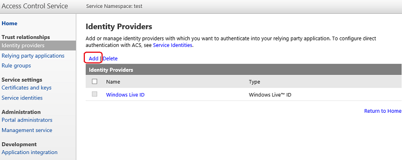
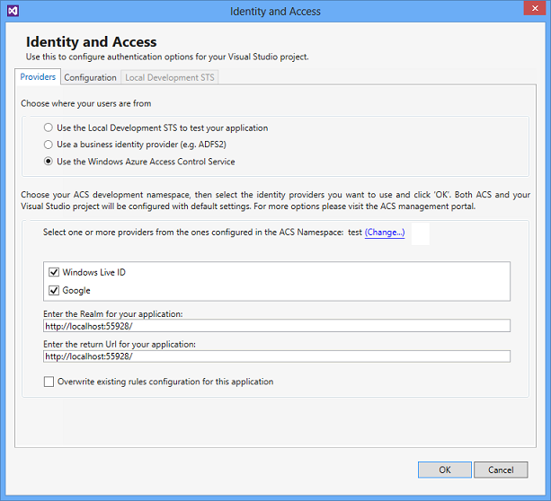

<properties linkid="dev-net-how-to-access-control" urlDisplayName="Access Control" pageTitle="How to use Access Control (.NET) - Azure feature guide" metaKeywords="Azure Access Control Service authentication C#" description="Learn how to use Access Control Service (ACS) in your Azure application to authenticate users when they try to gain access to a web app." metaCanonical="" services="active-directory" documentationCenter=".NET" title="How to Authenticate Web Users with Azure Active Directory Access Control" authors="juneb" solutions="" manager="" editor="" />

Authentification des utilisateurs Web avec le contrôle d'accès Azure Active Directory
=====================================================================================

Ce guide vous montre comment utiliser le contrôle d'accès Azure Active Directory (également appelé Access Control Service, Service de contrôle d'accès, ou ACS) pour authentifier les utilisateurs de fournisseurs d'identité tels que Microsoft, Google, Yahoo et Facebook lorsqu'ils tentent d'accéder à une application Web.

SommaireSommaire
----------------

-   [Qu'est-ce qu'ACS ?](#what-is)
-   [Concepts](#concepts)
-   [Configuration requise](#pre)
-   [Création d'un espace de noms de contrôle d'accès](#create-namespace)
-   [Création d'une application ASP.NET MVC](#create-web-app)
-   [Intégration d'une application Web à ACS](#Identity-Access)
-   [Test de l'intégration à ACS](#Test-ACS)
-   [Affichage des demandes envoyées par ACS](#bkmk_viewClaims)
-   [Affichage de l'application dans le portail de gestion ACS](#bkmk_VP)
-   [Ajout d'un fournisseur d'identité](#add-IP)
-   [Étapes suivantes](#whats-next)

Qu'est-ce qu'ACS ?Qu'est-ce qu'ACS ?
------------------------------------

La plupart des développeurs ne sont pas des experts en matière d'identité et ne souhaitent pas passer du temps à développer des mécanismes d'authentification et d'autorisation pour leurs applications et services. ACS est un service Azure qui vous permet d'authentifier rapidement les utilisateurs lorsqu'ils accèdent à vos applications et services Web sans ajouter de logique d'authentification complexe à votre code.

Les fonctionnalités suivantes sont disponibles dans ACS :

-   Intégration avec Windows Identity Foundation (WIF).
-   Prise en charge des fournisseurs d'identité Web reconnus, notamment les comptes Microsoft (auparavant Windows Live ID), Google, Yahoo et Facebook.
-   Prise en charge d'Active Directory Federation Services (AD FS) 2.0.
-   Service de gestion OData (Open Data Protocol) qui fournit un accès par programme aux paramètres ACS.
-   Portail de gestion qui autorise l'accès administratif aux paramètres ACS.

Pour plus d'informations sur ACS, consultez la page [Access Control Service 2.0](http://go.microsoft.com/fwlink/?LinkID=212360).

ConceptsConcepts
----------------

ACS est basé sur les principes de l'identité basée sur des demandes, une approche cohérente permettant de créer des mécanismes d'authentification pour les applications exécutées localement ou dans le cloud. Cette approche permet aux applications et aux services d'obtenir les informations d'identité dont ils ont besoin pour les utilisateurs internes ou externes à leur organisation et sur Internet.

Pour effectuer les tâches présentées dans ce guide, vous devez comprendre les termes et concepts suivants :

**Client** - Navigateur qui tente d'accéder à votre application Web.

**Application par partie de confiance** - Votre application Web. Une application par partie de confiance est un site Web ou service qui sous-traite l'authentification à une autorité externe. Dans le jargon technique, nous disons que la partie de confiance fait confiance à cette autorité. Ce guide décrit la configuration de votre application de manière à ce qu'elle approuve ACS.

**Jeton** - Un utilisateur obtient l'accès à une application par partie de confiance en présentant un jeton valide émis par une autorité approuvée par celle-ci. Un ensemble de données de sécurité est émis lorsqu'un client est authentifié. Il contient un jeu de demandes, qui sont des attributs de l'utilisateur authentifié, tels que l'âge ou le nom de l'utilisateur, ou l'identificateur du rôle d'utilisateur. Un jeton est signé numériquement afin que son émetteur soit identifié, et son contenu inaltérable.

**Fournisseur d'identité** - Autorité qui authentifie des identités d'utilisateur et émet des jetons de sécurité, comme un compte Microsoft (Windows Live ID), Facebook, Google, Twitter et Active Directory. Lorsqu'ACS est configuré de manière à approuver un fournisseur d'identité, il accepte et valide les jetons émis par ce dernier. Comme ACS peut approuver plusieurs fournisseurs d'identité simultanément, lorsque votre application approuve ACS, elle peut fournir aux utilisateurs la possibilité d'être authentifiés par un fournisseur d'identité qu'ACS approuve en votre nom.

**Fournisseur de fédération** - Les fournisseurs d'identité ont une connaissance directe des utilisateurs, authentifient ces derniers à l'aide de leurs informations d'identification et émettent des demandes au sujet des utilisateurs. Un fournisseur de fédération est un autre type d'autorité. Au lieu d'authentifier directement les utilisateurs, il « répartit » l'authentification. Il agit comme intermédiaire entre l'application par partie de confiance et un ou plusieurs fournisseurs d'identité. ACS est un fournisseur de fédération.

**Moteur de règles ACS** - Les règles de transformation des demandes convertissent les demandes en jetons provenant de fournisseurs d'identité approuvés afin qu'elles puissent être utilisées par une partie de confiance. ACS inclut un moteur de règles qui applique les règles de transformation des demandes spécifiées par votre partie de confiance.

**Espace de noms de contrôle d'accès** - Fournit une étendue unique pour l'adressage des ressources ACS au sein de votre application. L'espace de noms contient vos paramètres, tels que les fournisseurs d'identité que vous approuvez, les applications par partie de confiance auxquelles vous faites appel et les règles que vous appliquez aux jetons entrants. Par ailleurs, il affiche les points de terminaison que l'application et les développeurs utilisent pour communiquer avec ACS.

La figure suivante présente le fonctionnement de l'authentification ACS avec une application Web :

1.  Le client (dans le cas présent, un navigateur) demande une page à partir de la partie de confiance.
2.  Puisque la demande n'a pas encore été authentifiée, la partie de confiance redirige l'utilisateur vers l'autorité approuvée, c'est-à-dire ACS. ACS propose à l'utilisateur de choisir parmi les fournisseurs d'identité spécifiés pour cette partie de confiance. L'utilisateur sélectionne le fournisseur d'identité approprié.
3.  Le client accède à la page d'authentification du fournisseur d'identité et invite l'utilisateur à se connecter.
4.  Une fois le client authentifié (par exemple, lorsque les informations d'identification de l'identité ont été entrées), le fournisseur d'identité émet un jeton de sécurité.
5.  À la suite de cela, il demande au client d'envoyer le jeton de sécurité que le fournisseur d'identité a émis à ACS.
6.  ACS valide le jeton de sécurité émis par le fournisseur d'identité, inclut la demande d'identité de ce jeton dans le moteur de règles ACS, calcule la demande d'identité de sortie et émet un nouveau jeton de sécurité contenant ces demandes de sortie.
7.  ACS demande au client d'envoyer le jeton de sécurité qu'ACS a émis à la partie de confiance. La partie de confiance valide la signature du jeton de sécurité, extrait les demandes à des fins d'utilisation par la logique métier de l'application et renvoie la page demandée à l'origine.

Configuration requiseConfiguration requise
------------------------------------------

Pour réaliser les tâches présentées dans ce guide, vous avez besoin des éléments suivants :

-   Abonnement Azure
-   Microsoft Visual Studio 2012
-   Identity and Access Tool for Visual Studio 2012 (téléchargement disponible à la page [Identity and Access Tool](http://go.microsoft.com/fwlink/?LinkID=245849))

Création d'un espace de noms de contrôle d'accèsCréation d'un espace de noms de contrôle d'accès
------------------------------------------------------------------------------------------------

Pour utiliser le contrôle d'accès Active Directory, créez un espace de noms de contrôle d'accès. L'espace de noms fournit une étendue unique pour l'adressage des ressources ACS au sein de votre application.

1.  Connectez-vous au [portail de gestion Azure](http://manage.WindowsAzure.com) (https://manage.WindowsAzure.com).

2.  Cliquez sur **Active Directory**.

    

3.  Pour créer un espace de noms de contrôle d'accès, cliquez sur **Nouveau**. **App Services** et **Access Control** sont sélectionnés. Cliquez sur **Create**.

    

4.  Entrez le nom de l'espace de noms. Azure vérifie que le nom est unique.

5.  Sélectionnez la région dans laquelle l'espace de noms sera utilisé. Pour bénéficier de performances optimales, utilisez la région dans laquelle vous déployez votre application, puis cliquez sur **Create**.

Azure crée et active l'espace de noms.

Création d'une application ASP.NET MVCCréation d'une application ASP.NET MVC
----------------------------------------------------------------------------

Au cours de cette étape, vous allez créer une application ASP.NET MVC. Lors des prochaines étapes, vous intègrerez cette application Web Forms simple à ACS.

1.  Démarrez Visual Studio 2012 ou Visual Studio Express 2012 pour le Web (les versions précédentes de Visual Studio ne fonctionneront pas dans le cadre de ce didacticiel).
2.  Cliquez sur **Fichier**, puis sur **Nouveau projet**.
3.  Sélectionnez le modèle Visual C\#/Web, puis **ASP.NET MVC 4 Web Application**.

    Ici, nous allons utiliser une application MVC, mais vous pouvez utiliser un autre type d'application Web pour cette tâche.

    

4.  Dans **Nom**, tapez **MvcACS**, puis cliquez sur **OK**.
5.  Dans la boîte de dialogue suivante, sélectionnez **Application Internet**, puis cliquez sur **OK**.
6.  Modifiez le fichier *Views\\Shared\_LoginPartial.cshtml* en remplaçant son contenu par le code suivant :

         @if (Request.IsAuthenticated)
         {
             string name = "Null ID";
             if (!String.IsNullOrEmpty(User.Identity.Name))
             {
                 name = User.Identity.Name;
             }    
             <text>
             Hello, @Html.ActionLink(name, "Manage", "Account", routeValues: null, htmlAttributes: new { @class = "username", title = "Manage" })!
                     @using (Html.BeginForm("LogOff", "Account", FormMethod.Post, new { id = "logoutForm" }))
                     {
                         @Html.AntiForgeryToken()
                         <a href="javascript:document.getElementById('logoutForm').submit()">Log off</a>
                     }
             </text>
         }
         else
         {
             <ul>
                 <li>@Html.ActionLink("Register", "Register", "Account", routeValues: null, htmlAttributes: new { id = "registerLink" })</li>
                 <li>@Html.ActionLink("Log in", "Login", "Account", routeValues: null, htmlAttributes: new { id = "loginLink" })</li>
             </ul>
         }

Comme ACS ne définit pas User.Identity.Name actuellement, nous devons apporter les modifications ci-dessus.

1.  Appuyez sur F5 pour exécuter l'application. L'application ASP.NET MVC par défaut apparaît dans le navigateur Web.

Intégration d'une application Web à ACSIntégration d'une application Web à ACS
------------------------------------------------------------------------------

Au cours de cette tâche, vous allez intégrer votre application Web ASP.NET à ACS.

1.  Dans l'Explorateur de solutions, cliquez avec le bouton droit sur le projet MvcACS, puis sélectionnez **Identité et accès**.

    Si l'option **Identité et accès** ne s'affiche pas dans le menu contextuel, installez l'outil Identity and Access Tool. Pour plus d'informations, consultez la page [Identity and Access Tool](http://go.microsoft.com/fwlink/?LinkID=245849).

    

2.  Sous l'onglet **Fournisseurs**, sélectionnez **Use the Azure Access Control Service**.

    

3.  Cliquez sur le lien **Configurer**.

    

    Visual Studio demande des informations sur l'espace de noms de contrôle d'accès. Entrez le nom de l'espace de noms créé précédemment (qui diffère de celui figurant dans les images ci-dessus). Revenez au portail de gestion Azure pour obtenir la clé symétrique.

    

4.  Dans le portail de gestion Azure, cliquez sur l'espace de noms de contrôle d'accès, puis sur **Gérer**.

    

5.  Cliquez sur **Management Service**, puis sur **Management Client**.

    

6.  Cliquez sur **Clé symétrique**, sur **Afficher la clé**, puis copiez la valeur de la clé. Cliquez ensuite sur **Annuler** pour quitter la page Edit Management Client sans apporter de modifications.

    

7.  Dans Visual Studio, collez la clé dans le champ **Enter the Management Key for the namespace**, cliquez sur **Save management key**, puis sur **OK**.

    

    Visual Studio utilise les informations sur l'espace de noms pour se connecter au portail de gestion ACS et obtenir les paramètres de votre espace de noms, notamment les fournisseurs d'identité, le domaine et l'URL de renvoi.

8.  Sélectionnez **Windows Live ID** (compte Microsoft), puis cliquez sur OK.

    

Test de l'intégration avec ACSTest de l'intégration avec ACS
------------------------------------------------------------

Cette tâche explique comment tester l'intégration de votre application par partie de confiance et ACS.

-   Appuyez sur F5 dans Visual Studio pour exécuter l'application.

Lorsque votre application est intégrée à ACS et que vous avez sélectionné Windows Live ID (compte Microsoft) au lieu d'ouvrir l'application ASP.NET Web Forms par défaut, votre navigateur est redirigé vers la page de connexion aux comptes Microsoft. Lorsque vous vous connectez avec un nom d'utilisateur et un mot de passe valides, vous êtes ensuite redirigé vers l'application MvcACS.

Félicitations ! Vous avez correctement intégré ACS à votre application Web ASP.NET. ACS traite désormais l'authentification des utilisateurs à l'aide des informations d'identification de leur compte Microsoft.

Affichage des demandes envoyées par ACS
---------------------------------------

Dans cette section, nous allons modifier l'application de manière à ce qu'elle affiche les demandes envoyées par ACS. L'outil Identity and Access Tool a créé un groupe de règles qui transmet les demandes du fournisseur d'identité vers l'application. Il est important de noter que différents fournisseurs envoient des demandes distinctes.

1.	Ouvrez le fichier *Controllers\\HomeController.cs*. Ajoutez une instruction **using** pour **System.Threading** :

 using System.Threading;

2.	Dans la classe HomeController, ajoutez la méthode *Claims* :

    public ActionResult Claims() { ViewBag.Message = "Votre page de demande.";

         ViewBag.ClaimsIdentity = Thread.CurrentPrincipal.Identity;

         return View();

    }

2.  Cliquez avec le bouton droit sur la méthode *Claims*, puis sélectionnez **Ajouter une vue**.

1.  Cliquez sur **Add**.

2.  Remplacez le contenu du fichier *Views\\Home\\Claims.cshtml* par le code suivant :

         @{
             ViewBag.Title = "Demandes";
         }
         <hgroup class="title">
             <h1>@ViewBag.Title.</h1>
             <h2>@ViewBag.Message</h2>
         </hgroup>
         <h3>Values from Identity</h3>
         <table>
             <tr>
                 <td>
                     IsAuthenticated: 
                 </td>
                 <td>
                     @ViewBag.ClaimsIdentity.IsAuthenticated 
                 </td>
             </tr>
             <tr>
                 <td>
                     Name: 
                 </td>        
                 <td>
                     @ViewBag.ClaimsIdentity.Name
                 </td>        
             </tr>
         </table>
         <h3>Claims from ClaimsIdentity</h3>
         <table>
             <tr>
                 <th>
                     Claim Type
                 </th>
                 <th>
                     Claim Value
                 </th>
             </tr>
                 @foreach (System.Security.Claims.Claim claim in ViewBag.ClaimsIdentity.Claims ) {
             <tr>
                 <td>
                     @claim.Type
                 </td>
                 <td>
                     @claim.Value
                 </td>
             </tr>
         }
         </table>

3.  Exécutez l'application et accédez à la méthode *Claims* :

Pour plus d'informations sur l'utilisation des demandes dans votre application, consultez la [bibliothèque Windows Identity Foundation](http://msdn.microsoft.com/fr-fr/library/hh377151.aspx).

Affichage de l'application dans le portail de gestion ACS
---------------------------------------------------------

L'outil Identity and Access Tool de Visual intègre automatiquement votre application à ACS.

Lorsque vous sélectionnez l'option Use Azure Access Control, puis que vous exécutez l'application, l'outil Identity and Access ajoute votre application en tant que partie de confiance, la configure pour utiliser les fournisseurs d'identité sélectionnés, puis génère et sélectionne les règles de transformation de demandes par défaut pour l'application.

Vous pouvez passer en revue et modifier ces paramètres de configuration dans le portail de gestion ACS. Pour ce faire, procédez comme suit.

1.  Connectez-vous au [portail de gestion Azure](http://manage.WindowsAzure.com).

2.  Cliquez sur **Active Directory**.

    

3.  Sélectionnez un espace de noms de contrôle d'accès, puis cliquez sur **Gérer**. Cette action permet d'ouvrir le portail de gestion ACS.

    

4.  Cliquez sur **Relying party applications**.

    La nouvelle application MvcACS apparaît dans la liste des applications par partie de confiance. Le domaine est défini automatiquement sur la page principale de l'application.

    

5.  Cliquez sur **MvcACS**.

    La page Edit Relying Party Application contient les paramètres de configuration de l'application Web MvcACS. Lorsque vous modifiez les paramètres de cette page puis que vous les enregistrez, les modifications sont immédiatement appliquées à l'application.

    

6.  Faites défiler la page pour voir les autres paramètres de configuration de l'application MvcACS, notamment les fournisseurs d'identité et les règles de transformation des demandes.

    

Dans la prochaine section, nous utiliserons les fonctionnalités du portail de gestion ACS pour modifier l'application Web. Vous verrez par vous-même à quel point cela est facile.

Ajout d'un fournisseur d'identitéAjout d'un fournisseur d'identité
------------------------------------------------------------------

Utilisons le portail de gestion ACS pour modifier l'authentification de l'application MvcACS. Dans cet exemple, nous allons ajouter Google comme fournisseur d'identité pour MvcACS.

1.  Cliquez sur **Fournisseurs d’identité** (dans le menu de navigation), puis sur **Ajouter**.

    

2.  Cliquez sur **Google**, puis sur **Suivant**. La case à cocher de l'application MvcACS est activée par défaut.

    

3.  Cliquez sur Enregistrer.

    

Vous avez terminé. Revenez à Visual Studio, ouvrez le projet correspondant à l'application MvcACS, puis cliquez sur **Identité et accès**. L'outil répertorie les fournisseurs d'identité Windows Live ID et Google.

Lorsque vous exécutez l'application, quelque chose se produit. Lorsqu'une application prend en charge plusieurs fournisseurs d'identité, le navigateur de l'utilisateur est tout d'abord redirigé vers une page hébergée par ACS et qui demande à l'utilisateur de choisir un fournisseur d'identité.

Une fois que l'utilisateur a sélectionné un fournisseur d'identité, le navigateur le redirige vers la page de connexion correspondante.

Étapes suivantesÉtapes suivantes
--------------------------------

Vous avez créé une application Web intégrée à ACS. Ce n'est que le début. Vous allez en apprendre davantage sur ce scénario.

Par exemple, vous pouvez ajouter d'autres fournisseurs d'identité pour cette partie de confiance ou autoriser les utilisateurs inscrits dans les annuaires d'entreprise, tels que les services de domaine Active Directory, à se connecter à l'application Web.

Vous pouvez également ajouter des règles à l'espace de noms pour déterminer quelle demande est envoyée à l'application pour le traitement de la logique métier de l'application.

Pour en savoir plus sur les fonctionnalités ACS et découvrir d'autres scénarios, consultez la page [Access Control Service 2.0](http://go.microsoft.com/fwlink/?LinkID=212360).

