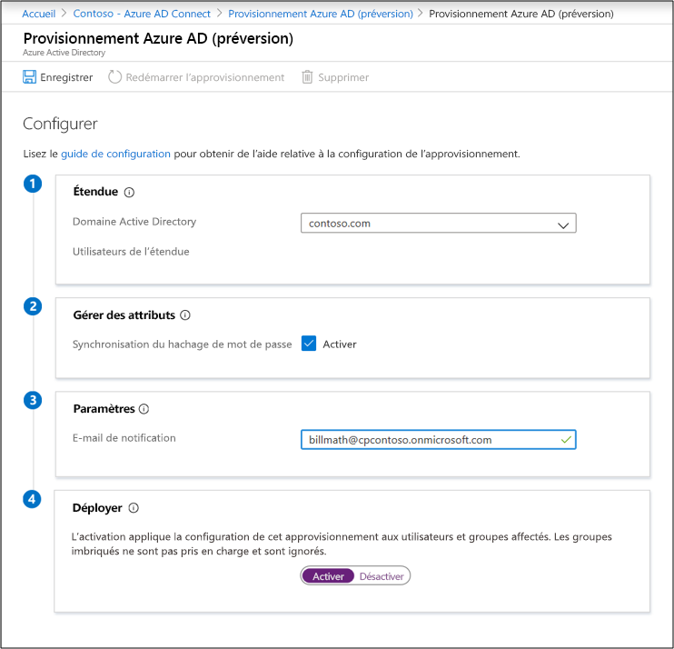

# Nouvelle configuration du provisionnement cloud Azure AD Connect

Après avoir installé l’agent, vous devez vous connecter au portail Azure et configurer le provisionnement.  Utilisez les étapes suivantes pour activer l’agent.

## Configurer le provisionnement
Pour configurer le provisionnement, suivez ces étapes :

1.  Dans le portail Azure AD, cliquez sur  **Azure Active Directory**.
2.  Cliquez sur **Azure AD Connect**.
3.  Sélectionnez **Gérer le provisionnement (préversion)** 
.

4.  Cliquez sur **Nouvelle configuration**.
5.  Dans l’écran de configuration, le domaine local est pré-rempli.
6. Entrez une adresse **E-mail de notification**. Une notification est envoyée à cette adresse e-mail quand le provisionnement n’est pas intègre.  
8. Déplacez le sélecteur sur **Activer**, puis cliquez sur **Enregistrer**.

## Limiter l’étendue du provisionnement à des utilisateurs et des groupes spécifiques
Si vous souhaitez limiter l’étendue de l’agent à la seule synchronisation d’utilisateurs et de groupes spécifiques, vous pouvez le faire. Utilisez les unités d’organisation ou les groupes Active Directory locaux pour définir cette étendue. Vous ne pouvez pas configurer des groupes et des unités d’organisation au sein d’une configuration. 

1.  Dans le portail Azure AD, cliquez sur  **Azure Active Directory**.
2.  Cliquez sur **Azure AD Connect**.
3.  Sélectionnez **Gérer le provisionnement (préversion)** .
4.  Sous **Configuration**, cliquez sur votre configuration.  

5.  Sous **Configurer**, sélectionnez **Tous les utilisateurs** pour modifier l’étendue de la règle de configuration.

6. Sur la droite, vous pouvez modifier l’étendue pour inclure uniquement des groupes de sécurité, en entrant le nom unique du groupe et en cliquant sur **Ajouter**.

7. Ou changer pour n’inclure que des unités d’organisation spécifiques. Cliquez sur **Terminé**, puis sur **Enregistrer**.

## Redémarrer le provisionnement 
Si vous ne souhaitez pas attendre la prochaine exécution planifiée, vous pouvez déclencher l’exécution du provisionnement à l’aide du bouton de redémarrage du provisionnement. 
1.  Dans le portail Azure AD, cliquez sur  **Azure Active Directory**.
2.  Cliquez sur **Azure AD Connect**.
3.  Sélectionnez **Gérer le provisionnement (préversion)** .
4.  Sous **Configuration**, cliquez sur votre configuration.  

5.  En haut de la page, cliquez sur **Redémarrer le provisionnement**.

## Supprimer une configuration
Si vous souhaitez supprimer une configuration, vous pouvez le faire en suivant les étapes décrites ici.

1.  Dans le portail Azure AD, cliquez sur  **Azure Active Directory**.
2.  Cliquez sur **Azure AD Connect**.
3.  Sélectionnez **Gérer le provisionnement (préversion)** .
4.  Sous **Configuration**, cliquez sur votre configuration.  

5.  En haut de la page, cliquez sur **Supprimer**.

>[!IMPORTANT]
>Aucune confirmation ne s’affichant avant la suppression d’une configuration, assurez-vous qu’il s’agit bien de l’action que vous souhaitez effectuer avant de cliquer sur **Supprimer**.

## Étapes suivantes 

- [Présentation du provisionnement](what-is-provisioning.md)
- [Présentation du provisionnement cloud Azure AD Connect](what-is-cloud-provisioning.md)
