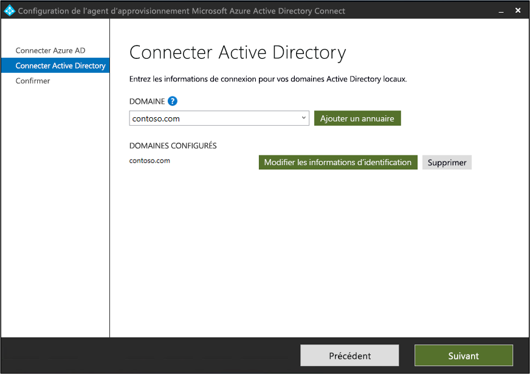
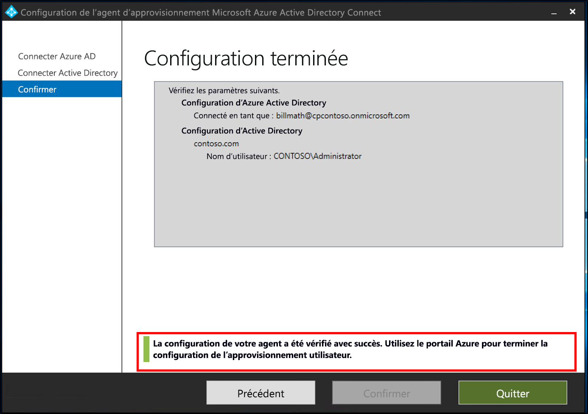
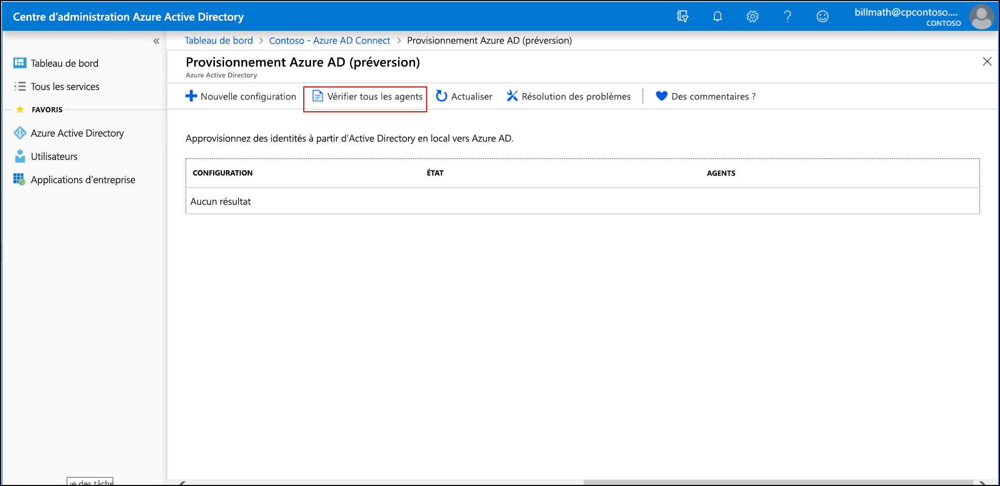

# Installer l’agent de provisionnement Azure AD Connect
Ce document vous guide tout au long du processus d’installation de l’agent de provisionnement Azure AD Connect, et explique comment le configurer au départ dans le portail Azure.

>[!IMPORTANT]
>Les instructions d’installation suivantes supposent que tous les [prérequis](how-to-prerequisites.md) ont été réunis.

L’installation et la configuration du provisionnement Azure AD Connect sont accomplies dans les étapes suivantes :
    
- [Installer l’agent](#install-the-agent)
- [Vérifier l’installation de l’agent](#verify-agent-installation)

## Installer l’agent

1. Connectez-vous au serveur que vous allez utiliser à l’aide des autorisations d’administrateur d’entreprise.
2. Accédez au portail Azure et sélectionnez Azure Active Directory sur la gauche.
3. Cliquez sur **Gérer le provisionnement (préversion)** et sélectionnez **Passer en revue tous les agents**.
3. Téléchargez l’agent de provisionnement Azure AD Connect à partir du portail Azure.
 
3. Exécuter le provisionnement Azure AD Connect (AADConnectProvisioningAgent.Installer)
3. Dans l’écran de démarrage, **acceptez** les termes du contrat de licence et cliquez sur **Installer**. 
 

4. Une fois cette opération terminée, l’Assistant de configuration démarre.  Connectez-vous avec votre compte d’administrateur général Azure AD.
5. Dans l’écran **Connexion à Active Directory**, cliquez sur **Ajout d’un annuaire**, puis connectez-vous avec votre compte d’administrateur Active Directory.  Cette opération ajoute votre annuaire local.  Cliquez sur **Suivant**. 
 

6. Dans l’écran **Configuration terminée**, cliquez sur **Confirmer**.  Cette opération inscrit et redémarre l’agent. 
 

7. Une fois cette opération terminée, vous devriez voir une notification : **La configuration de votre agent a été vérifiée avec succès.**  Vous pouvez cliquer sur **Quitter**. 
 
8. Si vous voyez encore l’écran de démarrage initial, cliquez sur **Fermer**.

## Vérifier l’installation de l’agent
La vérification de l’agent se produit dans le portail Azure et sur le serveur local qui exécute l’agent.

### Vérification de l’agent dans le portail Azure
Pour vérifier que l’agent est visible par Azure, procédez comme suit :

1. Connectez-vous au portail Azure.
2. Sur la gauche, sélectionnez **Azure Active Directory**, cliquez sur **Azure AD Connect** et, au centre, sélectionnez **Gérer le provisionnement (préversion)** . 
 

3.  Dans l’écran **Provisionnement Azure AD (préversion)** , cliquez sur **Passer en revue tous les agents**.
 
 
4. Dans l’écran **Agents de provisionnement locaux**, vous voyez les agents que vous avez installés.  Vérifiez que l’agent en question est présent et qu’il est marqué comme étant **actif**.
 

### Vérifier le port
Pour vérifier que le service Azure est à l’écoute sur le port 443, et que votre agent peut communiquer avec lui, vous pouvez utiliser l’outil suivant :

https://aadap-portcheck.connectorporttest.msappproxy.net/ 

Ce test permet de vérifier que vos agents sont en mesure de communiquer avec Azure via le port 443.  Ouvrez un navigateur et accédez à l’URL ci-dessus à partir du serveur sur lequel l’agent est installé.

### Sur le serveur local
Pour vérifier que l’agent est en cours d’exécution, effectuez les étapes suivantes :

1.  Connectez-vous au serveur avec un compte administrateur.
2.  Ouvrez **Services** en y accédant ou en accédant à Démarrer/Exécuter/Services.msc.
3.  Sous **Services**, assurez-vous que le **Programme de mise à jour de l’agent Microsoft Azure AD Connect** et l’**Agent de provisionnement Microsoft Azure AD Connect** sont présents, et que leur état est **En cours d’exécution**.

>[!IMPORTANT]
>L’agent a été installé, mais il doit être configuré et activé pour pouvoir démarrer la synchronisation des utilisateurs.  Pour configurer un nouvel agent, consultez [Configuration d’un nouvel agent de provisionnement Azure AD Connect](how-to-configure.md).

## Étapes suivantes 

- [Présentation du provisionnement](what-is-provisioning.md)
- [Présentation du provisionnement cloud Azure AD Connect](what-is-cloud-provisioning.md)
 
