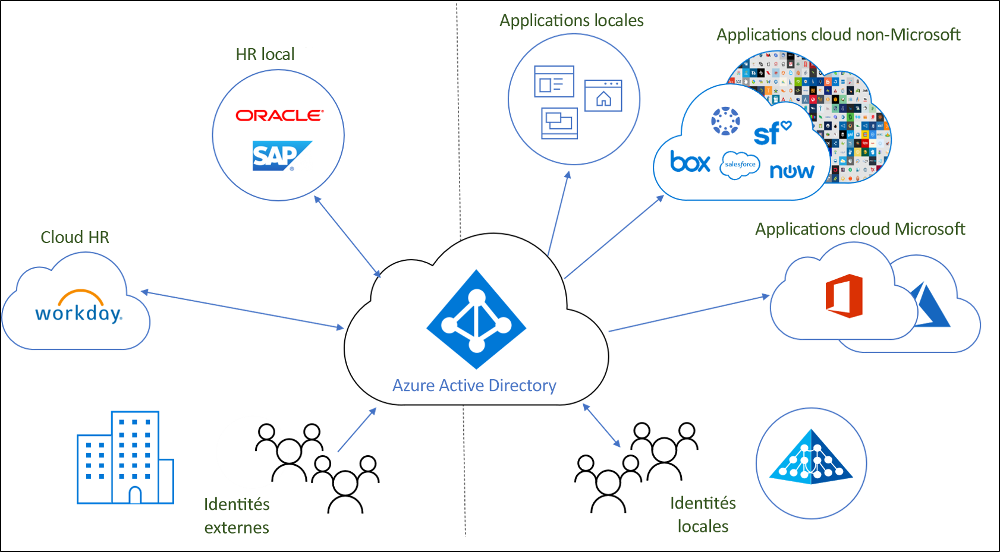
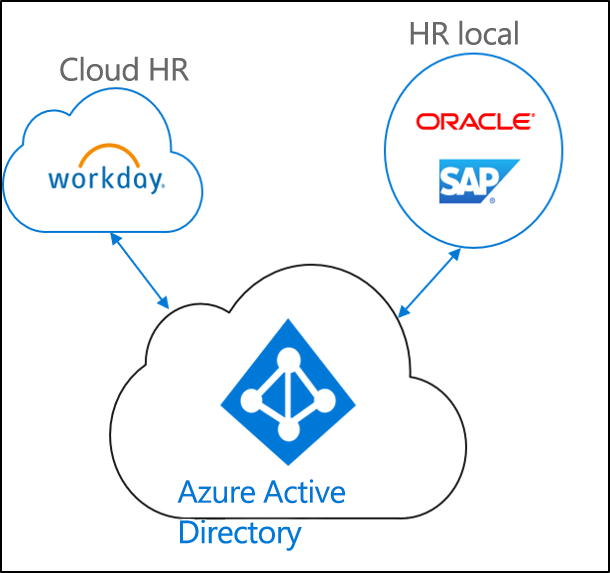
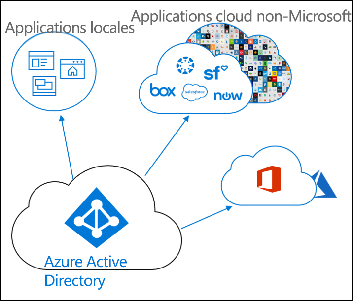
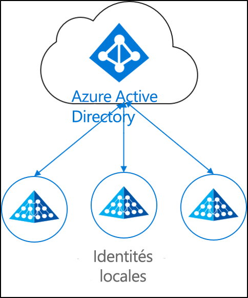

# Qu’est-ce que le provisionnement d’identités ?

Les entreprises et les organisations utilisent aujourd’hui de plus en plus souvent une combinaison d’applications locales et cloud.  Les utilisateurs doivent avoir accès aux applications localement et dans le cloud. Il est nécessaire d’avoir une identité unique pour ces différentes applications (localement et dans le cloud).

Le provisionnement est le processus qui vise à créer un objet en fonction de certaines conditions, à le maintenir à jour et à le supprimer quand les conditions ne sont plus remplies. Par exemple, lorsqu’un nouvel utilisateur rejoint votre organisation, cet utilisateur est entré dans le système RH.  À ce stade, le provisionnement peut créer un compte d’utilisateur correspondant dans le cloud, dans Active Directory et dans différentes applications auxquelles l’utilisateur doit accéder.  Cela permet à l’utilisateur de commencer à travailler et d’accéder aux applications et systèmes dont il a besoin, dès le premier jour. 

En ce qui concerne Azure Active Directory, le provisionnement peut être divisé selon les scénarios clés suivants.  

- **[Provisionnement axé sur les RH](#hr-driven-provisioning)**  
- **[Provisionnement d’applications](#app-provisioning)**  
- **[Provisionnement d’annuaire](#directory-provisioning)** 

## Provisionnement axé sur les RH

Le provisionnement du service RH dans le cloud implique la création d’objets (utilisateurs, rôles, groupes, etc.) en fonction des informations figurant dans votre système RH.  

Le scénario le plus courant correspond à un nouvel employé qui rejoint votre entreprise et qui est entré dans le système RH.  Une fois cette opération effectuée, il est provisionné dans le cloud.  Dans ce cas, dans Azure AD.  Le provisionnement à partir du service RH peut couvrir les scénarios suivants. 

- **Nouvelles embauches** – Lorsqu’un nouvel employé est ajouté au service RH cloud, un compte d’utilisateur est automatiquement créé dans Active Directory, Azure Active Directory et éventuellement dans Office 365 et d’autres applications SaaS prises en charge par Azure AD, avec l’écriture différée de l’adresse e-mail dans le service RH cloud.
- **Mises à jour du profil et des attributs de l’employé** – Lorsque le dossier d’un employé est mis à jour dans le service RH cloud (par exemple, le nom, la fonction ou le responsable), son compte d’utilisateur est automatiquement mis à jour dans Active Directory, Azure Active Directory et éventuellement dans Office 365 et d’autres applications SaaS prises en charge par Azure AD.
- **Résiliations de contrats d’employé** – Lorsque le contrat d’un employé est résilié dans le service RH cloud, son compte d’utilisateur est automatiquement désactivé dans Active Directory, Azure Active Directory et éventuellement dans Office 365 et d’autres applications SaaS prises en charge par Azure AD.
- **Employés réembauchés** – Lorsqu’un employé est réembauché dans le service RH cloud, son ancien compte peut être automatiquement réactivé ou reprovisionné (selon votre préférence) dans Active Directory, Azure Active Directory et éventuellement dans Office 365 et d’autres applications SaaS prises en charge par Azure AD.

## Provisionnement d’applications

Dans Azure Active Directory (Azure AD), le terme **[provisionnement de l’application](../app-provisioning/user-provisioning.md)** désigne la création automatique des identités et rôles des utilisateurs dans les applications cloud auxquelles les utilisateurs ont besoin d’accéder. En plus de créer des identités utilisateur, l’approvisionnement automatique comprend la maintenance et la suppression d’identités utilisateur en cas de modification de l’état ou des rôles. Les scénarios courants incluent la configuration d’un utilisateur Azure AD dans des applications telles que [Dropbox](../saas-apps/dropboxforbusiness-provisioning-tutorial.md), [Salesforce](../saas-apps/salesforce-provisioning-tutorial.md), [ServiceNow](../saas-apps/servicenow-provisioning-tutorial.md), et bien plus encore.

## Provisionnement d’annuaire

Le provisionnement local implique le provisionnement de sources locales (par exemple Active Directory) vers Azure AD.  

Le scénario le plus courant correspond au provisionnement dans Azure AD d’un utilisateur dans Active Directory (AD).

Cette opération peut être réalisée par la synchronisation Azure AD Connect, le provisionnement cloud Azure AD Connect et Microsoft Identity Manager. 
 
## Étapes suivantes 

- [Présentation du provisionnement cloud Azure AD Connect](what-is-cloud-provisioning.md)
- [Installer le provisionnement cloud](how-to-install.md)