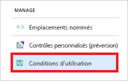
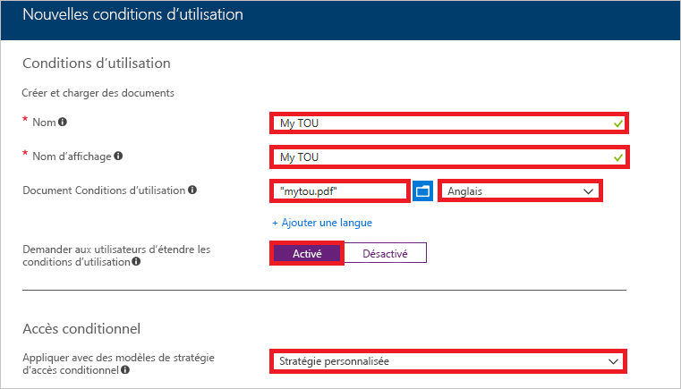
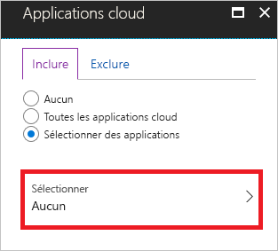

# Démarrage rapide : Exiger l’acceptation des conditions d’utilisation avant d’accorder l’accès à des applications cloud

Si vous souhaitez obtenir le consentement des utilisateurs avant qu’ils ne puissent accéder à certaines applications cloud de votre environnement, vous pouvez demander à ce qu’ils acceptent vos conditions d’utilisation. L’accès conditionnel Azure Active Directory (Azure AD) vous offre les avantages suivants :

- Une méthode simple pour configurer les conditions d’utilisation
- La possibilité d’exiger l’acceptation de vos conditions d’utilisation à l’aide d’une stratégie d’accès conditionnel  

Ce démarrage rapide vous montre comment configurer une [stratégie d’accès conditionnel Azure AD](../active-directory-conditional-access-azure-portal.md) qui vous permet de demander aux utilisateurs d’accepter vos conditions d’utilisation pour accéder à une certaine application cloud de votre environnement.

Si vous n’avez pas d’abonnement Azure, créez un [compte gratuit](https://azure.microsoft.com/free/?WT.mc_id=A261C142F) avant de commencer.

## Prérequis

Pour suivre le scénario décrit dans ce démarrage rapide, vous avez besoin de ce qui suit :

- **Accès à l’édition Azure AD Premium** : l’accès conditionnel Azure AD est une fonctionnalité d’Azure AD Premium.
- **Un compte d’essai nommé Isabella Simonsen** : si vous ignorez comment créer un compte d’essai, voir [Ajouter des utilisateurs basés sur le cloud](../fundamentals/add-users-azure-active-directory.md#add-a-new-user).

## Tester la connexion

L’objectif de cette étape consiste à obtenir une impression de l’expérience de connexion sans stratégie d’accès conditionnel.

**Pour tester la connexion :**

1. [Connectez-vous](https://portal.azure.com/) à votre portail Azure en tant que Isabella Simonsen.
1. Déconnectez-vous.

## Créer vos conditions d’utilisation

Cette section explique comment configurer des conditions d’utilisation. Lorsque vous créez des conditions d’utilisation, vous sélectionnez une valeur pour **Appliquer avec des modèles de stratégie d’accès conditionnel**. Sélectionnez **Stratégie personnalisée** pour ouvrir la boîte de dialogue permettant de créer une nouvelle stratégie d’accès conditionnel. Cette étape est possible dès que vos conditions d’utilisation sont créées.

**Pour créer vos conditions d’utilisation :**

1. Dans Microsoft Word, créez un nouveau document.
1. Saisissez **My terms of use**, puis enregistrez le document sur votre ordinateur sous le nom **mytou.pdf**.
1. Connectez-vous au [portail Azure](https://portal.azure.com) en tant qu’administrateur général, administrateur de sécurité ou administrateur de l’accès conditionnel.
1. Dans la barre de navigation gauche du portail Azure, cliquez sur **Azure Active Directory**.

   

1. Sur la page **Azure Active Directory**, dans la section **Sécurité**, cliquez sur **Accès conditionnel**.

   

1. Dans la section **Gérer**, cliquez sur **Conditions d’utilisation**.

   

1. Dans le menu supérieur, cliquez sur **Nouvelles conditions**.

   

1. Sur la page **Nouvelles conditions d’utilisation** :

   

   1. Dans la zone de texte **Nom**, saisissez **My TOU**.
   1. Dans la zone de texte **Nom d’affichage** saisissez **My TOU**.
   1. Chargez vos conditions d’utilisation sous forme de fichier PDF.
   1. Dans la zone **langue**, sélectionnez **anglais**.
   1. Activez l’option permettant de **demander aux utilisateurs de développer les conditions d’utilisation** **.**
   1. Pour l’option **Appliquer avec des modèles de stratégie d’accès conditionnel**, sélectionnez **Stratégie personnalisée**.
   1. Cliquez sur **Créer**.

## Créer votre stratégie d’accès conditionnel

Cette section montre comment créer la stratégie d’accès conditionnel requise. Le scénario de ce démarrage rapide utilise ce qui suit :

- le portail Azure en tant qu’espace réservé pour une application cloud qui exige que vos conditions d’utilisation soient acceptées ; 
- Votre exemple d’utilisateur pour tester la stratégie d’accès conditionnel.  

Dans votre stratégie, définissez :

| Paramètre | Valeur |
| --- | --- |
| Utilisateurs et groupes | Isabella Simonsen |
| Applications cloud | Gestion Microsoft Azure |
| Accorder l'accès | My TOU |

**Pour configurer votre stratégie d’accès conditionnel, procédez comme suit :**

1. Sur la page **Nouveau**, dans la zone de texte **Nom**, saisissez **Require TOU for Isabella**.

   

1. Dans la section **Affectation**, cliquez sur **Utilisateurs et groupes**.

   

1. Sur la page **Utilisateurs et groupes** :

   

   1. Cliquez sur **Sélectionner des utilisateurs et des groupes**, puis choisissez **des utilisateurs et des groupes**.
   1. Cliquez sur **Sélectionner**.
   1. Dans la page **Sélectionner**, sélectionnez **Isabella Simonsen**, puis cliquez sur **Sélectionner**.
   1. Dans la page **Utilisateurs et groupes**, cliquez sur **Terminé**.
1. Cliquez sur **Applications cloud**.

   

1. Sur la page **Applications cloud** :

   

   1. Cliquez sur **Sélectionner les applications**.
   1. Cliquez sur **Sélectionner**.
   1. Dans la page **Sélectionner**, choisissez **Gestion Microsoft Azure**, puis cliquez sur **Sélectionner**.
   1. Dans la page **Applications cloud**, cliquez sur **Terminé**.
1. Dans la section **Contrôles d’accès**, cliquez sur **Accorder**.

   

1. Sur la page des **octrois** :

   

   1. Sélectionner **Accorder l’accès**.
   1. Sélectionnez **My TOU**.
   1. Cliquez sur **Sélectionner**.
1. Dans la section **Activer la stratégie**, cliquez sur **Activée**.

   

1. Cliquez sur **Créer**.

## Évaluer une connexion simulée

À présent que vous avez configuré votre stratégie d’accès conditionnel, vous souhaitez probablement savoir s’il fonctionne comme prévu. Dans un premier temps, utilisez l’outil de stratégie d’accès conditionnel What If pour simuler une connexion de votre utilisateur de test. La simulation évalue l’impact cette connexion sur vos stratégies et génère un rapport de simulation.  

Pour initialiser l’outil d’évaluation de stratégie **What If**, définissez ce qui suit :

- **Isabella Simonsen** en tant qu’utilisateur.
- **Gestion Microsoft Azure** en tant qu’application cloud.

Un clic sur **What If** a pour effet de créer un rapport de simulation indiquant ce qui suit :

- **Require TOU for Isabella** sous **Stratégies qui vont s’appliquer**
- **My TOU** en tant que **contrôles des octrois**.

**Pour évaluer votre stratégie d’accès conditionnel :**

1. Dans la page [Accès conditionnel - Stratégies](https://portal.azure.com/#blade/Microsoft_AAD_IAM/ConditionalAccessBlade/Policies), dans le menu en haut, cliquez sur **What If**.  

   

1. Cliquez sur **Utilisateurs**, sélectionnez **Isabella Simonsen**, puis cliquez sur **Sélectionner**.

   

1. Pour sélectionner une application cloud :

   

   1. Cliquez sur **Applications cloud**.
   1. Dans la page **Applications cloud**, cliquez sur **Sélectionner les applications**.
   1. Cliquez sur **Sélectionner**.
   1. Dans la page **Sélectionner**, choisissez **Gestion Microsoft Azure**, puis cliquez sur **Sélectionner**.
   1. Dans la page Applications cloud, cliquez sur **Terminé**.
1. Cliquez sur **What If**.

## Tester votre stratégie d’accès conditionnel

Dans la section précédente, vous avez appris à évaluer une connexion simulée. En plus d’une simulation, vous devez tester votre stratégie d’accès conditionnel pour vous assurer qu’elle fonctionne comme prévu.

Pour tester votre stratégie, essayez de vous connecter à votre [portail Azure](https://portal.azure.com) à l’aide de votre compte de test **Isabella Simonsen**. Une boîte de dialogue doit s’afficher, exigeant que vous acceptiez vos conditions d’utilisation.

## Supprimer des ressources

Lorsque vous n’en avez plus besoin, supprimez l’utilisateur de test et la stratégie d’accès conditionnel :

- Si vous ignorez comment supprimer un utilisateur Azure AD, voir [Supprimer des utilisateurs d’Azure AD](../fundamentals/add-users-azure-active-directory.md#delete-a-user).
- Pour supprimer votre stratégie, sélectionnez-la, puis cliquez sur **Supprimer** dans la barre d’outils Accès rapide.

    

- Pour supprimer vos conditions d’utilisation, sélectionnez-les, puis cliquez sur **Supprimer les conditions** dans la barre d’outils supérieure.

    

## Étapes suivantes

> [!div class="nextstepaction"]
> [Exiger une authentification multifacteur pour des applications spécifiques](app-based-mfa.md)
> [Bloquer l’accès lorsqu’un risque de session est détecté](app-sign-in-risk.md)
