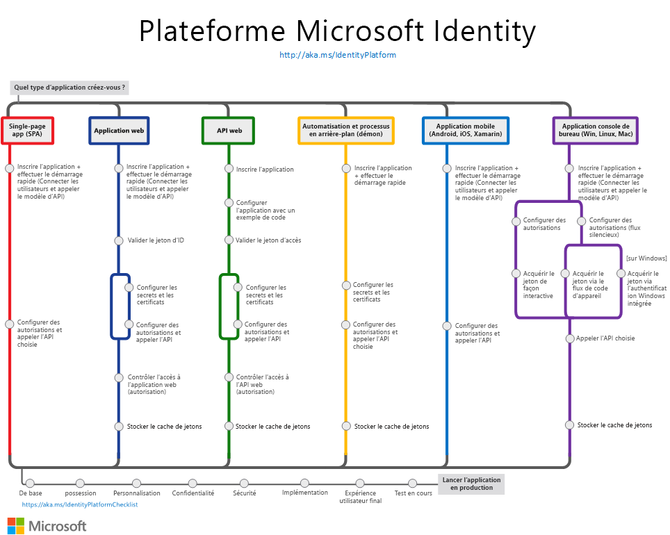

# Présentation de la plateforme d’identités Microsoft (v2.0)

La plateforme d’identités Microsoft est une évolution de la plateforme de développement Azure Active Directory (Azure AD). Elle permet aux développeurs de générer des applications qui connectent toutes les identités Microsoft et obtiennent des jetons pour appeler des API Microsoft, comme Microsoft Graph, ou des API que des développeurs ont créées. Le point de terminaison de la plateforme d’identités Microsoft comprend les éléments suivants :

- **Service d’authentification conforme aux standards OAuth 2.0 et OpenID Connect** qui permet aux développeurs d’authentifier n’importe quelle identité Microsoft, notamment :
  - Comptes professionnels ou scolaires (provisionnés par le biais d’Azure AD)
  - Comptes Microsoft personnels (par exemple, Skype, Xbox et Outlook.com)
  - Comptes sociaux ou locaux (par le biais d’Azure AD B2C)
- **Bibliothèques open source** : bibliothèques MSAL (Microsoft Authentication Libraries) et prise en charge des autres bibliothèques conformes aux normes
- **Portail de gestion des applications** : expérience d’inscription et de configuration intégrée au portail Azure ainsi que toutes vos autres fonctions de gestion Azure.
- **API de configuration des applications et PowerShell** : vous pouvez configurer par programmation vos applications par le biais de l’API REST (Microsoft Graph et Azure Active Directory Graph 1.6) et de PowerShell, automatisant ainsi vos tâches DevOps.
- **Contenu destiné aux développeurs** : documentation conceptuelle et de référence, exemples de guide de démarrage rapide, exemples de code, tutoriels et guides pratiques.

Pour les développeurs, la plateforme d’identités Microsoft offre une intégration fluide aux innovations de l’espace d’identité et de sécurité, telles que l’authentification sans mot de passe, l’authentification renforcée et l’accès conditionnel.  Vous n’avez pas besoin d’implémenter ces fonctionnalités vous-même : les applications intégrées à la plateforme d’identités Microsoft tirent parti de ces innovations de manière native.

Avec la plateforme d’identités Microsoft, vous pouvez écrire du code une seule fois et atteindre tous les utilisateurs. Vous pouvez générer une application une seule fois et la faire fonctionner dans de nombreuses plateformes, ou générer une application qui fonctionne en tant que client et aussi qu’application de ressource (API).

## Prise en main

L’utilisation des identités ne doit pas être difficile. Choisissez un [scénario](authentication-flows-app-scenarios.md) s’appliquant à votre cas ; chaque chemin de scénario a un guide de démarrage rapide et une page de présentation qui vous aident à être opérationnel en quelques minutes :

- [Générer une application monopage](scenario-spa-overview.md)
- [Générer une application web qui connecte les utilisateurs](scenario-web-app-sign-user-overview.md)
- [Générer une application web qui appelle des API web](scenario-web-app-call-api-overview.md)
- [Générer une API web protégée](scenario-protected-web-api-overview.md)
- [Générer une API web qui appelle des API web](scenario-web-api-call-api-overview.md)
- [Générer une application de bureau](scenario-desktop-overview.md)
- [Générer une application démon](scenario-daemon-overview.md)
- [Générer une application mobile](scenario-mobile-overview.md)

Le tableau suivant décrit les scénarios d’applications d’authentification courants : utilisez-le comme référence au moment d’intégrer la plateforme d’identités Microsoft à votre application.

## Étapes suivantes

Si vous souhaitez en savoir plus sur les concepts d’authentification de base, nous vous recommandons de commencer par ces rubriques :

- [Flux d’authentification et scénarios d’applications](authentication-flows-app-scenarios.md)
- [Principes fondamentaux de l’authentification](authentication-scenarios.md)
- [Applications et principaux de service](app-objects-and-service-principals.md)
- [Audiences](v2-supported-account-types.md)
- [Autorisations et consentement](v2-permissions-and-consent.md)
- [Jetons d’ID](id-tokens.md) et [jetons d’accès](access-tokens.md)

Générez une application riche en données qui appelle [Microsoft Graph](https://docs.microsoft.com/graph/overview).

Quand vous êtes prêt à lancer votre application dans un **environnement de production**, passez en revue ces bonnes pratiques :

- [Activez la journalisation](msal-logging.md) dans votre application.
- Activez la télémétrie dans votre application.
- Activez les [proxys et personnalisez les clients HTTP](msal-net-provide-httpclient.md).
- Testez votre intégration en suivant la [check-list de l’intégration à la plateforme d’identités Microsoft](identity-platform-integration-checklist.md).

## En savoir plus

Si vous envisagez de générer une application orientée client qui connecte des identités sociales et locales, consultez la [vue d’ensemble d’Azure AD B2C](https://docs.microsoft.com/azure/active-directory-b2c/tutorial-add-identity-providers).
