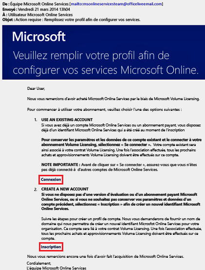
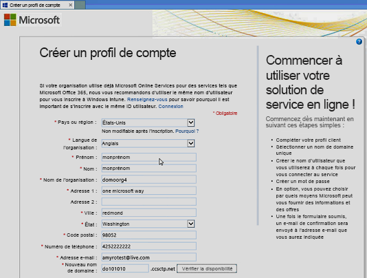
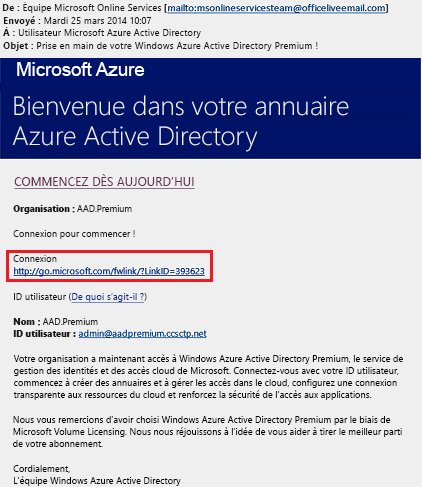
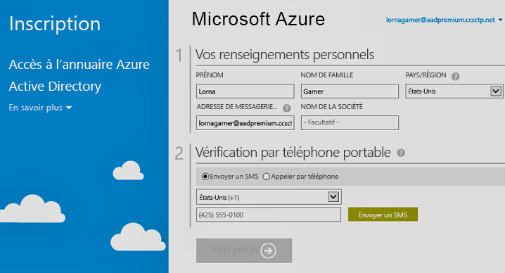

# S’inscrire aux éditions Azure Active Directory Premium
Vous pouvez acheter des éditions Azure Active Directory (Azure AD) Premium et les associer à votre abonnement Azure. Si vous devez créer un nouvel abonnement Azure, vous devez aussi activer votre offre de licences et l’accès au service Azure AD.

> [!NOTE]
>Les clients vivant en Chine peuvent accéder aux éditions De base et Premium d’Azure Active Directory à l’aide de l’instance mondiale d’Azure Active Directory. Actuellement, les éditions De base et Premium d’Azure AD ne sont pas prises en charge dans le service Azure géré par 21Vianet en Chine. Pour plus d’informations, contactez-nous sur le [forum Azure Active Directory](https://feedback.azure.com/forums/169401-azure-active-directory/).

Avant de vous inscrire à Active Directory Premium 1 ou Premium 2, vous devez tout d’abord déterminer quel abonnement ou plan existant vous souhaitez utiliser :

- Votre abonnement Azure ou Office 365 existant

- Votre offre de licences Enterprise Mobility + Security

- Une offre de licences en volume Microsoft

L’inscription par le biais de votre abonnement Azure, qui fait état des licences Azure AD déjà achetées et activées, active automatiquement les licences du même annuaire. Si ce n’est pas le cas, vous devez vous-même activer votre offre de licences et votre accès à Azure AD. Pour plus d’informations sur l’activation de votre offre de licences, consultez [Activer votre nouvelle offre de licences](#activate-your-new-license-plan). Pour plus d’informations sur l’activation de votre accès à Azure AD, consultez [Activer votre accès à Azure AD](#activate-your-azure-ad-access). 

## S’inscrire par le biais de votre abonnement Azure ou Office 365 existant
En tant qu’abonné Azure ou Office 365, vous pouvez vous procurer les éditions Azure Active Directory Premium en ligne. Pour obtenir des instructions détaillées, consultez [How to Purchase Azure Active Directory Premium - Existing Customers](https://channel9.msdn.com/Series/Azure-Active-Directory-Videos-Demos/How-to-Purchase-Azure-Active-Directory-Premium-Existing-Customer) (Comment acheter Azure Active Directory Premium - clients existants) ou [How to Purchase Azure Active Directory Premium - New Customers](https://channel9.msdn.com/Series/Azure-Active-Directory-Videos-Demos/How-to-Purchase-Azure-Active-Directory-Premium-New-Customers) (Comment acheter Azure Active Directory Premium - nouveaux clients).

## S’inscrire par le biais de votre offre de licences Enterprise Mobility + Security
Enterprise Mobility + Security est une suite composée d’Azure AD Premium, Azure Information Protection et Microsoft Intune. Si vous avez déjà une licence EMS, vous pouvez commencer par Azure AD, en utilisant l’une des options de licence suivantes :

Pour plus d’informations sur EMS, consultez [le site web d’Enterprise Mobility + Security](https://www.microsoft.com/cloud-platform/enterprise-mobility-security).

- Essayer EMS avec une [Version d’évaluation Enterprise Mobility + Security E5](https://signup.microsoft.com/Signup?OfferId=87dd2714-d452-48a0-a809-d2f58c4f68b7&ali=1) gratuite

- Acheter des [licences Enterprise Mobility + Security E5](https://signup.microsoft.com/Signup?OfferId=e6de2192-536a-4dc3-afdc-9e2602b6c790&ali=1)

- Acheter des [licences Enterprise Mobility + Security E3](https://signup.microsoft.com/Signup?OfferId=4BBA281F-95E8-4136-8B0F-037D6062F54C&ali=1)

## S’inscrire par le biais de votre offre de licences en volume Microsoft
Dans le cadre de votre offre de licences en volume Microsoft, vous pouvez vous inscrire à Azure AD Premium au moyen de l’un de ces deux programmes, selon le nombre de licences que vous souhaitez obtenir :

- **Pour 250 licences ou plus.** [Contrat Entreprise Microsoft](https://www.microsoft.com/en-us/licensing/licensing-programs/enterprise.aspx)

- **Pour 5 à 250 licences.** [Licence en volume Open](https://www.microsoft.com/en-us/licensing/licensing-programs/open-license.aspx)

Pour en savoir plus sur les options d’achat de licences en volume, consultez [Comment acheter des licences en volume](https://www.microsoft.com/en-us/licensing/how-to-buy/how-to-buy.aspx).

## Activer votre nouvelle offre de licences
Si vous vous êtes inscrit par l’intermédiaire d’une nouvelle offre de licences Azure AD, vous devez activer celle-ci pour votre organisation à l’aide de l’e-mail de confirmation envoyé après l’achat.

### Pour activer votre offre de licences
- Ouvrez l’e-mail de confirmation que vous avez reçu de Microsoft après vous être inscrit, puis cliquez sur **Se connecter** ou **S’inscrire**.
   
    

    - **Se connecter.** Choisissez ce lien si vous disposez d’un locataire existant, puis connectez-vous avec votre compte Administrateur existant. Vous devez être administrateur général sur le locataire où les licences vont être activées.

    - **S’inscrire.** Choisissez ce lien si vous voulez ouvrir la page **Créer un profil de compte** et créer un locataire Azure AD pour votre offre de licences.

        

Lorsque vous avez terminé, une boîte de confirmation s’affiche vous remerciant de l’activation de l’offre de licences pour votre locataire.

## Activer votre accès Azure AD
Si vous ajoutez de nouvelles licences Azure AD Premium à un abonnement existant, votre accès Azure AD doit être déjà activé. Dans le cas contraire, vous devez activer l’accès à Azure AD après avoir reçu l’**e-mail de Bienvenue**.  

Dès que vos licences achetées sont provisionnées dans votre annuaire, vous recevez un **e-mail de bienvenue**. L’e-mail confirme que vous pouvez commencer à gérer vos licences Azure AD Premium ou Enterprise Mobility + Security et leurs fonctionnalités associées. 

> [!TIP]
> Vous ne pouvez pas accéder à Azure AD pour votre nouveau locataire tant que vous n’avez pas activé l’accès à l’annuaire Azure AD à partir de l’e-mail de bienvenue.

### Pour activer votre accès à Azure AD

1. Ouvrez l’**E-mail de bienvenue**, puis cliquez sur **Se connecter**.
   
    

2. Après vous être connecté avec succès, vous accédez à la vérification en deux étapes sur appareil mobile.
   
    

Le processus d’activation ne prend généralement que quelques minutes, après lesquelles vous pourrez utiliser votre locataire Azure AD. 

## Étapes suivantes
À présent que vous disposez d’Azure AD Premium, vous pouvez [personnaliser votre domaine](add-custom-domain.md), ajouter une [personnalisation pour votre entreprise](customize-branding.md), [créer un locataire](active-directory-access-create-new-tenant.md) et [ajouter des groupes](active-directory-groups-create-azure-portal.md)et [des utilisateurs](add-users-azure-active-directory.md).
