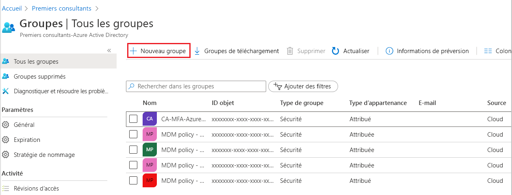
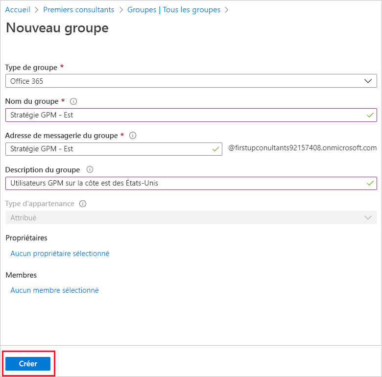
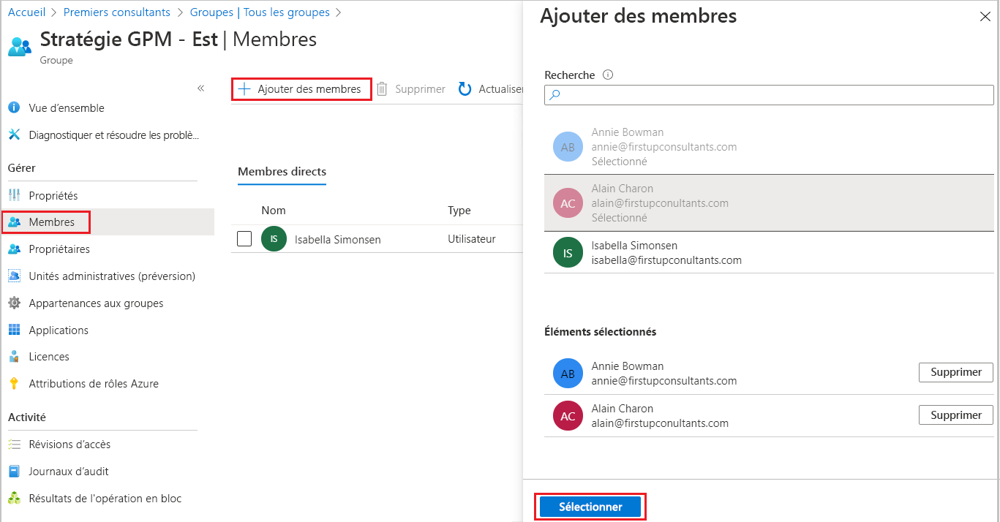
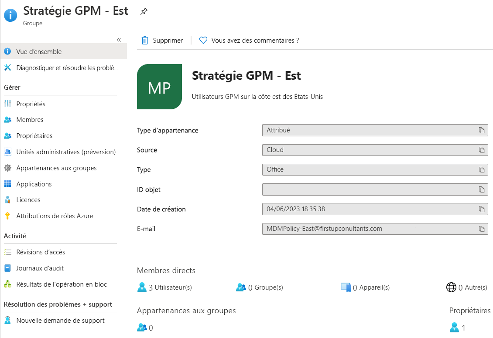

# Créer un groupe de base et ajouter des membres avec Azure Active Directory
Vous pouvez créer un groupe de base à l’aide du portail Azure Active Directory (Azure AD). Pour les besoins de cet article, un groupe de base est ajouté à une seule ressource par le propriétaire de la ressource (administrateur) ; il inclut les membres spécifiques (employés) qui doivent accéder à cette ressource. Pour des scénarios plus complexes, notamment la création de règles et les appartenances dynamiques, consultez la [documentation Gestion des utilisateurs Azure Active Directory](../users-groups-roles/index.yml).

## Créer un groupe de base et ajouter des membres
Vous pouvez créer un groupe de base et ajouter vos membres en même temps.

### Pour créer un groupe de base et ajouter des membres
1. Connectez-vous au [portail Azure](https://portal.azure.com) à l’aide d’un compte d’administrateur général pour l’annuaire.

2. Sélectionnez **Azure Active Directory**, **Groupes**, puis **Nouveau groupe**.

    

3. Dans la page **Groupe**, fournissez les informations obligatoires.

    

   - **Type de groupe (obligatoire).** Sélectionnez un type de groupe prédéfini. notamment :
        
       - **Sécurité**. Utilisé pour gérer l’accès de membres et d’ordinateurs aux ressources partagées d’un groupe d’utilisateurs. Par exemple, vous pouvez créer un groupe de sécurité pour une stratégie de sécurité particulière. En procédant ainsi, vous pouvez donner un ensemble d’autorisations à tous les membres à la fois, au lieu de devoir ajouter des autorisations individuellement à chaque membre. Pour plus d’informations sur la gestion de l’accès aux ressources, consultez [Gérer l’accès aux ressources avec des groupes Azure Active Directory](active-directory-manage-groups.md).
        
       - **Office 365**. Fournit des opportunités de collaboration en donnant aux membres l’accès à des éléments partagés : une boîte aux lettres, un calendrier, des fichiers, un site SharePoint et bien plus encore. Cette option vous permet également de donner à des personnes extérieures à votre organisation un accès au groupe. Pour plus d’informations sur les groupes Office 365, consultez [En savoir plus sur les groupes Office 365](https://support.office.com/article/learn-about-office-365-groups-b565caa1-5c40-40ef-9915-60fdb2d97fa2).

   - **Nom du groupe (obligatoire).** Ajoutez le nom du groupe, quelque chose dont vous vous souviendrez et qui est évocateur. Une vérification sera effectuée pour déterminer si le nom est déjà utilisé pour un autre groupe. Si le nom est déjà en cours d’utilisation, pour éviter les noms en double, vous devrez modifier le nom de votre groupe.

   - **Description du groupe**. Ajoutez une description facultative à votre groupe.

   - **Type d’appartenance (obligatoire).** Sélectionnez un type d’appartenance prédéfini. notamment :

     - **Affecté.** Vous permet d’ajouter des utilisateurs spécifiques pour qu’ils soient membres de ce groupe et qu’ils disposent d’autorisations uniques. Pour les besoins de cet article, nous utilisons cette option.

     - **Utilisateur dynamique.** Vous permet d’utiliser des règles d’appartenance dynamique pour ajouter et supprimer automatiquement des membres. Si les attributs d’un membre changent, le système examine vos règles de groupe dynamique par rapport à l’annuaire, et voit si le membre répond aux exigences des règles (il est ajouté) ou s’il ne répond plus aux exigences de ces règles (il est supprimé).

     - **Appareil dynamique.** Vous permet d’utiliser des règles de groupe dynamique pour ajouter et supprimer automatiquement des appareils. Si les attributs d’un appareil changent, le système examine vos règles de groupe dynamique par rapport à l’annuaire, et voit si l’appareil répond aux exigences des règles (il est ajouté) ou s’il ne répond plus aux exigences de ces règles (il est supprimé).

       >[!Important]
       >Vous pouvez créer un groupe dynamique pour des appareils ou pour des utilisateurs, mais pas pour les deux. Vous ne pouvez pas non plus créer de groupe d’appareils d’après les attributs des propriétaires d’appareils. Les règles d’appartenance d’appareil peuvent référencer uniquement des attributions d’appareils. Pour plus d’informations sur la création d’un groupe dynamique d’utilisateurs ou d’appareils, consultez [Créer un groupe dynamique et vérifier l’état](../users-groups-roles/groups-create-rule.md).

4. Sélectionnez **Créer**.

    Votre groupe est créé et prêt pour l’ajout de membres.

5. Sélectionnez la zone **Membres** dans la page **Groupe**, puis commencez à rechercher les membres à ajouter à votre groupe à partir de la page **Sélectionner des membres**.

    

6. Lorsque vous avez terminé l’ajout de membres, choisissez **Sélectionner**.

    La page **Présentation du groupe** est mise à jour pour afficher le nombre de membres désormais ajoutés au groupe.

    

## Activer ou désactiver l’e-mail de bienvenue

À la création d’un groupe Office 365, que l’appartenance soit dynamique ou statique, une notification de bienvenue est envoyée à tous les utilisateurs qui sont ajoutés au groupe. Lorsqu’un attribut d’utilisateur ou d’appareil change, toutes les règles de groupe dynamique au sein de l’organisation sont traitées pour des modifications d’appartenance potentielles. Les utilisateurs qui sont alors ajoutés reçoivent également la notification de bienvenue. Vous pouvez désactiver ce comportement dans [Exchange PowerShell](https://docs.microsoft.com/powershell/module/exchange/users-and-groups/Set-UnifiedGroup?view=exchange-ps). 

## Étapes suivantes
Maintenant que vous avez ajouté un groupe et au moins un utilisateur, vous pouvez :

- [Afficher vos groupes et vos membres](active-directory-groups-view-azure-portal.md)

- [Ajouter une appartenance à un groupe](active-directory-groups-membership-azure-portal.md)

- [Gérer les règles dynamiques pour les utilisateurs dans un groupe](../users-groups-roles/groups-create-rule.md)

- [Modifier vos paramètres de groupe](active-directory-groups-settings-azure-portal.md)

- [Gérer l’accès aux ressources en utilisant des groupes](active-directory-manage-groups.md)

- [Gérer l’accès aux applications SaaS en utilisant des groupes](../users-groups-roles/groups-saasapps.md)

- [Gérer des groupes au moyen de commandes PowerShell](../users-groups-roles/groups-settings-v2-cmdlets.md)

- [Associer ou ajouter un abonnement Azure à Azure Active Directory](active-directory-how-subscriptions-associated-directory.md)
