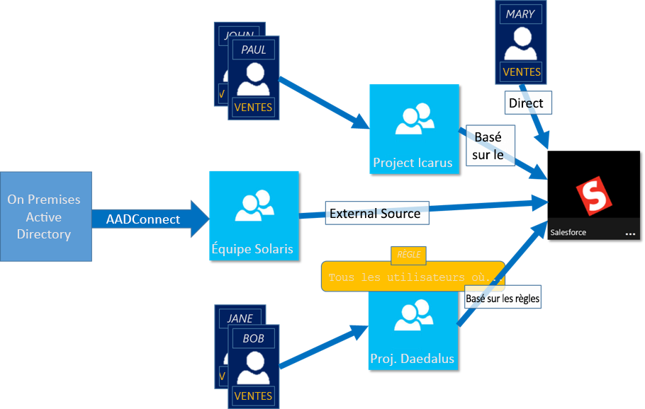
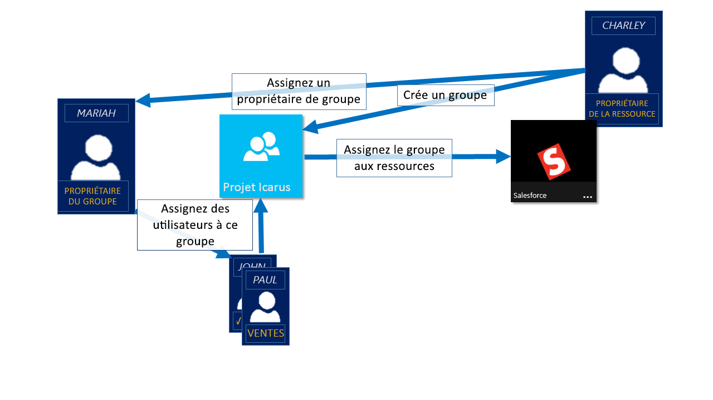

# Gérer l’accès aux ressources avec les groupes Azure Active Directory
Azure Active Directory (Azure AD) est une solution complète de gestion des identités et de gestion des accès qui offre un ensemble de fonctions de gestion de l’accès aux applications et ressources locales et cloud, dont les services en ligne Microsoft comme Office 365 et tout un ensemble d’applications SaaS non-Microsoft. Cet article fournit une vue d’ensemble, mais si vous voulez commencer à utiliser des groupes Azure AD regroupe dès maintenant, suivez les instructions de la rubrique [Gestion des groupes de sécurité dans Azure AD](active-directory-groups-create-azure-portal.md). Pour en savoir plus sur l’utilisation de PowerShell pour gérer des groupes dans Azure Active Directory, vous pouvez consulter l’article [Cmdlets d’Azure Active Directory pour la gestion de groupe](../users-groups-roles/groups-settings-v2-cmdlets.md).

> [!NOTE]
> Pour utiliser Azure Active Directory, vous avez besoin d'un compte Azure. Si vous ne possédez pas encore un compte Azure, vous pouvez [vous inscrire pour en obtenir un gratuitement](https://azure.microsoft.com/pricing/free-trial/).
>
>

Dans Azure AD, une des principales fonctionnalités est la possibilité de gérer l’accès aux ressources. Ces ressources peuvent faire partie de l’annuaire, comme dans le cas des autorisations de gestion des objets via des rôles dans l’annuaire ou les ressources externes à l’annuaire, comme les applications SaaS, les services Azure et les sites SharePoint ou les ressources locales. Il existe quatre méthodes selon lesquelles un utilisateur peut obtenir les droits d’accès à une ressource :

1. Affectation directe

    Les utilisateurs peuvent être directement affectés à une ressource par le propriétaire de la ressource.
2. Appartenance au groupe

    Un groupe peut être affecté à une ressource par le propriétaire de la ressource. Ce faisant, il octroie aux membres de ce groupe l’accès à la ressource. L’appartenance au groupe peut être gérée par le propriétaire du groupe. Le propriétaire de la ressource délègue l’autorisation d’affecter des utilisateurs à ses ressources au propriétaire du groupe.
3. Basée sur une règle

    Le propriétaire de la ressource peut utiliser une règle pour définir les utilisateurs qui peuvent avoir accès à une ressource. Le résultat de cette règle dépend des attributs utilisés dans la règle et leur valeur pour chaque utilisateur. En procédant ainsi, le propriétaire de la ressource délègue le droit de gérer l’accès à sa ressource à la source faisant autorité pour les attributs utilisés dans la règle. Le propriétaire de la ressource gère toujours la règle lui-même et détermine quels attributs et quelles valeurs offrent l’accès à la ressource.
4. Autorité externe

    L’accès à une ressource est dérivé d’une source externe, par exemple, un groupe synchronisé à partir d’une source faisant autorité comme un annuaire local ou une application SaaS, par exemple WorkDay. Le propriétaire de la ressource affecte au groupe l’accès à la ressource et la source externe gère les membres du groupe.

   

## Regardez une vidéo qui explique la gestion des accès
Vous pouvez regarder une courte vidéo qui explique en détail ceci :

**Azure AD : Présentation de l’appartenance dynamique à des groupes**

> [!VIDEO https://channel9.msdn.com/Series/Azure-Active-Directory-Videos-Demos/Azure-AD--Introduction-to-Dynamic-Memberships-for-Groups/player]
>
>

## Comment fonctionne la gestion des accès dans Azure Active Directory ?
Les groupes de sécurité sont le cœur de la solution de gestion des accès Azure AD. L’utilisation d’un groupe de sécurité pour gérer l’accès aux ressources est une situation connue, qui offre un moyen flexible et facilement compréhensible de fournir l’accès à une ressource au groupe d’utilisateurs voulu. Le propriétaire de la ressource (ou l’administrateur de l’annuaire) peut affecter un groupe pour fournir un certain droit d’accès aux ressources dont il dispose. Les membres de groupe se voient fournir l’accès et le propriétaire de la ressource peut déléguer le droit de gérer la liste des membres d’un groupe à quelqu’un d’autre, comme le chef de service ou l’administrateur du support technique.

Le propriétaire d’un groupe peut également rendre ce groupe disponible pour les requêtes libre-service. De cette manière, l’utilisateur final peut rechercher le groupe et demander à en faire partie, demandant ainsi l’autorisation à accéder aux ressources qui sont gérées via ce groupe. Le propriétaire du groupe peut configurer le groupe de façon à ce que les demandes d’appartenance soient automatiquement approuvées ou exigent une approbation par le propriétaire du groupe. Lorsqu’un utilisateur fait une demande d’appartenance à un groupe, cette demande est transmise aux propriétaires du groupe. Si un des propriétaires approuve la demande, l’utilisateur en est informé et il est ajouté au groupe. Si un des propriétaires refuse la demande, l’utilisateur en est averti, mais il n’est pas ajouté au groupe.

## Prise en main de la gestion des accès
Vous êtes prêt à commencer ? Testez certaines des tâches de base que vous pouvez faire avec les groupes Azure AD. Utilisez ces fonctionnalités pour offrir un accès spécialisé à différents groupes de personnes pour les différentes ressources de votre organisation. Vous trouverez ci-dessous une liste des premières étapes à suivre.

* [Création d’une règle simple pour configurer l’appartenance dynamique au groupe](active-directory-groups-create-azure-portal.md)
* [Utilisation d’un groupe pour gérer l’accès aux applications SaaS](../users-groups-roles/groups-saasapps.md)
* [Mise à disposition d’un groupe en libre-service pour l’utilisateur final](../users-groups-roles/groups-self-service-management.md)
* [Synchronisation d’un groupe local avec Azure avec Azure AD Connect](../connect/active-directory-aadconnect.md)
* [Gestion des propriétaires d’un groupe](active-directory-accessmanagement-managing-group-owners.md)

## Étapes suivantes
Maintenant que vous avez compris les principes fondamentaux de la gestion des accès, voici d’autres fonctionnalités avancées disponibles dans Azure Active Directory pour gérer l’accès à vos applications et à vos ressources.

* [Utilisation d’attributs pour créer des règles avancées](../active-directory-groups-dynamic-membership-azure-portal.md)
* [Gestion des groupes de sécurité dans Azure AD](active-directory-groups-create-azure-portal.md)
* [Référence de l’API Graph pour les groupes](https://msdn.microsoft.com/Library/Azure/Ad/Graph/api/groups-operations#GroupFunctions)
* [Configuration des paramètres de groupe avec les applets de commande Azure Active Directory](../users-groups-roles/groups-settings-cmdlets.md)
