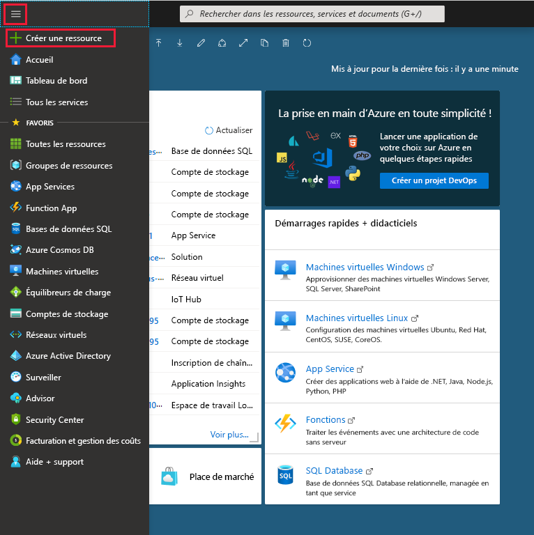
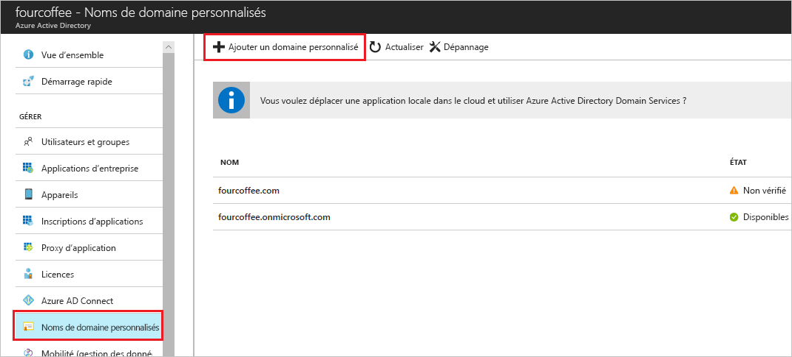

# Procédure : ajouter votre nom de domaine personnalisé à l’aide du Portail Azure Active Directory
Chaque nouveau locataire Azure AD est fourni avec un nom de domaine initial au format *nom_de_domaine*.onmicrosoft.com. Vous ne pouvez pas modifier ni supprimer le nom de domaine initial, mais vous pouvez ajouter des noms de votre organisation à la liste. L’ajout de noms de domaine personnalisés vous permet de créer des noms d’utilisateur qui sont familiers à vos utilisateurs, par exemple *alain@contoso.com*.

## Avant de commencer
Avant de pouvoir ajouter un nom de domaine personnalisé, vous devez créer votre nom de domaine avec un bureau d’enregistrement de domaines. Pour trouver un bureau d’enregistrement de domaines agréé, consultez la page [ICANN-Accredited Registrars](https://www.icann.org/registrar-reports/accredited-list.html) (Bureaux d’enregistrement agréés par l’ICANN).

## Créer votre annuaire dans Azure AD
Après avoir obtenu votre nom de domaine, vous pouvez créer votre premier annuaire Azure AD.

1. Connectez-vous au [Portail Azure](https://portal.azure.com/) en utilisant un compte de propriétaire d’abonnement pour l’annuaire, puis sélectionnez **Azure Active Directory**.

    

    >[!TIP]
    > Si vous envisagez de fédérer votre instance locale de Windows Server Active Directory avec Azure AD, vous devez cocher la case **Je prévois de configurer ce domaine pour l’authentification unique avec mon annuaire Active Directory local** lorsque vous exécutez l’outil Azure AD Connect pour synchroniser vos annuaires. Vous devez également inscrire le même nom de domaine que celui que vous comptez fédérer avec votre annuaire local lors de l’étape **Domaine Azure AD** de l’Assistant. Vous pouvez voir à quoi cette étape de l’assistant ressemble [dans ces instructions](../hybrid/how-to-connect-install-custom.md#verify-the-azure-ad-domain-selected-for-federation). Si vous ne disposez pas de l’outil Azure AD Connect, vous pouvez [le télécharger ici](http://go.microsoft.com/fwlink/?LinkId=615771).

2. Créez votre annuaire en suivant les étapes décrites dans la rubrique [Create a new tenant for your organization](active-directory-access-create-new-tenant.md#create-a-new-tenant-for-your-organization) (Créer un locataire pour votre organisation).

    >[!Important]
    >La personne qui crée le locataire est automatiquement définie comme administrateur général pour ce locataire. L’administrateur général peut ajouter des administrateurs au locataire.

## Ajouter votre nom de domaine personnalisé à Azure AD
Après avoir créé votre annuaire, vous pouvez ajouter votre nom de domaine personnalisé.

1. Sélectionnez **Noms de domaine personnalisés**, puis **Ajouter un domaine personnalisé**.

    

2. Tapez le nouveau nom de domaine de votre organisation dans la zone **Nom de domaine personnalisé** (par exemple, _contoso.com_), puis sélectionnez **Ajouter un domaine**.

    Le domaine non vérifié est ajouté et la page **Contoso** s’affiche, indiquant vos informations DNS.

    >[!Important]
    >Vous devez inclure .com, .net ou toute autre extension de niveau supérieur pour que le processus fonctionne correctement.

    

4. Copiez les informations DNS de la page **Contoso**. Par exemple, MS=ms64983159.

    

## Ajouter vos informations DNS au bureau d’enregistrement de domaines
Après avoir ajouté votre nom de domaine personnalisé à Azure AD, vous devez revenir à votre bureau d’enregistrement de domaines et ajouter les informations DNS d’Azure AD de votre fichier TXT copié. La création de cet enregistrement TXT pour votre domaine entraîne la « vérification » de la propriété de votre nom de domaine.

-  Revenez à votre bureau d’enregistrement de domaines, créez un enregistrement TXT pour votre domaine en fonction de vos informations DNS copiées, définissez la valeur **TTL** (durée de vie) à 60 minutes, puis enregistrez les informations.

    >[!Important]
    >Vous pouvez enregistrer autant de noms de domaine que vous le souhaitez. Toutefois, chaque domaine obtient son propre enregistrement TXT à partir d’Azure AD. Soyez prudent lorsque vous entrez les informations de votre fichier TXT sur le bureau d’enregistrement de domaines. Si vous entrez des informations incorrectes ou dupliquées par erreur, vous devez attendre l’expiration de la durée de vie (60 minutes) avant d’essayer de nouveau.

## Vérifier votre nom de domaine personnalisé
Après avoir enregistré votre nom de domaine personnalisé, vous devez vous assurer qu’il est valide dans Azure AD. La propagation vers Azure AD à partir de votre bureau d’enregistrement de domaines peut être instantanée ou prendre quelques jours selon votre bureau d’enregistrement de domaines.

### Pour vérifier votre nom de domaine personnalisé
1. Connectez-vous au [Portail Azure](https://portal.azure.com/) à l’aide d’un compte d’administrateur général pour l’annuaire.

2. Sélectionnez **Azure Active Directory**, puis **Noms de domaine personnalisés**.

3. Sur la page **Fabrikam - Noms de domaine personnalisés**, sélectionnez le nom de domaine personnalisé **Contoso**.

    

4. Sur la page **Contoso**, sélectionnez **Vérifier** pour vous assurer que votre domaine personnalisé est enregistré correctement et qu’il est valide pour Azure AD.

    

## Problèmes de vérification courants
- Si Azure AD ne parvient pas à vérifier un nom de domaine personnalisé, suivez les suggestions ci-après :
    - **Attendez au moins une heure et essayez à nouveau**. Les enregistrements DNS doivent être propagés pour qu’Azure AD puisse vérifier le domaine. Ce processus peut dure une heure, voire plus.

    - **Vérifiez que l’enregistrement DNS est correct.** Revenez sur le site du bureau d’enregistrement de noms de domaine. Assurez-vous que l’entrée y figure et qu’elle correspond aux informations d’entrée DNS fournies par Azure AD.

    Si vous ne pouvez pas mettre à jour l’enregistrement sur le site du bureau d’enregistrement, vous devez partager l’entrée avec une personne qui dispose des autorisations appropriées pour ajouter l’entrée et vérifier qu’elle est exacte.

- **Assurez-vous que le nom de domaine n’est pas déjà en cours d’utilisation dans un autre annuaire.** Un nom de domaine peut être vérifié dans un annuaire uniquement. Par conséquent, si votre nom de domaine est vérifié dans un autre annuaire, il ne peut pas être vérifié également dans le nouvel annuaire. Pour résoudre ce problème de duplication, vous devez supprimer le nom de domaine à partir de l’ancien annuaire. Pour plus d’informations sur la suppression de noms de domaine, voir [Gérer les noms de domaine personnalisés](../users-groups-roles/domains-manage.md).

- **Assurez-vous de n’avoir aucun locataire Power BI non managé.** Si vos utilisateurs ont activé Power BI via l’inscription libre-service et créé un locataire non managé pour votre organisation, vous devez reprendre la gestion en tant qu’administrateur interne ou externe à l’aide de PowerShell. Pour en savoir plus sur la reprise d’un répertoire non managé, consultez [Prendre le contrôle d’un annuaire non géré en tant qu’administrateur dans Azure Active Directory](../users-groups-roles/domains-admin-takeover.md).

## Étapes suivantes

- Ajoutez un autre administrateur général à votre annuaire. Pour plus d’informations, consultez la rubrique [Affecter des rôles d’administrateur à un utilisateur dans Azure Active Directory](active-directory-users-assign-role-azure-portal.md).

- Ajoutez des utilisateurs à votre domaine. Consultez la page [Démarrage rapide : Ajouter de nouveaux utilisateurs à Azure Active Directory](add-users-azure-active-directory.md).

- Gérez vos informations de nom de domaine dans Azure AD. Pour plus d’informations, consultez [Gestion des noms de domaine personnalisés dans Azure Active Directory](../users-groups-roles/domains-manage.md).

- Si vous souhaitez utiliser des versions locales de Windows Server avec Azure Active Directory, consultez la rubrique [Intégrer des répertoires locaux à Azure Active Directory](../connect/active-directory-aadconnect.md).
