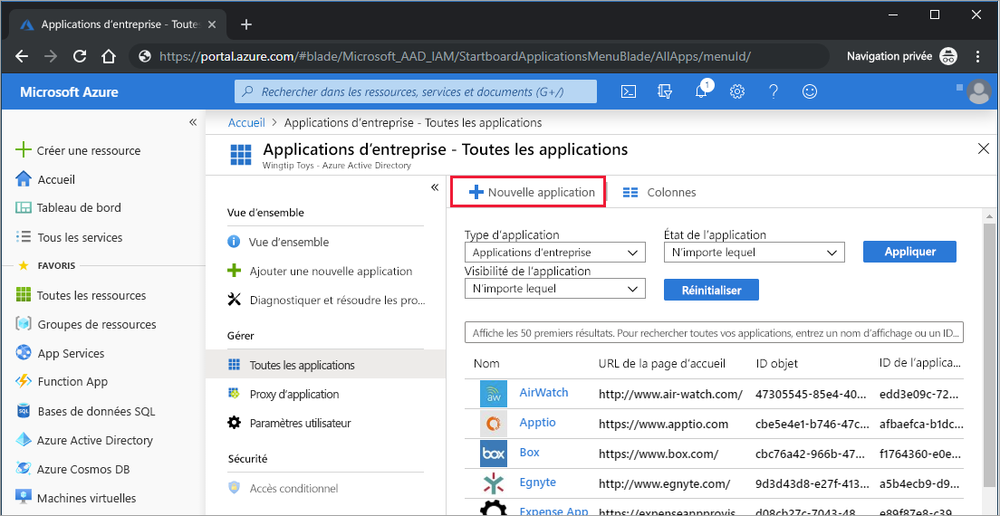

# Démarrage rapide : Ajouter une application à votre locataire Azure Active Directory (Azure AD)

Azure Active Directory (Azure AD) dispose d’une galerie contenant des milliers d’applications pré-intégrées. De nombreuses applications utilisées par votre organisation sont probablement déjà dans la galerie. Ce guide de démarrage rapide utilise le portail Azure pour ajouter une application de la galerie à votre locataire Azure AD. Ce guide de démarrage rapide est axé sur l’ajout d’une application qui fait déjà partie de la galerie. Les applications qui ne sont pas incluses dans la galerie peuvent également être intégrées à Azure AD, mais cette option n’est pas abordé dans ce guide de démarrage rapide. 

Une fois qu’une application est ajoutée à votre locataire Azure AD, vous pouvez :

- Configurer les propriétés de l’application.
- Gérer l’accès utilisateur à l’application avec une stratégie d’accès conditionnel.
- Configurer l’authentification unique afin que les utilisateurs puissent se connecter à l’application avec leurs informations d’identification Azure AD.

## Prérequis

Pour ajouter une application à votre locataire Azure AD, vous avez besoin des éléments suivants :

- Compte Azure avec un abonnement actif. [Créez un compte gratuitement](https://azure.microsoft.com/free/?WT.mc_id=A261C142F).
- Un des rôles suivants : Administrateur général, Administrateur d’application cloud, Administrateur d’application ou propriétaire du principal de service.
- (Facultatif : effectuer [Voir vos applications](view-applications-portal.md)).

>[!IMPORTANT]
>Nous vous recommandons d’utiliser un environnement de non-production pour tester les étapes de ce guide de démarrage rapide.

## Ajouter une application à votre locataire Azure AD

Pour ajouter une application de la galerie à votre locataire Azure AD :

1. Dans le panneau de navigation gauche du [portail Azure](https://portal.azure.com), sélectionnez **Azure Active Directory**.
2. Dans le volet **Azure Active Directory**, sélectionnez **Applications d’entreprise**. Le volet **Toutes les applications** s’ouvre et affiche un échantillon aléatoire des applications de votre locataire Azure AD.
3. Dans le volet **Applications d’entreprise**, sélectionnez **Nouvelle application**. 
    
4. Basculez vers la nouvelle expérience de la galerie (préversion) : dans la bannière en haut de la page **Ajouter une application**, sélectionnez le lien **Cliquez ici pour essayer la Galerie d’applications nouvelle et améliorée**.
5. Le volet **Parcourir la galerie Azure AD (préversion)** s’ouvre et affiche des vignettes pour les plateformes cloud, les applications locales et les applications principales. Les applications listées dans la section **Applications principales** ont des icônes indiquant si elles prennent en charge l’authentification unique fédérée et le provisionnement.
    
6. Vous pouvez parcourir la galerie de l’application que vous souhaitez ajouter ou rechercher l’application en entrant son nom dans la zone de recherche. Ensuite, sélectionnez l’application dans les résultats. Dans le formulaire, vous pouvez modifier le nom de l’application afin qu’il corresponde aux besoins de votre organisation. Dans cet exemple, nous avons changé le nom en **GitHub-test**.
    
7. Sélectionnez **Create** (Créer). Une page de démarrage s’affiche avec les options de configuration de l’application pour votre organisation.

Vous avez terminé l’ajout d’une application. Le guide de démarrage rapide suivant vous montre comment changer le logo et d’autres propriétés pour votre application.

## Étapes suivantes

- [Configurer une application](add-application-portal-configure.md)
- [Configurer l’authentification unique](add-application-portal-setup-sso.md)
- [Supprimer une application](delete-application-portal.md)