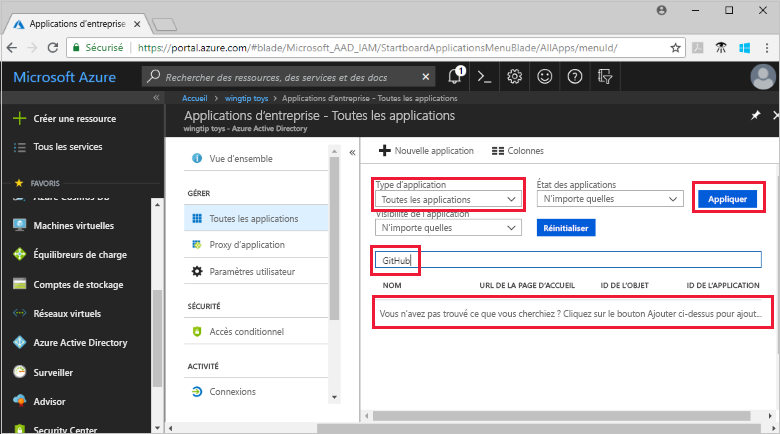

# Afficher les application du tenant Azure Active Directory

Ce démarrage rapide utilise le portail Azure pour afficher les applications dans votre tenant Azure Active Directory (Azure AD).

## Avant de commencer

Pour afficher des résultats, vous devez avoir au moins une application dans votre tenant Azure AD. Pour ajouter une application, consultez le démarrage rapide [d’ajout d’une application](add-application-portal.md).

Connectez-vous au [portail Azure](https://portal.azure.com) en tant qu’administrateur général pour votre tenant Azure AD, administrateur d’application cloud ou administrateur d’application.

## Trouver la liste des applications du tenant

Vos applications de tenant Azure AD sont visibles dans la section **Applications d’entreprise** du portail Azure.

Pour rechercher les applications de votre tenant :

1. Dans le panneau de navigation gauche du **[portail Azure](https://portal.azure.com)** , sélectionnez **Azure Active Directory**. 

1. Dans le volet **Azure Active Directory**, sélectionnez **Applications d’entreprise**. 

1. À partir du menu déroulant **Type d’Application**, sélectionnez **Toutes les Applications**, puis choisissez **Appliquer**. Un échantillon aléatoire des applications de votre tenant s’affiche.
   
1. Pour afficher davantage d’applications, sélectionnez **Charger plus** en bas de la liste. Selon le nombre d’applications de votre tenant, il peut être plus facile de [rechercher une application particulière](#search-for-a-tenant-application) que de faire défiler la liste.

## Sélectionner les options d'affichage

Sélectionnez les options correspondant à ce que vous recherchez.

1. Vous pouvez afficher les applications par **Type d’application**, **État de l’application** et **Visibilité de l’application**. 

1. Sous **Type d’Application**, choisissez l’une des options suivantes :

    - **Applications d’entreprise** montre les applications non Microsoft.
    - **Applications Microsoft** montre les applications Microsoft.
    - **Toutes les Applications** montre les applications non Microsoft et Microsoft.

1. Sous **État de l’Application**, choisissez **Quelconque**, **Désactivé**, ou **Activé**. L’option **Quelconque** inclut les applications activées et désactivées.

1. Sous **Visibilité de l’Application**, choisissez **Quelconque** ou **Masqué**. L’option **Masqué** affiche les applications qui sont dans le locataire, mais ne sont pas visibles pour les utilisateurs.

1. Après avoir choisi les options souhaitées, sélectionnez **Appliquer**.

## Rechercher une application de tenant

Pour rechercher une application particulière :

1. À partir du menu déroulant **Type d’application**, sélectionnez **Toutes les applications**, puis sélectionnez **Appliquer**.

1. Entrez le nom de l’application recherchée. Si l’application a été ajoutée à votre locataire Azure AD, elle apparaît dans les résultats de recherche. Cet exemple montre que GitHub n’a pas été ajouté aux applications du locataire.

    

1. Essayez d’entrer les premières lettres du nom de l’application. Cet exemple montre toutes les applications qui commencent par **Sales**.

    

## Étapes suivantes

Dans ce guide de démarrage rapide, vous avez appris à voir les applications dans votre locataire Azure AD. Vous avez appris à filtrer la liste des applications par type, état et visibilité. Vous avez également appris comment rechercher une application particulière.

Maintenant que vous avez trouvé l’application dont vous avez besoin, vous pouvez [ajouter d’autres applications à votre locataire](add-application-portal.md). Ou bien, vous pouvez sélectionner l’application pour voir ou modifier les propriétés et les options de configuration. Vous pouvez par exemple configurer l’authentification unique.

> [!div class="nextstepaction"]
> [Configurer l’authentification unique](configure-single-sign-on-portal.md)
