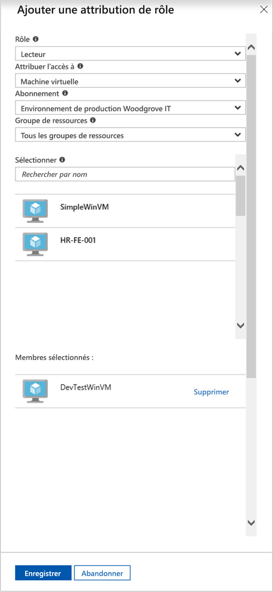

# <a name="use-a-windows-vm-system-assigned-managed-identity-to-access-resource-manager"></a>Utiliser une identité managée affectée par le système de machine virtuelle Windows pour accéder à Resource Manager

[!INCLUDE [preview-notice](../../../includes/active-directory-msi-preview-notice.md)]

Ce guide de démarrage rapide vous indique comment accéder à l’API Azure Resource Manager à l’aide d’une machine virtuelle Windows sur laquelle l’identité managée affectée par le système est activée. Les identités managées pour ressources Azure sont gérées automatiquement par Azure et vous permettent de vous authentifier auprès des services prenant en charge l’authentification Azure AD sans avoir à insérer des informations d’identification dans votre code. Vous allez apprendre à effectuer les actions suivantes :

> [!div class="checklist"] 
> * Accorder à votre machine virtuelle l’accès à un groupe de ressources dans Azure Resource Manager 
> * Obtenir un jeton d’accès à l’aide de l’identité de machine virtuelle et l’utiliser pour appeler Azure Resource Manager

## <a name="prerequisites"></a>Prérequis

[!INCLUDE [msi-tut-prereqs](../../../includes/active-directory-msi-tut-prereqs.md)]

## <a name="grant-your-vm-access-to-a-resource-group-in-resource-manager"></a>Accorder l’accès à un groupe de ressources dans Azure Resource Manager à votre machine virtuelle
À l’aide d’identités managées pour ressources Azure, votre code peut obtenir des jetons d’accès pour vous authentifier sur des ressources prenant en charge l’authentification Azure AD.  Azure Resource Manager prend en charge l’authentification Azure AD.  Tout d’abord, nous devons accorder à cette identité managée affectée par le système de machine virtuelle l’accès à une ressource dans Resource Manager, dans ce cas le groupe de ressources dans lequel est contenue la machine virtuelle.  

1.  Accédez à l’onglet de **Groupes de ressources**. 
2.  Sélectionnez le **Groupe de ressources** spécifique que vous avez créé pour la **machine virtuelle Windows**. 
3.  Accédez au **Contrôle d’accès (IAM)** dans le volet de gauche. 
4.  Sélectionnez ensuite **Ajouter une attribution de rôle** afin d’ajouter une nouvelle attribution de rôle pour votre **machine virtuelle Windows**.  Choisissez **Rôle** en tant que **Lecteur**. 
5.  Dans la liste déroulante suivante, sélectionnez **Attribuer un accès** à la ressource **Machine virtuelle**. 
6.  Ensuite, assurez-vous que l’abonnement approprié est répertorié dans la liste déroulante **Abonnement**. Et pour **Groupe de ressources**, sélectionnez **Tous les groupes de ressources**. 
7.  Enfin, choisissez votre machine virtuelle Windows dans la liste déroulante dans **Sélectionner** et cliquez sur **Enregistrer**.

    

## <a name="get-an-access-token-using-the-vms-system-assigned-managed-identity-and-use-it-to-call-azure-resource-manager"></a>Obtenir un jeton d’accès à l’aide de l’identité managée affectée par le système de machine virtuelle et utiliser celui-ci pour appeler Azure Resource Manager 

Vous devez utiliser **PowerShell** dans cette partie.  Si vous n’avez pas installé **PowerShell**, vous pouvez le télécharger [ici](https://docs.microsoft.com/powershell/azure/overview). 

1.  Dans le portail, accédez à **Machines virtuelles** et accédez à votre machine virtuelle Windows. Puis, dans **Vue d’ensemble**, cliquez sur **Connecter**. 
2.  Entrez le **Nom d’utilisateur** et le **Mot de passe** que vous avez ajoutés lorsque vous avez créé la machine virtuelle Windows. 
3.  Maintenant que vous avez créé une **Connexion au Bureau à distance** avec la machine virtuelle, ouvrez **PowerShell** dans la session à distance. 
4.  À l’aide de l’applet de commande Invoke-WebRequest, envoyez une requête au point de terminaison d’identités managées pour ressources Azure afin d’obtenir un jeton d’accès pour Azure Resource Manager.

    ```powershell
       $response = Invoke-WebRequest -Uri 'http://169.254.169.254/metadata/identity/oauth2/token?api-version=2018-02-01&resource=https://management.azure.com/' -Method GET -Headers @{Metadata="true"}
    ```
    
    > [!NOTE]
    > La valeur du paramètre « ressource » doit correspondre exactement à ce qui est attendu par Azure AD. Lorsque vous utilisez l’ID de ressource Azure Resource Manager, vous devez inclure la barre oblique de fin à l’URI.
    
    Ensuite, extrayez la réponse complète qui est stockée sous forme de chaîne au format JavaScript Objet Notation (JSON) dans l’objet $response. 
    
    ```powershell
    $content = $response.Content | ConvertFrom-Json
    ```
    Ensuite, extrayez le jeton d’accès de la réponse.
    
    ```powershell
    $ArmToken = $content.access_token
    ```
    
    Enfin, appelez Azure Resource Manager à l’aide du jeton d’accès. Dans cet exemple, nous utilisons également l’applet de commande Invoke-WebRequest pour appeler Azure Resource Manager et inclure le jeton d’accès dans l’en-tête d’autorisation.
    
    ```powershell
    (Invoke-WebRequest -Uri https://management.azure.com/subscriptions/<SUBSCRIPTION ID>/resourceGroups/<RESOURCE GROUP>?api-version=2016-06-01 -Method GET -ContentType "application/json" -Headers @{ Authorization ="Bearer $ArmToken"}).content
    ```
    > [!NOTE] 
    > L’URL respecte la casse, par conséquent, assurez-vous que la casse est identique à celle utilisée précédemment lorsque vous avez nommé le groupe de ressources, et que la majuscule « G » dans « resourceGroups » est correcte.
        
    La commande suivante renvoie les détails du groupe de ressources :

    ```powershell
    {"id":"/subscriptions/98f51385-2edc-4b79-bed9-7718de4cb861/resourceGroups/DevTest","name":"DevTest","location":"westus","properties":{"provisioningState":"Succeeded"}}
    ```

## <a name="next-steps"></a>Étapes suivantes

Dans ce démarrage rapide, vous avez appris à utiliser une identité managée affectée par le système pour accéder à l’API Azure Resource Manager.  Pour en savoir plus sur Azure Resource Manager, consultez :

> [!div class="nextstepaction"]
>[Azure Resource Manager](/azure/azure-resource-manager/resource-group-overview)

