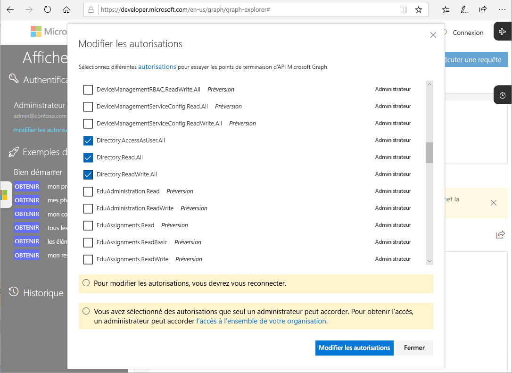

# API Microsoft Graph pour PIM (préversion)

La plupart des tâches que vous pouvez effectuer dans Azure Active Directory (Azure AD) Privileged Identity Management (PIM) à l’aide du portail Azure peuvent également être effectuées à l’aide des [API Microsoft Graph](https://developer.microsoft.com/graph/docs/concepts/overview). Cet article décrit certains concepts importants en cas d’utilisation des API Microsoft Graph pour PIM. Pour plus d’informations sur les API Microsoft Graph, consultez la [référence sur les API Azure AD Privileged Identity Management](https://developer.microsoft.com/graph/docs/api-reference/beta/resources/privilegedidentitymanagement_root).

> [!IMPORTANT]
> Les API sous la version /beta dans Microsoft Graph sont en préversion et susceptibles de changer. L’utilisation de ces API dans les applications de production n’est pas prise en charge.

## Autorisations requises

Pour appeler les API Microsoft Graph pour PIM, vous devez avoir **une ou plusieurs** des autorisations suivantes :

- `Directory.AccessAsUser.All`
- `Directory.Read.All`
- `Directory.ReadWrite.All`
- `PrivilegedAccess.ReadWrite.AzureAD`

### Définir des autorisations

Pour pouvoir appeler les API Microsoft Graph pour PIM, les applications doivent avoir les autorisations requises. Pour spécifier les autorisations requises, le plus simple consiste à utiliser le [framework de consentement Azure AD](../develop/consent-framework.md).

### Définir des autorisations dans l’Afficheur Graph

Si vous utilisez l’Afficheur Graph pour tester vos appels, vous pouvez spécifier les autorisations dans l’outil.

1. Connectez-vous à l’[Afficheur Graph](https://developer.microsoft.com/graph/graph-explorer) en tant qu’Administrateur général.

1. Cliquez sur **Modifier les autorisations**.

    

1. Ajouter des coches en regard des autorisations que vous souhaitez inclure. `PrivilegedAccess.ReadWrite.AzureAD` n’est pas encore disponible dans l’Afficheur Graph.

    

1. Cliquez sur **Modifier les autorisations** pour appliquer les modifications d’autorisation.

## Étapes suivantes

- [Référence sur les API Azure AD Privileged Identity Management](https://developer.microsoft.com/graph/docs/api-reference/beta/resources/privilegedidentitymanagement_root)
