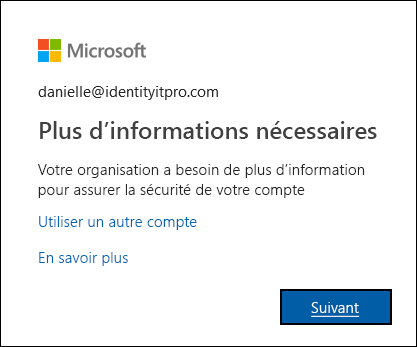

# Qu’est-ce que la page Vérification supplémentaire ?

Vous avez reçu un e-mail d’une personne du service informatique ou de votre patron, qui vous indique qu’une vérification de sécurité supplémentaire a été ajoutée à votre compte. Qu’est-ce que cela signifie ? Cela signifie que votre organisation effectue des étapes supplémentaires pour s’assurer que vous êtes bien celui que vous prétendez être lorsque vous vous connectez. Cette vérification supplémentaire, également appelée vérification à deux facteurs, s’effectue via une combinaison de votre nom d’utilisateur, de votre mot de passe et d’un appareil mobile ou d’un téléphone.

Elle est plus sécurisée qu’un simple mot de passe, car elle s’appuie sur deux formes d’authentification : quelque chose que vous connaissez et quelque chose que vous avez avec vous. L’élément que vous connaissez est votre mot de passe. L’élément que vous avez sur vous est un téléphone ou un appareil que vous avez généralement avec vous. La vérification à deux facteurs peut aider à empêcher les pirates de se faire passer pour vous, car même s’ils ont votre mot de passe, il est probable qu’ils n’ont pas votre appareil.

>[!Important]
>Cet article s’adresse aux utilisateurs qui essaient d’utiliser la vérification à deux facteurs avec un compte professionnel ou scolaire (par exemple, alain@contoso.com). Si vous êtes administrateur et que vous recherchez des informations sur l’activation de la vérification à deux facteurs pour vos employés ou d’autres utilisateurs, consultez la [documentation sur l’authentification Azure Active Directory](https://docs.microsoft.com/azure/active-directory/authentication/).

## Qui décide si vous utilisez cette fonctionnalité ?

Selon votre type de compte, votre organisation peut décider que vous devez utiliser la vérification à deux facteurs ou vous pouvez le décider par vous-même.

- **Un compte professionnel ou scolaire.** Si vous utilisez un compte professionnel ou scolaire (par exemple alain@contoso.com), c’est à votre organisation de décider si vous devez utiliser la vérification à deux facteurs, ainsi que les méthodes de vérification spécifiques. Comme votre organisation a décidé que cette fonctionnalité était obligatoire, vous n’avez aucun moyen de la désactiver individuellement.

- **Compte Microsoft personnel.** Vous pouvez choisir de configurer la vérification à deux facteurs pour vos comptes Microsoft personnels (par exemple alain@outlook.com). Si vous rencontrez des problèmes avec la vérification à deux facteurs et votre compte Microsoft personnel, consultez [Activation ou désactivation de la vérification à deux facteurs de votre compte Microsoft](https://support.microsoft.com/help/4028586/microsoft-account-turning-two-step-verification-on-or-off). Étant donné que vous choisissez d’utiliser cette fonctionnalité, vous pouvez l’activer et la désactiver chaque fois que vous le souhaitez.

    >[!Note]
    >Si vous rencontrez des problèmes avec la vérification à deux facteurs et l’un de vos comptes Microsoft personnels (par exemple, danielle@outlook.com), vous pouvez essayer les suggestions sur la [façon d’utiliser la vérification en deux étapes avec votre compte Microsoft](https://support.microsoft.com/help/12408/microsoft-account-how-to-use-two-step-verification).

## Accès à la page Vérification de sécurité supplémentaire

Une fois que votre organisation a activé et configuré la vérification à deux facteurs, vous recevez un message vous invitant à fournir des informations supplémentaires pour vous aider à protéger votre compte.

### Pour accéder à la page Vérification de sécurité supplémentaire

1. Sélectionnez **Suivant** dans l’invite**Plus d’informations requises**.

    La page **Vérification de sécurité supplémentaire** s’affiche.

2. À partir de la page **Vérification de sécurité supplémentaire**, vous devez décider de la méthode de vérification à deux facteurs à utiliser pour vérifier que vous êtes bien qui vous prétendez être une fois que vous vous êtes connecté à votre compte professionnel ou scolaire. Vous pouvez sélectionner :

    | Méthode de contact | Description |
    | --- | --- |
    | Application mobile | <ul><li>**Recevoir des notifications pour la vérification.** Cette option envoie une notification à l’application d’authentification sur votre smartphone ou tablette. Examinez la notification et, si elle est légitime, sélectionnez **Authentifier** dans l’application. Votre entreprise ou établissement scolaire peut vous demander d’entrer un code confidentiel avant de vous authentifier.</li><li>**Utiliser le code de vérification.** Dans ce mode, l’application d’authentification génère un code de vérification mis à jour toutes les 30 secondes. Entrez le code de vérification le plus récent dans l’écran de connexion. L’application Microsoft Authenticator est disponible pour [Android](https://go.microsoft.com/fwlink/?linkid=866594) et [iOS](https://go.microsoft.com/fwlink/?linkid=866594).</li></ul> |
    | Téléphone d’authentification | <ul><li>L’option **Appel téléphonique** passe un appel vocal automatisé au numéro de téléphone indiqué. Répondez à l’appel et appuyez sur la touche # du clavier du téléphone pour vous authentifier.</li><li>L’option **SMS** envoie un SMS contenant un code de vérification. Selon l’invite contenue dans le SMS, répondez au SMS ou entrez le code de vérification fourni dans l’interface de connexion.</li></ul> |
    | Téléphone de bureau | Passe un appel vocal automatisé au numéro de téléphone indiqué. Répondez à l’appel et appuyez sur la touche # du clavier du téléphone pour vous authentifier. |

## Étapes suivantes

Une fois que vous avez accédé à la page **Vérification de sécurité supplémentaire**, vous devez sélectionner et configurer votre méthode de vérification à deux facteurs :

- [Configurer votre appareil mobile comme méthode de vérification](multi-factor-authentication-setup-phone-number.md)

- [Configurer votre téléphone de bureau comme méthode de vérification](multi-factor-authentication-setup-office-phone.md)

- [Configurer l’application Microsoft Authenticator comme méthode de vérification](multi-factor-authentication-setup-auth-app.md)

## Ressources associées

- [Gérer les paramètres de la vérification à deux facteurs](multi-factor-authentication-end-user-manage-settings.md)

- [Manage app passwords](multi-factor-authentication-end-user-app-passwords.md) (Gérer les mots de passe d’application)

- [Se connecter à l’aide de la vérification en deux étapes](multi-factor-authentication-end-user-signin.md)

- [Obtenir de l’aide pour la vérification à deux facteurs](multi-factor-authentication-end-user-troubleshoot.md) 
