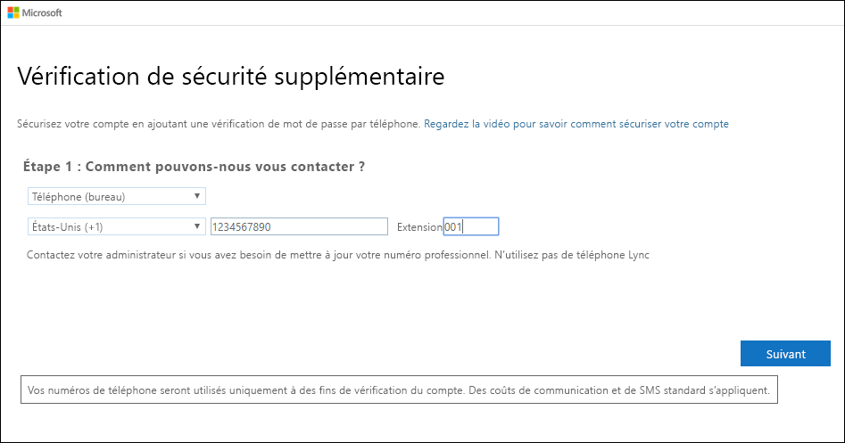
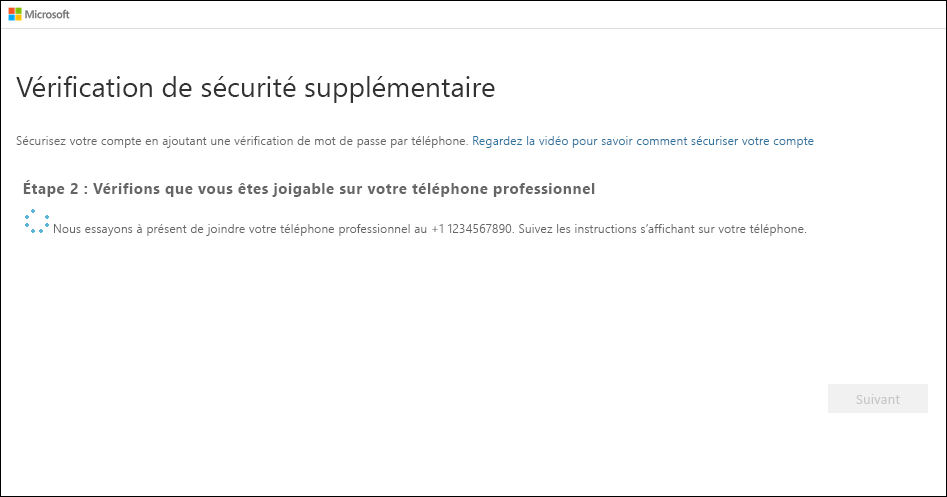
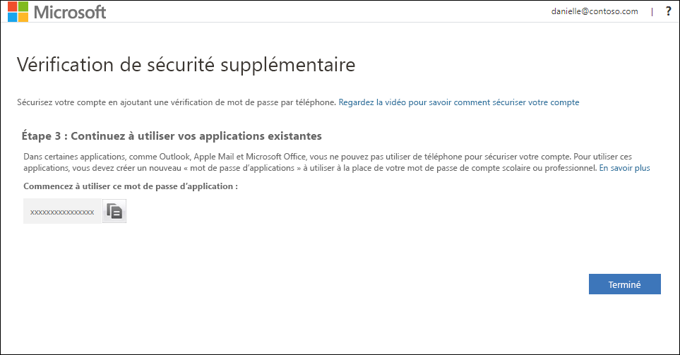

# Configurer un téléphone professionnel comme méthode de vérification à deux facteurs

Vous pouvez configurer un téléphone professionnel comme méthode de vérification à deux facteurs.

>[!Note]
> Si l’option de téléphone est grisée, il est possible que votre organisation ne vous autorise pas à utiliser un numéro de téléphone à des fins de vérification. Dans ce cas, vous devez choisir une autre méthode ou contacter votre administrateur pour obtenir de l’aide.

## Configurer votre numéro de téléphone professionnel comme méthode de vérification

1. Dans la page **Vérification de sécurité supplémentaire**, sélectionnez **Téléphone professionnel** dans la zone **Étape 1 : Comment devons-nous contacter**, sélectionnez votre pays ou votre région dans la liste déroulante, tapez votre numéro de téléphone professionnel, puis tapez votre extension, si vous en avez une.

    

2. Vous recevrez un appel téléphonique de Microsoft, vous demandant d’appuyer sur le signe dièse (#) sur votre téléphone professionnel pour vérifier votre identité.

    

3. Dans la zone **Étape 3 : Continuez à utiliser vos applications existantes**, copiez le mot de passe d’application fourni et collez-le à un endroit sûr.

    

    >[!Note]
    >Pour plus d’informations sur l’utilisation du mot de passe d’application avec vos anciennes applications, consultez [Gérer les mots de passe d’application](multi-factor-authentication-end-user-app-passwords.md). Vous devez uniquement utiliser les mots de passe d’application si vous continuez à utiliser des applications plus anciennes qui ne prennent pas en charge la vérification à deux facteurs.

4. Sélectionnez **Terminé**.

## Étapes suivantes

Une fois que vous avez configuré votre méthode de vérification à deux facteurs, vous pouvez ajouter des méthodes supplémentaires, gérer vos paramètres et mots de passe d’application, vous connecter ou obtenir de l’aide pour certains problèmes courants liés à la vérification à deux facteurs.

- [Gérer les paramètres de la vérification à deux facteurs](multi-factor-authentication-end-user-manage-settings.md)

- [Manage app passwords](multi-factor-authentication-end-user-app-passwords.md) (Gérer les mots de passe d’application)

- [Se connecter à l’aide de la vérification en deux étapes](multi-factor-authentication-end-user-signin.md)

- [Obtenir de l’aide pour la vérification à deux facteurs](multi-factor-authentication-end-user-troubleshoot.md)
