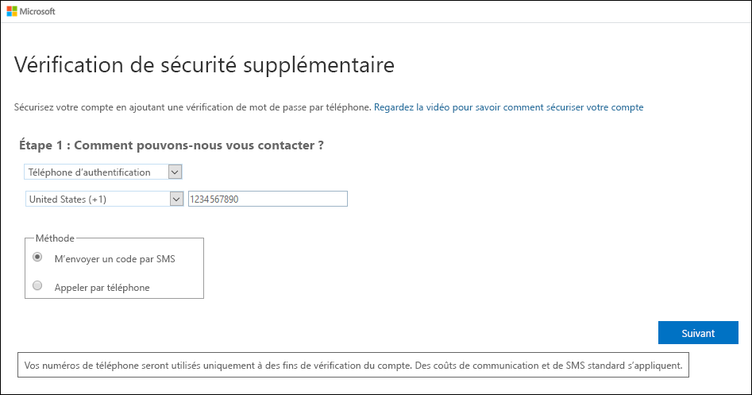
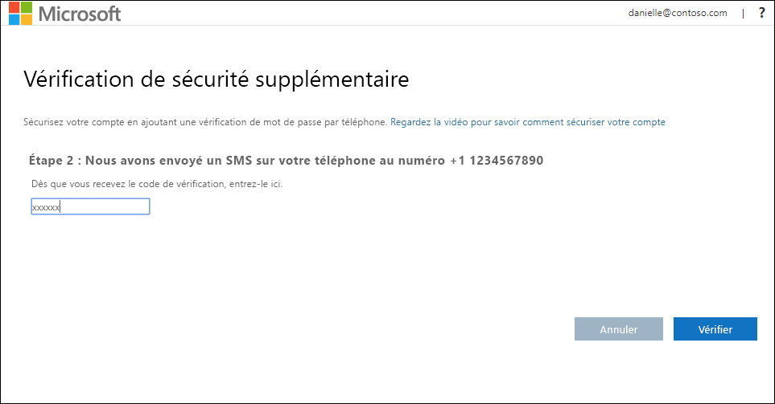
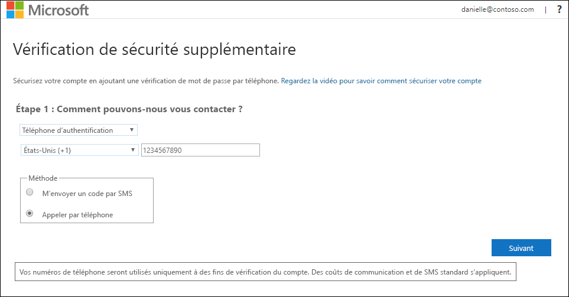
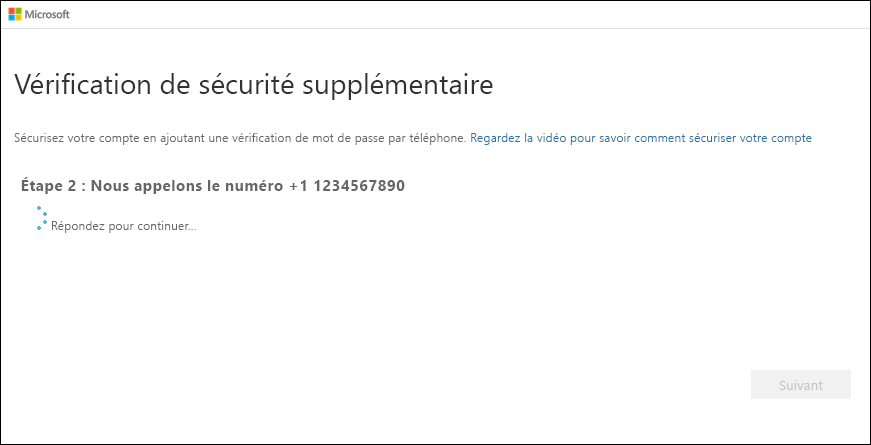

# Configurer un appareil mobile comme méthode de vérification à deux facteurs

Vous pouvez configurer un appareil mobile comme méthode de vérification à deux facteurs. Votre téléphone mobile peut recevoir un SMS avec un code de vérification ou un appel téléphonique.

>[!Note]
> Si l’option de téléphone d’authentification est grisée, il est possible que votre organisation ne vous autorise pas à utiliser un numéro de téléphone ou SMS à des fins de vérification. Dans ce cas, vous devez choisir une autre méthode ou contacter votre administrateur pour obtenir de l’aide.

## Configurer votre appareil mobile pour qu’il utilise un SMS comme méthode de vérification

1. Dans la page **Vérification de sécurité supplémentaire**, sélectionnez **Téléphone d’authentification** dans la zone **Étape 1 : Comment devons-nous vous contacter**, sélectionnez votre pays ou région dans la liste déroulante, puis tapez le numéro de téléphone de votre appareil mobile.

2. Sélectionnez **M’envoyer un code par SMS** à partir de la zone **Méthode**, puis sélectionnez **Suivant**.

    

3. Tapez le code de vérification du SMS envoyé par Microsoft dans la zone **Étape 2 : Nous avons envoyé un SMS à votre téléphone**, puis sélectionnez **Vérifier**.

    

4. Dans la zone **Étape 3 : Continuez à utiliser vos applications existantes**, copiez le mot de passe d’application fourni et collez-le à un endroit sûr.

    

    >[!Note]
    >Pour plus d’informations sur l’utilisation du mot de passe d’application avec vos anciennes applications, consultez [Gérer les mots de passe d’application](multi-factor-authentication-end-user-app-passwords.md). Vous devez uniquement utiliser les mots de passe d’application si vous continuez à utiliser des applications plus anciennes qui ne prennent pas en charge la vérification à deux facteurs.

5. Sélectionnez **Terminé**.

## Configurer votre appareil mobile pour recevoir un appel téléphonique

1. Dans la page **Vérification de sécurité supplémentaire**, sélectionnez **Téléphone d’authentification** dans la zone **Étape 1 : Comment devons-nous vous contacter**, sélectionnez votre pays ou région dans la liste déroulante, puis tapez le numéro de téléphone de votre appareil mobile.

2. Sélectionnez **M’appeler** dans la zone **Méthode**, puis sélectionnez **Suivant**.

    

3. Vous recevez alors un appel téléphonique de Microsoft, vous demandant d’appuyer sur le signe dièse (#) sur votre appareil mobile pour vérifier votre identité.

    

4. Dans la zone **Étape 3 : Continuez à utiliser vos applications existantes**, copiez le mot de passe d’application fourni et collez-le à un endroit sûr.

    

    >[!Note]
    >Pour plus d’informations sur l’utilisation du mot de passe d’application avec vos anciennes applications, consultez [Gérer les mots de passe d’application](multi-factor-authentication-end-user-app-passwords.md). Vous devez uniquement utiliser les mots de passe d’application si vous continuez à utiliser des applications plus anciennes qui ne prennent pas en charge la vérification à deux facteurs.

5. Sélectionnez **Terminé**.

## Étapes suivantes

Une fois que vous avez configuré votre méthode de vérification à deux facteurs, vous pouvez ajouter des méthodes supplémentaires, gérer vos paramètres et mots de passe d’application, vous connecter ou obtenir de l’aide pour certains problèmes courants liés à la vérification à deux facteurs.

- [Gérer les paramètres de la vérification à deux facteurs](multi-factor-authentication-end-user-manage-settings.md)

- [Manage app passwords](multi-factor-authentication-end-user-app-passwords.md) (Gérer les mots de passe d’application)

- [Se connecter à l’aide de la vérification en deux étapes](multi-factor-authentication-end-user-signin.md)

- [Obtenir de l’aide pour la vérification à deux facteurs](multi-factor-authentication-end-user-troubleshoot.md)
