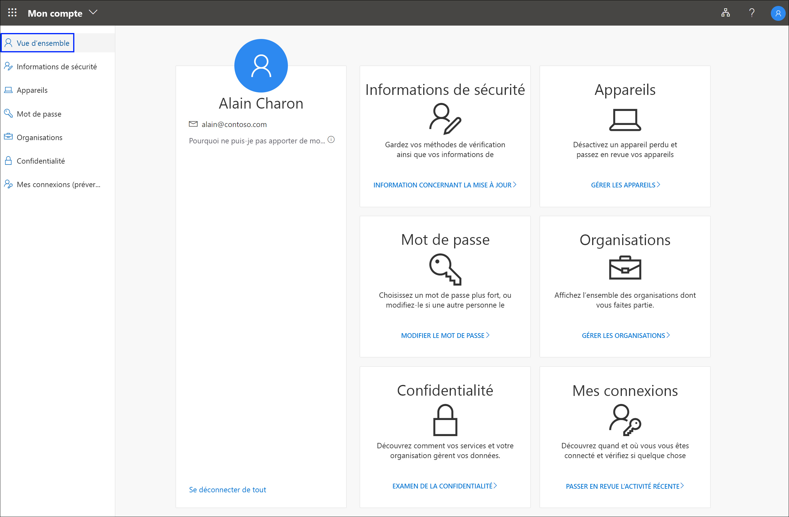

# Qu’est-ce que le portail Mon compte ?

Le portail **Mon compte** vous aide à gérer votre compte professionnel ou scolaire en configurant et en gérant vos informations de sécurité, en gérant vos organisations et vos appareils connectés, ainsi qu’en affichant l’utilisation de vos données par votre organisation.

Vous pouvez accéder au portail **Mon compte** (https://myaccount.microsoft.com) ) à partir de la version actuelle de l’un des navigateurs suivants :

- Chrome
- Microsoft Edge
- Safari
- Firefox
- Internet Explorer 11

>[!Important]
>Cet article s’adresse aux utilisateurs qui essaient d’accéder au portail Mon compte pour mettre à jour leurs informations de sécurité, les informations des appareils, le mot de passe, les organisations connectées, les paramètres de langue, la confidentialité ou les informations de connexion précédentes. Si vous êtes administrateur et que vous recherchez des informations sur l’activation de l’authentification et d’autres fonctionnalités d’Azure Active Directory (Azure AD) pour vos employés et d’autres utilisations, consultez la [documentation d’Azure AD pour les administrateurs](https://docs.microsoft.com/azure/active-directory/).

## Étapes suivantes

- Choisir d’afficher ou gérer vos [informations de sécurité](user-help-security-info-overview.md)

- Afficher ou gérer vos [appareils](my-account-portal-devices-page.md) connectés

- Afficher et gérer vos [organisations](my-account-portal-organizations-page.md)

- Afficher votre [activité de connexion](my-account-portal-sign-ins-page.md)

- Afficher la façon dont votre organisation [utilise vos données relatives à la confidentialité](my-account-portal-privacy-page.md)

- Modifier vos [paramètres du portail Mon compte](my-account-portal-settings.md)

## Contenu de Microsoft Office associé

- [Se connecter pour gérer votre produit Office](https://support.office.com/article/sign-in-to-manage-your-office-product-959ac957-8d37-4ae4-b1b6-d6e4874e013f)

- [Accéder à la page **Mon compte** Office](https://portal.office.com/account/)

- [Accéder à la page **Mes installations** Office](https://portal.office.com/account/#installs)

- [Accéder à la page **Abonnements** Office](https://portal.office.com/account/#subscriptions)