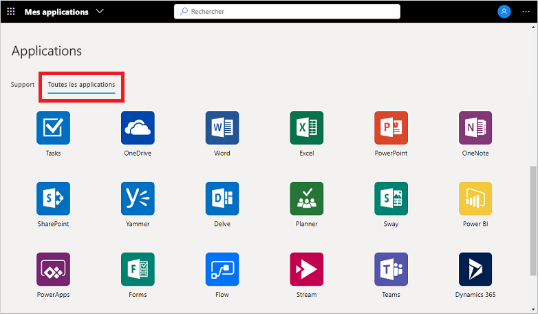

# Accéder aux espaces de travail et les utiliser sur le portail Mes applications (préversion)

Les espaces de travail sont des affichages d’application différents que vous pouvez voir dans le portail **Mes applications** (préversion). Les applications peuvent être regroupées en espaces de travail par fonction de service ou rôle d’utilisateur, par exemple. Si vous ne voyez pas d’espace de travail ou de catégorie disponible, cela signifie que votre administrateur n’en a pas encore configuré ou partagé avec vous. Contactez le support technique de votre organisation pour obtenir une assistance supplémentaire ou des autorisations pour afficher les espaces de travail partagés.

[!INCLUDE [preview-notice](../../../includes/active-directory-end-user-my-apps-and-workspaces.md)]

>[!Important]
>Ce contenu est destiné aux utilisateurs. Si vous êtes administrateur, vous trouverez des informations sur la configuration et la gestion de vos applications cloud dans la [documentation sur la gestion des applications](https://docs.microsoft.com/azure/active-directory/manage-apps/access-panel-workspaces).

## Accéder aux applications à l’aide d’espaces de travail

La liste des espaces de travail du portail **Mes applications** affiche par défaut un espace **Toutes les applications**, avec toutes les applications auxquelles vous avez accès :

Tous les autres espaces de travail que vous voyez dans cette liste ont été créés par votre administrateur et partagés avec vous. Vous pouvez choisir un de ces espaces de travail pour afficher un ensemble plus étendu d’applications, comme le *Support* dans l’exemple suivant :

Lorsque vous sélectionnez et affichez un espace de travail, vous voyez uniquement les applications par défaut auxquelles vous avez accès.

## Étapes suivantes

Après avoir organisé vos applications dans les différentes catégories du portail **Mes applications**, vous pouvez :

- Réviser, mettre à jour ou révoquer les autorisations accordées aux applications. Pour plus d’informations, consultez [Modifier ou révoquer des autorisations d’application dans le portail Mes applications (préversion)](my-applications-portal-permissions-saved-accounts.md).

## Articles connexes

- [Mettre à jour vos informations de profil et de compte](my-account-portal-overview.md). Instructions sur la façon de mettre à jour vos informations personnelles qui s’affichent dans la page **Mon profil** du portail (préversion).

- [Gérer vos organisations](my-account-portal-organizations-page.md). Instructions sur la façon d’afficher et de gérer les informations relatives à votre organisation dans la page **Organisations** du portail **Mon profil**.

- [Gérer vos appareils connectés](my-account-portal-devices-page.md). Instructions pour gérer les appareils auxquels vous êtes connecté à l’aide de votre compte professionnel ou scolaire à partir de la page **Appareils** du portail **Mon profil**.