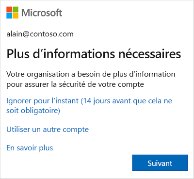
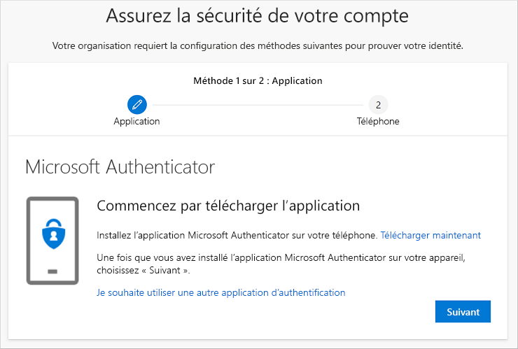
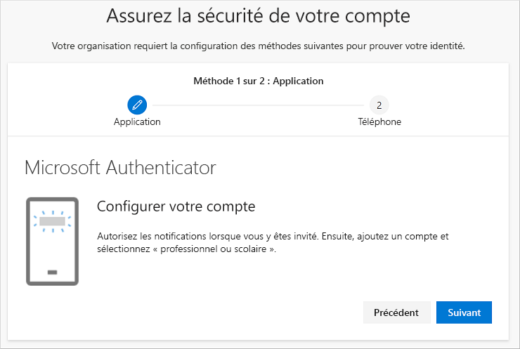
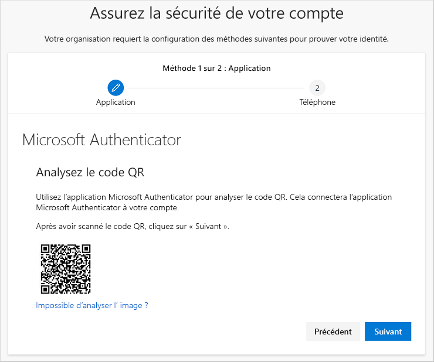
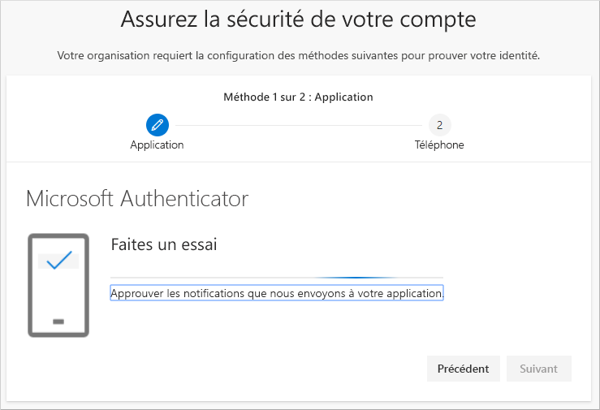
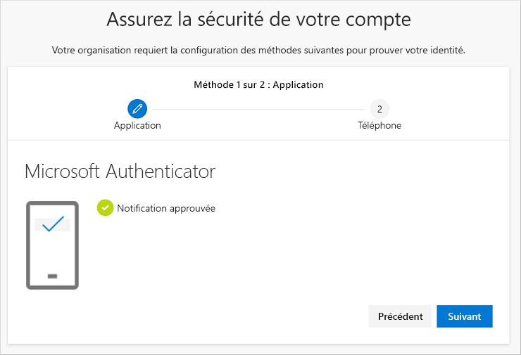
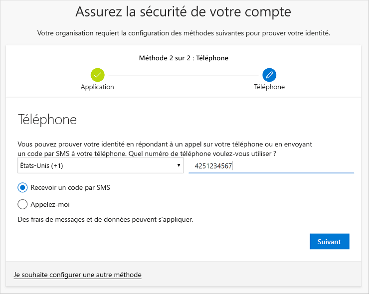
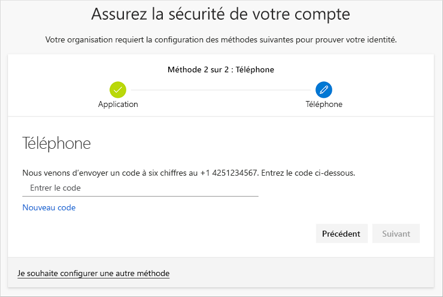
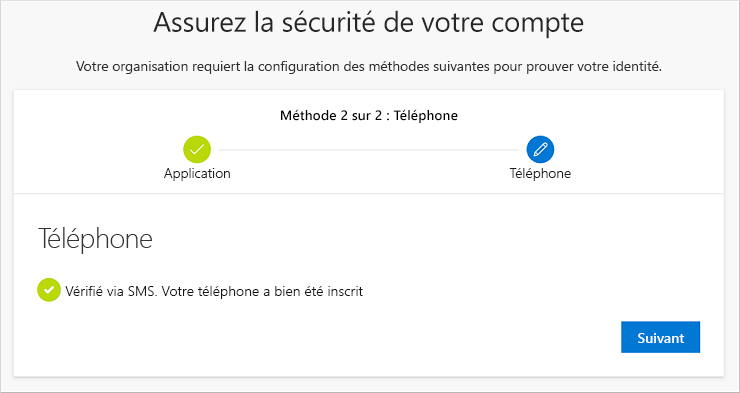
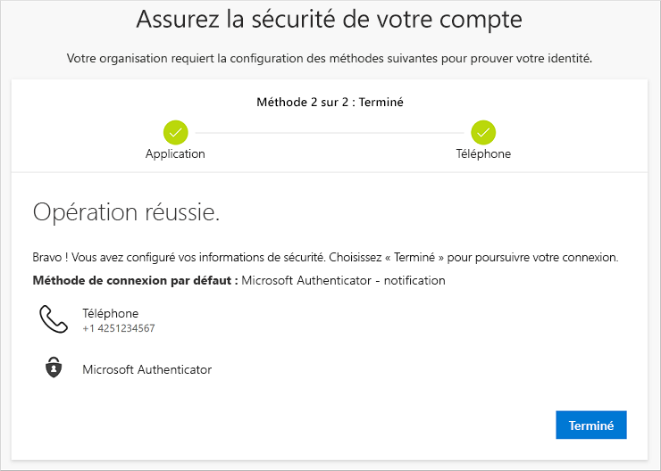

# Configurer des informations de sécurité (préversion) à partir de l’invite de la page de connexion

Vous pouvez suivre ces étapes si vous êtes invité à définir des informations de sécurité immédiatement après vous être connecté à votre compte professionnel ou scolaire.

Cette invite apparaît uniquement si vous n’avez pas configuré les informations de sécurité demandées par votre organisation. Si vous avez déjà configuré vos informations de sécurité et que vous souhaitez les changer, suivez les étapes décrites dans les différents articles de procédure fondés sur une méthode. Pour plus d’informations, consultez la [vue d’ensemble décrivant comment ajouter ou mettre à jour vos informations de sécurité](security-info-add-update-methods-overview.md).

[!INCLUDE [preview-notice](../../../includes/active-directory-end-user-preview-notice-security-info.md)]

## Se connecter à votre compte professionnel ou scolaire

Une fois connecté à votre compte professionnel ou scolaire, vous êtes invité à fournir plus d’informations avant de pouvoir accéder à votre compte.

## Configurer des informations de sécurité à l’aide de l’Assistant

Suivez ces étapes pour configurer les informations de sécurité de votre compte professionnel ou scolaire à partir de l’invite.

>[!Important]
>Il s’agit uniquement d’un exemple du processus. En fonction des besoins de votre organisation, votre administrateur peut avoir défini différentes méthodes de vérification que vous devrez configurer au cours de ce processus. Cet exemple fait appel à deux méthodes : l’application Microsoft Authenticator et un numéro de téléphone mobile pour les appels ou SMS de vérification.

1. Quand vous sélectionnez **Suivant** à partir de l’invite, l’Assistant **Protéger votre compte** apparaît et vous montre la première méthode que votre administrateur et votre organisation vous demandent de configurer. Cet exemple utilise l’application Microsoft Authenticator.

   > [!Note]
   > Si vous souhaitez utiliser une application d’authentification autre que Microsoft Authenticator, sélectionnez le lien **Je souhaite utiliser une autre application d’authentification**.
   >
   > Si votre organisation vous permet de choisir une autre méthode en plus de l’application d’authentification, vous pouvez sélectionner **Je veux configurer une autre méthode**.

    

2. Sélectionnez **Télécharger maintenant** pour télécharger et installer l’application Microsoft Authenticator sur votre appareil mobile, puis sélectionnez **Suivant**. Pour plus d’informations sur le téléchargement et l’installation de l’application, consultez [Télécharger et installer l’application Microsoft Authenticator](user-help-auth-app-download-install.md).

    

3. Gardez la page **Configurer votre compte** ouverte pendant que vous configurez l’application Microsoft Authenticator sur votre appareil mobile.

4. Ouvrez l’application Microsoft Authenticator, choisissez d’autoriser les notifications (si vous y êtes invité), sélectionnez **Ajouter un compte** grâce à l’icône **Personnaliser et contrôler** dans l’angle supérieur droit, puis sélectionnez **Compte professionnel ou scolaire**.

5. Revenez à la page **Configurer votre compte** sur votre ordinateur, puis sélectionnez **Suivant**.

    La page **Scanner le code QR** s’affiche.

    

6. Scannez le code fourni à l’aide du lecteur de code QR d’application de Microsoft Authenticator qui apparaît sur votre appareil mobile après la création de votre compte professionnel ou scolaire à l’étape 5.

    L’application Authenticator doit ajouter votre compte professionnel ou scolaire sans exiger d’informations supplémentaires de votre part. Toutefois, si le lecteur de code QR ne parvient pas à lire le code, vous pouvez sélectionner le lien **Impossible de scanner le code QR** et entrer manuellement le code et l’URL dans l’application Microsoft Authenticator. Pour plus d’informations sur l’ajout manuel d’un code, consultez [Ajouter manuellement un compte à l’application](user-help-auth-app-add-account-manual.md).

7. Sélectionnez **Suivant** dans la page **Scanner le code QR** sur votre ordinateur.

    Une notification est envoyée à l’application Microsoft Authenticator sur votre appareil mobile pour tester votre compte.

    

8. Approuvez la notification dans l’application Microsoft Authenticator, puis sélectionnez **Suivant**.

    .

    Vos informations de sécurité sont mises à jour pour utiliser l’application Microsoft Authenticator par défaut et vérifier votre identité quand vous utilisez la vérification en deux étapes ou la réinitialisation de mot de passe.

9. Dans la page de configuration **Téléphone**, indiquez si vous voulez recevoir un SMS ou un appel téléphonique, puis sélectionnez **Suivant**. Dans cet exemple, nous utilisons des SMS. Vous devez donc indiquer le numéro de téléphone d’un appareil qui accepte les SMS.

    

    Un SMS est envoyé à votre numéro de téléphone. Si vous préférez recevoir un appel téléphonique, le processus est le même. Par contre, vous recevrez un appel téléphonique avec des instructions au lieu d’un SMS.

10. Entrez le code fourni par le SMS envoyé à votre appareil mobile, puis sélectionnez **Suivant**.

    

11. Passez en revue la notification de réussite, puis sélectionnez **Terminé**.

    

    Vos informations de sécurité sont mises à jour pour utiliser les SMS comme méthode de secours afin de vérifier votre identité quand vous utilisez la vérification en deux étapes ou la réinitialisation de mot de passe.

12. Passez en revue la page **Réussite** pour vérifier que vous avez correctement configuré l’application Microsoft Authenticator et une méthode (SMS ou appel téléphonique) pour vos informations de sécurité, puis sélectionnez **Terminé** .

    

## Étapes suivantes

- Pour changer, supprimer ou mettre à jour les méthodes relatives aux informations de sécurité par défaut, consultez :

    - [Configurer les informations de sécurité pour utiliser une application d’authentification](security-info-setup-auth-app.md).

    - [Configurer les informations de sécurité pour utiliser des SMS](security-info-setup-text-msg.md).

    - [Configurer les informations de sécurité pour utiliser un appel téléphonique](security-info-setup-phone-number.md).

    - [Configurer les informations de sécurité pour utiliser un e-mail](security-info-setup-email.md).

    - [Configurer les informations de sécurité pour utiliser des questions de sécurité prédéfinies](security-info-setup-questions.md).

- Pour plus d’informations sur la façon de vous connecter à l’aide de votre méthode spécifiée, consultez ce [guide pratique](user-help-sign-in.md).

- Si vous avez perdu ou oublié votre mot de passe, réinitialisez-le à partir du [portail de réinitialisation de mot de passe](https://passwordreset.microsoftonline.com/), ou suivez les étapes de l’article [Réinitialiser votre mot de passe professionnel ou scolaire](user-help-reset-password.md).

- Obtenez des conseils de dépannage et de l’aide pour les problèmes de connexion en consultant l’article [Quand vous ne pouvez pas vous connecter à votre compte Microsoft](https://support.microsoft.com/help/12429/microsoft-account-sign-in-cant).
