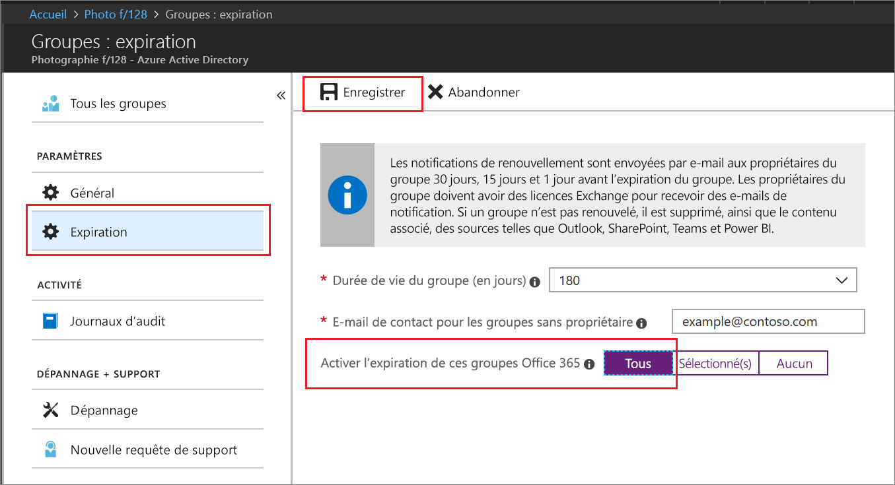

# Démarrage rapide : Configurer l’expiration des groupes Office 365 dans Azure Active Directory

Dans le cadre de ce démarrage rapide, vous allez définir la stratégie d’expiration de vos groupes Office 365. Lorsque les utilisateurs peuvent configurer leurs propres groupes, les groupes inutilisés risquent de se multiplier. L’une des façons de gérer les groupes inutilisés consiste à configurer l’expiration de ces groupes afin de minimiser la tâche de suppression manuelle des groupes.

La stratégie d’expiration est simple :

- Les groupes présentant des activités utilisateur sont automatiquement renouvelés à l’approche de l’expiration.
- Les propriétaires de groupe sont invités à renouveler un groupe sur le point d’expirer.
- Un groupe non renouvelé est supprimé.
- Un groupe Office 365 supprimé peut être restauré dans les 30 jours par son propriétaire ou par un administrateur Azure AD.

> [!NOTE]
> Les groupes bénéficient désormais de l’intelligence Azure AD, qui corrèle leur renouvellement automatique à leur utilisation récente. Cette décision de renouvellement est basée sur l’activité des utilisateurs dans les groupes des services Office 365 tels qu’Outlook, SharePoint, Teams, Yammer, etc.

Si vous ne disposez pas d’abonnement Azure, créez un [compte gratuit](https://azure.microsoft.com/free/) avant de commencer.

## Configuration requise

 Au sein de l'organisation, le rôle aux privilèges les moins élevés requis pour configurer l'expiration du groupe est Administrateur d'utilisateurs.

## Activer la création d’utilisateurs pour les groupes

1. Connectez-vous au [portail Azure](https://portal.azure.com) à l'aide d'un compte Administrateur d'utilisateurs.

2. Sélectionnez **Groupes**, puis sélectionnez **Général**.
  
   

3. Définissez l’option **Les utilisateurs peuvent créer des groupes Office 365** sur **Oui**.

4. Lorsque vous avez terminé, sélectionnez **Enregistrer** pour enregistrer les paramètres des groupes.

## Définir l’expiration d’un groupe

1. Connectez-vous au [portail Azure](https://portal.azure.com), sélectionnez **Azure Active Directory** > **Groupes** > **Expiration** pour ouvrir les paramètres d’expiration.
  
   

2. Définissez l’intervalle d’expiration. Sélectionnez une valeur prédéfinie ou entrez une valeur personnalisée supérieure à 31 jours. 

3. Fournissez une adresse e-mail à laquelle les notifications d’expiration doivent être envoyées si un groupe est dépourvu de propriétaire.

4. Pour ce démarrage rapide, définissez l’option **Activer l’expiration de ces groupes Office 365** sur **Tous**.

5. Lorsque vous avez terminé, sélectionnez **Enregistrer** pour enregistrer les paramètres d’expiration.

Et voilà ! Dans le cadre de ce démarrage rapide, vous avez configuré la stratégie d’expiration des groupes Office 365 sélectionnés.

## Supprimer des ressources

### Pour supprimer la stratégie d’expiration

1. Vérifiez que vous êtes connecté au [Portail Azure](https://portal.azure.com) à l’aide du compte d’administrateur général de votre locataire.
2. Sélectionnez **Azure Active Directory** > **Groupes** > **Expiration**.
3. Définissez l’option **Activer l’expiration de ces groupes Office 365** sur **Aucun**.

### Pour désactiver la création d’utilisateurs pour les groupes

1. Sélectionnez **Azure Active Directory** > **Groupes** > **Général**. 
2. Définissez l’option **Les utilisateurs peuvent créer des groupes Office 365 dans les portails Azure** sur **Non**.

## Étapes suivantes

Pour plus d'informations sur l'expiration, ainsi que sur les instructions PowerShell et les contraintes techniques, consultez l'article suivant :

> [!div class="nextstepaction"]
> [Stratégie d'expiration - PowerShell](groups-lifecycle.md)
