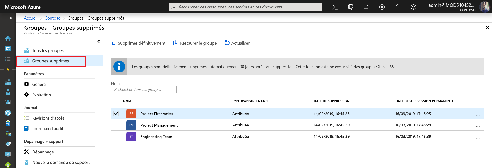

# <a name="restore-a-deleted-office-365-group-in-azure-active-directory"></a>Restaurer un groupe Office 365 supprimé dans Azure Active Directory

Lorsque vous supprimez un groupe Office 365 dans Azure Active Directory (Azure AD), celui-ci est conservé, mais il n’est pas visible pendant 30 jours à partir de la date de suppression. L’avantage de ce comportement est que le groupe et son contenu peuvent être restaurés au besoin. Cette fonctionnalité est limitée exclusivement aux groupes Office 365 dans Azure AD. Elle n’est pas disponible pour les groupes de sécurité et les groupes de distribution. Veuillez noter que la période de restauration des groupes de 30 jours n’est pas personnalisable.

> [!NOTE]
> N’utilisez pas `Remove-MsolGroup`, car il vide le groupe définitivement. Utilisez toujours `Remove-AzureADMSGroup` pour supprimer un groupe Office 365.

Les autorisations requises pour restaurer un groupe peuvent être les suivantes :

Role | Autorisations
--------- | ---------
Administrateur général, Administrateur de groupe Prise en charge du partenaire de niveau 2 et Administrateur Intune | Peut restaurer n’importe quel groupe Office 365 supprimé
Administrateur d’utilisateurs et Prise en charge du partenaire de niveau 1 | Peut restaurer n’importe quel groupe Office 365 supprimé, à l’exception de ceux affectés au rôle Administrateur de la société
Utilisateur | Peut restaurer n’importe quel groupe Office 365 supprimé dont il est propriétaire

## <a name="view-and-manage-the-deleted-office-365-groups-that-are-available-to-restore"></a>Voir et gérer les groupes Office 365 supprimés disponibles pour la restauration

1. Se connecter au [centre d’administration Azure AD](https://aad.portal.azure.com) avec un compte administrateur d’utilisateurs.

2. Sélectionnez **Groupes**, puis **Groupes supprimés** pour voir les groupes supprimés disponibles pour la restauration.

    

3. Dans le panneau **Groupes supprimés**, vous pouvez effectuer les opérations suivantes :

   - Restaurer le groupe supprimé et son contenu en sélectionnant **Restaurer le groupe**.
   - Supprimer définitivement le groupe supprimé en sélectionnant **Supprimer définitivement**. Pour supprimer définitivement un groupe, vous devez être administrateur.

## <a name="view-the-deleted-office-365-groups-that-are-available-to-restore-using-powershell"></a>Voir les groupes Office 365 supprimés disponibles pour la restauration à l’aide de PowerShell

Les applets de commande suivantes peuvent servir à afficher les groupes supprimés pour vérifier que ceux qui vous intéressent n’ont pas encore été supprimés de façon définitive. Ces cmdlets font partie du module [Azure AD PowerShell](https://www.powershellgallery.com/packages/AzureAD/). Pour plus d’informations sur ce module, consultez l’article [Azure Active Directory PowerShell Version 2](/powershell/azure/active-directory/install-adv2?view=azureadps-2.0).

1.  Exécutez l’applet de commande suivante pour afficher tous les groupes Office 365 supprimés dans votre organisation Azure AD et dont la restauration est toujours possible.
   

    ```powershell
    Get-AzureADMSDeletedGroup
    ```

2.  Ou, si vous connaissez l’ID d’objet d’un groupe spécifique (que vous pouvez obtenir à partir de l’applet de commande indiquée à l’étape 1), exécutez l’applet de commande suivante pour vérifier que le groupe supprimé spécifique n’a pas encore été supprimé de façon définitive.

    ```
    Get-AzureADMSDeletedGroup –Id <objectId>
    ```

## <a name="how-to-restore-your-deleted-office-365-group-using-powershell"></a>Comment restaurer votre groupe Office 365 supprimé à l’aide de PowerShell

Une fois que vous avez vérifié que le groupe est toujours disponible pour la restauration, restaurez-le en effectuant l’une des étapes suivantes. Si le groupe contient des documents, des sites SP ou d’autres objets persistants, la restauration du groupe et de son contenu peut nécessiter jusqu’à 24 heures.

1. Exécutez l’applet de commande suivante pour restaurer le groupe et son contenu.
 

   ```
    Restore-AzureADMSDeletedDirectoryObject –Id <objectId>
    ``` 

2. Vous pouvez également exécuter l’applet de commande suivante pour supprimer définitivement le groupe supprimé.
    

    ```
    Remove-AzureADMSDeletedDirectoryObject –Id <objectId>
    ```

## <a name="how-do-you-know-this-worked"></a>Comment savez-vous si l’opération a fonctionné ?

Pour vérifier que vous avez correctement restauré un groupe Office 365, exécutez l’applet de commande `Get-AzureADGroup –ObjectId <objectId>` pour afficher des informations sur le groupe. Une fois que vous avez effectué la demande de restauration :

- Le groupe apparaît dans la barre de navigation de gauche sur Exchange
- Le plan associé au groupe apparaît dans le planificateur.
- Les sites SharePoint et tout leur contenu sont disponibles.
- Le groupe est accessible à partir des points de terminaison Exchange et des autres charges de travail Office 365 qui prennent en charge les groupes Office 365.

## <a name="next-steps"></a>Étapes suivantes

Ces articles fournissent des informations supplémentaires sur les groupes Azure Active Directory.

* [Consulter les groupes existants](../fundamentals/active-directory-groups-view-azure-portal.md)
* [Gérer les paramètres d’un groupe](../fundamentals/active-directory-groups-settings-azure-portal.md)
* [Gérer les membres d’un groupe](../fundamentals/active-directory-groups-members-azure-portal.md)
* [Gérer l’appartenance à un groupe](../fundamentals/active-directory-groups-membership-azure-portal.md)
* [Gérer les règles dynamiques pour les utilisateurs dans un groupe](groups-dynamic-membership.md)
