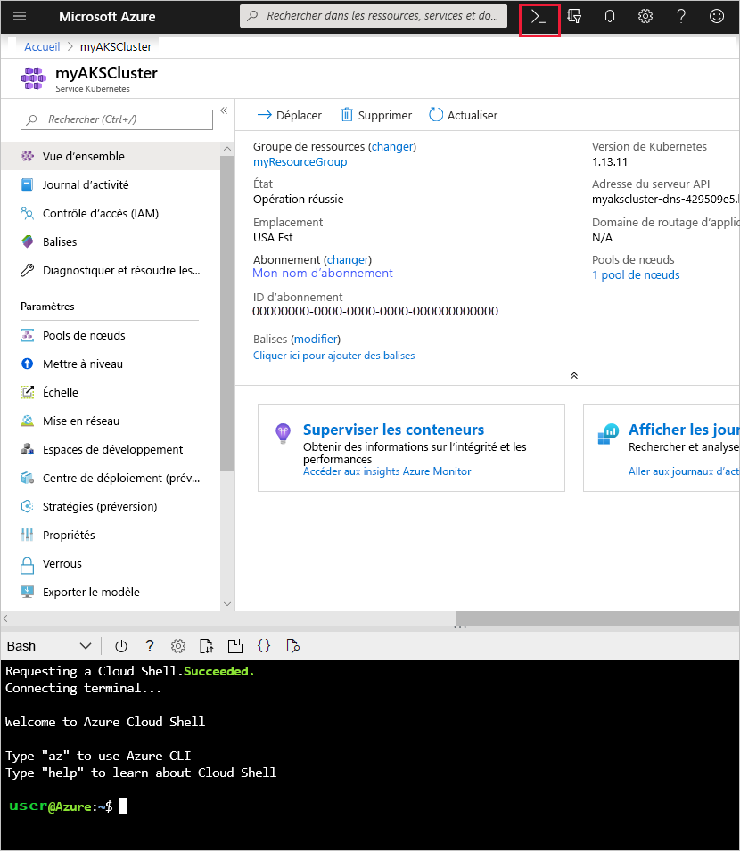
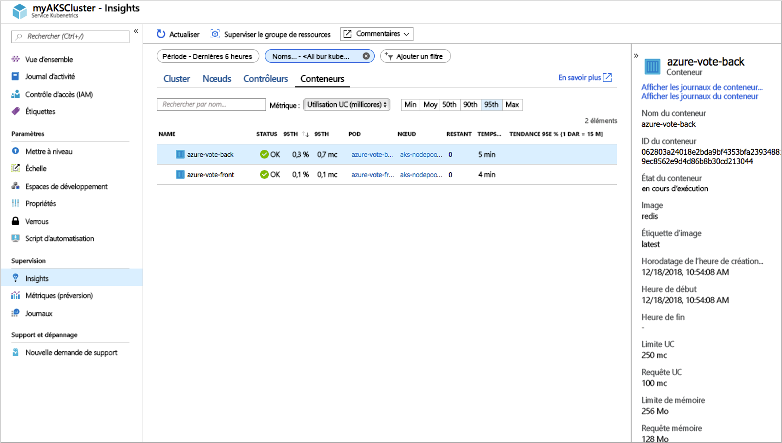

# <a name="quickstart-deploy-an-azure-kubernetes-service-aks-cluster-using-the-azure-portal"></a>Démarrage rapide : déployer un cluster AKS (Azure Kubernetes Service) à l’aide du portail Azure

AKS (Azure Kubernetes Service) est un service Kubernetes managé qui vous permet de déployer et de gérer rapidement des clusters. Dans ce guide de démarrage rapide, vous allez déployer un cluster AKS à l’aide du portail Azure. Une application multiconteneur composée d’un front-end web et d’une instance Redis est exécutée dans le cluster. Vous pouvez ainsi voir comment superviser l’intégrité du cluster et des pods qui exécutent votre application.


Ce guide de démarrage rapide suppose une compréhension élémentaire des concepts liés à Kubernetes. Pour plus d’informations, consultez [Concepts de base de Kubernetes pour AKS (Azure Kubernetes Service)][kubernetes-concepts].

Si vous n’avez pas d’abonnement Azure, créez un [compte gratuit](https://azure.microsoft.com/free/?WT.mc_id=A261C142F) avant de commencer.

## <a name="sign-in-to-azure"></a>Connexion à Azure

Connectez-vous au portail Azure sur [https://portal.azure.com](https://portal.azure.com).

## <a name="create-an-aks-cluster"></a>Créer un cluster AKS

Pour créer un cluster AKS, exécutez les étapes suivantes :

1. Dans le menu du Portail Azure ou dans la page **Accueil**, sélectionnez **Créer une ressource**.

2. Sélectionnez **Conteneurs** >  **Kubernetes Service**.

3. Sur la page **Bases**, configurez les options suivantes :
    - **Détails du projet** : Choisissez un **abonnement** Azure, puis sélectionnez ou créez un **groupe de ressources** Azure, comme *myResourceGroup*.
    - **Détails du cluster** : Entrez un **nom du cluster Kubernetes**, tel que *myAKSCluster*. Sélectionnez une **Région**, une **version de Kubernetes** et le **préfixe du nom DNS** du cluster AKS.
    - **Pool de nœuds principal** : Sélectionnez une **taille de nœud** de machine virtuelle pour les nœuds AKS. Elle ne sera *pas modifiable* une fois le cluster AKS déployé. 
            - Sélectionnez également le nombre de nœuds à déployer dans le cluster. Pour effectuer ce démarrage rapide, définissez le **Nombre de nœuds** à *1*. Le nombre de nœuds est *modifiable* après le déploiement du cluster.
    
    

    Sélectionnez **Suivant : Mettre à l’échelle** lorsque vous avez terminé.

4. Sur la page **Mise à l’échelle**, conservez les options par défaut. Au bas de la page, cliquez sur **Suivant : Authentification**.
    > [!CAUTION]
    > La propagation et la mise en disponibilité des nouveaux principaux de service AAD créés peuvent prendre plusieurs minutes, ce qui entraîne des erreurs « Principal du service introuvable » et des échecs de validation dans le portail Azure. Si vous rencontrez ce problème, consultez [ceci](troubleshooting.md#im-receiving-errors-that-my-service-principal-was-not-found-when-i-try-to-create-a-new-cluster-without-passing-in-an-existing-one) pour obtenir des solutions de contournement.

5. Sur la page **Authentification**, configurez les options suivantes :
    - Créez un principal de service en laissant dans le champ **Principal du Service** **(nouveau) le principal du service par défaut**. Ou vous pouvez choisir *Configurer un principal du service* pour utiliser un principal existant. Si vous utilisez un principal du service existant, vous devez indiquer l’ID client SPN et le secret associés.
    - Activez l’option pour les contrôles d’accès en fonction des rôles Kubernetes (RBAC). Ces options fournissent un contrôle plus précis sur l’accès aux ressources Kubernetes déployées dans votre cluster AKS.

Par défaut, le réseau *De base* est utilisé et Azure Monitor pour conteneurs est activé. Cliquez sur **Vérifier + créer**, puis **Créer** lorsque la validation est terminée.

La création du cluster AKS ne prend que quelques minutes. Une fois votre déploiement terminé, cliquez sur **Accédez à la ressource** ou accédez au groupe de ressources du cluster AKS, par exemple *myResourceGroup*, puis sélectionnez la ressource AKS, par exemple *myAKSCluster*. Le tableau de bord du cluster AKS s’affiche, comme dans l’exemple suivant :


## <a name="connect-to-the-cluster"></a>Se connecter au cluster

Pour gérer un cluster Kubernetes, vous utilisez [kubectl][kubectl], le client de ligne de commande Kubernetes. Le client `kubectl` est préinstallé dans Azure Cloud Shell.

Ouvrez Cloud Shell à l’aide du bouton `>_` situé en haut du portail Azure.



Pour configurer `kubectl` afin de vous connecter à votre cluster Kubernetes, exécutez la commande [az aks get-credentials][az-aks-get-credentials]. Cette commande télécharge les informations d’identification et configure l’interface CLI Kubernetes pour les utiliser. L’exemple suivant obtient les informations d’identification du nom du cluster *myAKSCluster* dans le groupe de ressources nommé *myResourceGroup* :

```azurecli-interactive
az aks get-credentials --resource-group myResourceGroup --name myAKSCluster
```

Pour vérifier la connexion à votre cluster, utilisez la commande [kubectl get][kubectl-get] pour retourner une liste des nœuds du cluster.

```console
kubectl get nodes
```

L’exemple de sortie suivant montre le nœud unique créé au cours des étapes précédentes. Vérifiez que l’état du nœud est *Ready* :

```output
NAME                       STATUS    ROLES     AGE       VERSION
aks-agentpool-14693408-0   Ready     agent     15m       v1.11.5
```

## <a name="run-the-application"></a>Exécution de l'application

Un fichier manifeste Kubernetes définit un état souhaité pour le cluster, notamment les images conteneur à exécuter. Dans ce guide de démarrage rapide, un manifeste est utilisé afin de créer tous les objets nécessaires pour l’exécution de l’application Azure Vote. Ce manifeste inclut deux [déploiements Kubernetes][kubernetes-deployment] : un pour les exemples d’applications Azure Vote Python et l’autre pour une instance Redis. Deux [services Kubernetes][kubernetes-service] sont également créés : un service interne pour l’instance Redis et un service externe pour accéder à l’application Azure Vote à partir d’Internet.

> [!TIP]
> Dans ce guide de démarrage rapide, vous créez et déployez manuellement vos manifestes d’application sur le cluster AKS. Dans des scénarios plus probables, vous pouvez utiliser [Azure Dev Spaces][azure-dev-spaces] pour itérer et déboguer votre code rapidement, directement dans le cluster AKS. Vous pouvez utiliser les espaces Dev Spaces sur des plateformes de système d’exploitation ainsi que des environnements de développement et collaborer avec les autres personnes de votre équipe.

Dans Cloud Shell, utilisez la commande `nano azure-vote.yaml` ou `vi azure-vote.yaml` pour créer un fichier nommé `azure-vote.yaml`. Ensuite, copiez-y la définition YAML suivante :

```yaml
apiVersion: apps/v1
kind: Deployment
metadata:
  name: azure-vote-back
spec:
  replicas: 1
  selector:
    matchLabels:
      app: azure-vote-back
  template:
    metadata:
      labels:
        app: azure-vote-back
    spec:
      nodeSelector:
        "beta.kubernetes.io/os": linux
      containers:
      - name: azure-vote-back
        image: redis
        resources:
          requests:
            cpu: 100m
            memory: 128Mi
          limits:
            cpu: 250m
            memory: 256Mi
        ports:
        - containerPort: 6379
          name: redis
---
apiVersion: v1
kind: Service
metadata:
  name: azure-vote-back
spec:
  ports:
  - port: 6379
  selector:
    app: azure-vote-back
---
apiVersion: apps/v1
kind: Deployment
metadata:
  name: azure-vote-front
spec:
  replicas: 1
  selector:
    matchLabels:
      app: azure-vote-front
  template:
    metadata:
      labels:
        app: azure-vote-front
    spec:
      nodeSelector:
        "beta.kubernetes.io/os": linux
      containers:
      - name: azure-vote-front
        image: microsoft/azure-vote-front:v1
        resources:
          requests:
            cpu: 100m
            memory: 128Mi
          limits:
            cpu: 250m
            memory: 256Mi
        ports:
        - containerPort: 80
        env:
        - name: REDIS
          value: "azure-vote-back"
---
apiVersion: v1
kind: Service
metadata:
  name: azure-vote-front
spec:
  type: LoadBalancer
  ports:
  - port: 80
  selector:
    app: azure-vote-front
```

Déployez l’application à l’aide de la commande [kubectl apply][kubectl-apply] et spécifiez le nom de votre manifeste YAML :

```console
kubectl apply -f azure-vote.yaml
```

L’exemple de sortie suivant montre que les déploiements et les ressources ont été créés correctement :

```output
deployment "azure-vote-back" created
service "azure-vote-back" created
deployment "azure-vote-front" created
service "azure-vote-front" created
```

## <a name="test-the-application"></a>Test de l’application

Quand l’application s’exécute, un service Kubernetes expose le front-end de l’application sur Internet. L’exécution de ce processus peut prendre plusieurs minutes.

Pour surveiller la progression, utilisez la commande [kubectl get service][kubectl-get] avec l’argument `--watch`.

```console
kubectl get service azure-vote-front --watch
```

Dans un premier temps, la valeur *EXTERNAL-IP* du service *azure-vote-front* apparaît comme étant en attente (*pending*).

```output
NAME               TYPE           CLUSTER-IP   EXTERNAL-IP   PORT(S)        AGE
azure-vote-front   LoadBalancer   10.0.37.27   <pending>     80:30572/TCP   6s
```

Quand l’adresse *EXTERNAL-IP* passe de l’état *pending* à une adresse IP publique réelle, utilisez `CTRL-C` pour arrêter le processus de surveillance `kubectl`. L’exemple de sortie suivant montre une adresse IP publique valide affectée au service :

```output
azure-vote-front   LoadBalancer   10.0.37.27   52.179.23.131   80:30572/TCP   2m
```

Pour voir l’application Azure Vote en action, ouvrez un navigateur web en utilisant l’adresse IP externe de votre service.


## <a name="monitor-health-and-logs"></a>Analyser le fonctionnement et les journaux d’activité

Azure Monitor pour conteneurs a été activé quand vous avez créé le cluster. Cette fonctionnalité de surveillance fournit des indicateurs d’intégrité pour le cluster AKS et les pods en cours d’exécution sur le cluster.

Ces données s’afficheront sur le Portail Azure au bout de quelques minutes. Pour afficher l’état actuel, la durée de fonctionnement et l’utilisation des ressources pour les pods Azure Vote, accédez à la ressource AKS dans le portail Azure, comme *myAKSCluster*. Vous pouvez alors accéder à l’état d’intégrité en procédant comme suit :

1. Sous **Supervision** à gauche, choisissez **Insights**.
1. Dans la partie supérieure, choisissez **+ Ajouter un filtre**.
1. Sélectionnez *Espace de noms* en guise de propriété, puis choisissez *\<Tout sauf kube-system\>* .
1. Choisissez de visualiser les **Conteneurs**.

Les conteneurs *azure-vote-back* et *azure-vote-front* s’affichent, comme illustré dans l’exemple suivant :



Pour visualiser les journaux relatifs au pod `azure-vote-front`, sélectionnez **Afficher les journaux du conteneur** dans la liste déroulante de conteneurs. Vous pourrez voir les flux *stdout* et *stderr* du conteneur.


## <a name="delete-cluster"></a>Supprimer un cluster

Dès vous n’avez plus besoin du cluster, supprimez la ressource de cluster : toutes les ressources associées seront ainsi supprimées. Vous pouvez effectuer cette opération sur le Portail Azure en cliquant sur le bouton **Supprimer** du tableau de bord du cluster AKS. Vous pouvez aussi exécuter la commande [az aks delete][az-aks-delete] dans Cloud Shell :

```azurecli-interactive
az aks delete --resource-group myResourceGroup --name myAKSCluster --no-wait
```

> [!NOTE]
> Lorsque vous supprimez le cluster, le principal de service Azure Active Directory utilisé par le cluster AKS n’est pas supprimé. Pour obtenir des instructions sur la façon de supprimer le principal de service, consultez [Considérations et suppression du principal de service AKS][sp-delete].

## <a name="get-the-code"></a>Obtenir le code

Dans ce guide de démarrage rapide, des images conteneur créées au préalable ont été utilisées pour créer un déploiement Kubernetes. Le code de l’application associé, Dockerfile, et le fichier manifeste Kubernetes sont disponibles sur GitHub.

[https://github.com/Azure-Samples/azure-voting-app-redis][azure-vote-app]

## <a name="next-steps"></a>Étapes suivantes

Dans ce Démarrage rapide, vous avez déployé un cluster Kubernetes dans lequel vous avez déployé une application de plusieurs conteneurs.

Pour en savoir plus sur AKS et parcourir le code complet de l’exemple de déploiement, passez au tutoriel sur le cluster Kubernetes.

> [!div class="nextstepaction"]
> [Didacticiel AKS][aks-tutorial]

<!-- LINKS - external -->
[azure-vote-app]: https://github.com/Azure-Samples/azure-voting-app-redis.git
[kubectl]: https://kubernetes.io/docs/user-guide/kubectl/
[kubectl-apply]: https://kubernetes.io/docs/reference/generated/kubectl/kubectl-commands#apply
[kubectl-get]: https://kubernetes.io/docs/reference/generated/kubectl/kubectl-commands#get
[kubernetes-documentation]: https://kubernetes.io/docs/home/

<!-- LINKS - internal -->
[kubernetes-concepts]: concepts-clusters-workloads.md
[az-aks-get-credentials]: /cli/azure/aks?view=azure-cli-latest#az-aks-get-credentials
[az-aks-delete]: /cli/azure/aks#az-aks-delete
[aks-monitor]: ../monitoring/monitoring-container-health.md
[aks-network]: ./concepts-network.md
[aks-tutorial]: ./tutorial-kubernetes-prepare-app.md
[http-routing]: ./http-application-routing.md
[sp-delete]: kubernetes-service-principal.md#additional-considerations
[azure-dev-spaces]: https://docs.microsoft.com/azure/dev-spaces/
[kubernetes-deployment]: concepts-clusters-workloads.md#deployments-and-yaml-manifests
[kubernetes-service]: concepts-network.md#services
