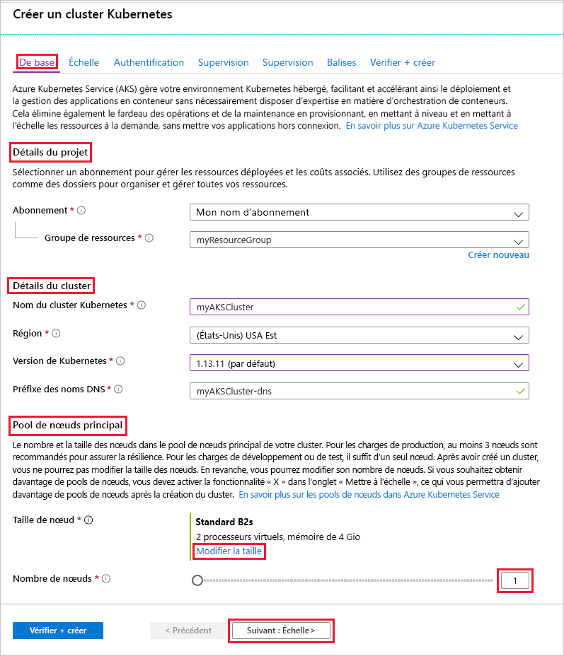
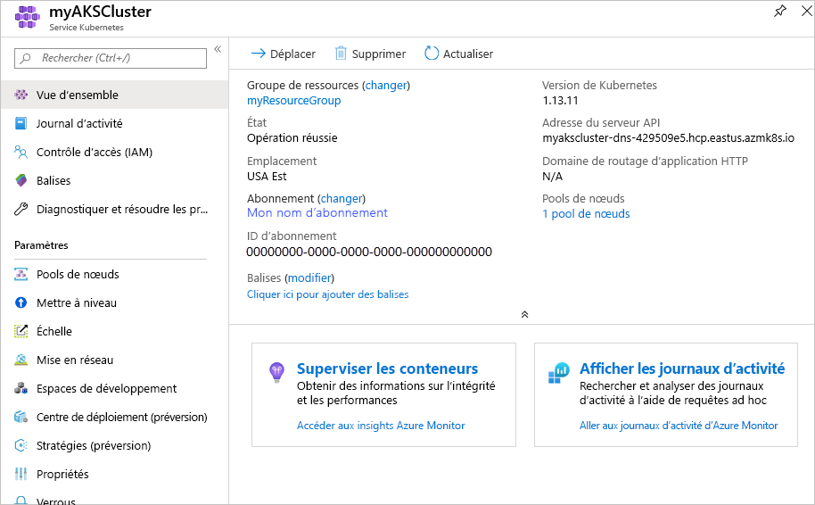
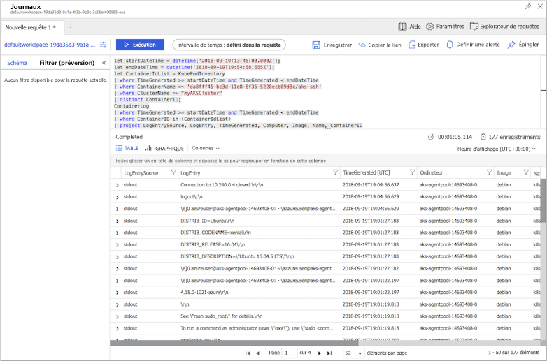

# <a name="quickstart-deploy-an-azure-kubernetes-service-aks-cluster"></a>Guide de démarrage rapide : déployer un cluster Azure Kubernetes Service (AKS)

Dans ce guide de démarrage rapide, vous allez déployer un cluster AKS à l’aide du portail Azure. Une application de plusieurs conteneurs composée d’un serveur web frontal et d’une instance Redis est alors exécutée sur le cluster. Ceci fait, l’application est accessible via internet.


Ce guide de démarrage rapide suppose une compréhension élémentaire des concepts liés à Kubernetes. Pour plus d’informations sur Kubernetes, consultez la [documentation de Kubernetes][kubernetes-documentation].

## <a name="sign-in-to-azure"></a>Connexion à Azure

Connectez-vous au portail Azure sur http://portal.azure.com.

## <a name="create-an-aks-cluster"></a>Créer un cluster AKS

Sélectionnez **Créer une ressource** > **Kubernetes Service** dans le coin supérieur gauche du portail Azure.

Pour créer un cluster AKS, exécutez les étapes suivantes :

1. **Bases** - Configurez les options suivantes :
    - *DÉTAILS DE PROJET* : choisissez un abonnement Azure, puis sélectionnez ou créez un groupe de ressources Azure, tel que *myResourceGroup*. Entrez un **nom du cluster Kubernetes**, tel que *myAKSCluster*.
    - *DÉTAILS DU CLUSTER* : sélectionnez une région, une version de Kubernetes, et le préfixe de nom DNS pour le cluster AKS.
    - *MISE À L’ÉCHELLE* : sélectionnez une taille de machine virtuelle pour les nœuds AKS. Elle ne sera **pas modifiable** une fois le cluster AKS déployé.
        - Sélectionnez également le nombre de nœuds à déployer dans le cluster. Pour effectuer ce démarrage rapide, définissez le **Nombre de nœuds** à *1*. Le nombre de nœuds est **modifiable** après le déploiement du cluster.
    
    

    Sélectionnez **Suivant : authentification** lorsque vous avez terminé.

1. **Authentification** : configurez les options suivantes :
    - Créez un principal de service ou *Configurez*-en un pour utiliser un principal existant. Si vous utilisez un nom de principal du service existant, indiquez l’ID client et la clé secrète associés.
    - Activez l’option pour les contrôles d’accès en fonction des rôles Kubernetes (RBAC). Ces options fournissent un contrôle plus précis sur l’accès aux ressources Kubernetes déployées dans votre cluster AKS.

    Sélectionnez **Suivant : Mise en réseau** lorsque vous avez terminé.

1. **Mise en réseau** : configurez les options de mise en réseau suivantes, qui doivent être réglées par défaut :
    
    - **Routage des applications HTTP** - Sélectionnez **Oui** pour configurer un contrôleur d’entrée intégré en activant la création automatique de noms DNS publics. Pour plus d’informations sur le routage HTTP, voir [DNS et routage HTTP AKS][http-routing].
    - **Configuration réseau** - Sélectionnez la configuration réseau **De base**, à l’aide du plug-in [kubenet][kubenet] de Kubernetes, plutôt que de choisir une configuration réseau avancée, avec [Azure CNI][azure-cni]. Pour plus d’informations sur les options de mise en réseau, voir [Vue d’ensemble de la mise en réseau AKS][aks-network].
    
    Sélectionnez **Suivant : Monitoring** lorsque vous avez terminé.

1. Lorsque vous déployez un cluster AKS, vous pouvez configurer Azure Monitor pour les conteneurs afin qu’il supervise l’intégrité du cluster AKS et des pods en cours d’exécution sur le cluster. Pour plus d’informations sur l’analyse du fonctionnement des conteneurs, voir [Analyser le fonctionnement d’Azure Kubernetes Service][aks-monitor].

    Sélectionnez **Oui** pour activer le monitoring du conteneur ; ensuite, sélectionnez un espace de travail Log Analytics existant ou créez-en un.
    
    Sélectionnez **Vérifier + créer**, puis **Créer** lorsque vous êtes prêt.

Il ne faut que quelques minutes pour créer le cluster AKS et que celui-ci soit prêt à être utilisé. Accédez au groupe de ressources de cluster AKS, comme *myResourceGroup*, puis sélectionnez la ressource AKS, comme *myAKSCluster*. Le tableau de bord du cluster AKS s’affiche, comme dans la capture d’écran suivante :



## <a name="connect-to-the-cluster"></a>Connexion au cluster

Pour gérer un cluster Kubernetes, utilisez [kubectl][kubectl], le client de ligne de commande Kubernetes. Le client `kubectl` est préinstallé dans Azure Cloud Shell.

Ouvrez Cloud Shell à l’aide du bouton situé dans le coin supérieur droit du portail Azure.


Exécutez la commande [az aks get-credentials][az-aks-get-credentials] pour configurer `kubectl` afin de vous connecter à votre cluster Kubernetes. L’exemple suivant obtient les informations d’identification du nom du cluster *myAKSCluster* dans le groupe de ressources nommé *myResourceGroup* :

```azurecli-interactive
az aks get-credentials --resource-group myResourceGroup --name myAKSCluster
```

Pour vérifier la connexion à votre cluster, utilisez la commande [kubectl get][kubectl-get] pour retourner une liste des nœuds du cluster.

```azurecli-interactive
kubectl get nodes
```

L’exemple de sortie suivant montre le nœud unique créé au cours des étapes précédentes.

```
NAME                       STATUS    ROLES     AGE       VERSION
aks-agentpool-14693408-0   Ready     agent     10m       v1.11.2
```

## <a name="run-the-application"></a>Exécution de l'application

Les fichiers manifestes Kubernetes définissent un état souhaité pour un cluster, et en particulier les images conteneur à exécuter. Dans ce guide de démarrage rapide, un manifeste est utilisé afin de créer tous les objets nécessaires pour l’exécution de l’application Azure Vote. Parmi ces objets figurent deux [déploiements Kubernetes][kubernetes-deployment] - un pour la composante frontale d’Azure Vote, l’autre pour une instance Redis. En outre, deux [services Kubernetes][kubernetes-service] sont créés, un service interne pour l’instance Redis et un service externe pour l’accès à l’application Azure Vote à partir d’Internet.

Créez un fichier nommé `azure-vote.yaml` et copiez-y le code YAML suivant. Si vous travaillez dans Azure Cloud Shell, créez ce fichier à l’aide de `vi` ou de `Nano`, comme si vous travailliez sur un système virtuel ou physique.

```yaml
apiVersion: apps/v1beta1
kind: Deployment
metadata:
  name: azure-vote-back
spec:
  replicas: 1
  template:
    metadata:
      labels:
        app: azure-vote-back
    spec:
      containers:
      - name: azure-vote-back
        image: redis
        resources:
          requests:
            cpu: 100m
            memory: 128Mi
          limits:
            cpu: 250m
            memory: 256Mi
        ports:
        - containerPort: 6379
          name: redis
---
apiVersion: v1
kind: Service
metadata:
  name: azure-vote-back
spec:
  ports:
  - port: 6379
  selector:
    app: azure-vote-back
---
apiVersion: apps/v1beta1
kind: Deployment
metadata:
  name: azure-vote-front
spec:
  replicas: 1
  template:
    metadata:
      labels:
        app: azure-vote-front
    spec:
      containers:
      - name: azure-vote-front
        image: microsoft/azure-vote-front:v1
        resources:
          requests:
            cpu: 100m
            memory: 128Mi
          limits:
            cpu: 250m
            memory: 256Mi
        ports:
        - containerPort: 80
        env:
        - name: REDIS
          value: "azure-vote-back"
---
apiVersion: v1
kind: Service
metadata:
  name: azure-vote-front
spec:
  type: LoadBalancer
  ports:
  - port: 80
  selector:
    app: azure-vote-front
```

Utilisez la commande [kubectl apply][kubectl-apply] pour exécuter l’application.

```azurecli-interactive
kubectl create -f azure-vote.yaml
```

L’exemple de sortie suivant présente les ressources Kubernetes créées sur votre cluster AKS :

```
deployment "azure-vote-back" created
service "azure-vote-back" created
deployment "azure-vote-front" created
service "azure-vote-front" created
```

## <a name="test-the-application"></a>Test de l’application

Lorsque l’application s’exécute, un [service Kubernetes][kubernetes-service] est créé pour exposer l’application à Internet. L’exécution de ce processus peut prendre plusieurs minutes.

Pour surveiller la progression, utilisez la commande [kubectl get service][kubectl-get] avec l’argument `--watch`.

```azurecli-interactive
kubectl get service azure-vote-front --watch
```

Au début, *EXTERNAL-IP* apparaît comme étant *en attente* pour le service *azure-vote-front*.

```
NAME               TYPE           CLUSTER-IP   EXTERNAL-IP   PORT(S)        AGE
azure-vote-front   LoadBalancer   10.0.37.27   <pending>     80:30572/TCP   6s
```

Une fois que l’adresse *EXTERNAL-IP* est passée du statut *En attente* à *Adresse IP*, utilisez `CTRL-C` pour arrêter le processus de surveillance kubectl.

```
azure-vote-front   LoadBalancer   10.0.37.27   52.179.23.131   80:30572/TCP   2m
```

Ouvrez un navigateur web à l’adresse IP externe de votre service pour voir l’application Azure Vote, comme indiqué dans l’exemple suivant :


## <a name="monitor-health-and-logs"></a>Analyser le fonctionnement et les journaux

Les informations du conteneur de surveillance ont été activées dès lors que vous avez créé le cluster. Cette fonctionnalité de surveillance fournit des indicateurs d’intégrité pour le cluster AKS et les pods en cours d’exécution sur le cluster. Pour plus d’informations sur l’analyse du fonctionnement des conteneurs, voir [Analyser le fonctionnement d’Azure Kubernetes Service][aks-monitor].

Ces données s’afficheront sur le Portail Azure au bout de quelques minutes. Pour afficher l’état actuel, la durée de fonctionnement et l’utilisation des ressources pour les pods Azure Vote, accédez à la ressource AKS dans le portail Azure, comme *myAKSCluster*. Vous pouvez alors accéder à l’état d’intégrité en procédant comme suit :

1. Sous **Surveillance** à gauche, choisissez **Insights (préversion)**.
1. Dans la partie supérieure, choisissez **+ Ajouter un filtre**.
1. Sélectionnez *Espace de noms* en guise de propriété, puis choisissez *\<Tout sauf kube-system\>*.
1. Choisissez de visualiser les **Conteneurs**.

Les conteneurs *azure-vote-back* et *azure-vote-front* s’affichent, comme illustré dans l’exemple suivant :


Pour visualiser les journaux relatifs au pod `azure-vote-front`, sélectionnez le lien **Afficher les journaux de conteneurs** sur le côté droit de la liste de conteneurs. Vous pourrez voir les flux *stdout* et *stderr* du conteneur.



## <a name="delete-cluster"></a>Supprimer un cluster

Dès vous n’avez plus besoin du cluster, supprimez la ressource de cluster : toutes les ressources associées seront ainsi supprimées. Vous pouvez effectuer cette opération sur le Portail Azure en cliquant sur le bouton **Supprimer** du tableau de bord du cluster AKS. Vous pouvez aussi exécuter la commande [az aks delete][az-aks-delete] dans Cloud Shell :

```azurecli-interactive
az aks delete --resource-group myResourceGroup --name myAKSCluster --no-wait
```

> [!NOTE]
> Lorsque vous supprimez le cluster, le principal de service Azure Active Directory utilisé par le cluster AKS n’est pas supprimé. Pour obtenir des instructions sur la façon de supprimer le principal de service, consultez [Considérations principales et suppression du principal de service AKS][sp-delete].

## <a name="get-the-code"></a>Obtenir le code

Dans ce guide de démarrage rapide, les images de conteneur, créées au préalable, ont été utilisées pour créer un déploiement Kubernetes. Le code de l’application associé, Dockerfile, et le fichier manifeste Kubernetes sont disponibles sur GitHub.

[https://github.com/Azure-Samples/azure-voting-app-redis][azure-vote-app]

## <a name="next-steps"></a>Étapes suivantes

Dans ce Démarrage rapide, vous avez déployé un cluster Kubernetes dans lequel vous avez déployé une application de plusieurs conteneurs.

Pour en savoir plus sur ACS et parcourir le code complet de l’exemple de déploiement, passez au tutoriel sur le cluster Kubernetes.

> [!div class="nextstepaction"]
> [Tutoriel ACS][aks-tutorial]

<!-- LINKS - external -->
[azure-vote-app]: https://github.com/Azure-Samples/azure-voting-app-redis.git
[azure-cni]: https://github.com/Azure/azure-container-networking/blob/master/docs/cni.md
[kubectl]: https://kubernetes.io/docs/user-guide/kubectl/
[kubectl-apply]: https://kubernetes.io/docs/reference/generated/kubectl/kubectl-commands#apply
[kubectl-get]: https://kubernetes.io/docs/reference/generated/kubectl/kubectl-commands#get
[kubenet]: https://kubernetes.io/docs/concepts/cluster-administration/network-plugins/#kubenet
[kubernetes-deployment]: https://kubernetes.io/docs/concepts/workloads/controllers/deployment/
[kubernetes-documentation]: https://kubernetes.io/docs/home/
[kubernetes-service]: https://kubernetes.io/docs/concepts/services-networking/service/

<!-- LINKS - internal -->
[az-aks-get-credentials]: /cli/azure/aks?view=azure-cli-latest#az-aks-get-credentials
[az-aks-delete]: /cli/azure/aks#az-aks-delete
[aks-monitor]: ../monitoring/monitoring-container-health.md
[aks-network]: ./networking-overview.md
[aks-tutorial]: ./tutorial-kubernetes-prepare-app.md
[http-routing]: ./http-application-routing.md
[sp-delete]: kubernetes-service-principal.md#additional-considerations
