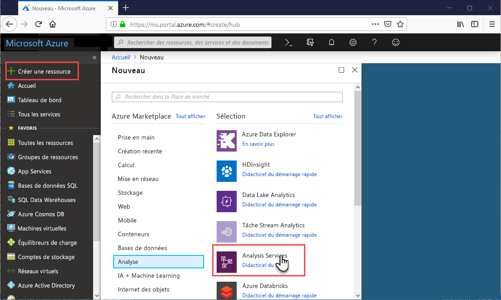

# Création d’un serveur Analysis Services dans le portail Azure
Cet article vous guide lors du processus de création d’une ressource de serveur Analysis Services dans votre abonnement Azure.

Avant de commencer, vous avez besoin des éléments suivants : 

* **Abonnement Azure** : visitez [version d’évaluation gratuite d’Azure](https://azure.microsoft.com/offers/ms-azr-0044p/) pour créer un compte.
* **Azure Active Directory** : votre abonnement doit être associé à un locataire Azure Active Directory. Vous devez également être connecté à Azure avec un compte dans cette instance d’Azure Active Directory. Pour en savoir plus, consultez [Authentification et autorisations utilisateur](analysis-services-manage-users.md).

## Se connecter au portail Azure. 

Connectez-vous au [portail Azure](https://portal.azure.com)

## Créer un serveur

1. Cliquez sur **+ Créer une ressource** > **Données + Analytique** > **Analysis Services**.

    

2. Dans **Analysis Services**, renseignez les champs requis, puis cliquez sur **Créer**.
   
    
   
   * **Nom du serveur** : tapez un nom unique utilisé pour se référencer au serveur.
   * **Abonnement** : sélectionnez l’abonnement à associer à ce serveur.
   * **Groupe de ressources** : créez un groupe de ressources ou sélectionnez un groupe existant. Ces groupes de ressources sont conçus pour vous aider à gérer une collection de ressources Azure. Pour en savoir plus, consultez les [groupes de ressources](../azure-resource-manager/resource-group-overview.md).
   * **Emplacement** : cet emplacement du centre de données Azure héberge le serveur. Choisissez l’emplacement le plus proche de votre plus grande base d’utilisateurs.
   * **Niveau de tarification** : sélectionnez un niveau de tarification. Si vous effectuez des tests et envisagez d’installer l’exemple de base de données model, sélectionnez le niveau gratuit **D1**. Pour en savoir plus, voir [Tarification d’Analysis Services](https://azure.microsoft.com/pricing/details/analysis-services/). 
    * **Administrateur** : par défaut, il s’agit du compte avec lequel vous êtes connecté. Vous pouvez choisir un autre compte de votre annuaire Azure Active Directory.
    * **Paramètres du stockage de sauvegarde** : facultatif. Si vous possédez déjà un [compte de stockage](../storage/common/storage-introduction.md), vous pouvez le spécifier en tant que compte par défaut pour la sauvegarde de la base de données model. Vous pouvez également spécifier les paramètres de [sauvegarde et restauration](analysis-services-backup.md) ultérieurement.
    * **Date d’expiration de la clé de stockage** : facultatif. Spécifiez une période d’expiration pour la clé de stockage.
3. Cliquez sur **Créer**.

La création prend généralement moins d’une minute. Si vous avez sélectionné **Add to Portal** (Ajouter au portail), accédez au portail pour voir votre nouveau serveur. Ou, accédez à **Tous les services** > **Analysis Services** pour voir si votre serveur est prêt.

## Supprimer des ressources
Quand vous n’en avez plus besoin, supprimez votre serveur. Dans la page **Vue d’ensemble** de votre serveur, cliquez sur **Supprimer**. 

 

## Étapes suivantes

[Ajoutez un exemple de modèle de données](analysis-services-create-sample-model.md) à votre serveur.  
[Installez une passerelle de données locale](analysis-services-gateway-install.md) si votre modèle de données se connecte à des sources de données locales.  
[Déployez un projet de modèle tabulaire](analysis-services-deploy.md) à partir de Visual Studio.   

