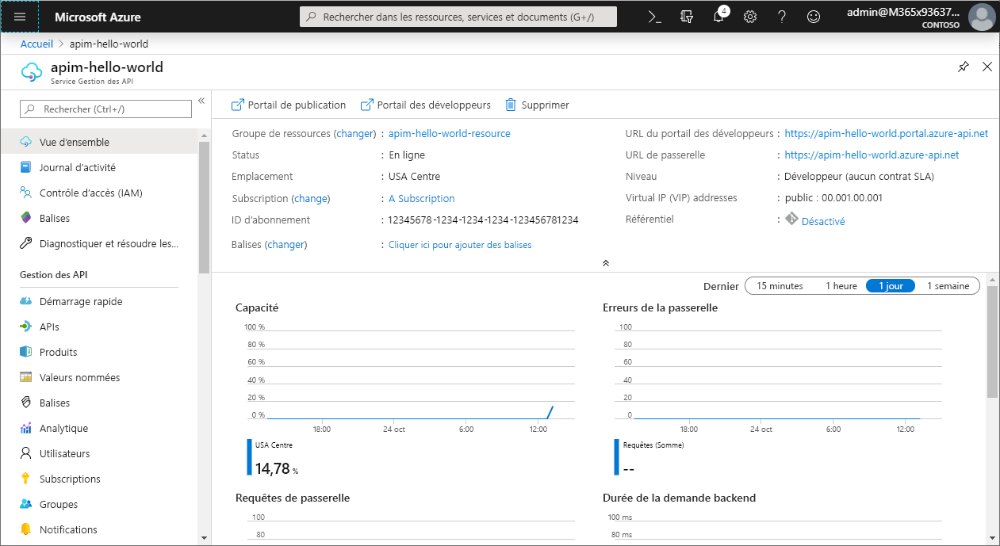
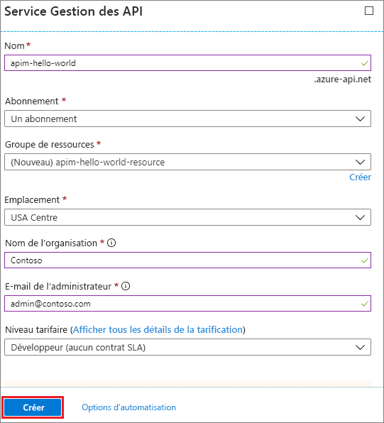

# Créer une instance du service Gestion des API Azure

Le service Gestion des API Azure (API Management, APIM) permet aux organisations de publier des API pour des développeurs externes, partenaires et internes afin de libérer le potentiel de leurs données et de leurs services. Il offre les compétences essentielles qui garantissent un programme d’API réussi au travers de l’engagement des développeurs, des perspectives commerciales, de l’analytique, de la sécurité et de la protection. APIM vous permet de créer et de gérer des passerelles d’API modernes pour des services backend existants, où qu’ils soient hébergés. Pour plus d’informations, consultez la rubrique [Vue d’ensemble](api-management-key-concepts.md).

Ce guide de démarrage rapide décrit les étapes permettant de créer une instance de la Gestion des API à l’aide du portail Azure.

[!INCLUDE [quickstarts-free-trial-note](../../includes/quickstarts-free-trial-note.md)]

## Connexion à Azure

Connectez-vous au portail Azure sur http://portal.azure.com.

## Créer un service

1. Dans le [portail Azure](https://portal.azure.com/), sélectionnez **Créer une nouvelle ressource** > **Intégration Entreprise** > **Gestion des API**.

    Vous pouvez également choisir **Nouveau**, entrer `API management` dans la zone de recherche, puis appuyer sur Entrée. Cliquez sur **Créer**.

2. Dans la fenêtre **Service Gestion des API**, entrez les paramètres.

    

    | Paramètre      | Valeur suggérée  | Description              |
    | ------------ |  ------- | ---------------------------------|
    |**Name**|Nom unique pour votre service Gestion des API.| Vous ne pourrez plus changer ce nom. Le nom du service sert à générer un nom de domaine par défaut sous la forme *{nom}.azure-api.net.* Si vous souhaitez utiliser un nom de domaine personnalisé, consultez [Configurer un domaine personnalisé](configure-custom-domain.md).   Le nom du service est utilisé pour faire référence au service et la ressource Azure correspondante.|
    |**Abonnement**|Votre abonnement | Abonnement sous lequel cette nouvelle instance de service sera créée. Vous pouvez sélectionner l’abonnement parmi les différents abonnements Azure auxquels vous avez accès.|
    |**Groupe de ressources**|*apimResourceGroup*|Vous pouvez sélectionner une ressource nouvelle ou existante. Un groupe de ressources désigne une collection de ressources qui partagent un cycle de vie, des autorisations et des stratégies. En savoir plus [ici](../azure-resource-manager/resource-group-overview.md#resource-groups).|
    |**Lieu**|*Ouest des États-Unis*|Sélectionnez la région géographique proche de chez vous. Seules les régions du service Gestion des API disponibles s’affichent dans la liste déroulante. |
    |**Nom de l’organisation**|Nom de votre organisation.|Ce nom est utilisé à plusieurs endroits, notamment dans le titre du portail des développeurs et comme expéditeur des e-mails de notification.|
    |**E-mail de l’administrateur**|*admin@org.com*|Indiquez l’adresse e-mail à laquelle toutes les notifications de la **Gestion des API** seront envoyées.|
    |**Niveau tarifaire**|*Developer*|Définissez le niveau **Développeur** pour évaluer le service. Ce niveau n’est pas destiné à la production. Pour en savoir plus sur la mise à l’échelle des niveaux du service Gestion des API, consultez [Mettre à niveau et mettre à l’échelle](upgrade-and-scale.md).|
3. Cliquez sur **Créer**.

    > [!TIP]
    > La création d’un service Gestion des API prend 20 à 30 minutes. Sélectionnez **Épingler au tableau de bord** pour rechercher plus rapidement un service qui vient d’être créé.

[!INCLUDE [api-management-navigate-to-instance.md](../../includes/api-management-navigate-to-instance.md)]

## Supprimer les ressources

Quand vous n’en avez plus besoin, vous pouvez supprimer le groupe de ressources et toutes les ressources associées en suivant ces étapes :

1. Dans le portail Azure, sélectionnez .
2. Sélectionnez **Groupes de ressources**.
3. Recherchez votre groupe de ressources.
4. Cliquez sur « . . . » et supprimez votre groupe.

## Étapes suivantes

> [!div class="nextstepaction"]
> [Importer et publier votre première API](import-and-publish.md)
