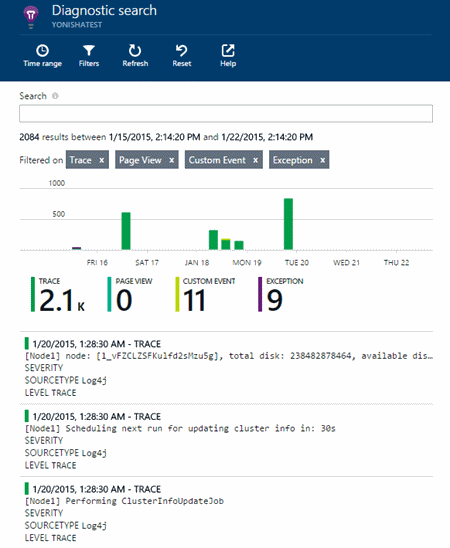

<properties 
	pageTitle="Exploration des journaux .NET dans Application Insights" 
	description="Effectuez une recherche dans les journaux générés avec Trace, NLog ou Log4Net." 
	services="application-insights" 
    documentationCenter=".net"
	authors="alancameronwills" 
	manager="keboyd"/>

<tags 
	ms.service="application-insights" 
	ms.workload="tbd" 
	ms.tgt_pltfrm="ibiza" 
	ms.devlang="na" 
	ms.topic="article" 
	ms.date="03/27/2015" 
	ms.author="awills"/>
 
# Exploration des journaux .NET dans Application Insights  

Si vous utilisez NLog, log4Net ou System.Diagnostics.Trace pour le suivi de diagnostic dans votre application ASP.NET, les journaux peuvent être envoyés à [Visual Studio Application Insights][start], où vous pouvez les explorer et les rechercher. Les journaux sont fusionnés avec la télémétrie provenant de votre application, afin que vous puissiez identifier les traces associées au traitement des demandes de l’utilisateur et les mettre en corrélation avec d’autres événements et des rapports d’exception.

Vous pouvez également écrire le suivi de journal, les rapports d’événements et d’exceptions à l’aide du Kit de développement logiciel (SDK) Application Insights.

Si vous ne l’avez pas encore fait, [configurez Application Insights pour votre projet][start].

##  Installation d’un adaptateur pour votre infrastructure de journalisation

Si vous utilisez une infrastructure de journalisation, comme log4Net, NLog ou System.Diagnostics.Trace, vous pouvez installer un adaptateur qui envoie ces journaux à Application Insights, ainsi que d’autres données de télémétrie.

1. Si vous prévoyez d'utiliser log4Net ou NLog, installez-le dans votre projet. 
2. Dans l’Explorateur de solutions, cliquez avec le bouton droit sur le projet, puis sélectionnez **Gérer les packages NuGet**.
3. Sélectionnez En ligne > Tout, puis **Inclure la version préliminaire** et recherchez « Microsoft.ApplicationInsights »

    

4. Sélectionnez le package approprié parmi :
  + Microsoft.ApplicationInsights.TraceListener (pour capturer les appels System.Diagnostics.Trace)
  + Microsoft.ApplicationInsights.NLogTarget
  + Microsoft.ApplicationInsights.Log4NetAppender

Le package NuGet installe les assemblys nécessaires et modifie également le fichier web.config ou app.config.

#### Insertion d'appels de journaux de diagnostic

Si vous utilisez System.Diagnostics.Trace, un appel standard serait :

    System.Diagnostics.Trace.TraceWarning("Slow response - database01");

Si vous préférez log4net ou NLog :

    logger.Warn("Slow response - database01");

## Utilisation de l’API de suivi directement

Vous pouvez appeler directement l’API de suivi d’Application Insights. Les adaptateurs de journalisation utilisent cette API.

Par exemple :

    var telemetry = new Microsoft.ApplicationInsights.TelemetryClient();
    telemetry.TrackTrace("Slow response - database01");

## Exploration de vos journaux

Dans le panneau Vue d’ensemble de votre application du [portail Application Insights][portal], choisissez [Rechercher][diagnostic].

Vous pouvez par exemple :

* Filtrer selon les traces de journal ou les éléments avec des propriétés spécifiques
* Inspecter un élément spécifique en détail
* Rechercher d’autres données de télémétrie relatives à la même demande utilisateur (autrement dit, avec la même OperationId) 
* Enregistrer la configuration de cette page en tant que favori

## Étapes suivantes

[Diagnostiquer les défaillances et les exceptions dans ASP.NET][exceptions]

[En savoir plus sur Diagnostic Search][diagnostic]

## Résolution de problèmes

### J’obtiens une erreur « La clé d’instrumentation ne peut pas être vide ».

Vous avez peut-être installé le package Nuget de l'enregistreur de données sans installer Application Insights.

Dans l’Explorateur de solutions, cliquez avec le bouton droit sur `ApplicationInsights.config`, puis sélectionnez **Mettre à jour Application Insights**. Une boîte de dialogue vous invite à vous connecter à Azure et à créer une ressource Application Insights, ou à réutiliser une ressource existante. Ceci devrait résoudre le problème.

### Je peux voir des suivis dans la recherche de diagnostic, mais pas les autres événements

Le passage des événements et des demandes dans le pipeline peut prendre un certain temps.

### Quelle est la quantité de données conservée ?

Jusqu'à 500 événements par seconde pour chaque application. Les événements sont conservés pendant sept jours.

## Étapes suivantes

* [Configuration des tests de disponibilité et de réactivité][availability]
* [Résolution des problèmes][qna]

<!--Link references-->

[availability]: app-insights-monitor-web-app-availability.md
[diagnostic]: app-insights-diagnostic-search.md
[exceptions]: app-insights-web-failures-exceptions.md
[portal]: http://portal.azure.com/
[qna]: app-insights-troubleshoot-faq.md
[start]: app-insights-get-started.md

<!---HONumber=58-->