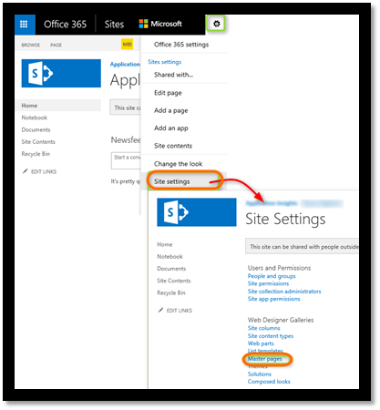
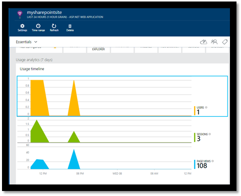
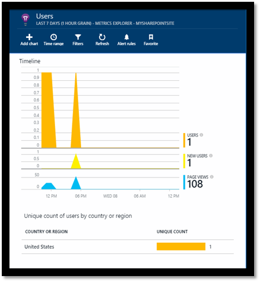

<properties 
	pageTitle="Surveillance d’un site SharePoint avec Application Insights" 
	description="Démarrage de la surveillance d'une nouvelle application avec une nouvelle clé d'instrumentation" 
	services="application-insights" 
    documentationCenter=""
	authors="alancameronwills" 
	manager="ronmart"/>

<tags 
	ms.service="application-insights" 
	ms.workload="tbd" 
	ms.tgt_pltfrm="ibiza" 
	ms.devlang="na" 
	ms.topic="article" 
	ms.date="04/16/2015" 
	ms.author="awills"/>

# Surveillance d’un site SharePoint avec Application Insights

[AZURE.INCLUDE [app-insights-selector-get-started](../includes/app-insights-selector-get-started.md)]

Visual Studio Application Insights surveille la disponibilité, les performances et l’utilisation de vos applications. Vous allez maintenant apprendre à le configurer pour un site SharePoint.

## Création d’une ressource Application Insights dans Azure

Dans le [portail Azure](http://portal.azure.com), créez une ressource Application Insights. Choisissez le type d'application ASP.NET.

Dans le panneau qui s'ouvre, vous trouverez des données relatives à l'utilisation et aux performances de votre application. Vous devriez trouver une vignette sur l'écran d'accueil pour accéder à ces informations, la prochaine fois que vous vous connecterez à Azure. Sinon, cliquez sur Parcourir.
    

## Ajout de notre script dans vos pages web

Dans Démarrage rapide, récupérez le script pour les pages Web :

Insérez-le juste avant la balise &lt;/head&gt; de chaque page que vous souhaitez suivre. Si votre site Web possède une page maître, vous pouvez y placer le script. Par exemple, dans un projet ASP.NET MVC, vous placeriez le script dans View\Shared_Layout.cshtml

Le script contient la clé d'instrumentation qui dirige la télémétrie vers votre ressource Application Insights.

### Ajouter le code aux pages de votre site

#### Sur la page maître

Si vous pouvez modifier la page maître de votre site, vous pourrez surveiller chaque page du site.

Vérifiez la page maître et modifiez-la à l'aide de SharePoint Designer ou de n’importe quel autre éditeur.

Ajoutez le code juste avant la balise </head>.

#### Ou sur des pages individuelles

Pour surveiller un ensemble limité de pages, ajoutez le script à chaque page, séparément.

Insérez un composant Web et incorporez l'extrait de code qu'il contient.

## Affichage des données relatives à votre application

Revenez au panneau de votre application dans le [portail Azure](http://portal.azure.com).

Les premiers événements s’affichent dans Recherche de diagnostic.

Après quelques secondes, cliquez sur Actualiser pour obtenir des données supplémentaires.

**Analyse de l'utilisation** donne un aperçu des utilisateurs, des sessions et des affichages de page :

Cliquez sur Affichages de page pour plus de détails :

Cliquez sur Utilisateurs pour accéder aux informations concernant les nouveaux utilisateurs et leur emplacement.

## Étapes suivantes

* [Tests Web](app-insights-monitor-web-app-availability.md) pour surveiller la disponibilité de votre site.

* [Application Insights](app-insights-get-started.md) pour les autres types d'applications.

<!--Link references-->

<!---HONumber=58-->