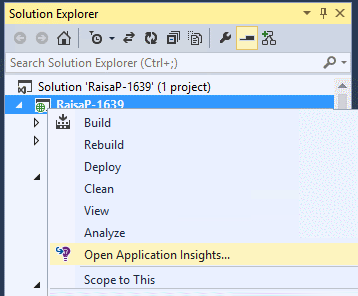

<properties 
	pageTitle="Ajout du Kit de développement logiciel (SDK) Application Insights vers votre projet web" 
	description="Analysez l'utilisation, la disponibilité et les performances de votre application web locale ou Microsoft Azure avec Application Insights." 
	services="application-insights" 
	authors="alancameronwills" 
	manager="kamrani"/>

<tags 
	ms.service="application-insights" 
	ms.workload="tbd" 
	ms.tgt_pltfrm="ibiza" 
	ms.devlang="na" 
	ms.topic="article" 
	ms.date="2015-02-03" 
	ms.author="awills"/>

# Application Insights - Commencer à analyser l'état d'intégrité et l'utilisation de votre application

*Application Insights est à l'état de version préliminaire.*

Application Insights vous permet d'analyser les éléments suivants de votre application en direct :

* **Disponibilité** - Nous testons vos URL à des intervalles de quelques minutes dans le monde entier.
* **Performances**   - Détectez et diagnostiquez les problèmes et exceptions de performances.
* **Utilisation** - Découvrez ce que les utilisateurs font avec votre application afin de l'améliorer et mieux les satisfaire.

Pour découvrir d'autres méthodes, consultez [Prise en main d'Application Insights][start].

## Ajout de Application Insights à votre projet

Vous aurez besoin des éléments suivants : [Visual Studio 2013 Update 3](http://go.microsoft.com/fwlink/?linkid=397827&clcid=0x409) (ou une version plus récente) ainsi qu'un compte [Microsoft Azure](http://azure.com).

### S'il s'agit d'un nouveau projet...

Lorsque vous créez un projet dans Visual Studio 2013, assurez-vous que Application Insights est sélectionné. 

S'il s'agit de votre toute première utilisation, vous êtes invité à vous connecter ou à vous inscrire à la version préliminaire de Microsoft Azure. (indépendamment de votre compte Visual Studio Online).

Utilisez **Configurer les paramètres** si vous souhaitez que la ressource Azure porte un nom différent de celui de votre projet, ou si vous souhaitez que la ressource apparaisse sous le même groupe, en tant que projet distinct. 

*Aucune option Application Insights n'est disponible ? Vérifiez que vous utilisez Visual Studio 2013 Update 3, que les outils Application Insights sont activés dans Extensions et mises à jour, et que vous êtes en train de créer un projet Web, Windows Store ou Windows Phone.*

### ... ou s'il s'agit d'un projet existant

Cliquez avec le bouton droit de la souris sur le projet dans l'Explorateur de solutions, puis sélectionnez Ajouter Application Insights.

*Il existe une étape supplémentaire si vous souhaitez configurer l'analyse de l'utilisation Web, mais examinons d'abord quelques données...*

### 2. Exécution de votre projet

Exécutez votre application à l'aide de la touche F5 et essayez-la - ouvrez différentes pages.

Un décompte des événements qui ont été reçus s'affiche dans Visual Studio.

### 3. Affichage des données d'analyse

Ouvrez Application Insights à partir de votre projet.

Recherchez des données dans les vignettes **Intégrité des applications**. Au début, seuls un ou deux points s'affichent. Par exemple :

Cliquez sur n'importe quelle vignette pour plus de détails. Vous pouvez modifier ce qui s'affiche dans les rapports. [Familiarisez-vous avec la configuration des rapports Intégrité des applications.][perf]

### 4. Déploiement de votre application

Déployez votre application et regardez les données s'accumuler.

Lorsque votre application est active, [configurez les test Web][availability] pour vous assurer qu'elle demeure active. 

### Vous souhaitez modifier le nom de votre application dans le portail ?

Vous pouvez modifier la ressource à laquelle votre projet envoie la télémétrie. 

(La " ressource " est le volet de Application Insights où vos résultats s'affichent. Vous pouvez placer plusieurs ressources dans un groupe - par exemple, si vous avez plusieurs projets qui font partie d'une application commerciale.) 

Dans l'Explorateur de solutions, cliquez avec le bouton droit de la souris sur ApplicationInsights.config, puis sélectionnez **Mettre à jour Application Insights**. L'assistant qui s'affiche vous permet de sélectionner une ressource existante différente ou d'en créer une.

Ensuite, revenez au portail et supprimez l'ancienne ressource.

## Vidéo

> [AZURE.VIDEO getting-started-with-application-insights]

## Étapes suivantes

[Suivi de l'utilisation de votre application Web][usage]

[Analyse des performances dans les applications Web][perf]

[Capture et recherche des journaux de diagnostic][diagnostic]

[Résolution des problèmes][qna]

[AZURE.INCLUDE [app-insights-learn-more](../includes/app-insights-learn-more.md)]

<!--HONumber=46--> 
