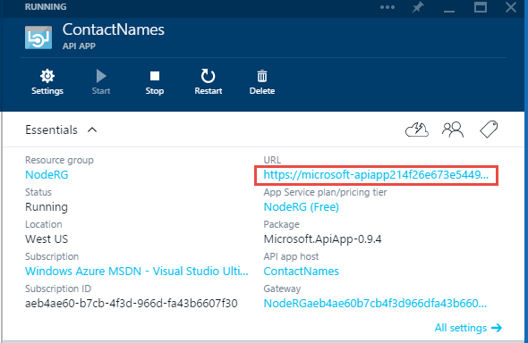
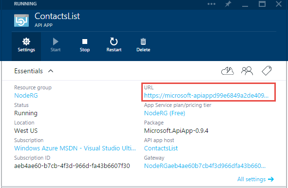
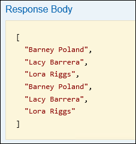

<properties 
	pageTitle="Utiliser une application API interne dans Azure App Service à partir d’un client .NET" 
	description="Découvrez comment utiliser une application API à partir d’un client .NET dans le même groupe de ressources, à l’aide du Kit de développement logiciel (SDK) App Service." 
	services="app-service\api" 
	documentationCenter=".net" 
	authors="tdykstra" 
	manager="wpickett" 
	editor="jimbe"/>

<tags 
	ms.service="app-service-api" 
	ms.workload="web" 
	ms.tgt_pltfrm="dotnet" 
	ms.devlang="na" 
	ms.topic="article" 
	ms.date="05/04/2015" 
	ms.author="bradyg;tarcher"/>

# Utiliser une application API interne dans Azure App Service à partir d’un client .NET 

## Vue d'ensemble

Ce didacticiel explique comment écrire du code pour une [application API](app-service-api-apps-why-best-platform.md) ASP.NET qui appelle une autre application API configurée pour un niveau d’accès **interne**. Les deux applications API doivent se trouver dans le même groupe de ressources. Le même code peut être utilisé pour appeler une application API interne à partir d’une [application mobile](app-service-mobile-value-prop-preview.md).

Vous allez générer une API Web ContactNames. La méthode Get de l’API Web appellera une application API ContactsList et retournera uniquement les noms parmi les informations de contact fournies par l’application API ContactsList. Voici l’écran de l’interface utilisateur Swagger qui vous permettra d’appeler la méthode Get ContactNames.

Pour plus d’informations sur l’appel d’applications API configurées pour des niveaux d’accès **Public (anonyme)** ou **Public (authentifié)**, consultez [Utiliser une application API à partir d’un client .NET dans Azure App Service](app-service-api-dotnet-consume.md).

## Composants requis

Le didacticiel suppose que vous êtes familiarisé avec la création de projets, l’ajout de code dans Visual Studio et la [gestion des applications API dans le portail Azure en version préliminaire](app-service-api-apps-manage-in-portal.md).

Les exemples de projet et de code de cet article sont basés sur le projet d’application API que vous créez et déployez dans les articles suivants :

- [Créer une application API](app-service-dotnet-create-api-app.md)
- [Déployer une application API](app-service-dotnet-deploy-api-app.md)

[AZURE.INCLUDE [install-sdk-2013-only](../includes/install-sdk-2013-only.md)]

Ce didacticiel requiert la version 2.6 ou ultérieure du Kit de développement logiciel (SDK) Azure pour .NET.

### Configurer l’application API cible

1. Si vous ne l’avez pas déjà fait, suivez le didacticiel [Déployer une application API](app-service-dotnet-deploy-api-app.md) pour déployer l’exemple de projet ContactsList vers une application API de votre abonnement Azure.

2. Dans le [portail Azure en version préliminaire](https://portal.azure.com/), dans le panneau **application API** de l’application API ContactsList que vous avez déployée plus tôt, cliquez sur **Paramètres > Paramètres de l’application** et définissez **Niveau d’accès** sur **Interne**, puis cliquez sur **Enregistrer**.

	
 
## Création d’une application API qui appelle l’application API existante

- Dans Visual Studio, créez un projet d’application API nommé ContactNames à l’aide du modèle de projet d’application API Azure.

	Le processus est le même que celui de l’article [Créer une application API](app-service-dotnet-create-api-app.md), sauf que vous ajouterez un code différent au projet plus tard dans ce didacticiel.
 
## Ajouter du code client généré par le SDK App Service

Les étapes suivantes sont expliquées plus en détail à la page [Utiliser une application API à partir d’un client .NET dans Azure App Service](app-service-api-dotnet-consume.md).

3. Dans l'**Explorateur de solutions**, cliquez avec le bouton droit sur le projet (pas sur la solution), puis sélectionnez **Ajouter > Client d'application API Azure**. 

3. Dans la boîte de dialogue **Ajouter un client d'application API Azure**, cliquez sur **Télécharger depuis une application API Azure**.

5. Dans la liste déroulante, sélectionnez l'application API que vous voulez appeler. Pour ce didacticiel, choisissez l’application API ContactsList que vous avez créée précédemment.

7. Cliquez sur **OK**.

## Activer l’interface utilisateur Swagger

Par défaut, les projets d’application API sont activés avec une génération automatique des métadonnées [Swagger](http://swagger.io/ "Informations officielles relatives à Swagger"), mais le modèle de nouveau projet d’application API Azure désactive la page de test de l’API. Dans cette section, vous allez activer la page de test.

1. Ouvrez le fichier *App_Start/SwaggerConfig.cs* et recherchez **EnableSwaggerUI** :

2. Annulez les marques de commentaire sur les lignes de code suivantes :

	        })
	    .EnableSwaggerUi(c =>
	        {

## Création d’un contrôleur

5. Cliquez avec le bouton droit sur le dossier **Contrôleurs** et sélectionnez **Ajouter > Contrôleur**. 

6. Dans la boîte de dialogue **Ajouter une génération de modèles automatique**, sélectionnez l’option **Contrôleur d’API web 2 - Vide** et cliquez sur **Ajouter**.

7. Nommez le contrôleur **ContactNamesController** et cliquez sur **Add**.

## Ajouter du code pour appeler l'application API

Pour appeler une application API qui a été protégée en définissant son niveau d’accès à **Interne**, vous devez ajouter les en-têtes d’authentification internes aux requêtes HTTP. Ces en-têtes informent l’application API cible que la source de l’appel est une application API homologue appelant depuis le même groupe de ressources.

Le kit de développement logiciel (SDK) d’App Service génère des classes de client qui simplifient le code que vous écrivez pour appeler l’application API. Pour appeler une application API de niveau d’accès **Public (anonyme)**, il vous suffit de créer un objet client et d’appeler des méthodes sur cet objet, comme dans cet exemple :

		var client = new ContactsList();
		var contacts = await client.Contacts.GetAsync();

Toutefois, pour ajouter des en-têtes d’authentification, vous devez accéder à l’objet `HttpRequestMessage` que vous n’avez pas ici. Pour obtenir l’accès à la requête et ajouter les en-têtes, vous devez créer une classe `DelegatingHandler` et transmettre une instance de celle-ci au constructeur du client généré.

1. Ajoutez au projet un fichier de classe nommé *InternalCredentialHandler.cs*, et remplacez le code du modèle par le code suivant.

		using Microsoft.Azure.AppService.ApiApps.Service;
		using System.Net.Http;
		using System.Threading;
		using System.Threading.Tasks;
		
		namespace ContactNames
		{
		    public class InternalCredentialHandler : DelegatingHandler
		    {
		        protected override Task<HttpResponseMessage> SendAsync(HttpRequestMessage request, CancellationToken cancellationToken)
		        {
		            Runtime.FromAppSettings(request).SignHttpRequest(request);
		            return base.SendAsync(request, cancellationToken);
		        }
		    }
		}

	Ce code appelle `SignHttpRequest` pour ajouter les en-têtes d’authentification à chaque requête envoyée par la classe de client généré :

		Runtime.FromAppSettings(this.Request).SignHttpRequest

1. Dans *ContactNamesController.cs*, remplacez le code du modèle par le code suivant.

		using ContactNames.Models;
		using Microsoft.Azure.AppService.ApiApps.Service;
		using System;
		using System.Collections.Generic;
		using System.Net.Http;
		using System.Net.Http.Headers;
		using System.Threading.Tasks;
		using System.Web.Http;
		
		namespace ContactNames.Controllers
		{
		    public class ContactNamesController : ApiController
		    {
		        [HttpGet]
		        public async Task<IEnumerable<string> Get()
		        {
		            var names = new List<string>();

		            var client = new ContactsList(new DelegatingHandler[] { new InternalCredentialHandler() });
		            var contacts = await client.Contacts.GetAsync();
		
		            foreach (Contact contact in contacts)
		            {
		                names.Add(contact.Name);
		            }		
		            return names;
		        }
		    }
		}

	Ce code passe dans le gestionnaire jusqu’au constructeur de la classe de client généré :

		var client = new ContactsList(new DelegatingHandler[] { new InternalCredentialHandler() });

### Déploiement

Vous ne pouvez pas effectuer de test localement. Vous devez déployer le code et l’exécuter dans une application API Azure, sinon vous ne pourrez pas ajouter les en-têtes d’authentification appropriées et les appels seront rejetés.

Les étapes de déploiement suivantes sont expliquées plus en détail dans l’article [Déployer une application API](app-service-dotnet-deploy-api-app.md).

1. Créez une application API ContactNames.

	* Dans **Explorateur de solutions**, cliquez avec le bouton droit sur le projet (pas la solution), puis cliquez sur **Publier**. 

	* Cliquez sur l’onglet **Profil** puis sur **Applications API Microsoft Azure**.

	* Cliquez sur **Nouveau** pour configurer une nouvelle application API dans votre abonnement Azure.

	* Dans la boîte de dialogue **Créer une application API**, entrez ContactNames comme **Nom d’application API**.

	* Pour les autres valeurs de la boîte de dialogue **Créer une application API**, entrez les mêmes valeurs que celles que vous avez entrées précédemment pour [Déployer une application API](app-service-dotnet-deploy-api-app.md).

		Plus important encore, veillez à créer la nouvelle application API dans le même groupe de ressources que l’application API que vous allez appeler.

	* Cliquez sur **OK**.

2. Déployez votre code dans la nouvelle application API.

	* Une fois l’application API configurée, cliquez avec le bouton droit sur le projet dans l’**Explorateur de solutions** et cliquez sur **Publier** pour rouvrir la boîte de dialogue de publication.

	* Dans la boîte de dialogue **Publier le site Web**, cliquez sur **Publier** pour commencer le processus de déploiement.

### Test

Dans cette section, vous utilisez l’interface utilisateur Swagger pour tester la nouvelle application API et vérifier qu’elle peut appeler l’application API que vous avez créée précédemment.

1. Ouvrez un navigateur vers l’URL de la nouvelle application API.

	Avec les paramètres de publication par défaut, Visual Studio ouvre automatiquement un navigateur vers l’URL de l’application API, une fois qu’il a terminé le processus de publication. Si cela ne se produit pas ou si vous avez fermé la fenêtre du navigateur, procédez comme suit pour accéder à la même URL :

	* Dans le portail Azure en version préliminaire, accédez au panneau Application API de l’application API ContactsName.

	* Cliquez sur **URL**.

		
  
5. Dans la barre d’adresse du navigateur, ajoutez `/swagger` à la fin de l’URL et appuyez sur Entrée.

	Le résultat ressemblera par exemple à cette URL :

		https://microsoft-apiapp214f26e673e5449a214f26e673e5449a.azurewebsites.net/swagger

1. Dans la page de l’interface utilisateur Swagger, cliquez sur **ContactNames > Obtenir > Essayez-le !**

	
  
	La page affiche les noms des contacts dans la section Corps de réponse, qui vérifie que l’application API ContactNames a réussi à récupérer les données de l’application API ContactsList.

	Si vous souhaitez vérifier que le paramètre **Interne** protège l’application API ContactsList, placez en commentaire l’appel `SignHttpRequest` dans *ContactNamesController.cs*, redéployez Swagger et cliquez de nouveau sur **Try it now**, et vous obtiendrez un message d’erreur.

## Ajoutez du code pour appeler l’application API en utilisant HttpClient
 
Le kit de développement logiciel (SDK) App Service dépend des définitions de l’API Swagger pour générer des classes de client. Si vous souhaitez appeler une application API qui n’a pas implémenté les définitions de l’API Swagger, vous pouvez le faire à l’aide de `HttpClient`. Dans ce cas, vous continuez à utiliser la méthode `SignHttpRequest`, mais vous l’appelez directement sur l’objet `HttpRequestMessage`.

1. Dans *ContactNamesController.cs*, ajoutez le code suivant avant l’instruction `return names;` dans la méthode `Get`.

		var httpClient = new HttpClient();
		HttpRequestMessage httpRequest = new HttpRequestMessage();
		httpRequest.Method = HttpMethod.Get;
		httpRequest.RequestUri = new Uri("https://{yourapiappurl}/api/contacts");
		Runtime.FromAppSettings(this.Request).SignHttpRequest(httpRequest);
		var response = await httpClient.SendAsync(httpRequest); 
		var contacts2 = await response.Content.ReadAsAsync<List<Contact>();
		foreach (Contact contact in contacts2)
		{
		    names.Add(contact.Name);
		}

	Ce code passe dans l’objet de la requête entrante vers la méthode `SignHttpRequest` pour signer l’objet de requête sortante :

		Runtime.FromAppSettings(this.Request).SignHttpRequest(httpRequest);

2. Dans le portail Azure en version préliminaire, accédez au panneau Application API de l’application API ContactsList, puis copiez l’URL.

	
 
4. Remplacez la chaîne d’espace réservé « {yourapiappurl} » dans le code du contrôleur par l’URL réelle. Lorsque vous avez terminé, cette ligne de code ressemblera à l’exemple suivant.

		httpRequest.RequestUri = new Uri("https://microsoft-apiappd99e684d99e684d99e684d99e684.azurewebsites.net/api/contacts");

### Déploiement et test

1. Suivez la même procédure que celle utilisée précédemment pour déployer le code de l’application API.

	**Conseil :** vous pouvez ignorer la boîte de dialogue **Publier le site Web** et effectuer le redéploiement en cliquant sur un simple bouton dans la barre d’outils. Dans Visual Studio, cliquez sur **Affichage > Barres d’outils**, et activez la barre d’outils **Publication Web en un clic**.
 
2. Suivez la même procédure que celle utilisée précédemment pour utiliser l’interface utilisateur Swagger.

	Étant donné que vous avez laissé le code HttpClient, cette fois le résultat indique un jeu de noms en double.

	
  
## Étapes suivantes

Cet article vous a montré comment utiliser une application API interne à partir d’un client .NET. Pour plus d’informations sur l’utilisation d’applications API configurées pour des niveaux d’accès **Public (anonyme)** et **Public (authentifié)**, consultez l’article [Utiliser une application API à partir d’un client .NET dans Azure App Service](app-service-api-dotnet-consume.md).

Pour d'autres exemples de code appelant une application API à partir de clients .NET, téléchargez l'exemple d'application [Azure Cards](https://github.com/Azure-Samples/API-Apps-DotNet-AzureCards-Sample).

<!---HONumber=58-->