<properties 
	pageTitle="Accéder à une application API Azure en utilisant HTML et JavaScript" 
	description="Découvrez comment accéder à votre backend d'application API en utilisant HTML et JavaScript." 
	services="app-service\api" 
	documentationCenter=".net"
	authors="bradygaster"
	manager="mohisri" 
	editor="tdykstra"/>

<tags 
	ms.service="app-service-api" 
	ms.workload="web" 
	ms.tgt_pltfrm="na" 
	ms.devlang="JavaScript" 
	ms.topic="article" 
	ms.date="04/20/2015" 
	ms.author="bradygaster"/>

# Utiliser une application API Azure à l'aide de HTML et JavaScript

## Vue d'ensemble

Cet article montre comment créer un client HTML et JavaScript pour une [application API](app-service-api-apps-why-best-platform.md) dans [Azure App Service](/documentation/services/app-service/). Cet article suppose une connaissance pratique de HTML et de JavaScript, et se concentre sur l'utilisation de l'infrastructure JavaScript [AngularJS](https://angularjs.org/) pour effectuer des appels REST à l'application API.

Voici quelques articles que vous pouvez parcourir préalablement pour vous aider à démarrer.

1. Dans [Créer une application API](app-service-dotnet-create-api-app.md), vous avez créé un projet d'application API.
2. Dans [Déployer une application API](app-service-dotnet-deploy-api-app.md), vous déployez l'application API dans votre abonnement Azure.
3. Dans [Déboguer une application API](app-service-dotnet-remotely-debug-api-app.md), vous utilisez Visual Studio pour déboguer à distance le code pendant son exécution dans Azure.

Cet article s'appuie sur ces articles précédents en montrant comment vos applications HTML peuvent utiliser JavaScript pour accéder à vos applications API de backend.

## Activation de CORS

En règle générale, CORS (Cross-Origin Resource Sharing) est nécessaire dans les applications HTML qui seront traitées par des hôtes différents de l'API elle-même. Avec les applications API, il existe au moins deux options pour activer CORS. Cette section décrit ces options.

### Activation de CORS pour les passerelles d'application API

Les passerelles des applications API peuvent être configurées pour activer CORS à l'aide du portail Azure en version préliminaire. En ajoutant l'*appSetting* **MS_CrossDomainOrigins**, vous pouvez spécifier les URL qui sont autorisées à appeler votre application API. Cette section explique comment utiliser cet *appSetting* pour activer CORS au niveau de la passerelle d'API.

1. Accédez au panneau du portail Azure en version préliminaire de l'application API pour laquelle vous voulez activer CORS. Une fois dans ce panneau, cliquez sur l'icône *Passerelle* pour votre application API. 

	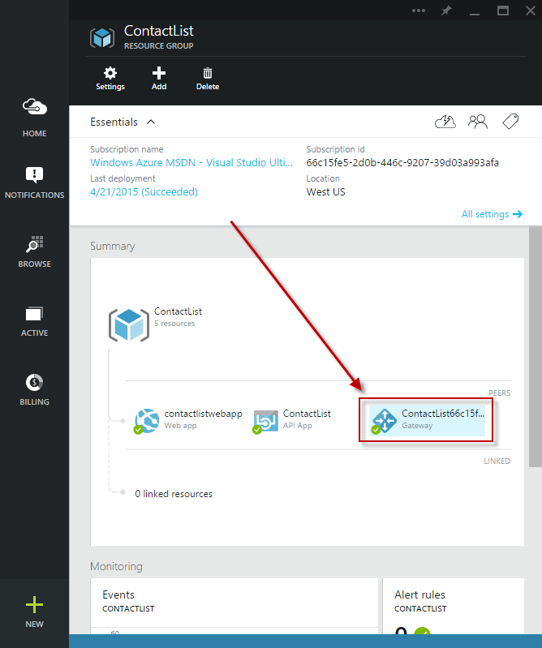

1. Cliquez sur le lien **Hôte de passerelle** dans le panneau du portail.

	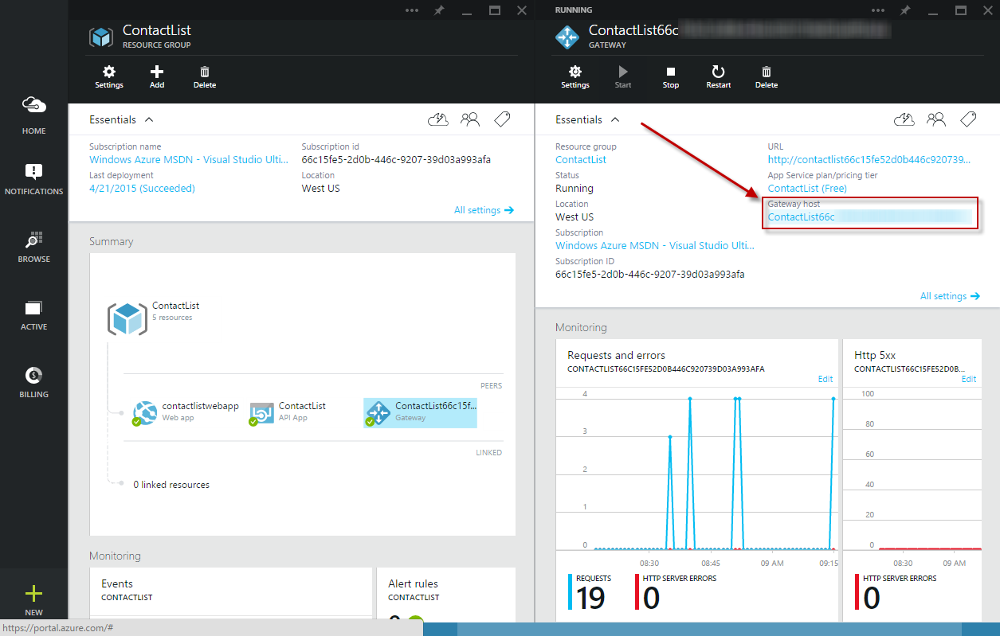

1. Cliquez sur le lien **Tous les paramètres** dans le panneau du portail.

	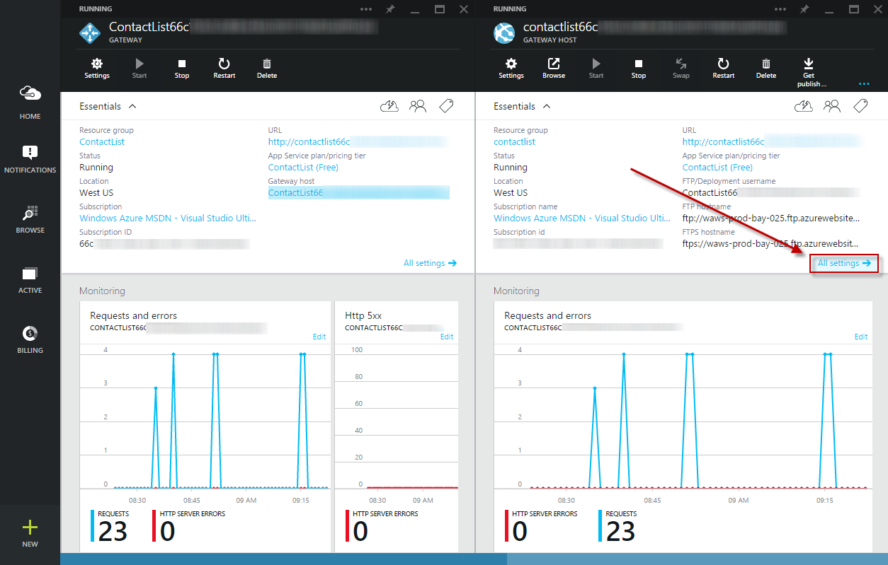

1. Cliquez sur le bouton **Paramètres de l'application** dans le panneau du portail.

	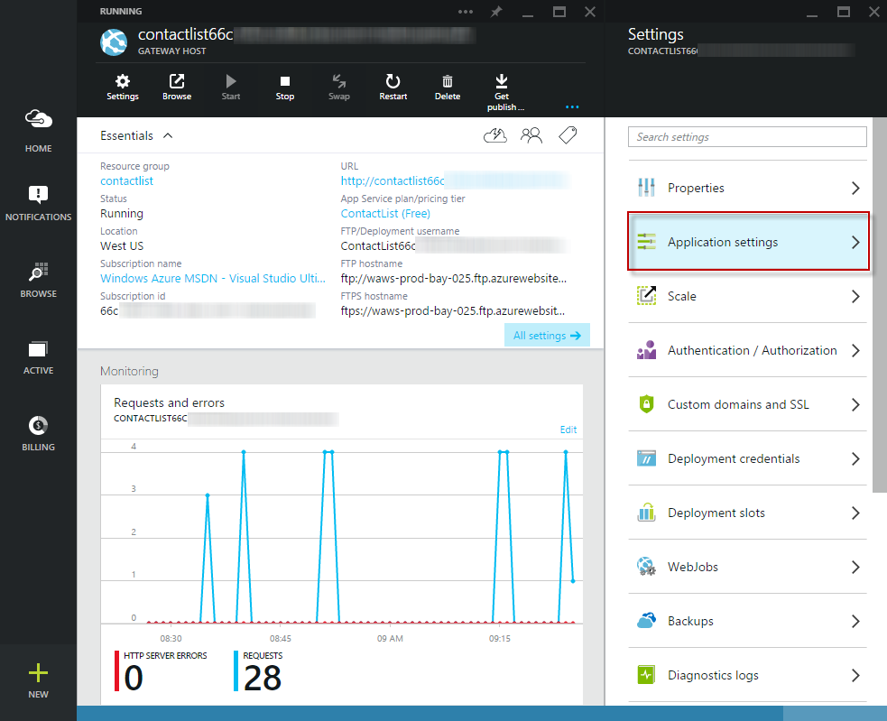

1. Ajoutez le paramètre d'application **MS_CrossDomainOrigins**. Affectez comme valeur du paramètre la liste (séparée par des virgules) des hôtes HTTP auxquels vous voulez donner accès à votre application API. Si vous voulez fournir un accès à plusieurs hôtes, la valeur de l'*appSetting* peut être définie avec un code similaire au code ci-dessous.

		http://foo.azurewebsites.net, https://foo.azurewebsites.net, http://contactlistwebapp.azurewebsites.net

	La section ci-dessous vous guide dans le processus de création d'une application web distincte contenant une page HTML simple qui appelle l'application API à partir d'une application web s'exécutant dans le même groupe de ressources Azure que l'application API. Comme c'est le seul hôte qui sera autorisé à accéder à l'application API, le paramètre est défini de façon à contenir un seul hôte.

		http://contactlistwebapp.azurewebsites.net

	La capture d'écran ci-dessous montre à quoi doit ressembler ce paramètre une fois que vous l'avez enregistré dans le portail Azure en version préliminaire.

	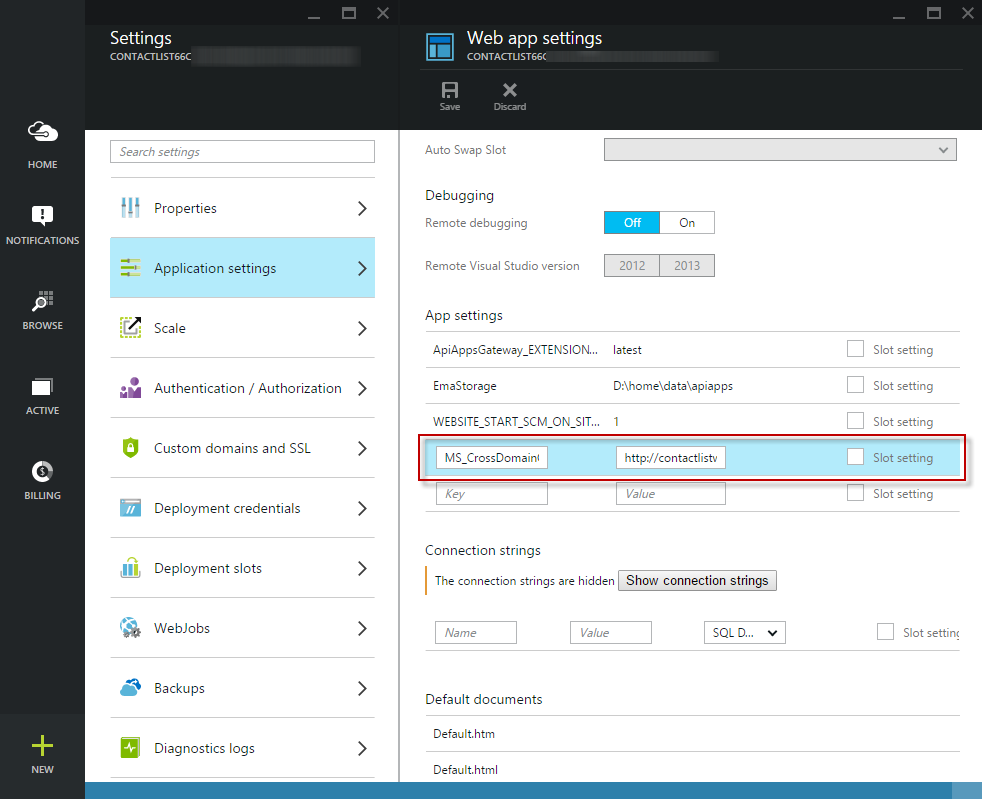

Le paramètre d'application **MS_CrossDomainOrigins** est décrit en détail dans le billet de blog [Mises à jour de .NET pour Azure Mobile Services](http://azure.microsoft.com/blog/2014/07/28/azure-mobile-services-net-updates/). Consultez donc ce billet pour plus d'informations sur les détails du paramètre.

### Activation de CORS dans du code Web API

Le processus d'activation de CORS dans Web API est documenté de façon détaillée dans l'article ASP.NET [Activation des demandes multi-origines dans API Web ASP.NET 2](http://www.asp.net/web-api/overview/security/enabling-cross-origin-requests-in-web-api). Pour les applications API créées à l'aide d'API Web ASP.NET, le processus est exactement le même, mais il est néanmoins résumé ci-dessous. Ignorez cette section si vous avez déjà activé CORS, car votre application API devrait déjà être configurée correctement.

1. La fonctionnalité CORS est fournie par le package NuGet [Microsoft.AspNet.WebApi.Cors](https://www.nuget.org/packages/Microsoft.AspNet.WebApi.Cors/). Installez-le en ouvrant la **Console du gestionnaire de package**, puis exécutez le script PowerShell suivant. 

		Install-Package Microsoft.AspNet.WebApi.Cors

1. Une fois la commande exécutée, la console du gestionnaire de package et **packages.config** reflètent l'ajout du nouveau package NuGet.

	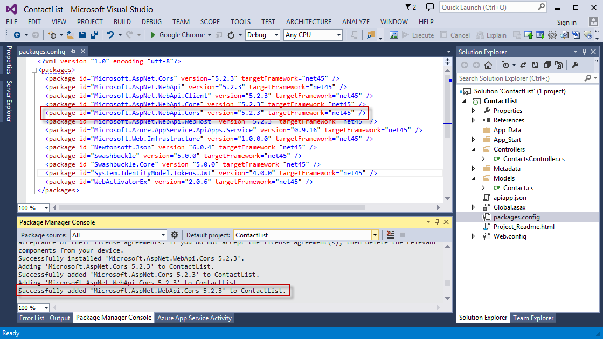

1. Ouvrez le fichier *App_Start/WebApiConfig.cs*. Ajoutez la ligne de code ci-dessous à la méthode **Register** de la classe **WebApiConfig** dans le fichier.

		config.EnableCors();

	Une fois le fichier mis à jour, le code doit se présenter comme suit :

		public static class WebApiConfig
	    {
	        public static void Register(HttpConfiguration config)
	        {
	            // Web API configuration and services
	            
				config.EnableCors(); /* -- NEW CODE -- */
	
	            // Web API routes
	            config.MapHttpAttributeRoutes();
	
	            config.Routes.MapHttpRoute(
	                name: "DefaultApi",
	                routeTemplate: "api/{controller}/{id}",
	                defaults: new { id = RouteParameter.Optional }
	            );
	        }
	    }

1. La dernière étape pour activer CORS consiste à délimiter les méthodes d'action individuelles que vous voulez activer. Ajoutez l'attribut **EnableCors** à chacune des méthodes ou sur la totalité du contrôleur, comme illustré dans le code ci-dessous.

	> **Remarque** : l'utilisation des caractères génériques pour tous les paramètres avec l'attribut EnableCors est destiné uniquement à des fins de démonstration. Elle ouvre votre API à toutes les origines et à toutes les requêtes HTTP. Utilisez cet attribut avec précaution et assurez-vous d'en comprendre les implications.

		using ContactList.Models;
		using System.Collections.Generic;
		using System.Web.Http;
		using System.Web.Http.Cors;
	
		namespace ContactList.Controllers
		{
		    [EnableCors(origins:"*", headers:"*", methods: "*")] /* -- NEW CODE -- */
		    public class ContactsController : ApiController
		    {
		        [HttpGet]
		        public IEnumerable<Contact> Get()
		        {
		            return new Contact[]
		            {
		                new Contact { Id = 1, EmailAddress = "barney@contoso.com", Name = "Barney Poland"},
		                new Contact { Id = 2, EmailAddress = "lacy@contoso.com", Name = "Lacy Barrera"},
		                new Contact { Id = 3, EmailAddress = "lora@microsoft.com", Name = "Lora Riggs"}
		            };
		        }
		
		        [HttpPost]
		        public Contact Post([FromBody] Contact contact)
		        {
		            return contact;
		        }
		    }
		}
1. Si vous aviez déjà déployé votre application API sur Azure avant d'ajouter la prise en charge de CORS, déployez à nouveau le code pour que CORS soit activé dans votre API hébergée dans Azure. 

## Création d'une application web pour utiliser l'application API

Dans cette section, vous allez créer une nouvelle application web vide, installer et y utiliser AngularJS, et lier une application frontale HTML simple à l'application API. Vous allez déployer cette application web dans Azure App Service. L'application web HTML se liera à l'application API et affichera des données extraites de celle-ci. Elle offrira aux utilisateurs une interface utilisateur simple pour l'API Contacts.

1. Cliquez avec le bouton droit sur la solution et sélectionnez **Ajouter > Nouveau projet**.

	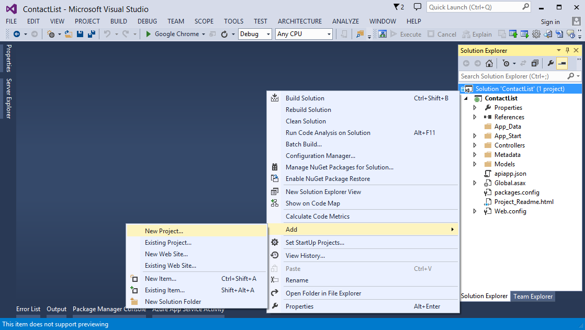

1. Sélectionnez le modèle **Application web ASP.NET**.

	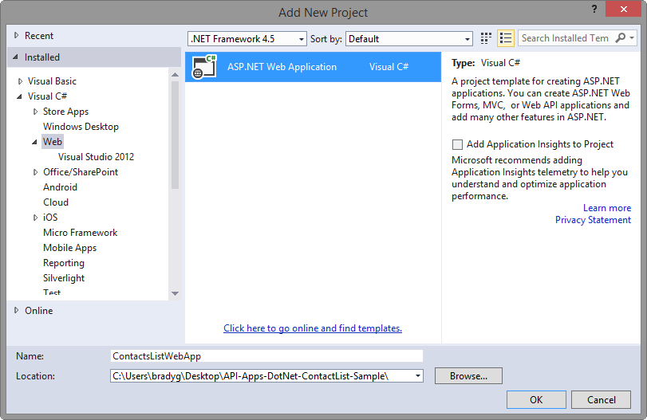

1. Sélectionnez le modèle **Vide** dans la boîte de dialogue One ASP.NET.

	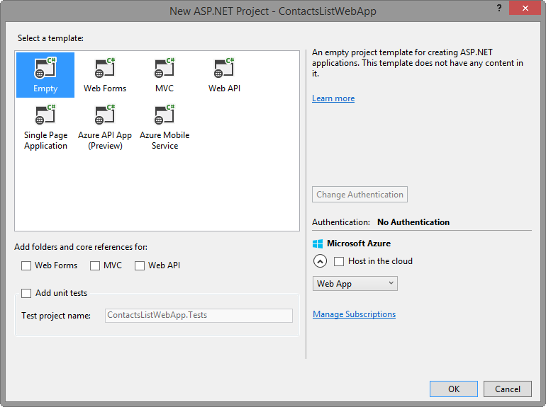

1. En utilisant le **Gestionnaire de package** ou via l'élément de menu contextuel **Gérer les packages NuGet**, installez le package NuGet [AngularJS](https://www.nuget.org/packages/angularjs).

	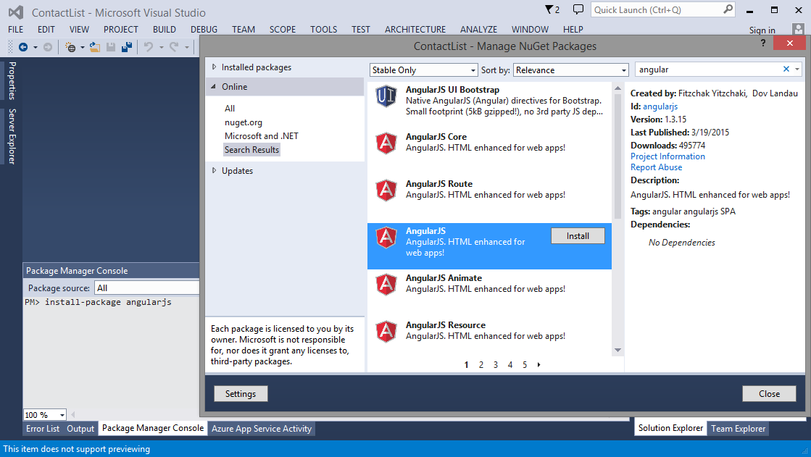

1. En utilisant le **Gestionnaire de package** ou via l'élément de menu contextuel **Gérer les packages NuGet**, installez le package NuGet [Bootstrap](https://www.nuget.org/packages/bootstrap).

	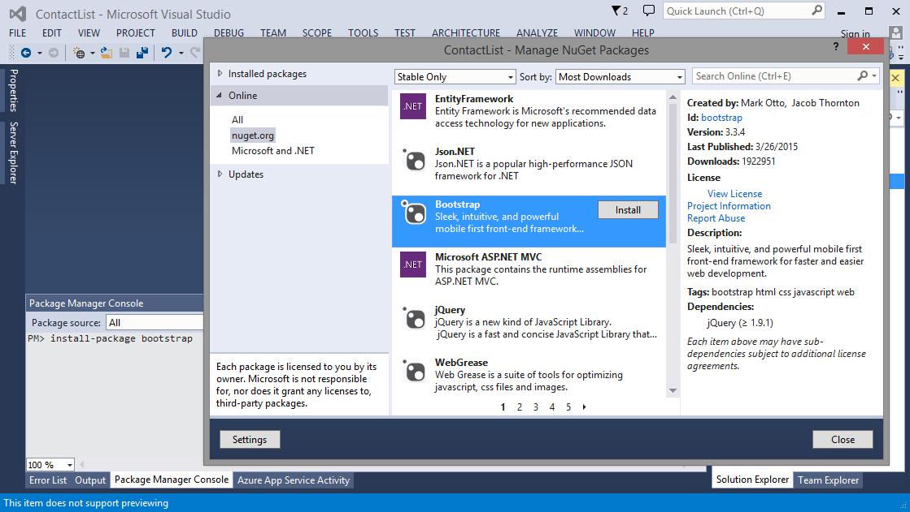

1. Ajoutez un nouveau fichier HTML au projet d'application web.

	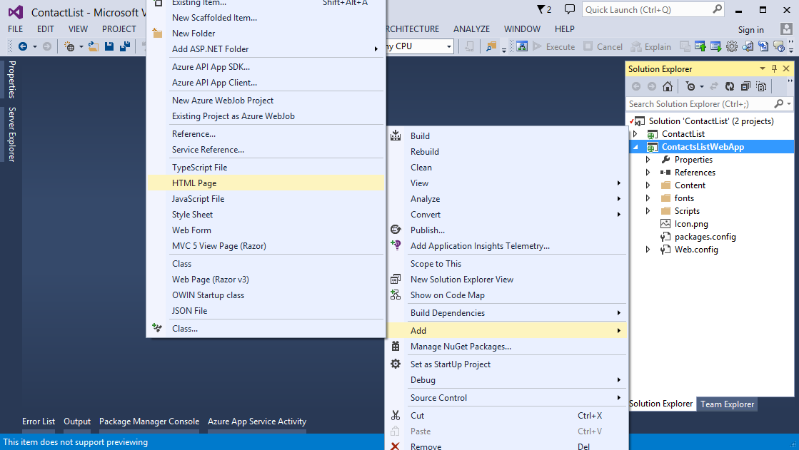

1. Nommez le fichier *index.html*.

	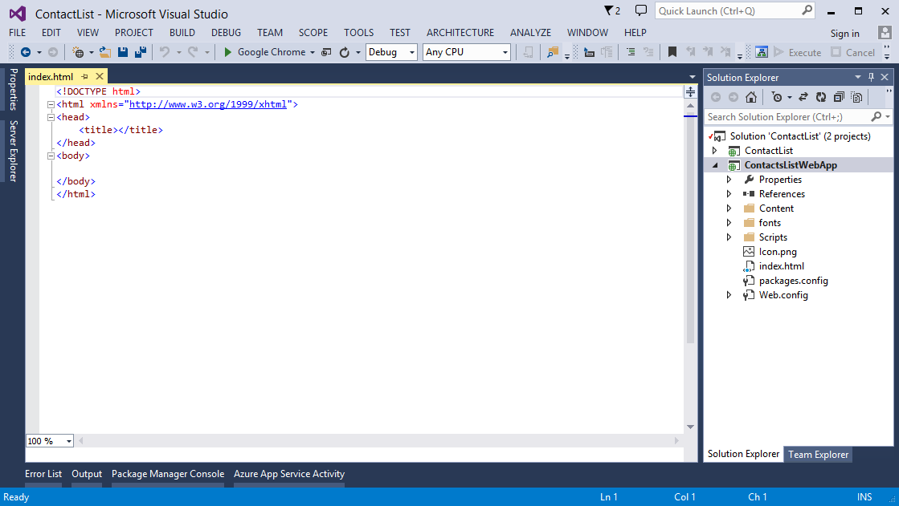

1. Ajoutez les fichiers de démarrage CSS et JavaScript AngularJS à la page HTML, utilisez un modèle d'amorçage simple ([comme celui-ci](http://getbootstrap.com/examples/starter-template/)) et créez une balise de script vide pour préparer la page.
	
	> Remarque : les commentaires dans le code HTML et JavaScript ci-dessous sont des préludes aux étapes suivantes de cette section.

		<!DOCTYPE html>
		<html xmlns="http://www.w3.org/1999/xhtml">
		<head>
		    <title>Contacts HTML Client</title>
		    <link href="Content/bootstrap.css" rel="stylesheet" />
		    
		</head>
		<body>
		
		    <nav class="navbar navbar-inverse navbar-fixed-top">
		        

		            

		                <button type="button" class="navbar-toggle collapsed" data-toggle="collapse" data-target="#navbar" aria-expanded="false" aria-controls="navbar">
		                    Toggle navigation
		                    
		                    
		                    
		                </button>
		                <a class="navbar-brand" href="#">Contacts</a>
		            

		            

		                <ul class="nav navbar-nav"></ul>
		            

		        

		    </nav>
		
		    

		        <!-- contacts ui here -->
		    

		
		    
		    
		
		</body>
		</html>

1. Ajoutez le code du tableau HTML ci-dessous à l'élément *div* du **conteneur** dans le code HTML.

		<!-- contacts ui here -->
        <table class="table table-striped" ng-app="myApp" ng-controller="contactListCtrl">
            <thead>
                <tr>
                    <th>ID</th>
                    <th>Name</th>
                    <th>Email</th>
                    <th></th>
                </tr>
            </thead>
            <tbody>
                <tr ng-repeat="con in contacts">
                    <td>{{con.Id}}</td>
                    <td>{{con.Name}}</td>
                    <td>{{con.EmailAddress}}</td>
                    <td></td>
                </tr>
            </tbody>
            <tfoot>
                <tr>
                    <th>Create a new Contact</th>
                    <th colspan="2">API Status: {{status}}</th>
                    <th><button class="btn btn-sm btn-info" ng-click="refresh()">Refresh</button></th>
                </tr>
                <tr>
                    <td><input type="text" placeholder="ID" ng-model="newId" /></td>
                    <td><input type="text" placeholder="Name" ng-model="newName" /></td>
                    <td><input type="text" placeholder="Email Address" ng-model="newEmail" /></td>
                    <td><button class="btn btn-sm btn-success" ng-click="create()">Create</button></td>
                </tr>
            </tfoot>
        </table>

1. Cliquez avec le bouton droit sur le fichier *index.html* et sélectionnez l'élément de menu **Définir comme page de démarrage**. Ensuite, déboguez le projet web afin qu'il s'ouvre dans votre navigateur par défaut.

	

1. Notez les barres de manipulation du modèle dans la sortie HTML. Vous allez lier ces éléments HTML aux données en utilisant AngularJS à l'étape suivante.

	

1. Ajoutez le code JavaScript ci-dessous au fichier *index.html* pour appeler l'API et lier l'interface utilisateur HTML aux données dans la sortie de l'API.

		/* client javascript code here */
        angular.module('myApp', []).controller('contactListCtrl', function ($scope, $http) {
            $scope.baseUrl = 'http://localhost:1578';

            $scope.refresh = function () {
                $scope.status = "Refreshing Contacts...";
                $http({
                    method: 'GET',
                    url: $scope.baseUrl + '/api/contacts',
                    headers: {
                        'Content-Type': 'application/json'
                    }
                }).success(function (data) {
                    $scope.contacts = data;
                    $scope.status = "Contacts loaded";
                }).error(function (data, status) {
                    $scope.status = "Error loading contacts";
                });
            };

            $scope.create = function () {
                $scope.status = "Creating a new contact";

                $http({
                    method: 'POST',
                    url: $scope.baseUrl + '/api/contacts',
                    headers: {
                        'Content-Type': 'application/json'
                    },
                    data: {
                        'Id': $scope.newId,
                        'Name': $scope.newName,
                        'EmailAddress': $scope.newEmail
                    }
                }).success(function (data) {
                    $scope.status = "Contact created";
                    $scope.refresh();
                    $scope.newId = 0;
                    $scope.newName = '';
                    $scope.newEmail = '';
                });
            };

            $scope.refresh();
        });

	> **Remarque** : votre numéro de port peut être différent. Par conséquent, si votre projet d'API s'exécute sur un autre port, modifiez simplement le code JavaScript ci-dessus de façon à refléter votre environnement.

1. Assurez-vous que le projet d'application API est également en cours d'exécution, sans quoi le HTML JavaScript ne fonctionnera pas correctement. Cliquez avec le bouton droit sur la solution et sélectionnez **Propriétés**. Spécifiez que les deux projets web doivent s'**Exécuter sans débogage** et que le projet d'API doit s'exécuter en premier.

	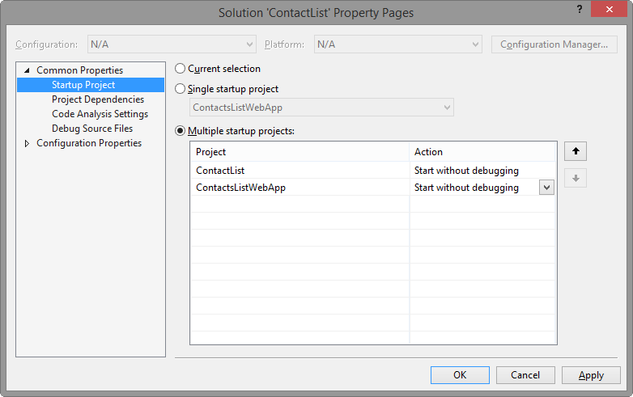

1. Déboguez la solution : vous verrez que le client HTML/JavaScript peut se connecter au projet d'application API et afficher des données à partir de celui-ci.

	

## Déploiement de l'application web

Dans cette section, vous allez déployer le client HTML/JavaScript comme une application web App Service. Une fois le déploiement terminé, vous allez modifier l'URL utilisé par JavaScript pour utiliser l'application API déployée.

> Remarque : cette section suppose que vous avez lu et effectué les manipulations de l'article [Déployer une application API](app-service-dotnet-deploy-api-app.md) ou que vous avez précédemment déployé votre propre application API.

1. Ouvrez le panneau de l'application API dans le portail Azure en version préliminaire. Cliquez sur l'URL dans le panneau pour l'ouvrir dans votre navigateur. Une fois qu'elle est ouverte, copiez l'URL de l'application API à partir de la barre d'adresses du navigateur. 

	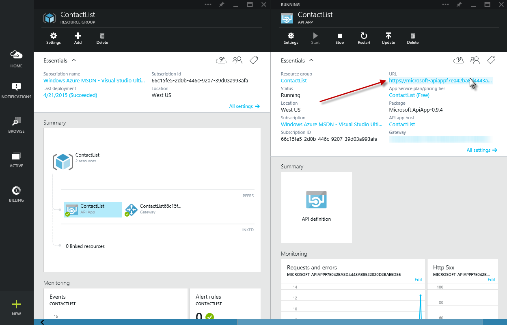

1. Collez l'URL de l'application API pour remplacer la valeur précédente de la propriété **$scope.baseUrl** dans le code JavaScript.

		$scope.baseUrl = 'https://microsoft-apiappf7e042ba8e5233ab4312021d2aae5d86.azurewebsites.net';

1. Cliquez avec le bouton droit sur le projet web HTML/JavaScript et sélectionnez l'élément de menu contextuel **Publier**.

	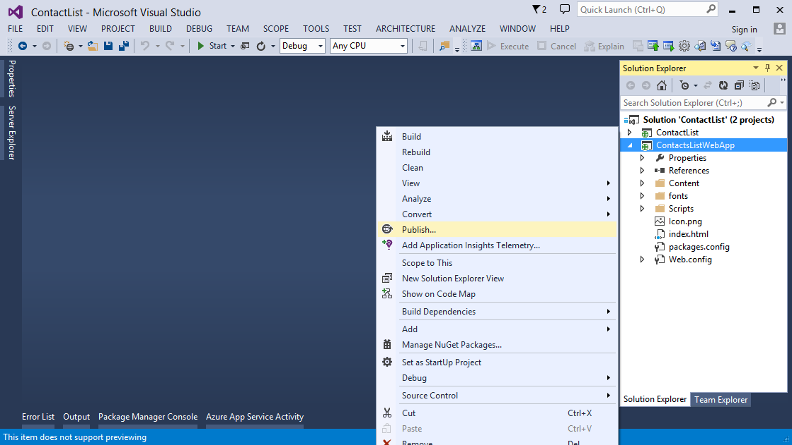

1. Sélectionnez l'option **Applications web Microsoft Azure** option dans la boîte de dialogue Publier le site Web.

	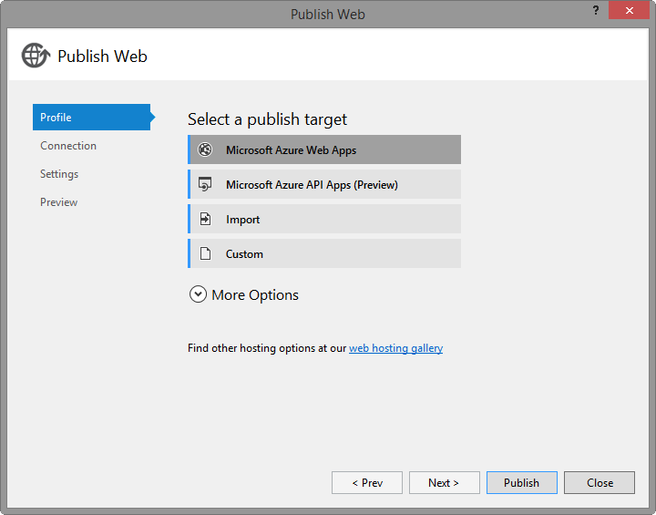

1. Cliquez sur le bouton **Nouveau** pour créer une application web.

	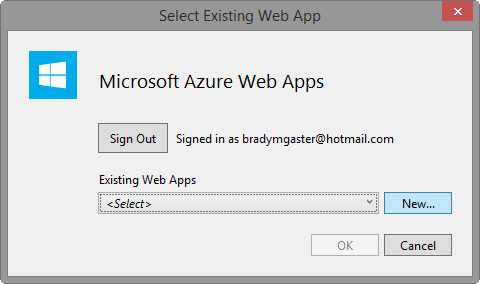

1. Sélectionnez le même plan d'hébergement d'application et le même groupe de ressources que ceux dans lesquels votre application API est déjà en cours d'exécution.

	> **Remarque** : ceci n'est pas obligatoire, mais dans le cadre d'une démonstration, le fait que tout soit contenu dans un même groupe de ressources facilite le nettoyage ultérieur de vos ressources Azure.

	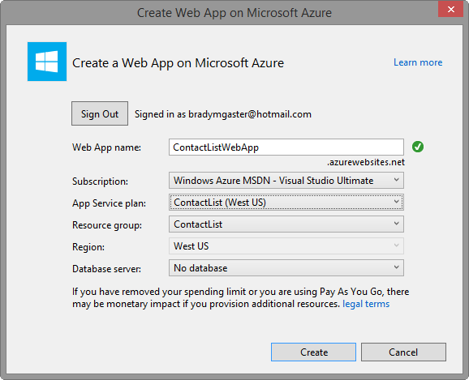

1. Effectuez les étapes de la publication web pour déployer le client HTML/JavaScript dans les applications web App Service.
1. Une fois que l'application web est déployée, elle doit automatiquement s'ouvrir dans votre navigateur web et afficher les données de l'application API. 

	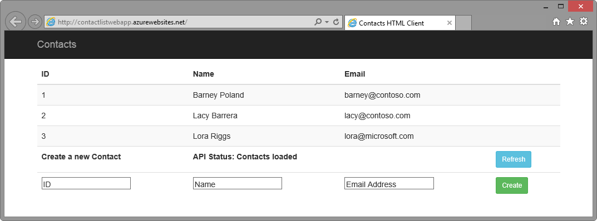

1. À ce stade, si vous accédez au groupe de ressources, vous verrez la nouvelle application web en cours d'exécution, en même temps que l'application API.

	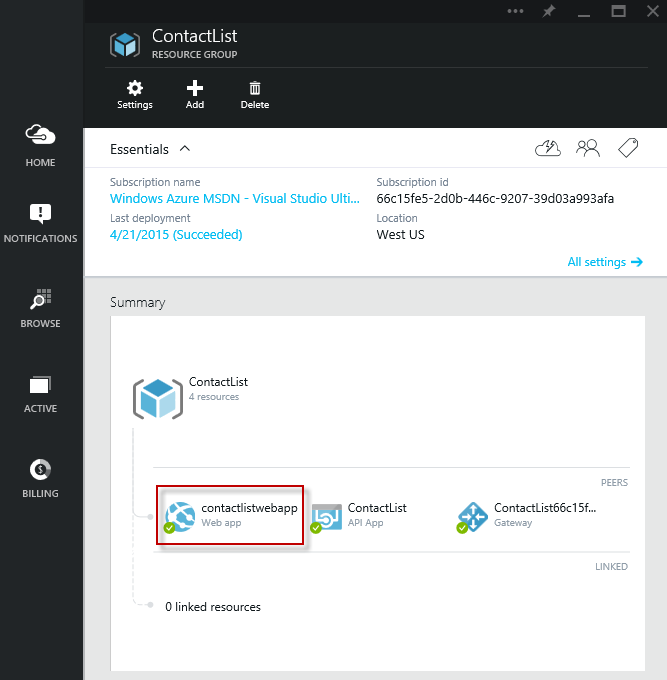

## Résumé 
Cet exemple a montré comment vous pouvez utiliser AngularJS comme plateforme JavaScript pour accéder aux backends d'applications API. Vous pouvez changer la fonctionnalité d'accès REST et utiliser une autre infrastructure JavaScript. <!--HONumber=52-->
