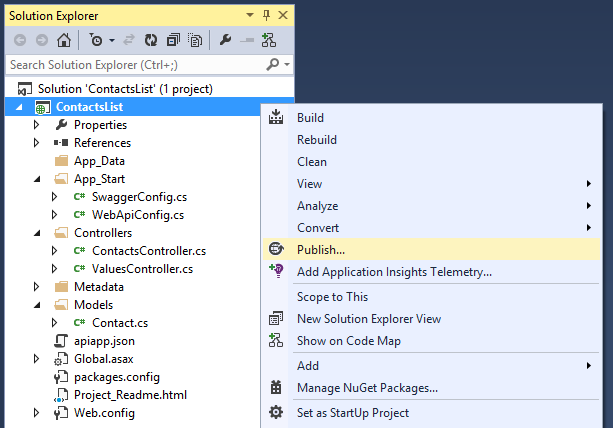
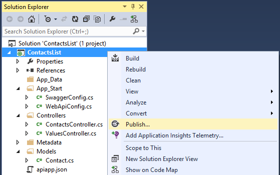

<properties 
	pageTitle="Déployer une application API dans Azure App Service" 
	description="Découvrez comment déployer un projet d'application API dans votre abonnement Azure." 
	services="app-service\api" 
	documentationCenter=".net" 
	authors="bradygaster" 
	manager="wpickett" 
	editor="jimbe"/>

<tags 
	ms.service="app-service-api" 
	ms.workload="web" 
	ms.tgt_pltfrm="dotnet" 
	ms.devlang="na" 
	ms.topic="article" 
	ms.date="02/19/2015" 
	ms.author="bradyg;tarcher"/>

# Déployer une application API dans Azure App Service

## Vue d'ensemble

Si vous développez activement votre propre application API à l'aide de Visual Studio et que vous devez tester votre API dans le cloud, vous pouvez créer une application API dans votre abonnement Azure et déployer votre code à l'aide des fonctionnalités de déploiement App Service pratiques de Visual Studio.

Ce didacticiel est le deuxième d'une série de trois :

1. Dans [Créer une application API](app-service-dotnet-create-api-app.md), vous avez créé un projet d’application API. 
* Dans ce didacticiel, vous allez déployer l'application API dans votre abonnement Azure.
* Dans [Déboguer une application API](app-service-dotnet-remotely-debug-api-app.md), vous allez utiliser Visual Studio pour déboguer à distance le code pendant son exécution dans Azure.

## Déployer l'application API 

Dans l’**Explorateur de solutions**, cliquez avec le bouton droit sur le projet (pas la solution), puis cliquez sur **Publier**.

Cliquez sur l’onglet **Profil** et sur **Microsoft Azure API Apps (version préliminaire)**.

Cliquez sur **Nouveau** pour configurer une nouvelle application API dans votre abonnement Azure.

Dans la boîte de dialogue **Créer une application API**, entrez les informations suivantes :

- Sous **Nom de l’application API**, entrez un nom pour l’application. 
- Si vous avez plusieurs abonnements Azure, choisissez celui à utiliser. Sous Plan App Service, sélectionnez un des plans App Service existants ou **Créer un plan App Service** et entrez le nom d’un nouveau plan. 
- Sous **Groupe de ressources**, sélectionnez un des groupes de ressources existants ou **Créer un groupe de ressources** et entrez un nom. Le nom doit être unique ; envisagez d'utiliser le nom de l'application en tant que préfixe et d'ajouter des informations personnelles telles que votre ID Microsoft (sans le signe @).  
- Sous **Niveau d’accès**, sélectionnez **Accessible à tout le monde**. Cette option rendra votre API complètement publique, ce qui convient pour ce didacticiel. Vous pouvez restreindre l'accès ultérieurement via le portail Azure.
- Sélectionnez une région.  

Cliquez sur **OK** pour créer l’application API dans votre abonnement. Comme le processus peut prendre quelques minutes, Visual Studio affiche une boîte de dialogue vous informant que le processus a commencé.

Le processus de configuration crée le groupe de ressources et l'application API dans votre abonnement Azure. Visual Studio affiche la progression dans la fenêtre **Activité d’Azure App Service**.

Une fois que l’application API est configurée, cliquez avec le bouton droit sur le projet dans l’Explorateur de solutions et sélectionnez **Publier** pour rouvrir la boîte de dialogue de publication. Le profil de publication créé à l'étape précédente doit être sélectionné au préalable. Cliquez sur **Publier** pour commencer le processus de déploiement.

La fenêtre **Activité d’Azure App Service** affiche la progression du déploiement.

## Afficher l'application dans le portail Azure

Dans cette section, vous allez accéder au portail pour afficher les paramètres de base disponibles pour les applications API et apporter des modifications itératives à votre application API. Avec chaque déploiement, le portail reflète les modifications que vous apportez à votre application API.

Dans votre navigateur, accédez au [portail Azure](https://portal.azure.com).

Cliquez sur le bouton **Parcourir** dans la barre latérale et sélectionnez **API Apps**.

Sélectionnez l'API que vous avez créée dans la liste des applications API dans votre abonnement.

Cliquez sur **Définition d’API**. Le panneau **Définition d’API** de l’application affiche la liste des opérations sur l’API que vous avez définies quand vous avez créé l’application.

Retournez à présent dans le projet dans Visual Studio. Ajoutez le code suivant au fichier **ContactsController.cs**.

	[HttpPost]
	public HttpResponseMessage Post([FromBody] Contact contact)
	{
		// todo: save the contact somewhere
		return Request.CreateResponse(HttpStatusCode.Created);
	}

Ce code ajoute une méthode **Post** qui peut être utilisée pour publier de nouvelles instances `Contact` dans l’API.

Dans l’**Explorateur de solutions**, cliquez avec le bouton droit sur le projet, puis sélectionnez **Publier**.

Sélectionnez la configuration **Déboguer** dans la liste déroulante **Configuration** et cliquez sur **Publier** pour redéployer l’application API.

Sous l’onglet **Aperçu** de l’Assistant **Publier le site web**, cliquez sur **Publier**.

Une fois le processus de publication terminé, revenez au portail, puis fermez et rouvrez le panneau **Définition d’API**. Vous verrez le nouveau point de terminaison d'API que vous venez de créer et de déployer directement dans votre abonnement Azure.

## Étapes suivantes

Vous avez vu comment les fonctionnalités de déploiement direct dans Visual Studio facilitent l'itération et le déploiement rapide de votre API ainsi que le test permettant de vérifier qu'elle fonctionne correctement. Dans le [didacticiel suivant](app-service-dotnet-remotely-debug-api-app.md), vous verrez comment déboguer votre application API pendant son exécution dans Azure.

<!--HONumber=54-->