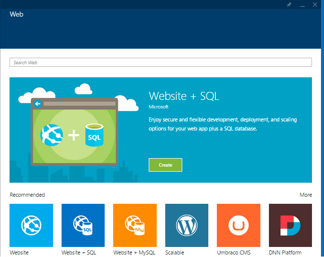

<properties
	pageTitle="Vue d'ensemble de Web Apps"
	description="En savoir plus sur App Service Web Apps"
	services="app-service\web"
	documentationCenter=""
	authors="jaime-espinosa"
	manager="wpickett"
	editor="jimbe"/>

<tags
	ms.service="app-service-web"
	ms.workload="web"
	ms.tgt_pltfrm="na"
	ms.devlang="na"
	ms.topic="article"
	ms.date="03/24/2015"
	ms.author="jaime.espinosa"/>

>[AZURE.NOTE] Si vous voulez commencer à utiliser Azure App Service avant de créer un compte Azure, cliquez sur [Essayer App Service](http://go.microsoft.com/fwlink/?LinkId=523751). Vous pourrez alors créer instantanément une application web de démarrage dans App Service. Aucune carte de crédit n'est requise, vous ne prenez aucun engagement.

#Vue d'ensemble de Web Apps

[App Service](http://go.microsoft.com/fwlink/?LinkId=529714) est une plateforme entièrement gérée destinée aux développeurs professionnels et qui leur apporte un ensemble riche de fonctionnalités pour les scénarios web, mobiles et les scénarios d'intégration. Azure App Service vous permet de créer et de déployer des applications web stratégiques qui s'adaptent à votre entreprise.

Grâce à la puissance d'[App Service Web Apps](http://go.microsoft.com/fwlink/?LinkId=529714), utilisez les langages et les infrastructures que vous connaissez et desquels vous dépendez, déployez vos applications rapidement sur le cloud Azure et améliorez constamment votre code sans avoir à vous soucier de l'infrastructure.

## Bien plus que de simples applications web##

Les entreprises modernes interagissent avec leurs clients de façon de plus en plus sophistiquée. Les entreprises de tous types considèrent leur présence sur le Web comme un élément essentiel de leur activité et comme un composant majeur de leur plan commercial. Pour répondre à une telle importance, les entreprises recherchent une plateforme qui fournisse souplesse, sécurité et évolutivité. Par ailleurs, elles ont besoin que les fonctionnalités soient compatibles avec leur système existant, afin de déployer rapidement du nouveau code et de mettre à disposition leurs instances dans le monde entier. Grâce à Azure App Service et à Web Apps, les entreprises peuvent répondre aux besoins de leurs clients rapidement et à moindre coût.

## Pourquoi Web Apps ? ##

Azure App Service Web Apps est une plateforme entièrement gérée qui vous permet de générer, déployer et mettre à l'échelle des applications web professionnelles en quelques secondes. Vous pouvez vous concentrer sur le code de votre application et laisser à Azure la prise en charge de l'infrastructure pour la mise à l'échelle et une exécution sécurisée. Web Apps est un outil :

- **Familier et rapide** : utilisez vos compétences pour écrire du code dans votre langage, votre infrastructure et votre IDE de prédilection. En quelques clics, vous pouvez ajouter le contrôle de version, la mise à jour, l'authentification unique, la gestion de l'identité, le stockage isolé et l'analyse des performances de vos applications web existantes.  Accédez aux nombreux éléments de la galerie que vous pourrez utiliser comme blocs de construction pour accélérer votre développement. Faites l'expérience d'une productivité de développement inégalée grâce aux fonctionnalités de pointe telles que l'intégration continue, le débogage de site actif et l'IDE Visual Studio.
- **Professionnel** : Web Apps est conçu pour la création et l'hébergement d'applications stratégiques sécurisées. Créez des applications d'entreprise Active Directory intégrées qui se connectent en toute sécurité aux ressources locales, puis hébergez-les sur une plateforme cloud conforme aux normes ISO, SOC2 et PCI. Tout cela, en profitant de contrats SLA de niveau entreprise.
- **À échelle globale** : Web Apps est optimisé pour fournir une disponibilité et une mise à l'échelle automatique dans une infrastructure de centre de données globale. Procédez en toute simplicité à une montée ou descente en puissance de vos applications sur demande. Une haute disponibilité est fournie au sein des différentes régions géographiques. La réplication de données et l'hébergement de services à plusieurs emplacements sont faciles et rapides. Il suffit d'un clic pour procéder à une extension de région ou de zone géographique.  

## Concepts de Web Apps ##

- **Galerie Web Apps** : sélectionnez parmi la liste des modèles d'applications web existants qui est alimentée en permanence. Profitez du meilleur de la communauté des applications OSS grâce à une installation en un clic de packages tels que Wordpress, Joomla et Drupal. Commencez votre développement d'applications sur de bonnes bases en utilisant les infrastructures .NET MVC, Django et CakePHP.
- **Mise à l'échelle automatique** : Web Apps permet de réaliser rapidement une montée ou une descente en puissance pour gérer la charge entrante des clients. Sélectionnez manuellement le nombre et la taille des machines virtuelles, ou configurez la mise à l'échelle automatique de vos serveurs suivant la charge ou la planification.
- **Intégration continue** : configurez l'intégration continue et les flux de travail de déploiement avec Visual Studio Online, GitHub, TeamCity, Hudson ou BitBucket. Vous pourrez ainsi générer, tester et déployer automatiquement votre application web lors de chaque archivage du code ou test d'intégration réussi.
- **Emplacements de déploiement** : mettez en place un [déploiement intermédiaire][Slots] pour vérifier votre code dans un environnement de pré-production identique à celui de votre application web de production dans Azure App Service. Quand vous êtes satisfait du résultat, publiez une nouvelle version de votre application sans interruption de service en effectuant une opération d'échange. 
- **Tests dans un environnement de production** : allez au-delà du déploiement intermédiaire en effectuant des [tests A/B][Tip] pour vérifier votre nouveau code avec une fraction configurable de votre trafic. 
- **Tâches web** : exécutez n'importe quel programme ou script sur des machines virtuelles Web Apps. Exécutez des tâches en continu ou selon un planning, et effectuez une mise à l'échelle pour une exécution sur plusieurs machines virtuelles. Pour intégrer le stockage Azure ou Service Bus, utilisez le [Kit de développement logiciel (SDK) pour les tâches Web][Webjobs] Azure.

## Prise en main ##
Pour commencer à utiliser Web Apps, suivez le didacticiel [Créer une application web ASP.NET][create].

Pour plus d'informations sur la plateforme Azure App Service, consultez [Azure App Service][appservice].

## Nouveautés
* Pour savoir comment passer de Sites Web à App Service, consultez : [Azure App Service et son impact sur les services Azure existants](http://go.microsoft.com/fwlink/?LinkId=529714)
* Pour savoir comment passer de l'ancien au nouveau portail, consultez : [Références sur la navigation dans le portail Azure en version préliminaire](http://go.microsoft.com/fwlink/?LinkId=529715)

[appservice]: app-service-value-prop-what-is.md
[create]: web-sites-dotnet-get-started.md
[Webjobs]: websites-dotnet-webjobs-sdk-get-started.md
[Slots]: web-sites-staged-publishing.md
[Tip]: http://blogs.msdn.com/b/tomholl/archive/2014/11/10/a-b-testing-with-azure-websites.aspx 

<!--HONumber=49-->