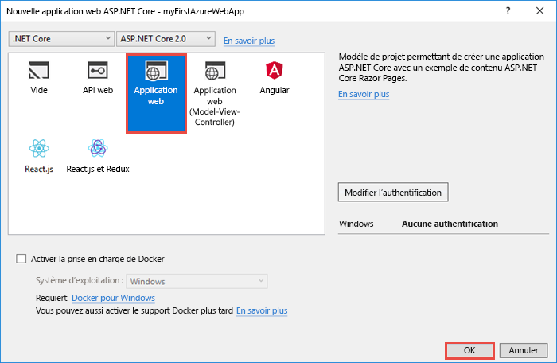
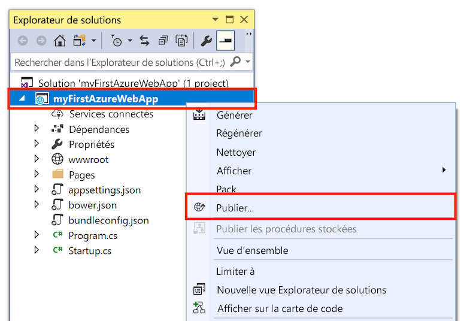
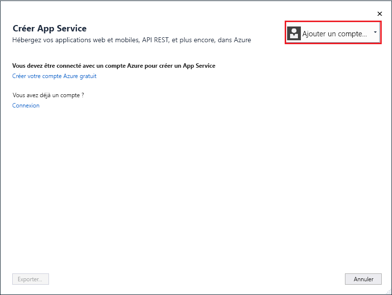
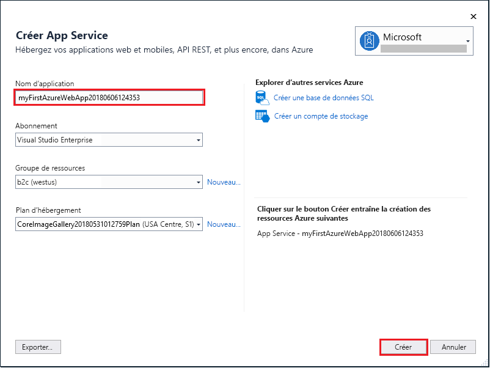
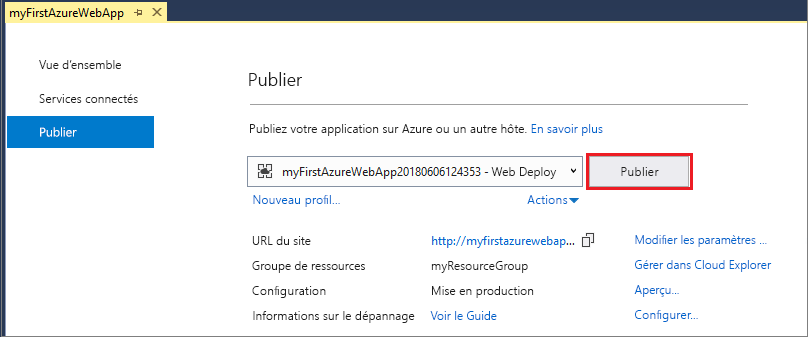

# <a name="create-an-aspnet-core-web-app-in-azure"></a>Créer une application web ASP.NET Core dans Azure

> [!NOTE]
> Cet article explique comment déployer une application sur App Service sous Windows. Pour déployer une application App Service sur _Linux_, consultez [Créer et déployer une application web .NET Core sur App Service sur Linux](./containers/quickstart-dotnetcore.md). 
>

[Azure Web Apps](app-service-web-overview.md) offre un service d’hébergement web hautement évolutif appliquant des mises à jour correctives automatiques.  Ce guide de démarrage rapide montre comment déployer votre première application web ASP.NET Core sur Azure Web Apps. Lorsque vous aurez terminé, vous disposerez d’un groupe de ressources constitué d’un plan App Service et d’une application web Azure avec une application web déployée.


[!INCLUDE [quickstarts-free-trial-note](../../includes/quickstarts-free-trial-note.md)]

## <a name="prerequisites"></a>Prérequis

Pour suivre ce didacticiel, installez <a href="https://www.visualstudio.com/downloads/" target="_blank">Visual Studio 2017</a> avec la charge de travail **Développement ASP.NET et web**.

Si vous avez déjà installé Visual Studio 2017 :

- Installez les dernières mises à jour dans Visual Studio en cliquant sur **Aide** > **Vérifier les mises à jour**.
- Ajoutez la charge de travail en cliquant sur **Outils** > **Obtenir des outils et des fonctionnalités**.

## <a name="create-an-aspnet-core-web-app"></a>Créez une application web ASP.NET Core

Dans Visual Studio, créez un projet en sélectionnant **Fichier > Nouveau > Projet**. 

Dans la boîte de dialogue **Nouveau projet**, sélectionnez **Visual C# > Web > Application web ASP.NET Core**.

Nommez l’application _myFirstAzureWebApp_, puis sélectionnez **OK**.
   


Vous pouvez déployer n’importe quel type d’application web ASP.NET Core dans Azure. Pour ce guide de démarrage rapide, sélectionnez le modèle **Application Web**, puis vérifiez que l’authentification est définie sur **Aucune authentification** et qu’aucune autre option n’est sélectionnée.
      
Sélectionnez **OK**.



Dans le menu, sélectionnez **Déboguer > Exécuter sans débogage** pour exécuter l’application web localement.


## <a name="launch-the-publish-wizard"></a>Lancer l’assistant de publication

Dans **l’Explorateur de solutions**, cliquez avec le bouton droit sur le projet **myFirstAzureWebApp**, puis sélectionnez **Publier**.



L’Assistant Publication est lancé automatiquement. Sélectionnez **App Service** > **Publier** pour ouvrir la boîte de dialogue **Créer App Service**.


## <a name="sign-in-to-azure"></a>Connexion à Azure

Dans la boîte de dialogue **Créer App Service**, cliquez sur **Ajouter un compte** puis connectez-vous à votre abonnement Azure. Si vous êtes déjà connecté, sélectionnez le compte que vous souhaitez dans la liste déroulante.

> [!NOTE]
> Si vous êtes déjà connecté, ne sélectionnez pas encore **Créer**.
>
   


## <a name="create-a-resource-group"></a>Créer un groupe de ressources

[!INCLUDE [resource group intro text](../../includes/resource-group.md)]

En regard de **Groupe de ressources**, sélectionnez **Nouveau**.

Nommez le groupe de ressources **myResourceGroup**, puis sélectionnez **OK**.

## <a name="create-an-app-service-plan"></a>Créer un plan App Service

[!INCLUDE [app-service-plan](../../includes/app-service-plan.md)]

En regard de **Plan d’hébergement**, sélectionnez **Nouveau**. 

Dans la boîte de dialogue **Configurer le plan d’hébergement**, utilisez les paramètres spécifiés dans la table sous la capture d’écran ci-après.


| Paramètre | Valeur suggérée | Description |
|-|-|-|
|Plan App Service| myAppServicePlan | Nom du plan App Service. |
| Lieu | Europe Ouest | Centre de données dans lequel l’application web est hébergée. |
| Taille | Gratuit | Le [niveau tarifaire](https://azure.microsoft.com/pricing/details/app-service/?ref=microsoft.com&utm_source=microsoft.com&utm_medium=docs&utm_campaign=visualstudio) détermine les fonctionnalités d’hébergement. |

Sélectionnez **OK**.

## <a name="create-and-publish-the-web-app"></a>Créer et publier l’application web

Dans **Nom de l’application**, saisissez un nom d’application unique (les caractères valides sont `a-z`, `0-9` et `-`) ou acceptez le nom unique généré automatiquement. L’URL de l’application web est `http://<app_name>.azurewebsites.net`, où `<app_name>` est le nom de votre application.

Sélectionnez **Créer** pour commencer à créer les ressources Azure.



Une fois que l’Assistant a terminé, il publie l’application web ASP.NET Core sur Azure, puis il lance l’application dans le navigateur par défaut.


Le nom de l’application spécifié à [l’étape de création et de publication](#create-and-publish-the-web-app) est utilisé en tant que préfixe d’URL au format `http://<app_name>.azurewebsites.net`.

Félicitations, votre application web ASP.NET Core s’exécute en temps réel dans Azure App Service.

## <a name="update-the-app-and-redeploy"></a>Mise à jour de l’application et redéploiement

Dans **l’Explorateur de solutions**, ouvrez _Pages/Index.cshtml_.

Remplacez les deux balises `<div>` par le code suivant :

```HTML
<div class="jumbotron">
    <h1>ASP.NET in Azure!</h1>
    <p class="lead">This is a simple app that we’ve built that demonstrates how to deploy a .NET app to Azure App Service.</p>
</div>
```

Pour effectuer un redéploiement dans Azure, cliquez avec le bouton droit sur le projet **myFirstAzureWebApp** dans **l’Explorateur de solutions**, puis sélectionnez **Publier**.

Dans la page Résumé de la publication, sélectionnez **Publier**.


Une fois la publication terminée, Visual Studio lance un navigateur en accédant à l’URL de l’application web.


## <a name="manage-the-azure-web-app"></a>Gérer l’application web Azure

Accédez au <a href="https://portal.azure.com" target="_blank">Portail Azure</a> pour gérer l’application web.

Dans le menu de gauche, sélectionnez **App Services**, puis sélectionnez le nom de votre application web Azure.


Vous voyez apparaître la page Vue d’ensemble de votre application web. Ici, vous pouvez également des tâches de gestion de base (parcourir, arrêter, démarrer, redémarrer et supprimer des éléments, par exemple). 


Le menu de gauche fournit différentes pages vous permettant de configurer votre application. 

[!INCLUDE [Clean-up section](../../includes/clean-up-section-portal.md)]

## <a name="next-steps"></a>Étapes suivantes

> [!div class="nextstepaction"]
> [Build a .NET Core and SQL Database web app in Azure App Service](app-service-web-tutorial-dotnetcore-sqldb.md) (Créer une application web .NET Core et SQL Database dans Azure App Service)
