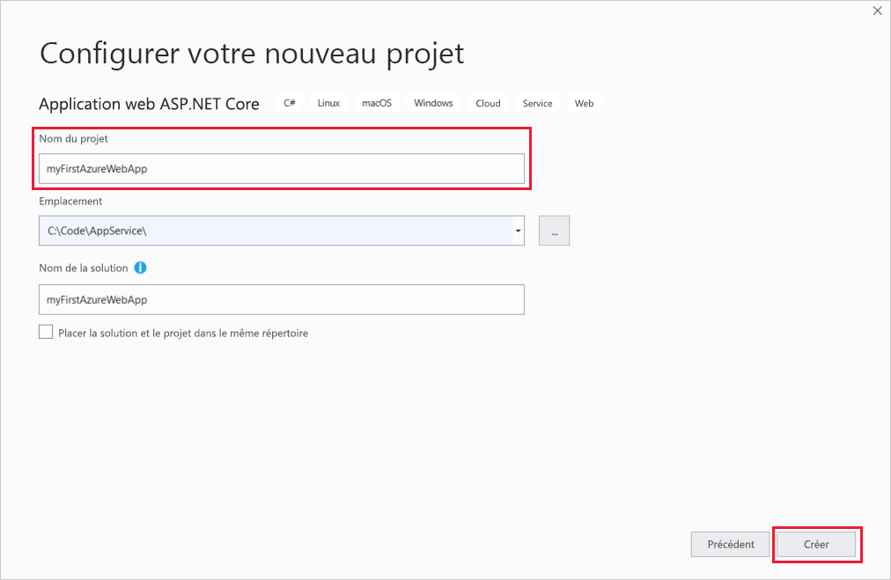
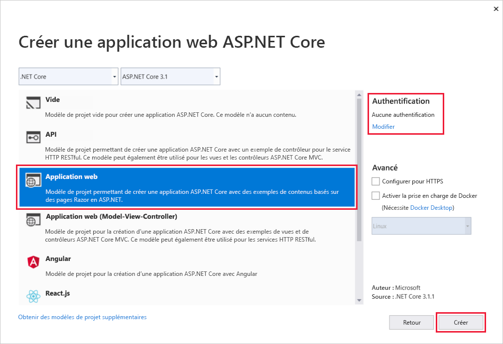
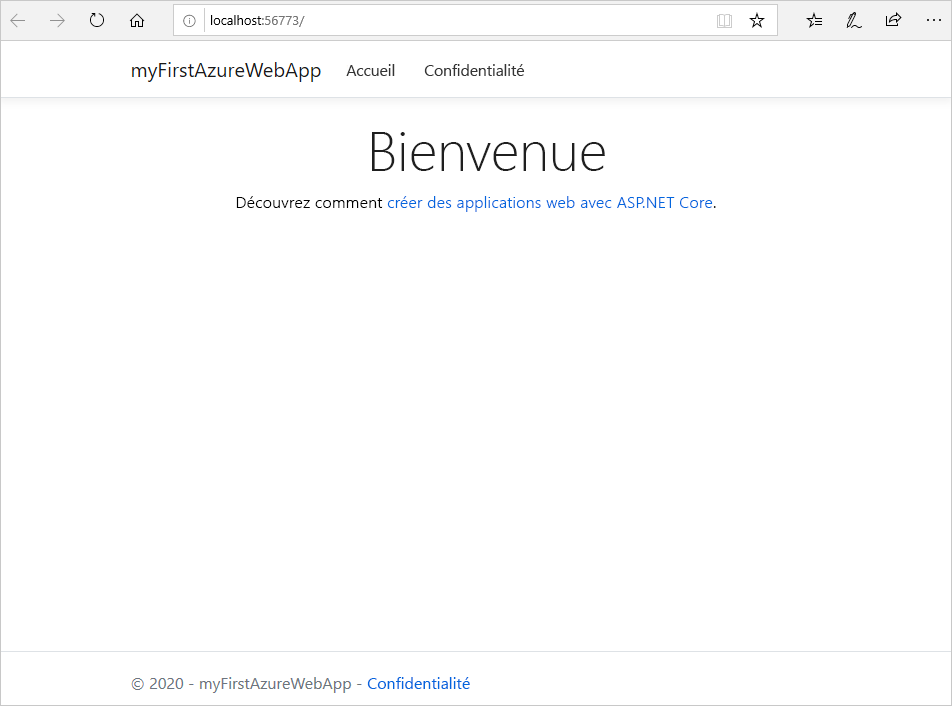
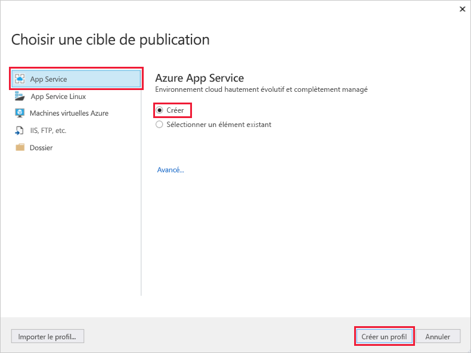
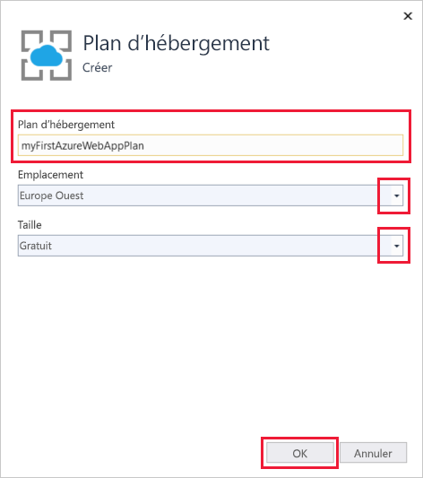
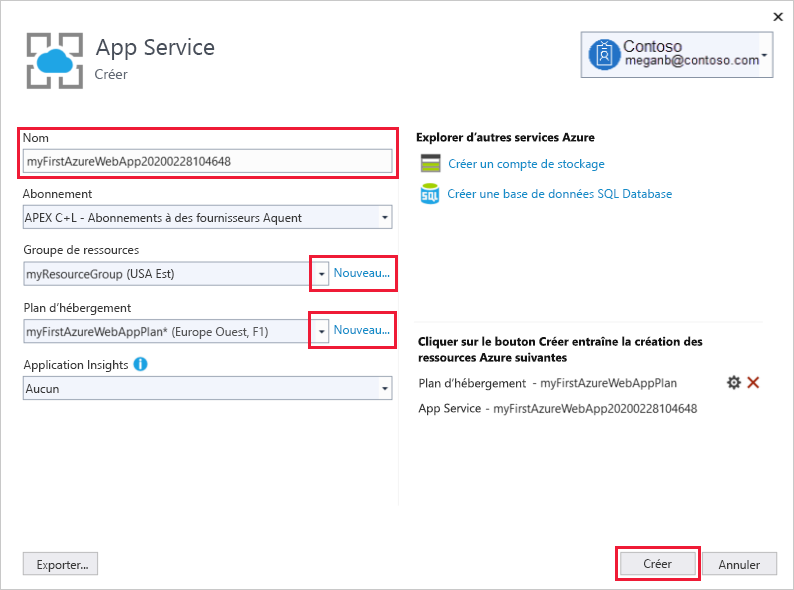
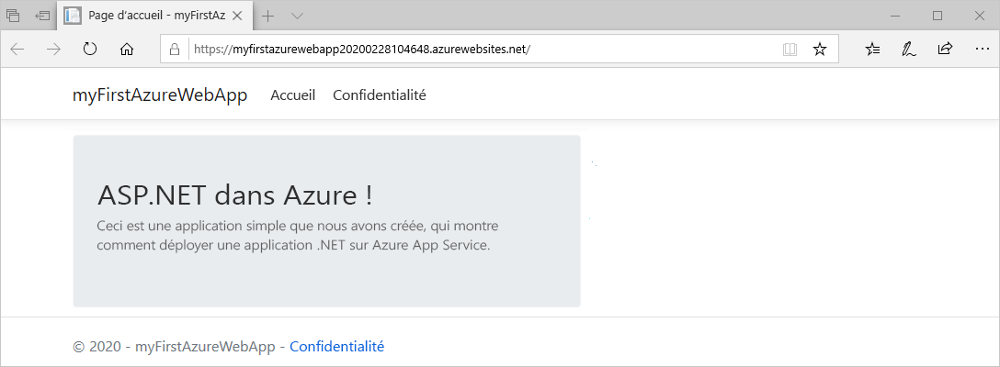
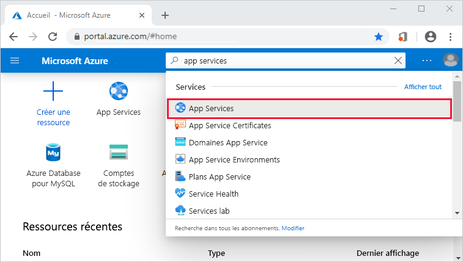
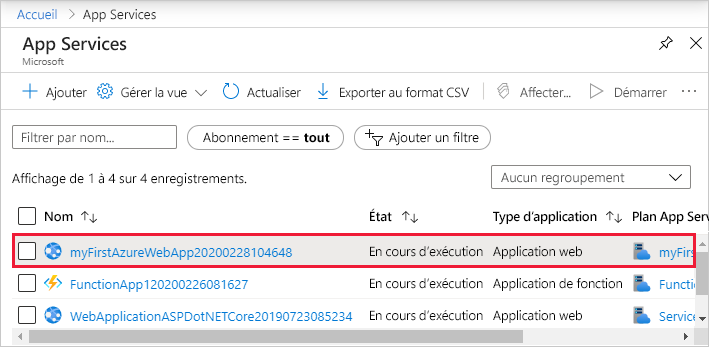
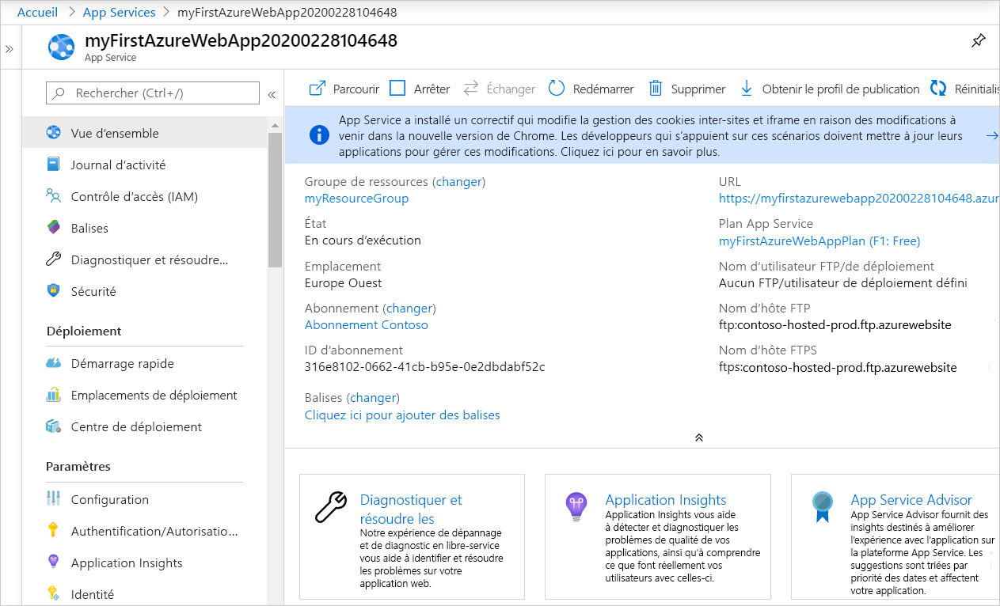

# <a name="quickstart-create-an-aspnet-core-web-app-in-azure"></a>Démarrage rapide : Créer une application web ASP.NET Core dans Azure

Dans ce guide de démarrage rapide, vous allez apprendre à créer et déployer votre première application web ASP.NET Core sur [Azure App Service](overview.md). 

Quand vous aurez terminé, vous disposerez d’un groupe de ressources Azure constitué d’un plan d’hébergement App Service et d’un service d’application avec une application web déployée.

## <a name="prerequisites"></a>Prérequis

- Compte Azure avec un abonnement actif. [Créez un compte gratuitement](https://azure.microsoft.com/free/?ref=microsoft.com&utm_source=microsoft.com&utm_medium=docs&utm_campaign=visualstudio).
- Ce guide de démarrage rapide déploie une application dans App Service sur Windows. Pour déployer une application App Service sur _Linux_, consultez [Créer et déployer une application web .NET Core sur App Service sur Linux](./containers/quickstart-dotnetcore.md).
- Installer <a href="https://www.visualstudio.com/downloads/" target="_blank">Visual Studio 2019</a> avec la charge de travail **Développement ASP.NET et web**.

  Si vous avez déjà installé Visual Studio 2019 :

  - Installez les dernières mises à jour dans Visual Studio en sélectionnant **Aide** > **Rechercher les mises à jour**.
  - Ajoutez la charge de travail en sélectionnant **Outils** > **Obtenir des outils et des fonctionnalités**.


## <a name="create-an-aspnet-core-web-app"></a>Créez une application web ASP.NET Core

Créez une application web ASP.NET Core dans Visual Studio en suivant ces étapes :

1. Ouvrez Visual Studio et sélectionnez **Créer un projet**.

1. Dans **Créer un projet**, sélectionnez **Application web ASP.NET Core** et vérifiez que **C#** est listé dans les langages de ce choix, puis sélectionnez **Suivant**.

1. Dans **Configurer votre nouveau projet**, nommez votre projet d’application web *myFirstAzureWebApp*, puis sélectionnez **Créer**.

   

1. Vous pouvez déployer n’importe quel type d’application web ASP.NET Core dans Azure, mais pour ce guide de démarrage rapide, choisissez le modèle **Application web**. Vérifiez que l’option **Authentification** est définie sur **Aucune authentification**, et qu’aucune autre option n’est sélectionnée. Sélectionnez ensuite **Create** (Créer).

    
   
1. Dans le menu Visual Studio, sélectionnez **Déboguer** > **Démarrer sans débogage** pour exécuter votre application web localement.

   

## <a name="publish-your-web-app"></a>Publier votre application web

Pour publier votre application web, vous devez d’abord créer et configurer un nouveau service d’application sur lequel publier votre application. 

Lors de la configuration du service d’application, vous allez créer :

- un nouveau [groupe de ressources](https://docs.microsoft.com/azure/azure-resource-manager/management/overview#terminology) pour contenir toutes les ressources Azure du service ;
- un nouveau [plan d’hébergement](https://docs.microsoft.com/azure/app-service/overview-hosting-plans) qui spécifie l’emplacement, la taille et les fonctionnalités de la batterie de serveurs web qui héberge votre application.

Pour créer votre service d’application et publier votre application web, suivez ces étapes :

1. Dans l’**Explorateur de solutions**, cliquez avec le bouton droit sur le projet **myFirstAzureWebApp**, puis sélectionnez **Publier**. Si vous ne vous êtes pas déjà connecté à votre compte Azure depuis Visual Studio, sélectionnez **Ajouter un compte** ou **Connexion**. Vous pouvez également créer un compte Azure gratuit.

1. Dans la boîte de dialogue **Choisir une cible de publication**, choisissez **App Service**, sélectionnez **Créer nouveau**, puis sélectionnez **Créer le profil**.

   

1. Dans la boîte de dialogue **App Service : Créer nouveau**, fournissez un **Nom** global unique pour votre application en acceptant le nom par défaut ou en entrant un nouveau nom. Les caractères valides sont `a-z`, `A-Z`, `0-9` et `-`. Ce **Nom** est utilisé comme préfixe d’URL pour votre application web dans le format `http://<app_name>.azurewebsites.net`.

1. Pour **Abonnement**, acceptez l’abonnement qui est listé ou sélectionnez-en un nouveau dans la liste déroulante.

1. Dans **Groupe de ressources**, sélectionnez **Nouveau**. Dans **Nouveau nom du groupe de ressources**, entrez *myResourceGroup*, puis sélectionnez **OK**. 

1. Pour **Plan d’hébergement**, sélectionnez **Nouveau**. 

1. Dans la boîte de dialogue **Plan d’hébergement : Créer nouveau**, entrez les valeurs spécifiées dans le tableau suivant :

   | Paramètre  | Valeur suggérée | Description |
   | -------- | --------------- | ----------- |
   | **Plan d’hébergement**  | *myFirstAzureWebAppPlan* | Nom du plan App Service. |
   | **Lieu**      | *Europe Ouest* | Centre de données dans lequel l’application web est hébergée. |
   | **Taille**          | *Gratuit* | Le [niveau tarifaire](https://azure.microsoft.com/pricing/details/app-service/?ref=microsoft.com&utm_source=microsoft.com&utm_medium=docs&utm_campaign=visualstudio) détermine les fonctionnalités d’hébergement. |
   
   

1. Laissez la valeur d’**Application Insights** définie sur *Aucun*.

1. Dans la boîte de dialogue **App Service : Créer nouveau**, sélectionnez **Créer** pour commencer à créer les ressources Azure.

   

1. À la fin de l’Assistant, sélectionnez **Publier**.

   

   Visual Studio publie votre application web ASP.NET Core dans Azure, puis lance l’application dans votre navigateur par défaut. 

   

**Félicitations !** Votre application web ASP.NET Core s’exécute en temps réel dans Azure App Service.

## <a name="update-the-app-and-redeploy"></a>Mise à jour de l’application et redéploiement

Pour mettre à jour et redéployer votre application web, suivez ces étapes :

1. Dans l’**Explorateur de solutions**, sous votre projet, ouvrez **Pages** > **Index.cshtml**.

1. Remplacez les deux balises `<div>` par le code suivant :

   ```HTML
   <div class="jumbotron">
       <h1>ASP.NET in Azure!</h1>
       <p class="lead">This is a simple app that we've built that demonstrates how to deploy a .NET app to Azure App Service.</p>
   </div>
   ```

1. Pour effectuer un redéploiement dans Azure, cliquez avec le bouton droit sur le projet **myFirstAzureWebApp** dans **l’Explorateur de solutions**, puis sélectionnez **Publier**.

1. Dans la page récapitulative intitulée **Publier**, sélectionnez **Publier**.

   

Une fois la publication terminée, Visual Studio lance un navigateur en accédant à l’URL de l’application web.



## <a name="manage-the-azure-app"></a>Gérer l’application Azure

Pour gérer votre application web, accédez au [Portail Azure](https://portal.azure.com), puis recherchez et sélectionnez **App Services**.



Dans la page **App Services**, sélectionnez le nom de votre application web.



La page **Vue d’ensemble** de votre application web contient des options de gestion de base, telles que parcourir, arrêter, démarrer, redémarrer et supprimer. Le menu de gauche fournit d’autres pages vous permettant de configurer votre application.



[!INCLUDE [Clean-up section](../../includes/clean-up-section-portal.md)]

## <a name="next-steps"></a>Étapes suivantes

Dans ce guide de démarrage rapide, vous avez utilisé Visual Studio pour créer et déployer une application web ASP.NET Core dans Azure App Service.

Passez à l’article suivant pour savoir comment créer une application .NET Core et la connecter à une base de données SQL :

> [!div class="nextstepaction"]
> [Build a .NET Core and SQL Database web app in Azure App Service](app-service-web-tutorial-dotnetcore-sqldb.md) (Créer une application web .NET Core et SQL Database dans Azure App Service)
