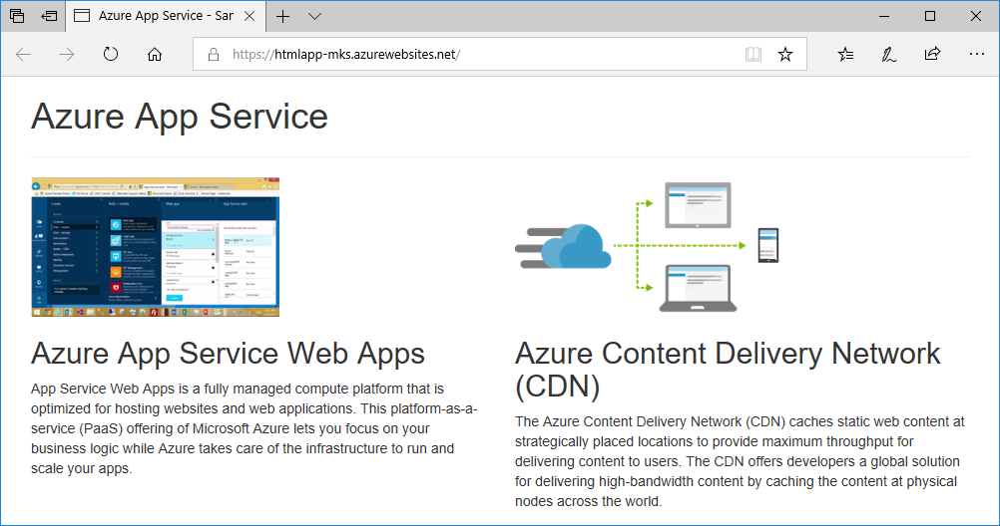
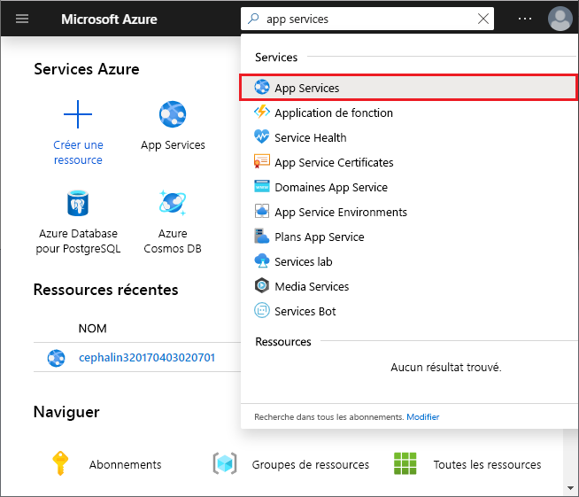
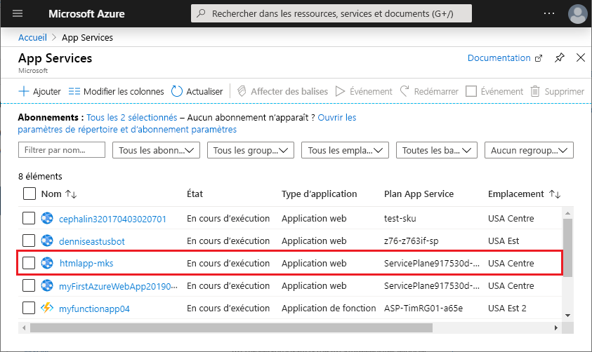
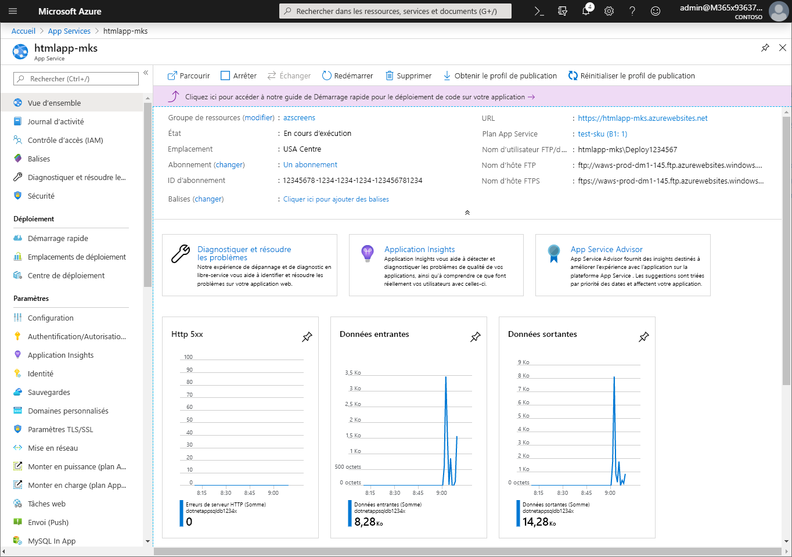

# <a name="create-a-static-html-web-app-in-azure"></a>Créer une application web HTML statique dans Azure

[Azure App Service](overview.md) offre un service d’hébergement web hautement évolutif appliquant des mises à jour correctives automatiques. Ce guide de démarrage rapide montre comment déployer un site HTML+CSS de base sur Azure App Service. Vous allez effectuer ce démarrage rapide dans [Cloud Shell](https://docs.microsoft.com/azure/cloud-shell/overview), mais vous pouvez également exécuter ces commandes localement avec [Azure CLI](/cli/azure/install-azure-cli).


[!INCLUDE [quickstarts-free-trial-note](../../includes/quickstarts-free-trial-note.md)]

[!INCLUDE [cloud-shell-try-it.md](../../includes/cloud-shell-try-it.md)]

## <a name="download-the-sample"></a>Télécharger l’exemple

Dans Cloud Shell, créez un répertoire de démarrage rapide, puis utilisez-le.

```bash
mkdir quickstart

cd $HOME/quickstart
```

Exécutez ensuite la commande suivante pour cloner le référentiel de l’exemple d’application sur votre répertoire de démarrage rapide.

```bash
git clone https://github.com/Azure-Samples/html-docs-hello-world.git
```

## <a name="create-a-web-app"></a>Créer une application web

Passez au répertoire qui contient l’exemple de code et exécutez la commande `az webapp up`.

Dans l’exemple suivant, remplacez <nom de l’application> par un nom d’application unique.

```bash
cd html-docs-hello-world

az webapp up --location westeurope --name <app_name>
```

La commande `az webapp up` exécute les actions suivantes :

- Créer un groupe de ressources par défaut

- Créer un plan App Service par défaut

- Créer une application avec le nom spécifié

- [Décompressez](https://docs.microsoft.com/azure/app-service/deploy-zip) les fichiers depuis le répertoire de travail en cours sur l’application web.

L’exécution de cette commande peut prendre quelques minutes. Pendant son exécution, des informations semblables à ce qui suit s’affichent :

```json
{
  "app_url": "https://<app_name>.azurewebsites.net",
  "location": "westeurope",
  "name": "<app_name>",
  "os": "Windows",
  "resourcegroup": "appsvc_rg_Windows_westeurope",
  "serverfarm": "appsvc_asp_Windows_westeurope",
  "sku": "FREE",
  "src_path": "/home/<username>/quickstart/html-docs-hello-world ",
  < JSON data removed for brevity. >
}
```

Notez la valeur de `resourceGroup`. Elle vous sera utile pour la section de [nettoyage des ressources](#clean-up-resources).

## <a name="browse-to-the-app"></a>Accéder à l’application

Dans un navigateur, accédez à l’URL de l’application : `http://<app_name>.azurewebsites.net`.

La page s’exécute comme une application web Azure App Service.


**Félicitations !** Vous avez déployé votre première application HTML dans App Service.

## <a name="update-and-redeploy-the-app"></a>Mise à jour et redéploiement de l’application

Dans Cloud Shell, tapez `nano index.html` pour ouvrir l’éditeur de texte nano. Dans la balise de titre `<h1>`, remplacez « Azure App Service - Exemple de site HTML statique » par « Azure App Service », comme indiqué ci-dessous.


Enregistrez vos modifications et quittez nano. Utilisez la commande `^O` pour enregistrer et `^X` pour quitter.

Vous allez maintenant redéployer l’application avec la même commande `az webapp up`.

```bash
az webapp up --location westeurope --name <app_name>
```

Une fois le déploiement terminé, revenez à la fenêtre du navigateur que vous avez ouverte à l’étape **Accéder à l’application**, puis actualisez la page.



## <a name="manage-your-new-azure-app"></a>Gérer votre nouvelle application Azure

Pour gérer l’application web que vous avez créée, dans le [portail Azure](https://portal.azure.com), recherchez et sélectionnez **App Services**. 



Dans la page **App Services**, sélectionnez le nom de votre application Azure.



Vous voyez apparaître la page Vue d’ensemble de votre application web. Ici, vous pouvez également des tâches de gestion de base (parcourir, arrêter, démarrer, redémarrer et supprimer des éléments, par exemple).



Le menu de gauche fournit différentes pages vous permettant de configurer votre application.

## <a name="clean-up-resources"></a>Supprimer des ressources

Au cours des étapes précédentes, vous avez créé des ressources Azure au sein d’un groupe de ressources. Si vous ne pensez pas avoir besoin de ces ressources à l’avenir, supprimez le groupe de ressources en exécutant la commande suivante dans Cloud Shell. Souvenez-vous que le nom du groupe de ressources a été généré automatiquement pour vous à l’étape [créer une application web](#create-a-web-app).

```bash
az group delete --name appsvc_rg_Windows_westeurope
```

L’exécution de cette commande peut prendre une minute.

## <a name="next-steps"></a>Étapes suivantes

> [!div class="nextstepaction"]
> [Mapper un domaine personnalisé](app-service-web-tutorial-custom-domain.md)
