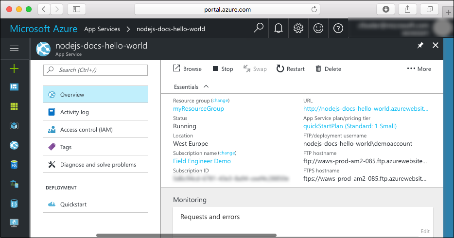

# <a name="create-a-nodejs-web-app-in-azure"></a>Créer une application web Node.js dans Azure

> [!NOTE]
> Cet article explique comment déployer une application sur App Service sous Windows. Pour déployer une application App Service sur _Linux_, consultez [Créer et déployer une application web Node.js dans Azure App Service sur Linux](./containers/quickstart-nodejs.md).
>

[Azure App Service](overview.md) offre un service d’hébergement web hautement évolutif appliquant des mises à jour correctives automatiques.  Ce guide de démarrage rapide montre comment déployer une application Node.js sur Azure App Service. Vous créez l’application web en utilisant [Cloud Shell](https://docs.microsoft.com/azure/cloud-shell/overview), mais vous pouvez également exécuter ces commandes localement avec [Azure CLI](/cli/azure/install-azure-cli). Vous déployez l’exemple de code Node.js sur l’application web en utilisant la commande [az webapp deployment source config-zip](/cli/azure/webapp/deployment/source?view=azure-cli-latest#az-webapp-deployment-source-config-zip).  


Vous pouvez suivre ces étapes en utilisant un ordinateur Mac, Windows ou Linux. Environ trois minutes sont nécessaires pour effectuer ces étapes.

[!INCLUDE [quickstarts-free-trial-note](../../includes/quickstarts-free-trial-note.md)]

[!INCLUDE [cloud-shell-try-it.md](../../includes/cloud-shell-try-it.md)]

## <a name="download-the-sample"></a>Télécharger l’exemple

Dans Cloud Shell, créez un répertoire de démarrage rapide, puis utilisez-le.

```azurecli-interactive
mkdir quickstart

cd quickstart
```

Exécutez ensuite la commande suivante pour cloner le référentiel de l’exemple d’application sur votre répertoire de démarrage rapide.

```azurecli-interactive
git clone https://github.com/Azure-Samples/nodejs-docs-hello-world
```

Pendant son exécution, des informations semblables à ce qui suit s’affichent :

```bash
Cloning into 'nodejs-docs-hello-world'...
remote: Counting objects: 40, done.
remote: Total 40 (delta 0), reused 0 (delta 0), pack-reused 40
Unpacking objects: 100% (40/40), done.
Checking connectivity... done.
```

> [!NOTE]
> L’exemple de fichier index.js définit le port d’écoute sur process.env.PORT. Cette variable d’environnement est affectée par App Service.
>

[!INCLUDE [Create resource group](../../includes/app-service-web-create-resource-group-scus.md)]

[!INCLUDE [Create app service plan](../../includes/app-service-web-create-app-service-plan-scus.md)]

## <a name="create-a-web-app"></a>Créer une application web

Dans Cloud Shell, créez une application web dans le plan App Service `myAppServicePlan` avec la commande [`az webapp create`](/cli/azure/webapp?view=azure-cli-latest#az-webapp-create).

Dans l’exemple suivant, remplacez `<app_name>` par un nom d’application unique (les caractères autorisés sont `a-z`, `0-9` et `-`).

```azurecli-interactive
# Bash and Powershell
az webapp create --resource-group myResourceGroup --plan myAppServicePlan --name <app_name>
```

Une fois l’application web créée, Azure CLI affiche une sortie similaire à l’exemple suivant :

```json
{
  "availabilityState": "Normal",
  "clientAffinityEnabled": true,
  "clientCertEnabled": false,
  "cloningInfo": null,
  "containerSize": 0,
  "dailyMemoryTimeQuota": 0,
  "defaultHostName": "<app_name>.azurewebsites.net",
  "enabled": true,
  < JSON data removed for brevity. >
}
```

### <a name="set-nodejs-runtime"></a>Définir le runtime Node.js

Définissez le runtime Node sur la valeur 10.14.1. Pour voir tous les runtimes, exécutez [`az webapp list-runtimes`](/cli/azure/webapp?view=azure-cli-latest#az-webapp-list-runtimes).

```azurecli-interactive
# Bash and Powershell
az webapp config appsettings set --resource-group myResourceGroup --name <app_name> --settings WEBSITE_NODE_DEFAULT_VERSION=10.14.1
```

Accédez à votre nouvelle application web. Remplacez `<app_name>` par un nom d’application unique.

```
http://<app_name>.azurewebsites.net
```

Voici à quoi doit ressembler votre nouvelle application web : 

## <a name="deploy-zip-file"></a>Déployer un fichier Zip

Dans Cloud Shell, accédez au répertoire racine de votre application, créez un fichier ZIP pour votre exemple de projet.

```azurecli-interactive
cd nodejs-docs-hello-world  

zip -r myUpdatedAppFiles.zip *.*
```

Déployez le fichier ZIP dans votre application web à l’aide de la commande [az webapp deployment source config-zip](/cli/azure/webapp/deployment/source?view=azure-cli-latest#az-webapp-deployment-source-config-zip).  

```azurecli-interactive
az webapp deployment source config-zip --resource-group myResourceGroup --name <app_name> --src myUpdatedAppFiles.zip
```

Cette commande déploie les fichiers et répertoires du fichier ZIP vers votre dossier d’applications App Service par défaut (`\home\site\wwwroot`), puis redémarre l’application. Si un processus de génération personnalisé supplémentaire est configuré, il est également exécuté. Pour plus d’informations, consultez la [documentation Kudu](https://github.com/projectkudu/kudu/wiki/Deploying-from-a-zip-file).

## <a name="browse-to-the-app"></a>Accéder à l’application

Accédez à l’application déployée à l’aide de votre navigateur web.

```
http://<app_name>.azurewebsites.net
```

L’exemple de code Node.js s’exécute dans une application web Azure App Service.


> [!NOTE]
> Dans Azure App Service, l’application est exécutée dans l’IIS à l’aide de [iisnode](https://github.com/Azure/iisnode). Pour permettre à l’application d’être exécutée avec iisnode, le répertoire racine d’application contient un fichier web.config. Le fichier est lisible par IIS, et les paramètres liés à iisnode sont documentés dans [le référentiel GitHub d’iisnode](https://github.com/Azure/iisnode/blob/master/src/samples/configuration/web.config).

**Félicitations !** Vous avez déployé votre première application Node.js dans App Service.

## <a name="update-and-redeploy-the-code"></a>Mettre à jour et redéployer le code

Dans Cloud Shell, tapez `code index.js` pour ouvrir l’éditeur Cloud Shell.


Apportez une petite modification au texte de l’appel pour `response.end` :

```javascript
response.end("Hello Azure!");
```

Enregistrez vos modifications et quittez l’éditeur. Utilisez la commande `^S` pour enregistrer et `^Q` pour quitter.

Créez un fichier ZIP et déployez-le à l’aide de la commande [az webapp deployment source config-zip](/cli/azure/webapp/deployment/source?view=azure-cli-latest#az-webapp-deployment-source-config-zip).  

```azurecli-interactive
# Bash
zip -r myUpdatedAppFiles.zip *.*

az webapp deployment source config-zip --resource-group myResourceGroup --name <app_name> --src myUpdatedAppFiles.zip
```

Revenez à la fenêtre du navigateur que vous avez ouverte à l’étape **Accéder à l’application**, puis actualisez la page.


## <a name="manage-your-new-azure-app"></a>Gérer votre nouvelle application Azure

Accédez au <a href="https://portal.azure.com" target="_blank">Portail Azure</a> pour gérer l’application web que vous avez créée.

Dans le menu de gauche, cliquez sur **App Services**, puis sur le nom de votre application Azure.


Vous voyez apparaître la page Vue d’ensemble de votre application web. Ici, vous pouvez également des tâches de gestion de base (parcourir, arrêter, démarrer, redémarrer et supprimer des éléments, par exemple).



Le menu de gauche fournit différentes pages vous permettant de configurer votre application.

[!INCLUDE [cli-samples-clean-up](../../includes/cli-samples-clean-up.md)]

## <a name="next-steps"></a>Étapes suivantes

> [!div class="nextstepaction"]
> [Node.js avec MongoDB](app-service-web-tutorial-nodejs-mongodb-app.md)
