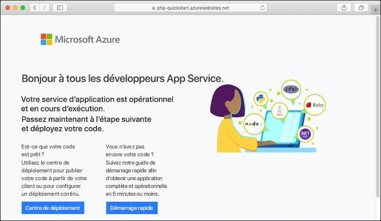
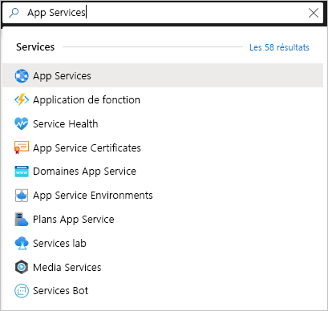

# <a name="create-a-php-web-app-in-azure"></a>Créer une application web PHP dans Azure

> [!NOTE]
> Cet article explique comment déployer une application sur App Service sous Windows. Pour déployer une application App Service sur _Linux_, consultez [Créer et déployer une application web PHP sur App Service sur Linux](./containers/quickstart-php.md).
>

[Azure App Service](overview.md) offre un service d’hébergement web hautement évolutif appliquant des mises à jour correctives automatiques.  Ce guide de démarrage rapide montre comment déployer une application PHP sur Azure App Service. Vous créez l’application web dans Cloud Shell grâce à l’interface [Azure CLI](https://docs.microsoft.com/cli/azure/get-started-with-azure-cli), et vous utilisez Git pour déployer l’exemple de code PHP dans l’application web.


Vous pouvez suivre ces étapes en utilisant un ordinateur Mac, Windows ou Linux. Une fois les composants requis installés, l’exécution de cette procédure prend environ cinq minutes.

[!INCLUDE [quickstarts-free-trial-note](../../includes/quickstarts-free-trial-note.md)]

## <a name="prerequisites"></a>Prérequis

Pour suivre ce guide de démarrage rapide :

* <a href="https://git-scm.com/" target="_blank">Installez Git</a>
* <a href="https://php.net/manual/install.php" target="_blank">Installez PHP</a>

## <a name="download-the-sample-locally"></a>Téléchargez l’exemple localement

Exécutez les commandes suivantes dans une fenêtre de terminal. Cette action va cloner l’exemple d’application sur votre ordinateur local et vous faire accéder au répertoire contenant l’exemple de code. 

```bash
git clone https://github.com/Azure-Samples/php-docs-hello-world
cd php-docs-hello-world
```

## <a name="run-the-app-locally"></a>Exécutez l’application localement.

Exécutez l’application localement pour voir à quoi elle devrait ressembler lorsque vous la déploierez sur Azure. Ouvrez une fenêtre de terminal et utilisez la commande `php` pour lancer le serveur web PHP intégré.

```bash
php -S localhost:8080
```

Ouvrez un navigateur web et accédez à l’application exemple à l’adresse `http://localhost:8080`.

Vous voyez apparaître sur la page le message **Hello World !** de l’exemple d’application.


Dans la fenêtre de terminal, appuyez sur **Ctrl + C** pour quitter le serveur web.

[!INCLUDE [cloud-shell-try-it.md](../../includes/cloud-shell-try-it.md)]

[!INCLUDE [Configure deployment user](../../includes/configure-deployment-user.md)]

[!INCLUDE [Create resource group](../../includes/app-service-web-create-resource-group.md)]

[!INCLUDE [Create app service plan](../../includes/app-service-web-create-app-service-plan.md)]

## <a name="create-a-web-app"></a>Créer une application web

Dans Cloud Shell, créez une application web dans le plan App Service `myAppServicePlan` avec la commande [`az webapp create`](/cli/azure/webapp?view=azure-cli-latest#az-webapp-create). 

Dans l’exemple suivant, remplacez `<app_name>` par un nom d’application unique (les caractères autorisés sont `a-z`, `0-9` et `-`). Le runtime est défini sur `PHP|7.0`. Pour voir tous les runtimes, exécutez [`az webapp list-runtimes`](/cli/azure/webapp?view=azure-cli-latest#az-webapp-list-runtimes). 

```azurecli-interactive
# Bash
az webapp create --resource-group myResourceGroup --plan myAppServicePlan --name <app_name> --runtime "PHP|7.0" --deployment-local-git
# PowerShell
az --% webapp create --resource-group myResourceGroup --plan myAppServicePlan --name <app_name> --runtime "PHP|7.0" --deployment-local-git
```

Une fois l’application web créée, Azure CLI affiche une sortie similaire à l’exemple suivant :

```json
Local git is configured with url of 'https://<username>@<app_name>.scm.azurewebsites.net/<app_name>.git'
{
  "availabilityState": "Normal",
  "clientAffinityEnabled": true,
  "clientCertEnabled": false,
  "cloningInfo": null,
  "containerSize": 0,
  "dailyMemoryTimeQuota": 0,
  "defaultHostName": "<app_name>.azurewebsites.net",
  "enabled": true,
  < JSON data removed for brevity. >
}
```
Vous avez créé une application web vide, avec le déploiement Git activé.

> [!NOTE]
> L’URL du Git distant est indiquée dans la propriété `deploymentLocalGitUrl`, avec le format `https://<username>@<app_name>.scm.azurewebsites.net/<app_name>.git`. Enregistrez cette URL, car vous en aurez besoin ultérieurement.
>

Accédez à votre nouvelle application web. Remplacez _&lt;nom de l’application >_ par le nom d’application unique créé à l’étape précédente.

```bash
http://<app name>.azurewebsites.net
```

Voici à quoi doit ressembler votre nouvelle application web :



[!INCLUDE [Push to Azure](../../includes/app-service-web-git-push-to-azure.md)] 

```bash
Counting objects: 2, done.
Delta compression using up to 4 threads.
Compressing objects: 100% (2/2), done.
Writing objects: 100% (2/2), 352 bytes | 0 bytes/s, done.
Total 2 (delta 1), reused 0 (delta 0)
remote: Updating branch 'master'.
remote: Updating submodules.
remote: Preparing deployment for commit id '25f18051e9'.
remote: Generating deployment script.
remote: Running deployment command...
remote: Handling Basic Web Site deployment.
remote: Kudu sync from: '/home/site/repository' to: '/home/site/wwwroot'
remote: Copying file: '.gitignore'
remote: Copying file: 'LICENSE'
remote: Copying file: 'README.md'
remote: Copying file: 'index.php'
remote: Ignoring: .git
remote: Finished successfully.
remote: Running post deployment command(s)...
remote: Deployment successful.
To https://<app_name>.scm.azurewebsites.net/<app_name>.git
   cc39b1e..25f1805  master -> master
```

## <a name="browse-to-the-app"></a>Accéder à l’application

Accédez à l’application déployée à l’aide de votre navigateur web.

```
http://<app_name>.azurewebsites.net
```

L’exemple de code PHP s’exécute dans une application web Azure App Service.


**Félicitations !** Vous avez déployé votre première application en PHP dans App Service.

## <a name="update-locally-and-redeploy-the-code"></a>Mettre à jour localement et redéployer le code

À l’aide d’un éditeur de texte local, ouvrez le fichier `index.php` dans l’application PHP et modifiez une petite partie du texte contenu dans la chaîne en regard de l’élément `echo` :

```php
echo "Hello Azure!";
```

Dans la fenêtre du terminal local, validez vos modifications dans Git, puis envoyez les modifications de code à Azure.

```bash
git commit -am "updated output"
git push azure master
```

Une fois le déploiement terminé, revenez à la fenêtre du navigateur que vous avez ouverte à l’étape **Accéder à l’application**, puis actualisez la page.


## <a name="manage-your-new-azure-app"></a>Gérer votre nouvelle application Azure

1. Accédez au <a href="https://portal.azure.com" target="_blank">Portail Azure</a> pour gérer l’application web que vous avez créée. Recherchez et sélectionnez **App Services**.

    

2. Sélectionnez le nom de votre application Azure.

    

    La page **Vue d’ensemble** de votre application web s’affiche. Elle vous permet d’exécuter des tâches de gestion de base telles que **Parcourir**, **Arrêter**, **Redémarrer** et **Supprimer**.

    

    Le menu de l’application web fournit différentes options vous permettant de configurer votre application. 

[!INCLUDE [cli-samples-clean-up](../../includes/cli-samples-clean-up.md)]

## <a name="next-steps"></a>Étapes suivantes

> [!div class="nextstepaction"]
> [PHP avec MySQL](app-service-web-tutorial-php-mysql.md)
