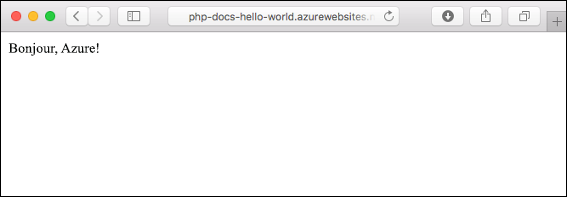
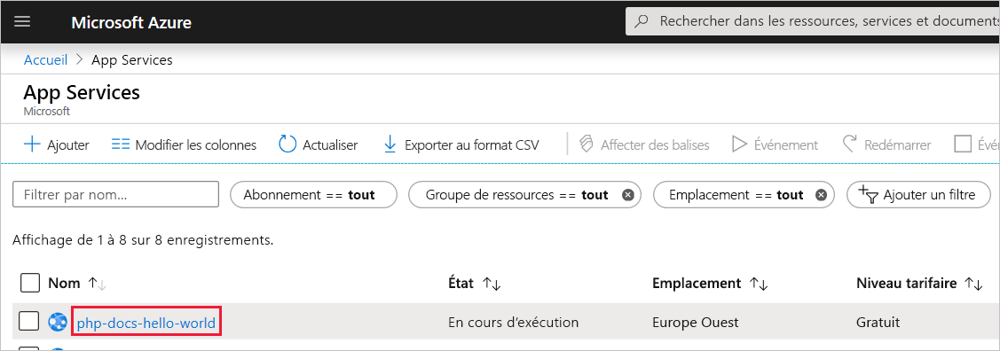
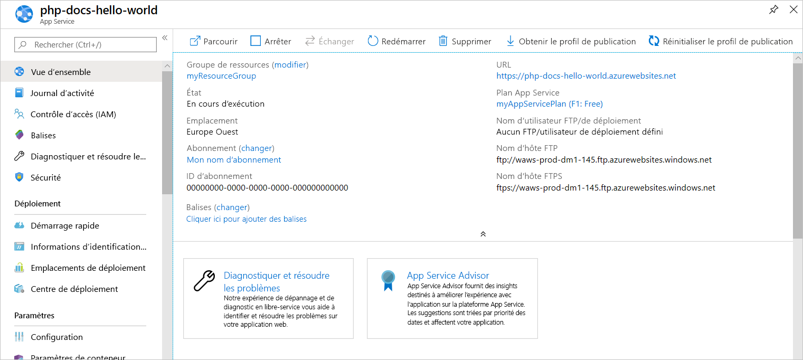

# <a name="create-a-php-web-app-in-azure"></a>Créer une application web PHP dans Azure

[Azure Web Apps](app-service-web-overview.md) offre un service d’hébergement web hautement évolutif appliquant des mises à jour correctives automatiques.  Ce guide de démarrage rapide vous indique comment déployer une application PHP dans Azure Web Apps. Vous créez l’application web dans Cloud Shell grâce à l’interface [Azure CLI](https://docs.microsoft.com/cli/azure/get-started-with-azure-cli), et vous utilisez Git pour déployer l’exemple de code PHP dans l’application web.

![Exemple d’application s’exécutant dans Azure]](media/app-service-web-get-started-php/hello-world-in-browser.png)

Vous pouvez suivre les étapes ci-dessous en utilisant un ordinateur Mac, Windows ou Linux. Une fois les composants requis installés, l’exécution de cette procédure prend environ cinq minutes.

## <a name="prerequisites"></a>Composants requis

Pour effectuer ce démarrage rapide :

* <a href="https://git-scm.com/" target="_blank">Installez Git</a>
* <a href="https://php.net" target="_blank">Installez PHP</a>

[!INCLUDE [quickstarts-free-trial-note](../../includes/quickstarts-free-trial-note.md)]

## <a name="download-the-sample-locally"></a>Téléchargez l’exemple localement

Exécutez les commandes suivantes dans une fenêtre de terminal. Cette action va cloner l’exemple d’application sur votre ordinateur local et vous faire accéder au répertoire contenant l’exemple de code.

```bash
git clone https://github.com/Azure-Samples/php-docs-hello-world
cd php-docs-hello-world
```

## <a name="run-the-app-locally"></a>Exécutez l’application localement.

Exécutez l’application localement en ouvrant une fenêtre de terminal et en utilisant la commande `php` pour lancer le serveur web PHP intégré.

```bash
php -S localhost:8080
```

Ouvrez un navigateur web et accédez à l’application exemple à l’adresse `http://localhost:8080`.

Vous voyez apparaître sur la page le message **Hello World !** de l’exemple d’application.


Dans la fenêtre de terminal, appuyez sur **Ctrl + C** pour quitter le serveur web.

[!INCLUDE [cloud-shell-try-it.md](../../includes/cloud-shell-try-it.md)]

[!INCLUDE [Configure deployment user](../../includes/configure-deployment-user.md)]

[!INCLUDE [Create resource group](../../includes/app-service-web-create-resource-group.md)]

[!INCLUDE [Create app service plan](../../includes/app-service-web-create-app-service-plan.md)]

## <a name="create-a-web-app"></a>Créer une application web

[!INCLUDE [Create web app](../../includes/app-service-web-create-web-app-php-no-h.md)]

Accédez à votre nouvelle application web. Remplacez _&lt;app name>_ par un nom d’application unique.

```bash
http://<app name>.azurewebsites.net
```


[!INCLUDE [Push to Azure](../../includes/app-service-web-git-push-to-azure.md)] 

```bash
Counting objects: 2, done.
Delta compression using up to 4 threads.
Compressing objects: 100% (2/2), done.
Writing objects: 100% (2/2), 352 bytes | 0 bytes/s, done.
Total 2 (delta 1), reused 0 (delta 0)
remote: Updating branch 'master'.
remote: Updating submodules.
remote: Preparing deployment for commit id '25f18051e9'.
remote: Generating deployment script.
remote: Running deployment command...
remote: Handling Basic Web Site deployment.
remote: Kudu sync from: '/home/site/repository' to: '/home/site/wwwroot'
remote: Copying file: '.gitignore'
remote: Copying file: 'LICENSE'
remote: Copying file: 'README.md'
remote: Copying file: 'index.php'
remote: Ignoring: .git
remote: Finished successfully.
remote: Running post deployment command(s)...
remote: Deployment successful.
To https://<app_name>.scm.azurewebsites.net/<app_name>.git
   cc39b1e..25f1805  master -> master
```

## <a name="browse-to-the-app-locally"></a>Accéder à l’application localement

Accédez à l’application déployée à l’aide de votre navigateur web.

```bash
http://<app_name>.azurewebsites.net
```

L’exemple de code PHP s’exécute dans une application web Azure App Service.


**Félicitations !** Vous avez déployé votre première application en PHP dans App Service.

## <a name="update-locally-and-redeploy-the-code"></a>Mettre à jour localement et redéployer le code

À l’aide d’un éditeur de texte local, ouvrez le fichier `index.php` dans l’application PHP et modifiez une petite partie du texte contenu dans la chaîne en regard de l’élément `echo` :

```php
echo "Hello Azure!";
```

Dans la fenêtre du terminal local, validez vos modifications dans Git, puis envoyez les modifications de code à Azure.

```bash
git commit -am "updated output"
git push azure master
```

Une fois le déploiement terminé, revenez à la fenêtre du navigateur que vous avez ouverte à l’étape **Accéder à l’application**, puis actualisez la page.



## <a name="manage-your-new-azure-web-app"></a>Gérer votre nouvelle application web Azure

Accédez au <a href="https://portal.azure.com" target="_blank">Portail Azure</a> pour gérer l’application web que vous avez créée.

Dans le menu de gauche, cliquez sur **App Services**, puis cliquez sur le nom de votre application web Azure.



Vous voyez apparaître la page Vue d’ensemble de votre application web. Ici, vous pouvez également des tâches de gestion de base (parcourir, arrêter, démarrer, redémarrer et supprimer des éléments, par exemple).



Le menu de gauche fournit différentes pages vous permettant de configurer votre application. 

[!INCLUDE [cli-samples-clean-up](../../includes/cli-samples-clean-up.md)]

## <a name="next-steps"></a>Étapes suivantes

> [!div class="nextstepaction"]
> [PHP avec MySQL](app-service-web-tutorial-php-mysql.md)
