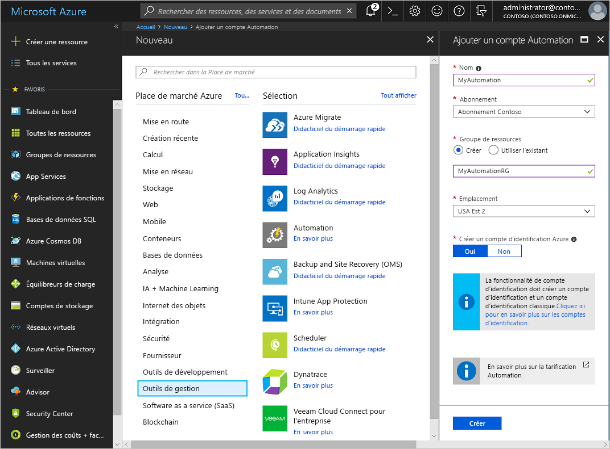
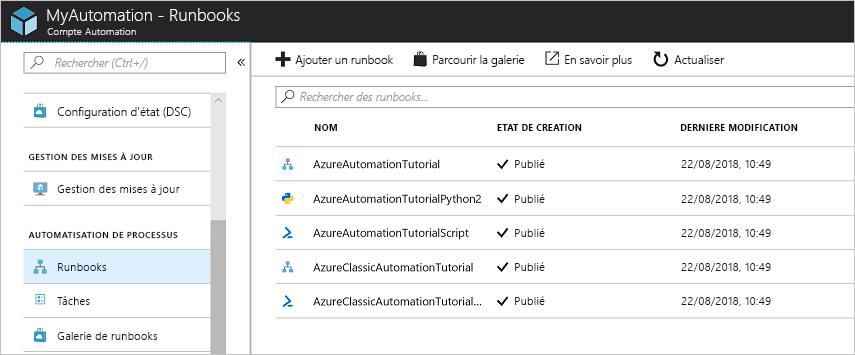
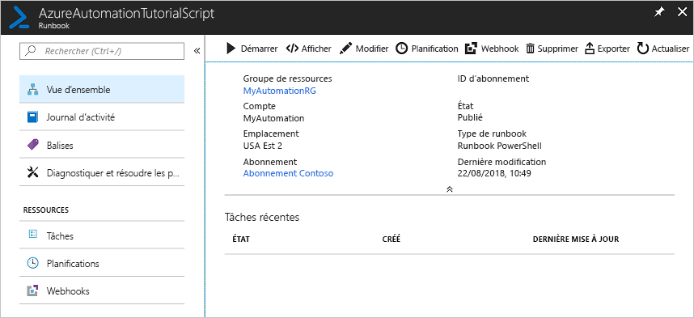

# Créer un compte Azure Automation

Les comptes Azure Automation peuvent être créés via Azure. Cette méthode fournit une interface utilisateur basée sur navigateur pour créer et configurer des comptes Automation et les ressources liées. Ces étapes de démarrage rapide permettent la création d’un compte Automation et l’exécution d’un runbook dans le compte.

Si vous n’avez pas d’abonnement Azure, créez un [compte Azure gratuit](https://azure.microsoft.com/free/?WT.mc_id=A261C142F) avant de commencer.

## Connexion à Azure

Se connecter à Azure à https://portal.azure.com

## Créer un compte Automation

1. Cliquez sur le bouton **Créer une ressource** dans le coin supérieur gauche d’Azure.

1. Sélectionnez **Outils de gestion**, puis sélectionnez **Automation**.

1. Saisissez les informations du compte. Pour **Créer un compte d’identification Azure**, choisissez **Oui** afin que les artefacts simplifiant l’authentification à Azure soient automatiquement activés. Il est important de noter que lorsque vous créez un compte Automation, le nom n’est pas modifiable une fois choisi. Lorsque vous avez terminé, cliquez sur **Créer** pour démarrer le déploiement du compte Automation.

      

1. Une fois le déploiement terminé, cliquez sur ** **Tous les Services**, sélectionnez **Comptes Automation** puis sélectionnez le compte Automation que vous avez créé.

    

## Exécuter un runbook

Exécutez l’un des runbooks de didacticiel.

1. Cliquez sur **Runbooks** sous **AUTOMATISATION DE PROCESSUS**. La liste des runbooks s’affiche. Par défaut, plusieurs runbooks de didacticiel sont activés dans le compte.

    

1. Sélectionnez le runbook **AzureAutomationTutorialScript**. Cette action ouvre la page de vue d’ensemble du runbook.

    

1. Cliquez sur **Démarrer**, puis, dans la page **Démarrer le Runbook**, cliquez sur **OK** pour démarrer le runbook.

    

1. Lorsque **l’état du travail** passe à **En cours d’exécution**, cliquez sur **Sortie** ou **Tous les journaux** pour afficher la sortie du travail de runbook. Pour ce runbook de didacticiel, la sortie est une liste de vos ressources Azure.

## Supprimer les ressources

Lorsque vous n’en avez plus besoin, supprimez le groupe de ressources, le compte Automation et toutes les ressources associées. Pour ce faire, sélectionnez le groupe de ressources pour le compte Automation, puis cliquez sur **Supprimer**.

## Étapes suivantes

Dans ce démarrage rapide, vous avez déployé un compte Automation, démarré un travail de runbook et affiché les résultats du travail. Pour en savoir plus sur Azure Automation, continuez en faisant le démarrage rapide pour créer votre premier runbook.

> [!div class="nextstepaction"]
> [Démarrage rapide de Automation - Créer un runbook](./automation-quickstart-create-runbook.md)
