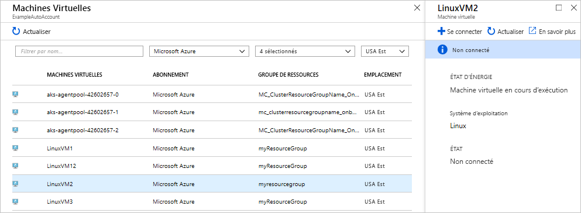
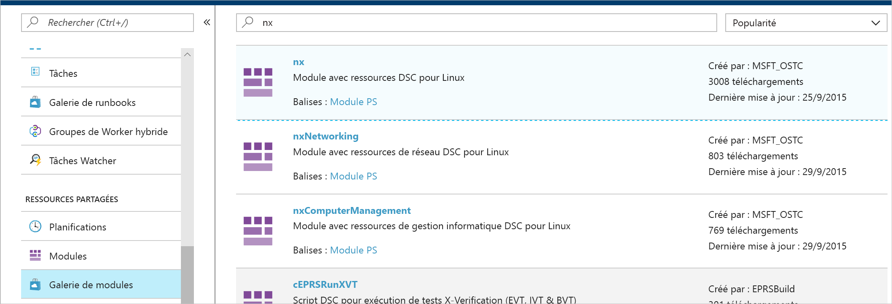
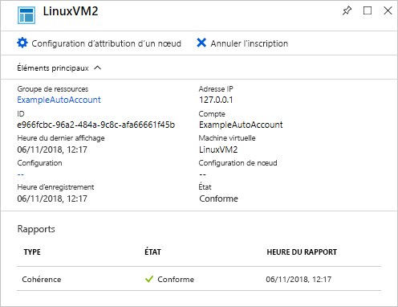

# <a name="configure-a-linux-virtual-machine-with-desired-state-configuration"></a>Configurer une machine virtuelle Linux avec le service de configuration d’état souhaité

En activant le service de configuration d’état souhaité (DSC), vous gérez et surveillez les configurations de vos serveurs Windows et Linux. Les configurations dérivant de la configuration souhaitée peuvent être identifiées ou corrigées automatiquement. Cette procédure de démarrage rapide vous permettra d’intégrer une machine virtuelle Linux et de déployer une pile LAMP avec DSC.

## <a name="prerequisites"></a>Prérequis

Pour effectuer ce démarrage rapide, les éléments suivants sont requis :

* Un abonnement Azure. Si vous n’avez pas d’abonnement Azure, [créez un compte gratuit](https://azure.microsoft.com/free/).
* Un compte Azure Automation. Pour obtenir des instructions sur la création d’un compte d’identification Azure Automation, consultez [Authentifier des Runbooks avec un compte d’identification Azure](automation-sec-configure-azure-runas-account.md).
* Une machine virtuelle Azure Resource Manager (autre que classique) exécutant Red Hat Enterprise Linux, CentOS ou Oracle Linux. Pour obtenir des instructions sur la création d’une machine virtuelle, consultez [Créer votre première machine virtuelle Linux dans le portail Azure](../virtual-machines/linux/quick-create-portal.md).

## <a name="sign-in-to-azure"></a>Connexion à Azure
Se connecter à Azure à https://portal.azure.com

## <a name="onboard-a-virtual-machine"></a>Intégrer une machine virtuelle
Il existe plusieurs méthodes pour intégrer une machine et activer le service de configuration d’état souhaité. Ce démarrage rapide aborde l’intégration via un compte Automation. Pour en savoir plus sur différentes méthodes d’intégration de vos machines au service de configuration d’état souhaité, lisez l’article sur [l’intégration](https://docs.microsoft.com/azure/automation/automation-dsc-onboarding).

1. Dans le volet de gauche du portail Azure, sélectionnez **Comptes Automation**. Si cette option n’est pas visible dans le volet de gauche, cliquez sur **Tous les services**, puis recherchez-la dans la vue correspondante.
1. Dans la liste, sélectionnez un compte Automation.
1. Dans le volet de gauche du compte Automation, sélectionnez **Configuration d’état (DSC)**.
2. Cliquez sur **Ajouter** pour ouvrir la page Sélection de machine virtuelle.
3. Trouvez la machine virtuelle pour laquelle vous souhaitez activer DSC. Vous pouvez utiliser le champ de recherche et les options de filtre pour rechercher une machine virtuelle en particulier.
4. Cliquez sur la machine virtuelle, puis sélectionnez **Connexion**.
5. Sélectionnez les paramètres DSC adaptés à la machine virtuelle. Si vous avez déjà préparé une configuration, vous pouvez la spécifier en tant que *Node Configuration Name* (Nom de configuration du nœud). Vous pouvez définir le [mode de configuration](https://docs.microsoft.com/powershell/dsc/metaconfig) pour contrôler le comportement de la configuration de la machine.
6. Cliquez sur **OK**



Lors du déploiement de l’extension de configuration d’état souhaité à la machine virtuelle, l’option *Connexion* apparaît.

## <a name="import-modules"></a>Modules d’importation

Ces modules contiennent des ressources DSC et nombreux se trouvent dans [PowerShell Gallery](https://www.powershellgallery.com). Toutes les ressources utilisées dans vos configurations doivent être importées dans le compte Automation avant la compilation. Pour ce didacticiel, le module nommé **nx** est requis.

1. Dans le volet de gauche du compte Automation, sélectionnez **Modules Gallery** (Modules Galerie) sous les ressources partagées.
1. Recherchez le module que vous souhaitez importer en saisissant une partie de son nom : *nx*.
1. Cliquez sur le module à importer.
1. Cliquez sur **Importer**.



## <a name="import-the-configuration"></a>Importer la configuration

Ce démarrage rapide utilise une configuration DSC qui configure Apache HTTP Server, MySQL et PHP sur l’ordinateur.

Pour obtenir des informations sur les configurations DSC, consultez [Configurations DSC](https://docs.microsoft.com/powershell/dsc/configurations).

Dans un éditeur de texte, tapez la commande suivante et enregistrez-la localement sous `LAMPServer.ps1`.

```powershell-interactive
configuration LAMPServer {
   Import-DSCResource -module "nx"

   Node localhost {

        $requiredPackages = @("httpd","mod_ssl","php","php-mysql","mariadb","mariadb-server")
        $enabledServices = @("httpd","mariadb")

        #Ensure packages are installed
        ForEach ($package in $requiredPackages){
            nxPackage $Package{
                Ensure = "Present"
                Name = $Package
                PackageManager = "yum"
            }
        }

        #Ensure daemons are enabled
        ForEach ($service in $enabledServices){
            nxService $service{
                Enabled = $true
                Name = $service
                Controller = "SystemD"
                State = "running"
            }
        }
   }
}
```

Pour importer la configuration :

1. Dans le volet de gauche du compte Automation, sélectionnez **Configuration d’état (DSC)** puis cliquez sur l’onglet **Configurations**.
2. Cliquez sur **+ Ajouter**
3. Sélectionnez le *fichier de configuration* que vous avez enregistré à l’étape précédente.
4. Cliquez sur **OK**

## <a name="compile-a-configuration"></a>Compiler une configuration

Les configurations DSC doivent être compilées dans une configuration de nœud (document MOF) avant de pouvoir être affectées à un nœud. La compilation valide la configuration et permet la saisie des valeurs de paramètre. Pour plus d’informations sur la compilation d’une configuration, consultez : [Compilation de configurations dans Azure Automation DSC](https://docs.microsoft.com/azure/automation/automation-dsc-compile)

Pour compiler la configuration :

1. Dans le volet de gauche du compte Automation, sélectionnez **Configuration d’état (DSC)** puis cliquez sur l’onglet **Configurations**.
1. Sélectionnez la configuration que vous avez importée dans une étape précédente (LAMPServer).
1. Parmi les options de menu, cliquez sur **Compiler**, puis sur **Oui**.
1. Dans la vue de la configuration,une nouvelle *tâche de compilation* apparaît en file d’attente. Lorsque cette tâche est terminée, vous êtes prêt à passer à l’étape suivante. En cas de problème, vous pouvez cliquer sur cette tâche de compilation pour plus d’informations.

## <a name="assign-a-node-configuration"></a>Affecter une configuration de nœud

Une *configuration de nœud* compilée peut être affectée aux nœuds DSC. Cette affectation applique la configuration à la machine et surveille (ou corrige automatiquement) tout écart.

1. Dans le volet de gauche du compte Automation, sélectionnez **Configuration d’état (DSC) puis cliquez sur l’onglet **Nœuds**.
1. Sélectionnez le nœud auquel vous souhaitez affecter une configuration.
1. Cliquez sur **Assign Node Configuration** (Affecter une configuration de nœud).
1. Sélectionnez la *configuration de nœud* - **LAMPServer.localhost** à affecter, puis cliquez sur **OK**
1. La configuration compilée est maintenant affectée au nœud, et l’état du nœud indique à présent *En attente*. Au cours de la prochaine vérification périodique, le nœud récupérera la configuration, l’appliquera et signalera à nouveau son état. Jusqu’à 30 minutes sont nécessaires pour que le nœud récupère la configuration, selon ses paramètres. Pour forcer une vérification immédiate, vous pouvez exécuter la commande suivante en local sur la machine virtuelle Linux :`sudo /opt/microsoft/dsc/Scripts/PerformRequiredConfigurationChecks.py`



## <a name="viewing-node-status"></a>Obtenir l’état du nœud

L’état de tous les nœuds gérés se trouve dans la **Configuration d’état (DSC)** et sous l’onglet **Nœuds** dans le compte Automation. Vous pouvez filtrer cette vue par état et configuration de nœud ou recherchez son nom.


## <a name="next-steps"></a>Étapes suivantes

Dans ce démarrage rapide, vous avez intégré une machine virtuelle Linux à DSC, vous avez créé une configuration pour une pile LAMP et vous l’avez déployée sur la machine virtuelle. Pour savoir comment utiliser Automation DSC pour un déploiement continu, lisez l’article suivant :

> [!div class="nextstepaction"]
> [Déploiement continu à une machine virtuelle à l’aide de DSC et Chocolatey](./automation-dsc-cd-chocolatey.md)

* Pour en savoir plus sur le service de configuration d’état souhaité PowerShell, consultez [Vue d’ensemble de la configuration d’état souhaité PowerShell](https://docs.microsoft.com/powershell/dsc/overview).
* Pour en savoir plus sur la gestion d’Automation DSC à partir de PowerShell, consultez [Azure PowerShell](https://docs.microsoft.com/powershell/module/azurerm.automation/?view=azurermps-5.0.0)
* Pour savoir comment transférer des rapports DSC à Log Analytics pour générer des rapports et alertes, consultez [Transférer des rapports DSC à Log Analytics](https://docs.microsoft.com/azure/automation/automation-dsc-diagnostics) 

