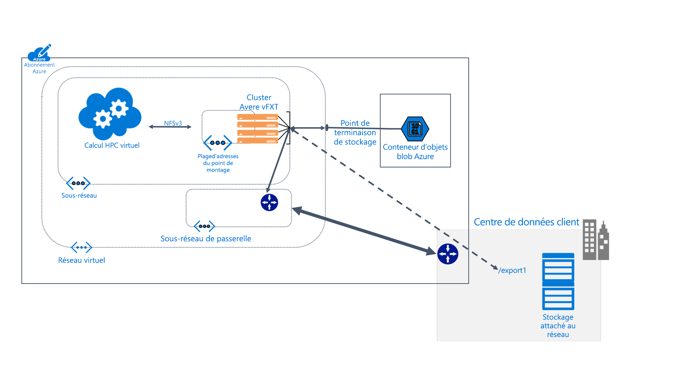

# En quoi consiste Avere vFXT pour Azure ? 

Avere vFXT pour Azure est une solution de mise en cache des systèmes de fichiers pour les tâches de calcul haute performance (HPC) consommant beaucoup de données. Il vous permet de tirer parti de l’extensibilité du cloud computing pour rendre vos données accessibles où et quand c’est nécessaire, même pour les données stockées dans votre propre matériel local.

AVERE vFXT prend en charge ces scénarios de calcul courants : 

* Architecture cloud hybride : Avere vFXT pour Azure peut fonctionner avec un système de stockage matériel, qui offre les avantages du cloud computing sans avoir à déplacer les fichiers. 
* Cloud Bursting : Avere vFXT pour Azure peut vous aider à déplacer vos données vers le cloud pour un projet unique. Il peut aussi effectuer une migration « lift-and-shift » de l’intégralité du flux de travail de manière définitive. 

Avere vFXT pour Azure est plus adapté à ces situations : 

* Opérations de lecture intensive pour les charges de travail HPC
* Applications utilisant le protocole NFS courant
* Calcul des batteries de serveurs contenant entre 1 000 et 40 000 cœurs d’unité centrale
* Intégration au matériel local NAS, au stockage Blob Azure ou aux deux

Pour plus d’informations, consultez <https://azure.microsoft.com/services/storage/avere-vfxt/>

## Qui utilise Avere vFXT pour Azure ? 

AVERE vFXT peut vous aider pour toutes sortes de tâches de calcul nécessitant beaucoup de lecture :

### Rendu des effets visuels 

Pour les médias et le divertissement, le cluster Avere vFXT peut accélérer l’accès aux données pour des projets de rendu prioritaires. Étant donné que vous pouvez ajouter davantage d’espace de cache ainsi que plusieurs nœuds de calcul dans Azure, vous disposez de la flexibilité requise pour gérer efficacement de gros projets. 

### Sciences de la vie 

AVERE vFXT permet aux chercheurs d’exécuter leurs flux de travail d’analyse secondaire dans Azure Compute et d’accéder à des données génomiques, quel que soit leur emplacement.

En recherche pharmaceutique, les clusters Avere vFXT peuvent être utilisés pour accélérer la détection de médicaments, notamment en aidant les chercheurs à prédire les interactions du médicament avec sa cible et à analyser les données de recherche.

### Analyses des services financiers

Un cluster Avere vFXT peut aider à accélérer les calculs d’analyse quantitative, ce qui donne plus d’informations aux entreprises fournissant des services financiers afin de prendre des décisions stratégiques. 

## Fonctionnalités et spécifications

Le système d’Avere vFXT se compose d’au moins trois nœuds Edge Filer virtuels, configurés dans un cluster. Il peut être placé à proximité des machines clients qui monteront le cluster au lieu de monter directement le stockage. 

Le cluster Avere vFXT met en cache les fichiers lorsqu’ils sont demandés. Les requêtes répétées peuvent être fournies par le cache de plus de 80 % du temps.

### Compatibilité 

* Compatible avec les systèmes NAS matériels à partir de NetApp ou Dell EMC Isilon
* Compatible avec les objets blob Azure
* Utilise le protocole NFSv3 ou SMB2

Avere vFXT utilise les ressources Azure suivantes : 

|Composant Azure|   |
|----------|-----------|
|Machines virtuelles|3 E32s_v3 ou plus|
|Stockage SSD Premium|200 Go d’espace de système d’exploitation, et de 1 To à 4 To d’espace de cache par nœud |
|Compte de stockage (facultatif) |v2|
|Stockage back-end de données (facultatif) | Un conteneur d’objets blob LRS vide |

## Étapes suivantes

Voici quelques liens pour commencer à créer votre propre déploiement d’Avere vFXT. 

* [Planification de votre solution](avere-vfxt-deploy-plan.md)
* [Vue d’ensemble du déploiement](avere-vfxt-deploy-overview.md)
* [Créer le vFXT](avere-vfxt-deploy.md)
