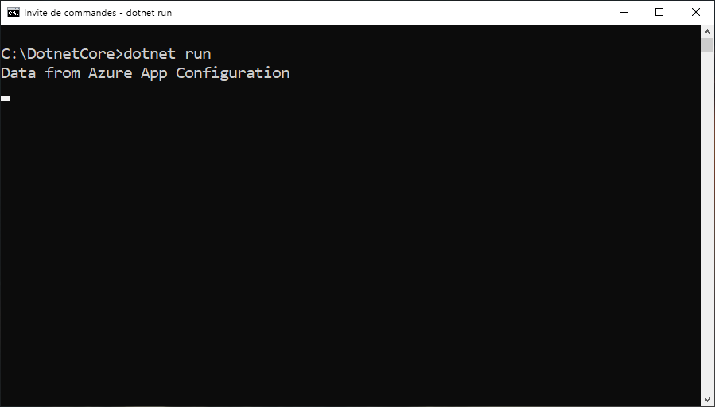

# <a name="quickstart-create-a-net-core-app-with-app-configuration"></a>Démarrage rapide : Créer une application .NET Core avec App Configuration

Azure App Configuration est un service de configuration managée dans Azure. Vous pouvez vous en servir pour stocker et gérer facilement tous les paramètres de votre application dans un seul endroit, indépendamment de votre code. Ce guide de démarrage rapide vous montre comment intégrer le service à une application console .NET Core.

Vous pouvez utiliser l’éditeur de code de votre choix pour exécuter les étapes de ce guide de démarrage rapide. [Visual Studio Code](https://code.visualstudio.com/) est une excellente option disponible sur les plateformes Windows, macOS et Linux.



## <a name="prerequisites"></a>Prérequis

Pour suivre ce guide de démarrage rapide, installez le [kit SDK .NET Core](https://dotnet.microsoft.com/download).

[!INCLUDE [quickstarts-free-trial-note](../../includes/quickstarts-free-trial-note.md)]

## <a name="create-an-app-configuration-store"></a>Créer un magasin de configuration d’application

[!INCLUDE [azure-app-configuration-create](../../includes/azure-app-configuration-create.md)]

6. Sélectionnez **Explorateur de paires clé-valeur** > **+ Créer** pour ajouter les paires clé-valeur suivantes :

    | Clé | Valeur |
    |---|---|
    | TestApp:Settings:Message | Data from Azure App Configuration |

    Laissez **Étiquette** et **Type de contenu** vides pour l’instant.

## <a name="create-a-net-core-console-app"></a>Créer une application console .NET Core

Vous utilisez l’[interface de ligne de commande (CLI) .NET Core](https://docs.microsoft.com/dotnet/core/tools/) pour créer un projet d’application console .NET Core. Par rapport à Visual Studio, l’interface CLI .NET Core offre l’avantage d’être disponible sur les plateformes Windows, macOS et Linux.

1. Créez un nouveau dossier pour votre projet.

2. Dans le nouveau dossier, exécutez la commande suivante pour créer un projet d’application web MVC ASP.NET Core :

        dotnet new console

## <a name="connect-to-an-app-configuration-store"></a>Se connecter à un magasin de configuration d’application

1. Ajoutez une référence au package NuGet `Microsoft.Extensions.Configuration.AzureAppConfiguration` en exécutant la commande suivante :

        dotnet add package Microsoft.Extensions.Configuration.AzureAppConfiguration --version 1.0.0-preview-007830001

2. Exécutez la commande suivante pour restaurer les packages de votre projet :

        dotnet restore

3. Ouvrez *Program.cs* et ajoutez une référence à un fournisseur de configuration .NET Core App Configuration.

    ```csharp
    using Microsoft.Extensions.Configuration;
    using Microsoft.Extensions.Configuration.AzureAppConfiguration;
    ```

4. Mettez à jour la méthode `Main` pour utiliser App Configuration en appelant la méthode `builder.AddAzureAppConfiguration()`.

    ```csharp
    static void Main(string[] args)
    {
        var builder = new ConfigurationBuilder();
        builder.AddAzureAppConfiguration(Environment.GetEnvironmentVariable("ConnectionString"));

        var config = builder.Build();
        Console.WriteLine(config["TestApp:Settings:Message"] ?? "Hello world!");
    }
    ```

## <a name="build-and-run-the-app-locally"></a>Générer et exécuter l’application localement

1. Définissez une variable d’environnement nommée **ConnectionString** et affectez-lui la valeur de la clé d’accès à votre magasin de configuration d’application. Si vous utilisez l’invite de commandes Windows, exécutez la commande suivante et redémarrez l’invite pour que la modification soit prise en compte :

        setx ConnectionString "connection-string-of-your-app-configuration-store"

    Si vous utilisez Windows PowerShell, exécutez la commande suivante :

        $Env:ConnectionString = "connection-string-of-your-app-configuration-store"

    Si vous utilisez macOS ou Linux, exécutez la commande suivante :

        export ConnectionString='connection-string-of-your-app-configuration-store'

2. Exécutez la commande suivante pour générer l’application console :

        dotnet build

3. La génération terminée correctement, lancez la commande suivante pour exécuter l’application localement :

        dotnet run

## <a name="clean-up-resources"></a>Supprimer des ressources

[!INCLUDE [azure-app-configuration-cleanup](../../includes/azure-app-configuration-cleanup.md)]

## <a name="next-steps"></a>Étapes suivantes

En suivant ce guide de démarrage rapide, vous avez créé un magasin de configuration d’application et l’avez utilisé avec une application console .NET Core par l’intermédiaire du [fournisseur d’App Configuration](https://go.microsoft.com/fwlink/?linkid=2074664). Pour en savoir plus sur la façon d’utiliser App Configuration, passez au tutoriel suivant et découvrez l’authentification.

> [!div class="nextstepaction"]
> [Intégration des identités managées](./howto-integrate-azure-managed-service-identity.md)
