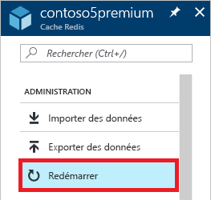
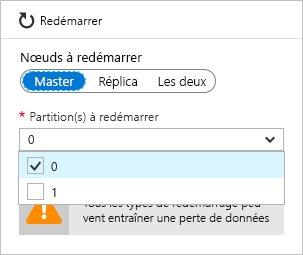

# Guide pratique pour administrer le Cache Azure pour Redis
Cette rubrique explique comment effectuer des tâches d’administration comme le [redémarrage](#reboot) et la [planification des mises à jour](#schedule-updates) de vos instances du Cache Azure pour Redis.

[!INCLUDE [updated-for-az](../../includes/updated-for-az.md)]

## Reboot
Le panneau **Redémarrer** vous permet de redémarrer un ou plusieurs nœuds de votre cache. Cette fonctionnalité de redémarrage vous permet de tester votre application pour garantir la résilience en cas de panne d’un nœud de cache.

Sélectionnez les nœuds à redémarrer, puis cliquez sur **Redémarrage**.

Si vous avez un cache premium avec activation du clustering, vous pouvez sélectionner les partitions du cache à redémarrer.

Pour redémarrer un ou plusieurs nœuds de votre cache, sélectionnez les nœuds souhaités, puis cliquez sur **Reboot**. Si vous avez un cache Premium avec activation du clustering, sélectionnez les partitions à redémarrer, puis cliquez sur **Redémarrer**. Après quelques minutes, les nœuds sélectionnés sont redémarrés et sont de nouveau en ligne.

L’impact sur les applications clientes varie selon les nœuds que vous redémarrez.

* **Master** – lorsque le nœud master est redémarré, le Cache Azure pour Redis bascule sur le nœud de réplica et le promeut au niveau master. Pendant ce basculement, il peut y avoir un court intervalle pendant lequel les connexions au cache peuvent échouer.
* **Subordonné** - lorsque le nœud subordonné est redémarré, il n’y a généralement aucun impact sur les clients du cache.
* **Master et Subordonné** - lorsque les nœuds du cache sont redémarrés, toutes les données sont perdues dans le cache et les connexions au cache échouent jusqu’à ce que le nœud principal soit de nouveau en ligne. Si vous avez configuré la [persistance des données](cache-how-to-premium-persistence.md), la sauvegarde la plus récente est restaurée au moment où le cache est de nouveau en ligne. Toutefois, toute écriture de cache intervenue après cette sauvegarde est perdue.
* **Nœuds d’un cache Premium avec activation du clustering** : lorsque vous redémarrez le ou les nœuds d’un cache Premium et que le clustering est activé, le comportement des nœuds sélectionnés est le même que lorsque vous redémarrez un ou plusieurs nœuds correspondants d’un cache non cluster.

> [!IMPORTANT]
> Le redémarrage est désormais disponible pour tous les niveaux de tarification.
> 
> 

## Forum aux questions sur le redémarrage
* [Quel nœud dois-je redémarrer pour tester mon application ?](#which-node-should-i-reboot-to-test-my-application)
* [Est-il possible de redémarrer le cache pour effacer les connexions client ?](#can-i-reboot-the-cache-to-clear-client-connections)
* [Vais-je perdre les données dans mon cache si je redémarre ?](#will-i-lose-data-from-my-cache-if-i-do-a-reboot)
* [Est-il possible de redémarrer mon cache à l’aide de PowerShell, de l’interface de ligne de commande ou d’autres outils de gestion ?](#can-i-reboot-my-cache-using-powershell-cli-or-other-management-tools)
* [Quels niveaux tarifaires peuvent utiliser la fonctionnalité de redémarrage ?](#what-pricing-tiers-can-use-the-reboot-functionality)

### Quel nœud dois-je redémarrer pour tester mon application ?
Pour tester la résilience de votre application en cas de défaillance du nœud principal de votre cache, redémarrez le nœud **Master** . Pour tester la résilience de votre application en cas de défaillance du nœud secondaire de votre cache, redémarrez le nœud **Subordonné** . Pour tester la résilience de votre application en cas de défaillance totale de votre cache, redémarrez les **deux** nœuds.

### Est-il possible de redémarrer le cache pour effacer les connexions client ?
Oui, toutes les connexions client sont effacées si vous réinitialisez le cache. Le redémarrage est utile lorsque toutes les connexions client sont utilisées, par exemple en raison d’une erreur logique ou d’un bogue dans l’application cliente. Chaque niveau tarifaire a différentes [limites de connexion client](cache-configure.md#default-redis-server-configuration) pour les différentes tailles. Une fois ces limites sont atteintes, aucune autre connexion client supplémentaire n’est acceptée. Redémarrer le cache permet d’effacer toutes les connexions client.

> [!IMPORTANT]
> Si vous réinitialisez votre cache pour effacer les connexions client, StackExchange.Redis se reconnecte automatiquement une fois le nœud Redis en ligne. Si le problème sous-jacent n’est pas résolu, les connexions client peuvent continuer à être utilisées.
> 
> 

### Vais-je perdre les données dans mon cache si je redémarre ?
Si vous redémarrez à la fois les nœuds **Maître** et **Subordonné**, toutes les données du cache (ou dans cette partition, si vous utilisez un cache Premium avec activation du clustering) peuvent être perdues, mais ceci n’est pas garanti non plus. Si vous avez configuré la [persistance des données](cache-how-to-premium-persistence.md), la sauvegarde la plus récente est restaurée au moment où le cache est de nouveau en ligne. Toutefois, toute écriture de cache intervenue après cette sauvegarde est perdue.

Si vous redémarrez simplement l’un des nœuds, les données ne sont généralement pas perdues, mais elles peuvent toujours l’être. Par exemple, si le nœud principal est redémarré et qu’une opération d’écriture dans le cache est en cours, les données écrites dans le cache sont perdues. Vous êtes également susceptible de perdre des données lorsque vous redémarrez un nœud et que l’autre nœud se met hors service en même temps en raison d’une défaillance. Pour plus d’informations sur les causes possibles d’une perte de données, voir [Qu’est-il arrivé à mes données dans Redis ?](https://gist.github.com/JonCole/b6354d92a2d51c141490f10142884ea4#file-whathappenedtomydatainredis-md)

### Est-il possible de redémarrer mon cache à l’aide de PowerShell, de l’interface de ligne de commande ou d’autres outils de gestion ?
Oui. Pour connaître les instructions PowerShell, voir [Redémarrer un Cache Azure pour Redis](cache-howto-manage-redis-cache-powershell.md#to-reboot-an-azure-cache-for-redis).

### Quels niveaux tarifaires peuvent utiliser la fonctionnalité de redémarrage ?
Le redémarrage est disponible pour tous les niveaux de tarification.

## Planifier les mises à jour
Le panneau **Planification de mises à jour** vous permet de désigner une fenêtre de maintenance pour votre cache de niveau Premium. Lorsque la fenêtre de maintenance est spécifiée, toute mise à jour du serveur Redis est effectuée pendant cet intervalle. 

> [!NOTE] 
> Notez que la fenêtre de maintenance s’applique uniquement aux mises à jour du serveur Redis et non à toutes les mises à jour d’Azure ou celles du système d’exploitation des machines virtuelles qui hébergent le cache.
> 
> 

Pour spécifier une fenêtre de maintenance, vérifiez les jours choisis et spécifiez l’heure de début de la fenêtre de maintenance pour chaque jour, puis cliquez sur **OK**. Notez que l’heure de la maintenance est au format UTC. 

La fenêtre de maintenance minimale et par défaut pour les mises à jour est de cinq heures. Cette valeur n’est pas configurable à partir du portail Azure, mais vous pouvez la configure dans PowerShell à l’aide du paramètre `MaintenanceWindow` de la cmdlet [New-AzRedisCacheScheduleEntry](/powershell/module/az.rediscache/new-azrediscachescheduleentry) . Pour plus d'informations, consultez Puis-je gérer les mises à jour planifiées à l'aide de PowerShell, de l'interface CLI ou de tout autre outil de gestion ?

## Forum aux questions de la planification des mises à jour
* [Quand les mises à jour sont-elles effectuées si je n’utilise pas la fonctionnalité de planification des mises à jour ?](#when-do-updates-occur-if-i-dont-use-the-schedule-updates-feature)
* [Quels types de mises à jour sont exécutés au cours de la fenêtre de maintenance planifiée ?](#what-type-of-updates-are-made-during-the-scheduled-maintenance-window)
* [Puis-je gérer les mises à jour planifiées à l’aide de PowerShell, de l’interface de ligne de commande ou de tout autre outil de gestion ?](#can-i-managed-scheduled-updates-using-powershell-cli-or-other-management-tools)
* [Quels niveaux tarifaires peuvent utiliser la fonctionnalité de planification des mises à jour ?](#what-pricing-tiers-can-use-the-schedule-updates-functionality)

### Quand les mises à jour sont-elles effectuées si je n’utilise pas la fonctionnalité de planification des mises à jour ?
Si vous ne spécifiez pas une fenêtre de maintenance, les mises à jour peuvent être effectuées à tout moment.

### Quels types de mises à jour sont exécutés au cours de la fenêtre de maintenance planifiée ?
Seules les mises à jour du serveur Redis sont exécutées au cours de la fenêtre de maintenance planifiée. La fenêtre de maintenance ne s’applique pas aux mises à jour d’Azure ou du système d’exploitation de la machine virtuelle.

### Puis-je gérer les mises à jour planifiées à l’aide de PowerShell, de l’interface de ligne de commande ou de tout autre outil de gestion ?
Oui. Vous pouvez gérer vos mises à jour planifiées à l’aide des cmdlets de commande PowerShell suivantes :

* [Get-AzRedisCachePatchSchedule](/powershell/module/az.rediscache/get-azrediscachepatchschedule)
* [New-AzRedisCachePatchSchedule](/powershell/module/az.rediscache/new-azrediscachepatchschedule)
* [New-AzRedisCacheScheduleEntry](/powershell/module/az.rediscache/new-azrediscachescheduleentry)
* [Remove-AzRedisCachePatchSchedule](/powershell/module/az.rediscache/remove-azrediscachepatchschedule)

### Quels niveaux tarifaires peuvent utiliser la fonctionnalité de planification des mises à jour ?
La fonction **Planifier les mises à jour** n’est disponible que dans le niveau tarifaire Premium.

## Étapes suivantes
* Découvrez les autres fonctionnalités du [niveau Premium du Cache Azure pour Redis](cache-premium-tier-intro.md).

