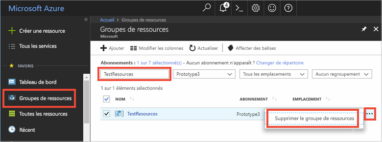

# <a name="quickstart-use-azure-cache-for-redis-with-python"></a>Démarrage rapide : Utiliser le cache Azure pour Redis avec Python


## <a name="introduction"></a>Introduction

Ce guide de démarrage rapide montre comment se connecter à un cache Azure pour Redis avec Python pour lire et écrire dans un cache. 


[!INCLUDE [quickstarts-free-trial-note](../../includes/quickstarts-free-trial-note.md)]

## <a name="prerequisites"></a>Prérequis

* [Environnement Python 2 ou Python 3 ](https://www.python.org/downloads/) installé avec [pip](https://pypi.org/project/pip/). 

## <a name="create-an-azure-cache-for-redis-on-azure"></a>Créer un cache Azure pour Redis sur Azure
[!INCLUDE [redis-cache-create](../../includes/redis-cache-create.md)]

[!INCLUDE [redis-cache-create](../../includes/redis-cache-access-keys.md)]

## <a name="install-redis-py"></a>Installe redis-py

[Redis-py](https://github.com/andymccurdy/redis-py) est une interface Python avec le cache Azure pour Redis. Utilisez l’outil de packages de Python, *pip*, pour installer le package redis-py. 

L'exemple suivant utilise *pip3* pour Python 3 pour installer le package redis-py sous Windows 10 à l'aide d'une invite de commandes Visual Studio 2019 Developer exécutée avec des privilèges d'administrateur élevés.

```python
    pip3 install redis
```


## <a name="read-and-write-to-the-cache"></a>Lire et écrire dans le cache

Exécutez Python et testez en utilisant le cache à partir de la ligne de commande. Remplacez `<Your Host Name>` et `<Your Access Key>` par les valeurs de votre cache Azure pour Redis. 

```python
>>> import redis
>>> r = redis.StrictRedis(host='<Your Host Name>.redis.cache.windows.net',
        port=6380, db=0, password='<Your Access Key>', ssl=True)
>>> r.set('foo', 'bar')
True
>>> r.get('foo')
b'bar'
```

> [!IMPORTANT]
> Avec Redis 3.0 ou version ultérieure, la vérification des certificats SSL s’applique. ssl_ca_certs doit être explicitement défini lors de la connexion à Redis. Dans le cas de Linux RH, ssl_ca_certs se trouve dans le module de certificat « /etc/pki/tls/certs/ca-bundle.crt ».

## <a name="create-a-python-script"></a>Créer un script Python

Créez un fichier texte de script nommé *PythonApplication1.py*.

Ajoutez le script suivant à *PythonApplication1.py* et enregistrez le fichier. Ce script teste l’accès au cache. Remplacez `<Your Host Name>` et `<Your Access Key>` par les valeurs de votre cache Azure pour Redis. 

```python
import redis

myHostname = "<Your Host Name>.redis.cache.windows.net"
myPassword = "<Your Access Key>"

r = redis.StrictRedis(host=myHostname, port=6380,
                      password=myPassword, ssl=True)

result = r.ping()
print("Ping returned : " + str(result))

result = r.set("Message", "Hello!, The cache is working with Python!")
print("SET Message returned : " + str(result))

result = r.get("Message")
print("GET Message returned : " + result.decode("utf-8"))

result = r.client_list()
print("CLIENT LIST returned : ")
for c in result:
    print("id : " + c['id'] + ", addr : " + c['addr'])
```

Exécutez le script avec Python.


## <a name="clean-up-resources"></a>Supprimer des ressources

Si vous envisagez de passer au tutoriel suivant, vous pouvez conserver les ressources créées dans le cadre de ce guide de démarrage rapide et les réutiliser.

Sinon, si l’exemple d’application de démarrage rapide était votre dernière opération, vous pouvez supprimer les ressources Azure créées dans ce démarrage rapide afin d’éviter tout frais. 

> [!IMPORTANT]
> La suppression d’un groupe de ressources est définitive ; le groupe de ressources et l’ensemble des ressources qu’il contient sont supprimés de manière permanente. Veillez à ne pas supprimer accidentellement des ressources ou un groupe de ressources incorrects. Si vous avez créé les ressources pour l’hébergement de cet exemple dans un groupe de ressources existant contenant des ressources que vous souhaitez conserver, vous pouvez supprimer chaque ressource individuellement à partir de son panneau respectif, au lieu de supprimer l’intégralité du groupe de ressources.
>

Connectez-vous au [Portail Azure](https://portal.azure.com) et cliquez sur **Groupes de ressources**.

Dans la zone de texte **Filtrer par nom.** , saisissez le nom de votre groupe de ressources. Les instructions de cet article ont utilisé un groupe de ressources nommé *TestResources*. Sur votre groupe de ressources dans la liste des résultats, cliquez sur **...** , puis sur **Supprimer le groupe de ressources**.



Il vous sera demandé de confirmer la suppression du groupe de ressources. Saisissez le nom de votre groupe de ressources pour confirmer, puis cliquez sur **Supprimer**.

Après quelques instants, le groupe de ressources et toutes les ressources qu’il contient sont supprimés.


## <a name="next-steps"></a>Étapes suivantes

> [!div class="nextstepaction"]
> [Créer une application web ASP.NET simple qui utilise un cache Azure pour Redis.](./cache-web-app-howto.md)


<!--Image references-->
[1]: ./media/cache-python-get-started/redis-cache-new-cache-menu.png
[2]: ./media/cache-python-get-started/redis-cache-cache-create.png
