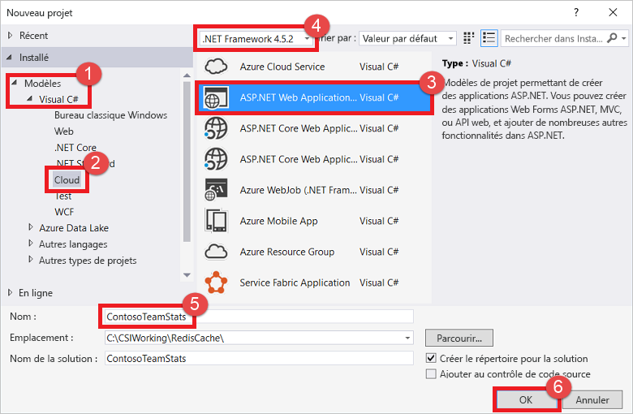
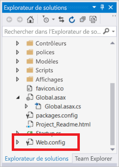
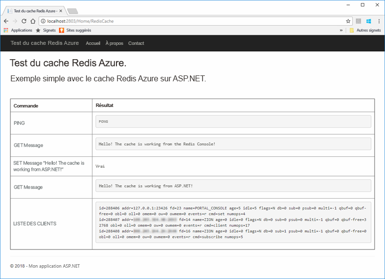
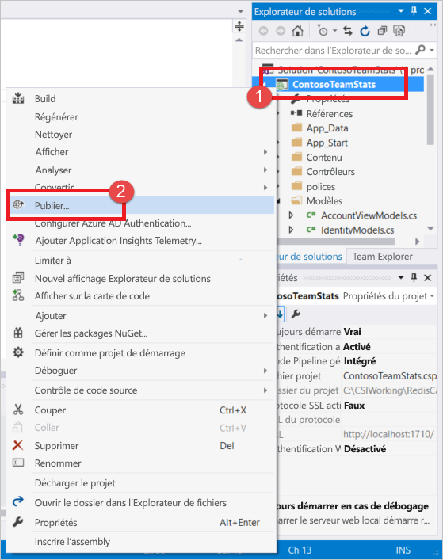
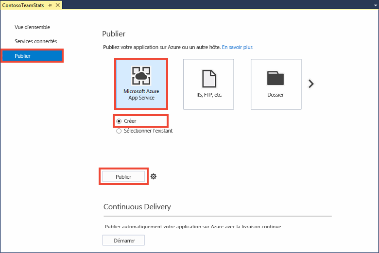
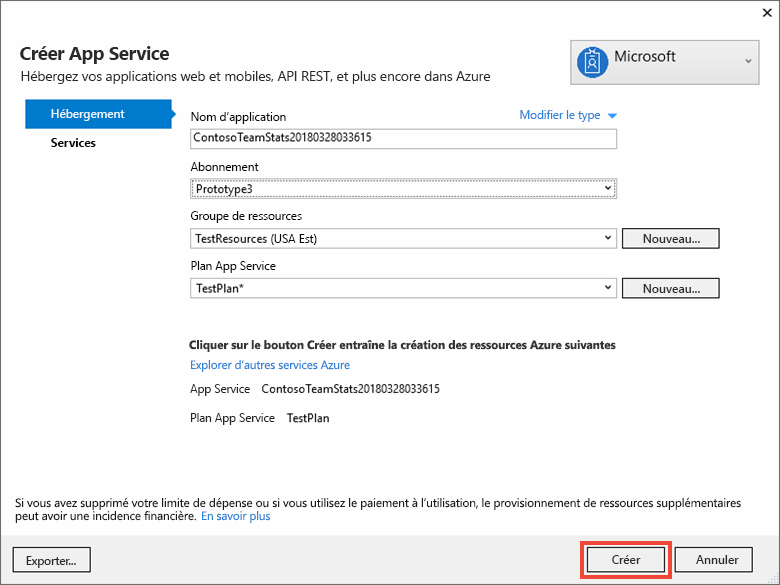
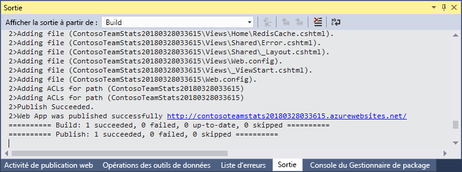
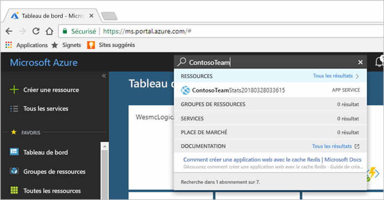
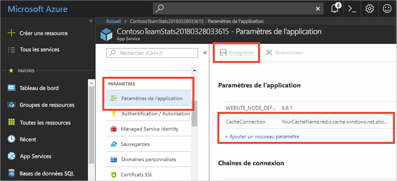

# <a name="quickstart-create-an-aspnet-web-app"></a>Démarrage rapide : Créez une application web ASP.NET 

## <a name="introduction"></a>Introduction

Ce démarrage rapide explique comment créer et déployer une application web ASP.NET sur Azure App Service à l’aide de Visual Studio 2017. L’exemple d’application se connecte au cache Azure pour Redis pour stocker des données et les récupérer à partir du cache. À la fin de ce guide de démarrage rapide, vous disposerez d’une application web hébergée dans Azure qui effectue des opérations de lecture et d’écriture dans le cache Azure pour Redis.


[!INCLUDE [quickstarts-free-trial-note](../../includes/quickstarts-free-trial-note.md)]

## <a name="prerequisites"></a>Prérequis

Pour effectuer ce démarrage rapide, vous devez installer [Visual Studio 2017](https://www.visualstudio.com/downloads/) avec les environnements suivants :
* Développement web et ASP.NET
* Développement Azure

## <a name="create-the-visual-studio-project"></a>Créer le projet Visual Studio

1. Ouvrez Visual Studio et sélectionnez **Fichier** >**Nouveau** > **Projet**.

2. Dans la boîte de dialogue **Nouveau projet**, procédez comme suit :

    

    a. Dans la liste **Modèles**, développez le nœud **Visual C#**.

    b. Sélectionnez **Cloud**.

    c. Sélectionnez **Application web ASP.NET**.

    d. Vérifiez que **.NET Framework 4.5.2** ou version supérieure est sélectionné.

    e. Dans le champ **Nom**, attribuez un nom au projet. Pour cet exemple, nous avons utilisé **ContosoTeamStats**.

    f. Sélectionnez **OK**.
   
3. Sélectionnez le type de projet **MVC** .

4. Vérifiez que la valeur **Aucune authentification** est spécifiée dans les paramètres **Authentification**. Selon votre version de Visual Studio, le paramètre **Authentification** par défaut peut être différent. Pour le modifier, sélectionnez **Modifier l’authentification**, puis **Aucune authentification**.

5. Cliquez sur **OK** pour créer le projet.

## <a name="create-a-cache"></a>Création d'un cache

Vous devez maintenant créer le cache pour l’application.

[!INCLUDE [redis-cache-create](../../includes/redis-cache-create.md)]

[!INCLUDE [redis-cache-access-keys](../../includes/redis-cache-access-keys.md)]

#### <a name="to-edit-the-cachesecretsconfig-file"></a>Pour modifier le fichier *CacheSecrets.config*

3. Créez un fichier sur votre ordinateur nommé *CacheSecrets.config*. Placez-le dans un emplacement où il ne sera pas archivé avec le code source de votre exemple d’application. Pour ce démarrage rapide, le fichier *CacheSecrets.config* se trouve à l’emplacement suivant : *C:\AppSecrets\CacheSecrets.config*.

4. Modifiez le fichier *CacheSecrets.config*. Ajoutez ensuite le contenu suivant :

    ```xml
    <appSettings>
        <add key="CacheConnection" value="<cache-name>.redis.cache.windows.net,abortConnect=false,ssl=true,password=<access-key>"/>
    </appSettings>
    ```

5. Remplacez `<cache-name>` par le nom d’hôte de votre cache.

6. Remplacez `<access-key>` par la clé primaire de votre cache.

    > [!TIP]
    > Vous pouvez utiliser la clé d’accès secondaire en tant que clé de remplacement lors de la rotation des clés pendant que vous régénérez la clé d’accès primaire.
>
7. Enregistrez le fichier .

## <a name="update-the-mvc-application"></a>Mettre à jour l’application MVC

Dans cette section, vous allez mettre à jour l’application pour prendre en charge un nouvel affichage qui présente un test simple avec le cache Azure pour Redis.

* [Mettre à jour le fichier web.config avec un paramètre d’application pour le cache](#Update-the-webconfig-file-with-an-app-setting-for-the-cache)
* [Configurer l’application pour utiliser le client StackExchange.Redis](#configure-the-application-to-use-stackexchangeredis)
* [Mettre à jour les fichiers HomeController et Layout](#update-the-homecontroller-and-layout)
* [Ajouter une nouvelle vue RedisCache](#add-a-new-rediscache-view)

### <a name="update-the-webconfig-file-with-an-app-setting-for-the-cache"></a>Mettre à jour le fichier web.config avec un paramètre d’application pour le cache

Quand vous exécutez l’application localement, les informations stockées dans le fichier *CacheSecrets.config* sont utilisées pour la connexion à votre instance du cache Azure pour Redis. Vous allez déployer cette application sur Azure ultérieurement. À ce moment-là, vous configurez dans Azure un paramètre d’application que l’application utilisera pour récupérer les informations de connexion au cache au lieu de ce fichier. 

Étant donné que le fichier *CacheSecrets.config* n’est pas déployé sur Azure avec votre application, il sert uniquement pour les tests de l’application en local. Sécurisez ces informations au maximum pour empêcher tout accès malveillant aux données de votre cache.

#### <a name="to-update-the-webconfig-file"></a>Pour mettre à jour le fichier *web.config*
1. Dans l’**Explorateur de solutions**, double-cliquez sur le fichier *web.config* pour l’ouvrir.

    

2. Dans le fichier *web.config*, recherchez l’élément `<appSetting>`. Ajoutez ensuite l’attribut `file` suivant. Si vous avez utilisé un autre nom de fichier ou un autre emplacement, remplacez ces valeurs par celles indiquées dans l’exemple.

* Avant : `<appSettings>`
* Après : ` <appSettings file="C:\AppSecrets\CacheSecrets.config">`

Le runtime ASP.NET fusionne le contenu du fichier externe avec le balisage dans l’élément `<appSettings>`. Le runtime ignore l’attribut de fichier si le fichier spécifié est introuvable. Vos secrets (la chaîne de connexion à votre cache) ne sont pas inclus dans le code source de l’application. Quand vous déployez votre application web sur Azure, le fichier *CacheSecrests.config* n’est pas déployé.

### <a name="to-configure-the-application-to-use-stackexchangeredis"></a>Pour configurer l’application afin qu’elle utilise StackExchange.Redis

1. Pour configurer l’application de sorte qu’elle utilise le package NuGet [StackExchange.Redis](https://github.com/StackExchange/StackExchange.Redis) pour Visual Studio, sélectionnez **Outils > Gestionnaire de package NuGet > Console du Gestionnaire de package**.

2. Exécutez la commande suivante depuis la fenêtre `Package Manager Console` :

    ```powershell
    Install-Package StackExchange.Redis
    ```

3. Le package NuGet télécharge et ajoute les références d’assembly nécessaires pour que votre application cliente puisse accéder au cache Azure pour Redis avec le client du cache StackExchange.Azure pour Redis. Si vous préférez utiliser une version avec nom fort de la bibliothèque du client `StackExchange.Redis`, installez le package `StackExchange.Redis.StrongName`.

### <a name="to-update-the-homecontroller-and-layout"></a>Pour mettre à jour les fichiers HomeController et Layout

1. Dans **l’Explorateur de solutions**, développez le dossier **Contrôleurs**, puis ouvrez le fichier *HomeController.cs*.

2. Ajoutez les deux instructions `using` suivantes en haut du fichier pour prendre en charge le client de cache et les paramètres d’application.

    ```csharp
    using System.Configuration;
    using StackExchange.Redis;
    ```

3. Ajoutez la méthode suivante à la classe `HomeController` pour prendre en charge une nouvelle action `RedisCache` qui exécute certaines commandes sur le nouveau cache.

    ```csharp
        public ActionResult RedisCache()
        {
            ViewBag.Message = "A simple example with Azure Cache for Redis on ASP.NET.";

            var lazyConnection = new Lazy<ConnectionMultiplexer>(() =>
            {
                string cacheConnection = ConfigurationManager.AppSettings["CacheConnection"].ToString();
                return ConnectionMultiplexer.Connect(cacheConnection);
            });

            // Connection refers to a property that returns a ConnectionMultiplexer
            // as shown in the previous example.
            IDatabase cache = lazyConnection.Value.GetDatabase();

            // Perform cache operations using the cache object...

            // Simple PING command
            ViewBag.command1 = "PING";
            ViewBag.command1Result = cache.Execute(ViewBag.command1).ToString();

            // Simple get and put of integral data types into the cache
            ViewBag.command2 = "GET Message";
            ViewBag.command2Result = cache.StringGet("Message").ToString();

            ViewBag.command3 = "SET Message \"Hello! The cache is working from ASP.NET!\"";
            ViewBag.command3Result = cache.StringSet("Message", "Hello! The cache is working from ASP.NET!").ToString();

            // Demostrate "SET Message" executed as expected...
            ViewBag.command4 = "GET Message";
            ViewBag.command4Result = cache.StringGet("Message").ToString();

            // Get the client list, useful to see if connection list is growing...
            ViewBag.command5 = "CLIENT LIST";
            ViewBag.command5Result = cache.Execute("CLIENT", "LIST").ToString().Replace(" id=", "\rid=");

            lazyConnection.Value.Dispose();

            return View();
        }
    ```

4. Dans **l’Explorateur de solutions**, développez le dossier **Affichages** > **Partagé**. Ouvrez ensuite le fichier *_Layout.cshtml*.

    Remplacez :
    
    ```csharp
    @Html.ActionLink("Application name", "Index", "Home", new { area = "" }, new { @class = "navbar-brand" })
    ```

    par :

    ```csharp
    @Html.ActionLink("Azure Cache for Redis Test", "RedisCache", "Home", new { area = "" }, new { @class = "navbar-brand" })
    ```

### <a name="to-add-a-new-rediscache-view"></a>Pour ajouter un nouvel affichage RedisCache

1. Dans l’**Explorateur de solutions**, développez le dossier **Vues** et cliquez avec le bouton droit sur le dossier **Accueil**. Choisissez **Ajouter** > **Vue...**.

2. Dans la boîte de dialogue **Ajouter un affichage**, entrez **RedisCache** dans le champ Nom de l’affichage. Sélectionnez ensuite **Ajouter**.

3. Remplacez le code du fichier *RedisCache.cshtml* par le code suivant :

    ```csharp
    @{
        ViewBag.Title = "Azure Cache for Redis Test";
    }

    <h2>@ViewBag.Title.</h2>
    <h3>@ViewBag.Message</h3>
    <br /><br />
    <table border="1" cellpadding="10">
        <tr>
            <th>Command</th>
            <th>Result</th>
        </tr>
        <tr>
            <td>@ViewBag.command1</td>
            <td><pre>@ViewBag.command1Result</pre></td>
        </tr>
        <tr>
            <td>@ViewBag.command2</td>
            <td><pre>@ViewBag.command2Result</pre></td>
        </tr>
        <tr>
            <td>@ViewBag.command3</td>
            <td><pre>@ViewBag.command3Result</pre></td>
        </tr>
        <tr>
            <td>@ViewBag.command4</td>
            <td><pre>@ViewBag.command4Result</pre></td>
        </tr>
        <tr>
            <td>@ViewBag.command5</td>
            <td><pre>@ViewBag.command5Result</pre></td>
        </tr>
    </table>
    ```

## <a name="run-the-app-locally"></a>Exécutez l’application localement.

Par défaut, le projet est configuré pour héberger l’application localement dans [IIS Express](https://docs.microsoft.com/iis/extensions/introduction-to-iis-express/iis-express-overview) à des fins de test et de débogage.

### <a name="to-run-the-app-locally"></a>Pour exécuter l’application localement
1. Dans Visual Studio, sélectionnez **Déboguer** > **Démarrer le débogage** pour générer et démarrer l’application localement à des fins de test et de débogage.

2. Dans la barre de navigation du navigateur, sélectionnez **Azure Cache for Redis Test** (Test du cache Azure pour Redis).

3. Dans l’exemple suivant, vous pouvez voir que la clé `Message` présentait auparavant une valeur mise en cache, qui avait été définie à l’aide de la console du cache Azure pour Redis dans le portail. L’application a mis à jour cette valeur mise en cache. Elle a également exécuté les commandes `PING` et `CLIENT LIST`.

    

## <a name="publish-and-run-in-azure"></a>Publier et exécuter l’application dans Azure

Après avoir testé l’application avec succès localement, vous pouvez déployer l’application sur Azure et l’exécuter dans le cloud.

### <a name="to-publish-the-app-to-azure"></a>Pour publier l’application sur Azure

1. Dans l’Explorateur de solutions de Visual Studio, cliquez avec le bouton droit sur le nœud du projet. Sélectionnez ensuite **Publier**.

    

2. Sélectionnez **Microsoft Azure App Service**, **Créer**, puis sélectionnez **Publier**.

    

3. Dans la boîte de dialogue **Créer App Service**, apportez les modifications suivantes :

    | Paramètre | Valeur recommandée | Description |
    | ------- | :---------------: | ----------- |
    | **Nom de l’application** | Utilisez la valeur par défaut. | Le nom de l’application est le nom d’hôte de l’application lors de son déploiement sur Azure. Un suffixe d’horodatage peut être ajouté au nom si nécessaire pour le rendre unique. |
    | **Abonnement** | Choisissez votre abonnement Azure. | Tous les frais d’hébergement associés sont facturés sur cet abonnement. Si vous possédez plusieurs abonnements Azure, vérifiez que l’abonnement souhaité est sélectionné.|
    | **Groupe de ressources** | Utilisez le même groupe de ressources que celui où vous avez créé le cache (par exemple, *TestResourceGroup*). | Le groupe de ressources vous permet de gérer toutes les ressources en tant que groupe. Pour supprimer l’application ultérieurement, vous pouvez simplement supprimer le groupe. |
    | **Plan App Service** | Sélectionnez **Nouveau** et créez un plan App Service nommé *TestingPlan*. <br />Utilisez le même **emplacement** que pour la création de votre cache. <br />Pour la taille, choisissez **Gratuit**. | Un plan App Service définit un ensemble de ressources de calcul à utiliser pour l’exécution d’une application web. |

    

4. Après avoir configuré les paramètres d’hébergement App Service, sélectionnez **Créer**.

5. Surveillez la fenêtre **Sortie** de Visual Studio pour connaître l’état de la publication. Une fois que l’application a été publiée, l’URL de l’application est enregistrée :

    

### <a name="add-the-app-setting-for-the-cache"></a>Ajouter le paramètre d’application pour le cache

Une fois que la nouvelle application a été publiée, ajoutez un nouveau paramètre d’application. Ce paramètre est utilisé pour stocker les informations de connexion au cache. 

#### <a name="to-add-the-app-setting"></a>Pour ajouter le paramètre d’application 

1. Tapez le nom de l’application dans la barre de recherche en haut du Portail Azure pour rechercher la nouvelle application que vous avez créée.

    

2. Ajoutez un nouveau paramètre d’application nommé **CacheConnection** qui sera utilisé par l’application pour se connecter au cache. Utilisez la valeur que vous avez configurée pour `CacheConnection` dans votre fichier *CacheSecrets.config*. Cette valeur contient le nom d’hôte et la clé accès du cache.

    

### <a name="run-the-app-in-azure"></a>Exécuter l’application dans Microsoft Azure

Dans votre navigateur, accédez à l’URL de l’application. L’URL figure dans les résultats de l’opération de publication, dans la fenêtre de sortie de Visual Studio. Elle est également indiquée dans le Portail Azure, sur la page de vue d’ensemble de l’application que vous avez créée.

Dans la barre de navigation, sélectionnez **Azure Cache for Redis Test** (Test du cache Azure pour Redis) pour tester l’accès au cache.


## <a name="clean-up-resources"></a>Supprimer des ressources

Si vous envisagez d’exécuter le didacticiel suivant, vous pouvez conserver les ressources créées dans le cadre de ce démarrage rapide afin de les réutiliser.

Sinon, dans le cas où l’exemple d’application de démarrage rapide était votre dernière opération, vous pouvez supprimer les ressources Azure que vous avez créées dans ce démarrage rapide afin d’éviter tout frais. 

> [!IMPORTANT]
> La suppression d’un groupe de ressources est irréversible. Quand vous supprimez un groupe de ressources, toutes les ressources qu’il contient sont supprimées définitivement. Veillez à ne pas supprimer accidentellement des ressources ou un groupe de ressources incorrects. Si vous avez créé les ressources pour l’hébergement de cet exemple dans un groupe de ressources existant contenant des ressources que vous souhaitez conserver, vous pouvez supprimer chaque ressource individuellement à partir de son panneau respectif, au lieu de supprimer l’intégralité du groupe de ressources.

### <a name="to-delete-a-resource-group"></a>Pour supprimer un groupe de ressources

1. Connectez-vous au [Portail Azure](https://portal.azure.com), puis sélectionnez **Groupes de ressources**.

2. Dans la zone **Filtrer par nom...**, saisissez le nom de votre groupe de ressources. Les instructions de cet article ont utilisé un groupe de ressources nommé *TestResources*. Sur votre groupe de ressources, dans la liste des résultats, sélectionnez **...**, puis **Supprimer le groupe de ressources**.

    

Vous êtes invité à confirmer la suppression du groupe de ressources. Saisissez le nom de votre groupe de ressources pour confirmer, puis sélectionnez **Supprimer**.

Après quelques instants, le groupe de ressources et toutes ses ressources sont supprimés.

## <a name="next-steps"></a>Étapes suivantes

Dans le tutoriel suivant, vous allez utiliser le cache Azure pour Redis dans un scénario plus concret pour améliorer les performances d’une application. Vous allez mettre à jour cette application pour mettre en cache les résultats d’un leaderboard en utilisant le modèle Cache-Aside avec ASP.NET et une base de données.

> [!div class="nextstepaction"]
> [Créer un leaderboard de type Cache-Aside sur ASP.NET](cache-web-app-cache-aside-leaderboard.md)
