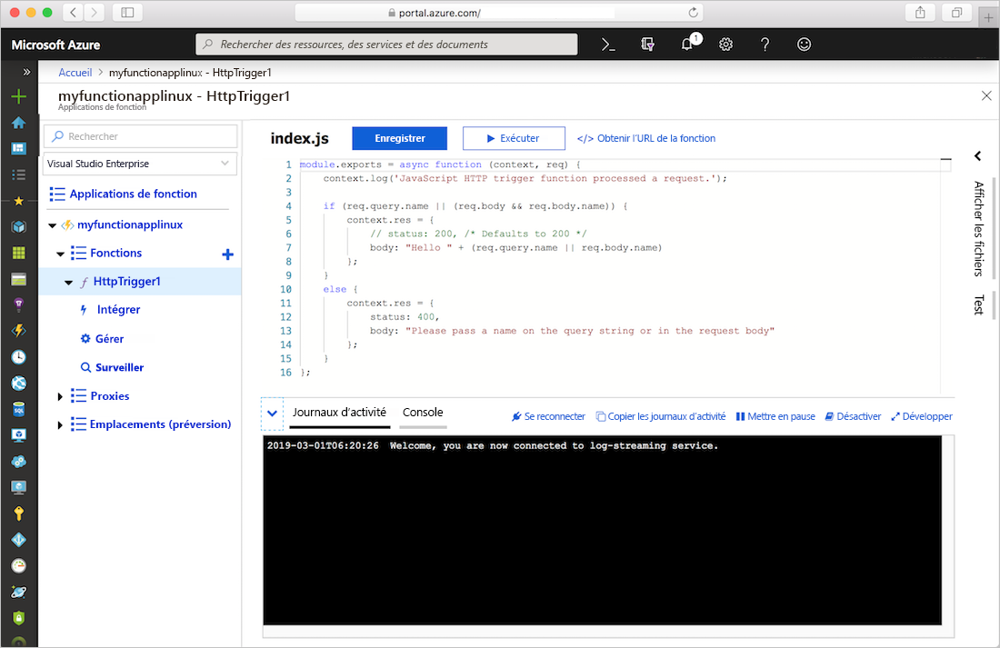
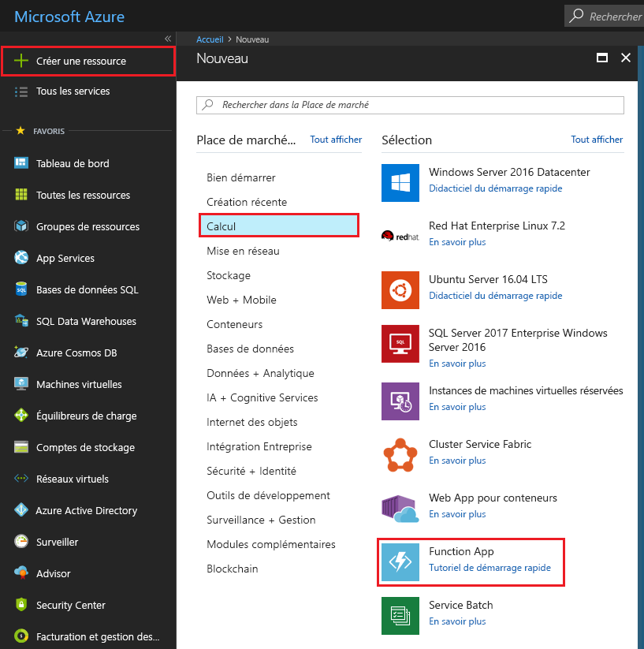
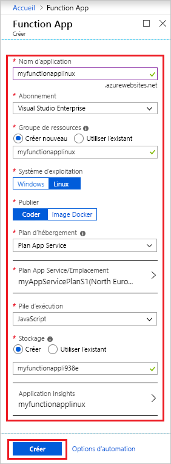
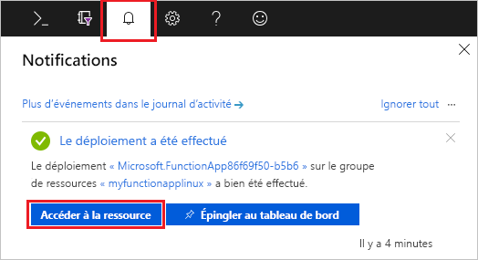
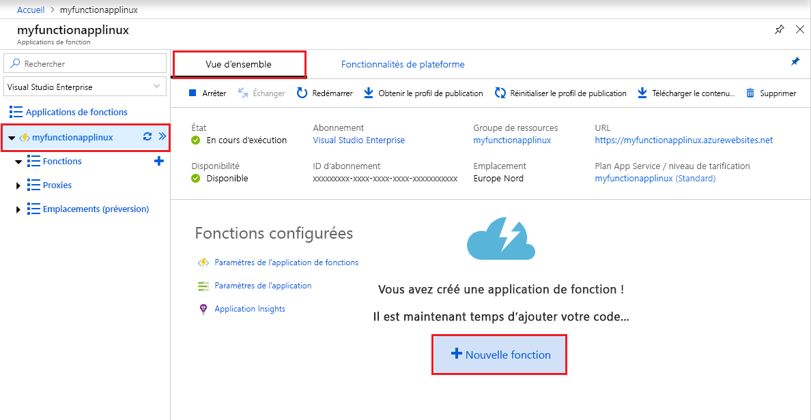
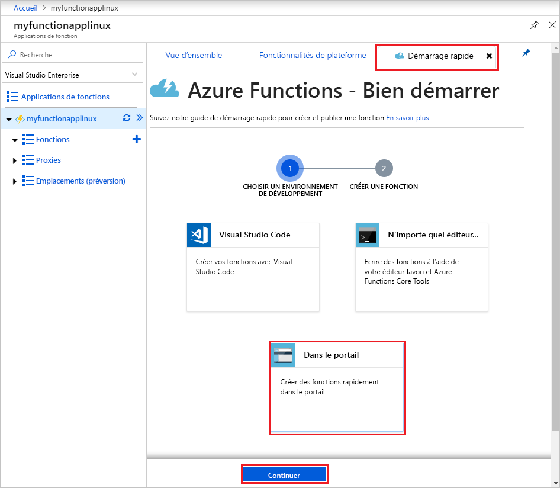
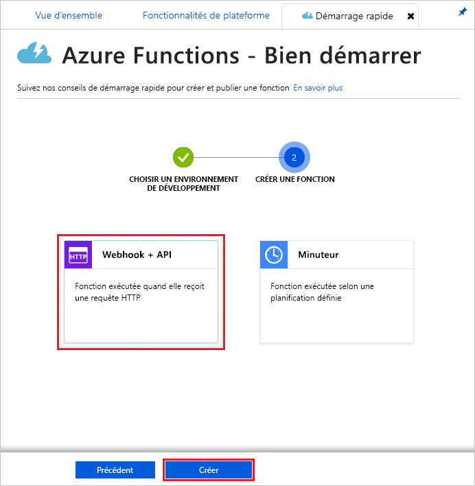
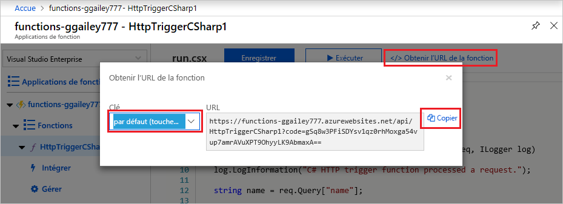
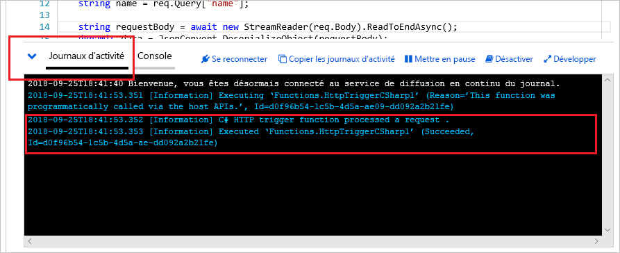

# Créer une application de fonction dans un plan App Service sur Linux

Azure Functions vous permet d’héberger vos fonctions sur Linux dans un conteneur Azure App Service par défaut. Cet article vous montre comment utiliser le [portail Azure](https://portal.azure.com) pour créer une application de fonction Linux dans Azure, qui s’exécute dans un [plan App Service](functions-scale.md#app-service-plan). Vous pouvez également [apporter votre propre conteneur personnalisé](functions-create-function-linux-custom-image.md).

[!INCLUDE [quickstarts-free-trial-note](../../includes/quickstarts-free-trial-note.md)]

## Connexion à Azure

Connectez-vous au portail Azure sur <https://portal.azure.com> avec votre compte Azure.

## Créer une application de fonction

Vous devez disposer d’une application de fonction pour héberger l’exécution de vos fonctions sur Linux. L’application de fonction fournit un environnement pour l’exécution de votre code de fonction. Elle vous permet de regrouper les fonctions en une unité logique pour faciliter la gestion, le déploiement et le partage des ressources. Dans cet article, vous créez un plan App Service lorsque vous créez votre application de fonction.

1. Cliquez sur le bouton **Créer une ressource** en haut à gauche du portail Azure, puis sélectionnez **Calcul** > **Application de fonction**.

    

2. Utilisez les paramètres d’application de fonction comme indiqué dans le tableau sous l’image.

    

    | Paramètre      | Valeur suggérée  | Description                                        |
    | ------------ |  ------- | -------------------------------------------------- |
    | **Nom de l’application** | Nom globalement unique | Nom qui identifie votre nouvelle Function App. Les caractères valides sont `a-z`, `0-9` et `-`.  | 
    | **Abonnement** | Votre abonnement | Abonnement sous lequel est créée cette nouvelle application de fonction. | 
    | **[Groupe de ressources](../azure-resource-manager/management/overview.md)** |  myResourceGroup | Nom du nouveau groupe de ressources dans lequel créer votre Function App. |
    | **SE** | Linux | L’application de fonction s’exécute sur Linux. |
    | **Publier** | Code | Le conteneur Linux par défaut pour votre **pile d’exécution** est utilisé. Tout ce que vous avez à fournir est le code de projet de votre application de fonction. Une autre option consiste à publier une [image Docker](functions-create-function-linux-custom-image.md) personnalisée. |
    | **[Plan d’hébergement](functions-scale.md)** | Plan App Service | Plan d’hébergement qui définit la façon dont les ressources sont allouées à votre Function App. Si vous exécutez dans un plan App Service, vous pouvez gérer la [mise à l’échelle de votre application de fonction](functions-scale.md).  |
    | **Plan/lieu App Service** | Créer un plan | Choisissez **Créer** et fournissez le nom du **plan App Service**. Choisissez un **emplacement** dans une [région](https://azure.microsoft.com/regions/) proche de chez vous, ou proche d’autres services auxquels vos fonctions ont accès. Choisissez votre **[niveau tarifaire](https://azure.microsoft.com/pricing/details/app-service/linux/)** .  Vous ne pouvez pas exécuter des applications de fonction Linux et Windows dans le même plan App Service. |
    | **Pile d’exécution** | Langage préféré | Choisissez un runtime qui prend en charge votre langage de programmation de fonction favori. Choisissez **.NET** pour les fonctions C# et F#. |
    | **[Stockage](../storage/common/storage-quickstart-create-account.md)** |  Nom globalement unique |  Créez un compte de stockage utilisé par votre application de fonction. Les noms des comptes de stockage doivent comporter entre 3 et 24 caractères, uniquement des lettres minuscules et des chiffres. Vous pouvez également utiliser un compte existant qui doit répondre aux [exigences relatives aux comptes de stockage](functions-scale.md#storage-account-requirements). |
    | **[Application Insights](functions-monitoring.md)** | activé | Application Insights est déactivé par défaut. Nous vous recommandons d’activer l’intégration d’Application Insights maintenant et de choisir un emplacement près de votre emplacement de plan App Service. Si vous souhaitez le faire ultérieurement, consultez [Surveiller Azure Functions](functions-monitoring.md).  |

3. Sélectionnez **Créer** pour configurer et déployer l’application de fonction.

4. Cliquez sur l’icône Notification en haut à droite du portail pour voir le message **Le déploiement a été effectué**.

    

5. Sélectionnez **Accéder à la ressource** pour afficher votre nouvelle application de fonction.

Créez ensuite une fonction dans la nouvelle Function App. Même une fois votre application de fonction disponible, il peut s’écouler quelques minutes avant qu’elle ne soit entièrement initialisée.

## Créer une fonction déclenchée via HTTP

Cette section vous montre comment créer une fonction dans votre nouvelle application de fonction dans le portail.

> [!NOTE]
> L’expérience de développement du portail peut être utile pour tester Azure Functions. Pour la plupart des scénarios, envisagez de développer vos fonctions localement et de publier le projet dans votre application de fonction à l’aide de [Visual Studio Code](functions-create-first-function-vs-code.md#create-an-azure-functions-project) ou d’[Azure Functions Core Tools](functions-run-local.md#create-a-local-functions-project).  

1. Dans votre nouvelle application de fonction, choisissez l’onglet **Vue d’ensemble** et une fois qu’il est complètement chargé, choisissez **+Nouvelle fonction**.

    

1. Dans l’onglet **Démarrage rapide**, choisissez **Dans le portail**, puis sélectionnez **Continuer**.

    

1. Choisissez **WebHook + API**, puis sélectionnez **Créer**.

    

Une fonction est créée à l’aide d’un modèle spécifique à une langue pour une fonction déclenchée via HTTP.

Vous pouvez maintenant exécuter la nouvelle fonction en envoyant une requête HTTP.

## Tester la fonction

1. Dans votre nouvelle fonction, cliquez sur **</> Obtenir l’URL de la fonction** en haut à droite, sélectionnez **par défaut (touche de fonction)** , puis cliquez sur **Copier**. 

    

2. Collez l’URL de fonction dans la barre d’adresse de votre navigateur. Ajoutez la valeur de la chaîne de requête `&name=<yourname>` à la fin de cette URL et appuyez sur la touche `Enter` de votre clavier pour exécuter la requête. Vous devez voir la réponse renvoyée par la fonction affichée dans le navigateur.  

    L’exemple suivant montre la réponse dans le navigateur :

    

    L’URL de demande inclut une clé qui est requise, par défaut, pour accéder à votre fonction sur HTTP.

3. Lorsque votre fonction s’exécute, des informations de suivi sont écrites dans les journaux d’activité. Pour afficher la sortie de suivi de l’exécution précédente, revenez à votre fonction dans le portail et cliquez sur la flèche figurant en bas de l’écran pour développer **Journaux d’activité**.

   

## Nettoyer les ressources

[!INCLUDE [Clean-up resources](../../includes/functions-quickstart-cleanup.md)]

## Étapes suivantes

Vous avez créé une Function App avec une simple fonction déclenchée via HTTP.  

[!INCLUDE [Next steps note](../../includes/functions-quickstart-next-steps.md)]

Pour plus d’informations, consultez [Liaisons HTTP Azure Functions](functions-bindings-http-webhook.md).
