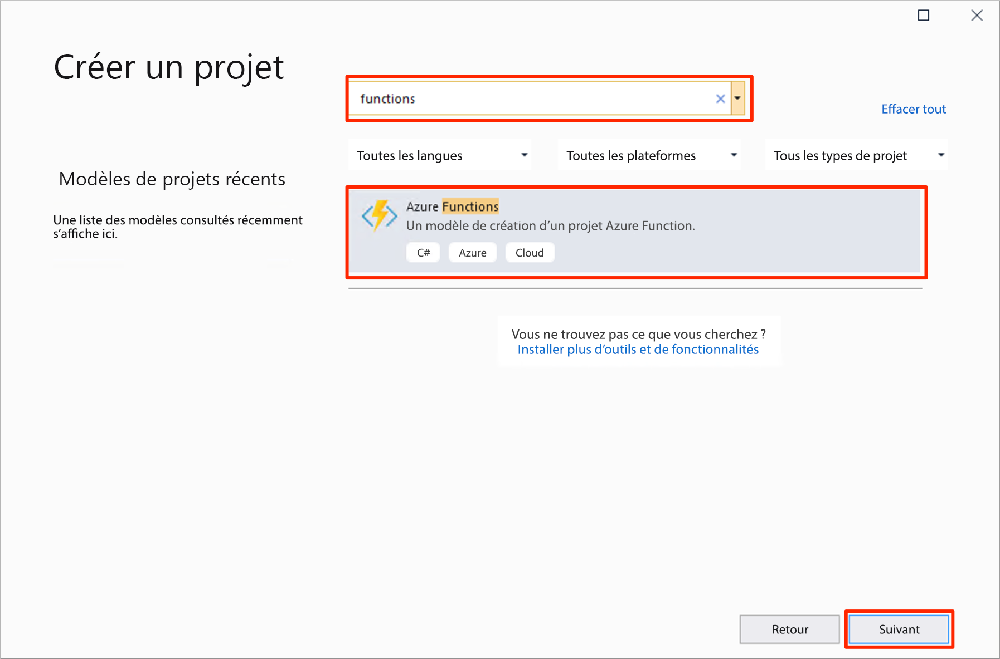
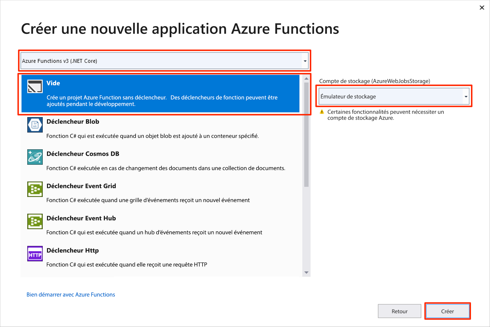
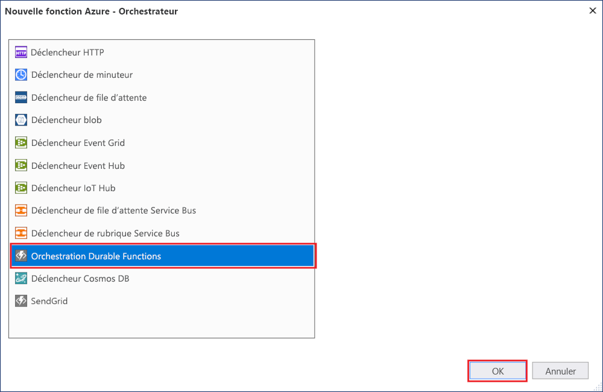

# <a name="create-your-first-durable-function-in-c"></a>Créer votre première fonction durable dans C\#

*Durable Functions* est une extension d’[Azure Functions](../functions-overview.md) qui vous permet d’écrire des fonctions avec état dans un environnement serverless. L’extension gère l’état, les points de contrôle et les redémarrages à votre place.

Dans cet article, vous allez découvrir comment utiliser les outils Visual Studio 2017 pour Azure Functions afin de créer et tester localement une fonction durable appelée « Hello World ».  Cette fonction permet d’orchestrer et de chaîner des appels à d’autres fonctions. Vous allez ensuite publier le code de la fonction dans Azure. Ces outils sont disponibles dans le cadre de la charge de travail de développement Azure dans Visual Studio 2017.


## <a name="prerequisites"></a>Prérequis

Pour suivre ce tutoriel :

* Installer [Visual Studio 2017](https://azure.microsoft.com/downloads/) et vérifiez que la charge de travail **Azure development** est également installée.

* Assurez-vous de disposer des [derniers outils Azure Functions](../functions-develop-vs.md#check-your-tools-version).

* Vérifiez que l’[émulateur de stockage Azure](../../storage/common/storage-use-emulator.md) est installé et démarré.

[!INCLUDE [quickstarts-free-trial-note](../../../includes/quickstarts-free-trial-note.md)]

## <a name="create-a-function-app-project"></a>Créer un projet d’application de fonction

Le modèle de projet Azure Functions dans Visual Studio crée un projet qui peut être publié dans une application de fonction dans Azure. Une application de fonctions vous permet de regrouper les fonctions dans une unité logique pour la gestion, le déploiement et le partage des ressources.

1. Dans Visual Studio, sélectionnez **Nouveau** > **Projet** dans le menu **Fichier**.

2. Dans la boîte de dialogue **Nouveau projet**, sélectionnez **Installé**, développez **Visual C#** > **Cloud**, sélectionnez **Azure Functions**, tapez un **Nom** pour votre projet, puis cliquez sur **OK**. Le nom d’application de la fonction doit être valide en tant qu’espace de noms C#, afin de ne pas utiliser des traits d’union, des traits de soulignement ou d’autres caractères non alphanumériques.

    

3. Utilisez les paramètres spécifiés dans le tableau à la suite de l’image.

    

    | Paramètre      | Valeur suggérée  | Description                      |
    | ------------ |  ------- |----------------------------------------- |
    | **Version** | Azure Functions 2.x <br />(.NET Core) | Crée un projet de fonction qui utilise le runtime Azure Functions version 2.x qui prend en charge .NET Core. La version 1.x d’Azure Functions prend en charge .NET Framework. Pour plus d’informations, consultez [Guide pratique pour cibler la version du runtime Azure Functions](../functions-versions.md).   |
    | **Modèle** | Vide | Crée une application de fonction vide. |
    | **Compte de stockage**  | Émulateur de stockage | Un compte de stockage est nécessaire pour la gestion des états de fonction durable. |

4. Cliquez sur **OK** pour créer un projet de fonction vide.

## <a name="add-functions-to-the-app"></a>Ajouter des fonctions à l’application

Visual Studio crée un projet d’application de fonction vide.  Ce projet contient les fichiers de configuration de base nécessaires pour une application, mais il ne contient pas encore de fonctions.  Nous devons ajouter un modèle de fonction durable au projet.

1. Cliquez avec le bouton droit sur le projet dans Visual Studio et sélectionnez **Ajouter** > **Nouvelle fonction Azure**.

    

2. Vérifiez qu’**Azure Function** est sélectionné dans le menu Ajouter et nommez votre fichier C#.  Cliquez sur **Ajouter**.

3. Sélectionnez le modèle **Orchestration Durable Functions** et cliquez sur **OK**.

      

Une nouvelle fonction durable sera ajoutée à l’application.  Ouvrez le nouveau fichier pour afficher le contenu.  Cette fonction durable est un exemple de chaînage de fonction simple.  

* La méthode `RunOrchestrator` est associée à la fonction d’orchestrateur.  Cette fonction démarre, crée une liste et ajoute le résultat de trois appels de fonctions à la liste.  À la fin des trois appels de fonctions, elle retourne la liste.  La fonction appelée est la méthode `SayHello` (par défaut, elle est appelée « <NameOfFile>_Hello »).
* La fonction `SayHello` retourne le mot « hello ».
* La méthode `HttpStart` décrit la fonction qui démarre les instances de l’orchestration.  Elle est associée à un [déclencheur HTTP](../functions-bindings-http-webhook.md) qui démarre une nouvelle instance de l’orchestrateur et retourne une réponse d’état de vérification.

Maintenant que vous avez créé un projet de fonction et une fonction durable, vous pouvez tester la fonction sur votre ordinateur local.

## <a name="test-the-function-locally"></a>Tester la fonction en local

Azure Functions Core Tools vous permet d’exécuter un projet Azure Functions sur votre ordinateur de développement local. Vous êtes invité à installer ces outils la première fois que vous démarrez une fonction dans Visual Studio.

1. Pour tester votre fonction, appuyez sur F5. Si vous y êtes invité, acceptez la requête dans Visual Studio pour télécharger et installer Azure Functions Core (CLI) Tools. Vous devrez peut-être activer une exception de pare-feu afin de permettre aux outils de prendre en charge les requêtes HTTP.

2. Copiez l’URL de votre fonction à partir de la sortie runtime Azure Functions.

    

3. Collez l’URL de la requête HTTP dans la barre d’adresse de votre navigateur et exécutez la requête. La capture d’écran suivante du navigateur montre la requête renvoyée par la fonction suite à la demande locale GET : 

    

    La réponse est le résultat initial de la fonction HTTP, qui nous indique que l’orchestration durable a bien été démarrée.  Il ne s’agit pas encore du résultat final de l’orchestration.  La réponse contient plusieurs URL utiles.  Pour le moment, demandons l’état de l’orchestration.

4. Copiez la valeur de l’URL pour `statusQueryGetUri` et collez-la dans la barre d’adresse du navigateur, puis exécutez la requête.

    La requête interroge l’instance d’orchestration pour obtenir l’état. Vous obtenez une réponse éventuelle qui ressemble à l’exemple ci-dessous.  Cette réponse nous indique que l’instance est terminée. Elle contient les sorties ou résultats de la fonction durable.

    ```json
    {
        "instanceId": "d495cb0ac10d4e13b22729c37e335190",
        "runtimeStatus": "Completed",
        "input": null,
        "customStatus": null,
        "output": [
            "Hello Tokyo!",
            "Hello Seattle!",
            "Hello London!"
        ],
        "createdTime": "2018-11-08T07:07:40Z",
        "lastUpdatedTime": "2018-11-08T07:07:52Z"
    }
    ```

5. Pour arrêter le débogage, appuyez sur **MAJ + F5**.

Après avoir vérifié que la fonction s’exécute correctement sur votre ordinateur local, il est temps de publier le projet sur Azure.

## <a name="publish-the-project-to-azure"></a>Publication du projet sur Azure

Vous devez disposer d’une application de fonction dans votre abonnement Azure avant de pouvoir publier votre projet. Vous pouvez créer une application de fonction directement à partir de Visual Studio.

[!INCLUDE [Publish the project to Azure](../../../includes/functions-vstools-publish.md)]

## <a name="test-your-function-in-azure"></a>Tester votre fonction dans Azure

1. Copiez l’URL de base de l’application de fonction à partir de la page de profil de publication. Remplacez la partie `localhost:port` de l’URL que vous avez utilisée lors du test en local de la fonction par la nouvelle URL de base.

    L’URL qui appelle le déclencheur HTTP de la fonction durable doit être au format suivant :

        http://<APP_NAME>.azurewebsites.net/api/<FUNCTION_NAME>_HttpStart

2. Collez cette nouvelle URL de requête HTTP dans la barre d’adresse de votre navigateur. Vous devez obtenir la même réponse d’état que lorsque vous avez utilisé l’application publiée.

## <a name="next-steps"></a>Étapes suivantes

Vous avez utilisé Visual Studio pour créer et publier une application de fonction durable C#.

> [!div class="nextstepaction"]
> [Découvrez maintenant les modèles courants de fonctions durables.](durable-functions-overview.md)
